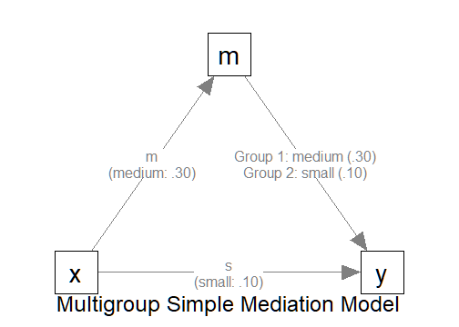

# Multigroup Sample Size Determination: Path Models of Observed Variables

## Introduction

This article illustrates how to do power analysis and sample size
determination in some typical observed variable path models, when the
test of interest is detecting the between-group difference in an
indirect path. The package
[power4mome](https://sfcheung.github.io/power4mome/) will be used for
illustration.

## Prerequisite

Basic knowledge about fitting models by `lavaan` and `power4mome` is
required.

This file is not intended to be an introduction on how to use functions
in `power4mome`. For details on how to use
[`power4test()`](https://sfcheung.github.io/power4mome/reference/power4test.md),
refer to the [Get-Started
article](https://sfcheung.github.io/power4mome/articles/power4mome.html).
Please also refer to the help page of
[`n_region_from_power()`](https://sfcheung.github.io/power4mome/reference/x_from_power.md),
and the
[article](https://sfcheung.github.io/power4mome/articles/x_from_power_for_n.html)
on
[`n_from_power()`](https://sfcheung.github.io/power4mome/reference/x_from_power.md),
which is called twice by
[`n_region_from_power()`](https://sfcheung.github.io/power4mome/reference/x_from_power.md)
to find the regions described below.

## Scope

A simple mediation model of observed variables will be used as an
example. Users new to the package are recommended to read the
[article](https://sfcheung.github.io/power4mome/articles/articles/template_n_from_power_mediation_obs_simple.md)
on the steps for a path model with observed variables having a
multivariate normal distribution (the default).

## Set Up the Model and Test

Load the packages first:

``` r
library(power4mome)
```

Estimate the power for a sample size.

The code for the model:

``` r
model <-
"
m ~ x
y ~ m + x
"

model_es <-
"
m ~ x: m
y ~ m:
 - m
 - s
y ~ x: s
"
```

To specify a multigroup model, at least one of the parameter (`y ~ m` in
this example) needs to have two or more values. One way to specify them
is as shown above: one line for each value, indented by at least one
space, after a hyphen.

In the example above, there are two groups because there are two values
for the path `y ~ m`. For the first group, Group 1, the path is medium
(`m`). For the second group, Group 2, the path is small (`s`).

All other paths have only one value, and so all groups have the same
values for these paths.



The Model

### Setup the Model

This section illustrates how to set up the call to
[`power4test()`](https://sfcheung.github.io/power4mome/reference/power4test.md).
We would like to check the model first. Therefore, the test of indirect
effect is not added for now.

``` r
out <- power4test(
  nrep = 600,
  model = model,
  pop_es = model_es,
  n = 100,
  iseed = 1234,
  parallel = TRUE)
```

By default, all groups are assumed to have the same sample size.
Therefore, only one value of `n` is needed.

There are two ways to specify the sample sizes if the groups are
expected to have different sample sizes.

- First, the argument `n` can be a numeric vector of the sample size of
  each group.

  - For example, `n = c(100, 200)` indicates that Group 1 has 100 cases
    and Group 2 has 200 cases.

- Second, the argument `n_ratio` can be used to specify the sample size
  for each group using one single value of `n`.

  - For example, `n = 100` and `n_ratio = c(1, 0.5)` indicates that
    Group 1 has 100 cases and Group 2 has 100 multiplied by 0.5 or 200
    cases.

To illustrate how to use other functions that accepts only one sample
size, we use `n_ratio` in the following illustration.

``` r
out <- power4test(
  nrep = 600,
  model = model,
  pop_es = model_es,
  n = 100,
  n_ratio = c(1, 0.5),
  iseed = 1234,
  parallel = TRUE)
```

### Check The Simulation

We now check the simulation:

``` r
out
```

This is part of the output on the population values:

    #> ====== Population Values ======
    #> 
    #> 
    #> Group 1 [Group1]:
    #> 
    #> Regressions:
    #>                    Population
    #>   m ~                        
    #>     x                 0.300  
    #>   y ~                        
    #>     m                 0.300  
    #>     x                 0.100  
    #> 
    #> Variances:
    #>                    Population
    #>    .m                 0.910  
    #>    .y                 0.882  
    #>     x                 1.000  
    #> 
    #> 
    #> Group 2 [Group2]:
    #> 
    #> Regressions:
    #>                    Population
    #>   m ~                        
    #>     x                 0.300  
    #>   y ~                        
    #>     m                 0.100  
    #>     x                 0.100  
    #> 
    #> Variances:
    #>                    Population
    #>    .m                 0.910  
    #>    .y                 0.974  
    #>     x                 1.000  
    #> 
    #> == Population Conditional/Indirect Effect(s) ==
    #> 
    #> == Indirect Effect(s) ==
    #> 
    #>                      ind
    #> Group1.x -> m -> y 0.090
    #> Group2.x -> m -> y 0.030
    #> 
    #>  - The 'ind' column shows the indirect effect(s).
    #> 

As shown in the output, there are two set of population values, one for
each group. The two groups differ on the regression path `y ~ m`, as we
expected.

NOTE: The population values are for the standardized solution.
Therefore, a difference in the path `y ~ m` also results in differences
in related variances and error variances (the error variances of `y` in
this case). This will not affect the power of some tests, such as a test
of the difference in the unstandardized paths when no constraints are
imposed on variances and error variances.

If indirect paths are present, the indirect effects for each group will
be printed automatically. As shown above, the two groups have different
population indirect effects for the path `x -> m -> y`.

If the group is a multigroup model, by default, a multigroup model will
be fitted by [`lavaan::sem()`](https://rdrr.io/pkg/lavaan/man/sem.html).
This is part of the output on the model fit to one set of data.

    #> ============ <fit> ============
    #> 
    #> lavaan 0.6-21 ended normally after 1 iteration
    #> 
    #>   Estimator                                         ML
    #>   Optimization method                           NLMINB
    #>   Number of model parameters                        14
    #> 
    #>   Number of observations per group:                   
    #>     Group1                                         100
    #>     Group2                                          50
    #> 
    #> Model Test User Model:
    #>                                                       
    #>   Test statistic                                 0.000
    #>   Degrees of freedom                                 0
    #>   Test statistic for each group:
    #>     Group1                                       0.000
    #>     Group2                                       0.000

As shown above, a two-group model is fitted. Moreover, the two samples
have different sample sizes, as specified in the call: Group 1 has 100
cases and Group 2 has 50 cases.

### Add the Test and Estimate Power

We now can add the test and estimate power. For a multigroup model with
indirect paths, when tested using the `manymome` package, used by
`power4mome`, the indirect effects will be treated “as” conditional
indirect effects, with group as the “moderator”. This test can be
conducted using
[`test_cond_indirect_effects()`](https://sfcheung.github.io/power4mome/reference/test_cond_indirect_effects.md).
This function is very similar to
[`test_indirect_effect()`](https://sfcheung.github.io/power4mome/reference/test_indirect_effect.md)
describe in the
[article](https://sfcheung.github.io/power4mome/articles/articles/template_n_from_power_mediation_obs_simple.md).
If the group is a multigroup model, the indirect path will be estimated
and tested in each group automatically.

Our interest is in testing the *difference* in the indirect effect. To
do this, we add `compare_groups = TRUE` to the argument of the test.

`R_for_bz(200)` is used to set `R` to the largest value less than 200
that is supported by the method proposed by Boos & Zhang (2000).
[¹](#fn1)

Note that

``` r
out <- power4test(
  nrep = 600,
  model = model,
  pop_es = model_es,
  n = 100,
  R = R_for_bz(200),
  ci_type = "mc",
  test_fun = test_cond_indirect_effects,
  test_args = list(x = "x",
                   m = "m",
                   y = "y",
                   mc_ci = TRUE,
                   compare_groups = TRUE),
  iseed = 1234,
  parallel = TRUE)
```

The rejection rate (power) for this example can be found by
[`rejection_rates()`](https://sfcheung.github.io/power4mome/reference/rejection_rates.md):

``` r
rejection_rates(out)
#> [test]: test_cond_indirect_effects: x->m->y 
#> [test_label]: x->m->y | Group2 - Group1 
#>      est   p.v reject r.cilo r.cihi
#> 1 -0.060 1.000  0.178  0.150  0.211
#> Notes:
#> - p.v: The proportion of valid replications.
#> - est: The mean of the estimates in a test across replications.
#> - reject: The proportion of 'significant' replications, that is, the
#>   rejection rate. If the null hypothesis is true, this is the Type I
#>   error rate. If the null hypothesis is false, this is the power.
#> - r.cilo,r.cihi: The confidence interval of the rejection rate, based
#>   on Wilson's (1927) method.
#> - Refer to the tests for the meanings of other columns.
```

As shown in the test label, the test is a test of the *difference* in
direct effects between the two groups. Therefore, the rejection rate,
power in this case, is the power to detect the difference.

## Testing Multigroup Difference in Other Functions

Other functions that make use of
[`power4test()`](https://sfcheung.github.io/power4mome/reference/power4test.md)
can also be used for multigroup models. However, most of them supports
only one single value of `n`. Therefore, `n_ratio` is needed to specify
the sample size for each group.

For example, the output above can be used directly by
[`n_from_power()`](https://sfcheung.github.io/power4mome/reference/x_from_power.md)
to find sample sizes given a target power, with `n_ratio` fixed.

``` r
n_power <- n_from_power(
              out,
              target_power = .80,
              final_nrep = 2000,
              seed = 1234
            )
```

Note that the search for sample size in multigroup model can be slow
(sometimes very slow), given the additional processes involved.
Therefore, other faster approximate approaches are recommended for
finding the approximate sample sizes, which can be verified using
[`power4test()`](https://sfcheung.github.io/power4mome/reference/power4test.md)
using a larger number of replications (`nrep`).

(NOTE: For this example, because the difference is in only one path, a
faster approach is to do power analysis on testing the difference in
this single path, which can be done in `power4mome` using
[`test_parameters()`](https://sfcheung.github.io/power4mome/reference/test_parameters.md)
with `compare_groups = TRUE`.)

The output can also be used directly by `n_power_region()` to find a
region of sample sizes given a target power:

``` r
n_power_region <- n_region_from_power(
                      out,
                      seed = 1357
                    )
```

## Reference(s)

Boos, D. D., & Zhang, J. (2000). Monte Carlo evaluation of
resampling-based hypothesis tests. *Journal of the American Statistical
Association*, *95*(450), 486–492.
<https://doi.org/10.1080/01621459.2000.10474226>

------------------------------------------------------------------------

1.  For tests that use Monte Carlo or bootstrapping confidence interval,
    the method proposed by Boos & Zhang (2000) to use a small number of
    resamples or simulated samples is recommended. This can be enabled
    automatically by setting `R` to a supported value. The helper
    [`R_for_bz()`](https://sfcheung.github.io/power4mome/reference/bz_helpers.md)
    can be used. By default, it returns the largest supported `R` which
    is less than a target `R`, given a default level of significance of
    .05 (two-tailed). For example, `R_for_bz(200)` returns 199.
