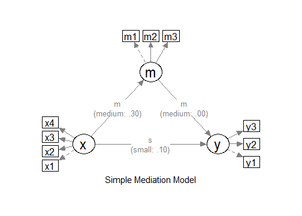

# Sample Size Determination with Ordinal Variables: Latent Variable Models

## Introduction

This article illustrates how to do power analysis and sample size
determination in some typical latent variable models, with the variables
being ordinal (e.g., true-false binary items, or 5-point Likert scale
items) and the model to be estimated using methods such as MLR or DWLS
in `lavaan`. The package
[power4mome](https://sfcheung.github.io/power4mome/) will be used for
illustration.

## Prerequisite

Basic knowledge about fitting models by `lavaan` and `power4mome` is
required.

This file is not intended to be an introduction on how to use functions
in `power4mome`. For details on how to use
[`power4test()`](https://sfcheung.github.io/power4mome/reference/power4test.md),
refer to the [Get-Started
article](https://sfcheung.github.io/power4mome/articles/power4mome.html).
Please also refer to the help page of
[`n_region_from_power()`](https://sfcheung.github.io/power4mome/reference/x_from_power.md),
and the
[article](https://sfcheung.github.io/power4mome/articles/x_from_power_for_n.html)
on
[`n_from_power()`](https://sfcheung.github.io/power4mome/reference/x_from_power.md),
which is called twice by
[`n_region_from_power()`](https://sfcheung.github.io/power4mome/reference/x_from_power.md)
to find the regions described below.

## Scope

A simple mediation model of latent variables will be used as an example.
Users new to the package are recommended to read the
[article](https://sfcheung.github.io/power4mome/articles/articles/template_n_from_power_mediation_lav_simple.md)
on the steps for a model with variables having a multivariate normal
distribution (the default).

## Set Up the Model and Test

Load the packages first:

``` r
library(power4mome)
```

Estimate the power for a sample size.

The code for the model:

``` r
model <-
"
m ~ x
y ~ m + x
"

model_es <-
"
m ~ x: m
y ~ m: m
y ~ x: s
"
```



The Model

Refer to this
[article](https://sfcheung.github.io/power4mome/articles/articles/power4test_latent_mediation.md)
on how to set `number_of_indicators` and `reliability` when calling
[`power4test()`](https://sfcheung.github.io/power4mome/reference/power4test.md).

## Convert the Continuous Variables to Ordinal Variables

Suppose that we know in advance the indicators collect data in ordinal
format, such as binary items (true-false) or 5-point items, although the
underlying distributions are assumed to be multivariate normal, as is
usually the case for this kind of data. In `lavaan`, it is common to set
`ordered = TRUE` and fit the model using DWLS (or WLSMV in Mplus
literature), or using MLR for items with five or more categories, such
as Likert scale items. We would like to have an accurate assessment of
the power and sample size requirements by taking these into account.

### Data Processor

The package [power4mome](https://sfcheung.github.io/power4mome/) comes
with some *data processors*, functions for processing the generated
dataset before fitting a model to it. A full list of them can be found
[here](https://sfcheung.github.io/power4mome/articles/reference/index.html#data-processors).

For example, the function
[`ordinal_variables()`](https://sfcheung.github.io/power4mome/reference/ordinal_variables.md)
can be used to convert a generated variable, drawn from a multivariate
normal distribution by default, to a variable with two or more
categories, using some thresholds (*k - 1* thresholds for *k*
categories). The processed dataset will be used instead of the original
dataset for subsequent analyses, such as model fitting and power
analysis.

### An Example

Suppose we know in advance that the indicators of `x` and `y` are binary
indicators, and the indicators of `m` are 5-point Likert scale
indicators. We have no special reason to assume that distribution is
skewed, and so a symmetric conversion will be conducted. Although users
can specify the thresholds they would like to use, a collection of
built-in patterns based on Savalei & Rhemtulla (2013) can be selected
using a keyword, as shown below. Please refer to the help page of
[`ordinal_variables()`](https://sfcheung.github.io/power4mome/reference/ordinal_variables.md)
for the list of supported patterns.

### Set the Conversion Using `process_data`

This section illustrates how to set up the call to
[`power4test()`](https://sfcheung.github.io/power4mome/reference/power4test.md)
using `process_data` and
[`ordinal_variables()`](https://sfcheung.github.io/power4mome/reference/ordinal_variables.md).
We would like to check the model first. Therefore, the test of indirect
effect is not added for now.

``` r
out <- power4test(
  nrep = 600,
  model = model,
  pop_es = model_es,
  n = 200,
  number_of_indicators = c(x = 4,
                           m = 3,
                           y = 3),
  reliability = c(x = .80,
                  m = .70,
                  y = .80),
  process_data = list(
      fun = ordinal_variables,
      args = list(cut_patterns = c(x = "s2",
                                   y = "s2",
                                   m = "s5"))
    ),
  iseed = 1234,
  parallel = TRUE)
```

Note that `reliability` refer to the population reliability coefficients
of the scale of a factor *before* the variables are converted to ordinal
variables.

#### How to Use `process_data` and `ordinal_variables()`

The argument `process_data` is used to specify the function, as well as
any arguments need, to *process* the generated data.

The value must be a named list. The argument `fun` is a required
argument, which is the argument to be used to process the data
(`ordinal_variables` in the example above).

If additional arguments are to be passed to this function, set them to a
named list for `args`, as shown above.

In the example above, the argument `cut_patterns` is set, telling
[`ordinal_variables()`](https://sfcheung.github.io/power4mome/reference/ordinal_variables.md)
how the variables are to be converted. The value of `cut_patterns` can
be named vector, with the names being the names of the *latent factors*,
and the value the names of the built-in patterns to be used.

In the example above, `"s2"` is a symmetric conversion, cutting the
continuous variables into two values with a threshold of 0. `"s5"` is a
symmetric conversion, cutting the continuous variables into five values
with the thresholds -1.5, -0.5, 0.5, and 1.5. These thresholds are those
used in the simulation study by Savalei & Rhemtulla (2013) on ordinal
variables in structural equation modeling.

If a latent factor is not included in `cut_patterns`, then its indicator
scores will not be converted.

### Check The Generated Data

To print the details of the generated data, including the descriptive
statistics, use `print` with `data_long = TRUE`:

``` r
print(out,
      data_long = TRUE)
```

This is part of the output:

    #> ==== Descriptive Statistics ====
    #> 
    #>    vars      n mean   sd  skew kurtosis se
    #> x1    1 120000  1.5 0.50  0.00    -2.00  0
    #> x2    2 120000  1.5 0.50 -0.01    -2.00  0
    #> x3    3 120000  1.5 0.50  0.00    -2.00  0
    #> x4    4 120000  1.5 0.50  0.00    -2.00  0
    #> m1    5 120000  3.0 1.01  0.00    -0.47  0
    #> m2    6 120000  3.0 1.01  0.00    -0.47  0
    #> m3    7 120000  3.0 1.01 -0.01    -0.47  0
    #> y1    8 120000  1.5 0.50 -0.01    -2.00  0
    #> y2    9 120000  1.5 0.50  0.00    -2.00  0
    #> y3   10 120000  1.5 0.50  0.00    -2.00  0

By default, values of 1, 2, … will be used for the categories. The
values assigned does not matter when ordinal variable methods are used.
For the estimation of power, the values also do not matter if the power
of a method is invariant to linear transformation of the variables,
which is usually the case for most common tests.

If there are variables with 10 or few unique values, the response
proportions are also printed:

    #> ===== Response Proportions =====
    #> 
    #> group: Single Group
    #>      1   2 miss
    #> x1 0.5 0.5    0
    #> x2 0.5 0.5    0
    #> x3 0.5 0.5    0
    #> x4 0.5 0.5    0
    #> y1 0.5 0.5    0
    #> y2 0.5 0.5    0
    #> y3 0.5 0.5    0
    #> 
    #> group: Single Group
    #>        1    2    3    4     5 miss
    #> m1 0.067 0.24 0.38 0.24 0.068    0
    #> m2 0.067 0.24 0.38 0.24 0.066    0
    #> m3 0.068 0.24 0.38 0.24 0.067    0

If necessary, the data generated can be retrieved by
[`pool_sim_data()`](https://sfcheung.github.io/power4mome/reference/sim_data.md)
and inspected directly:

``` r
dat <- pool_sim_data(out)
head(dat, 10)
#>    x1 x2 x3 x4 m1 m2 m3 y1 y2 y3
#> 1   1  1  1  1  3  2  3  2  1  1
#> 2   1  1  2  1  2  1  2  1  1  1
#> 3   2  1  1  1  3  2  5  1  2  1
#> 4   2  2  2  2  5  3  4  2  1  1
#> 5   2  2  1  2  4  3  3  2  1  2
#> 6   1  1  1  1  1  2  3  1  1  1
#> 7   2  2  2  2  2  4  5  2  2  2
#> 8   2  2  1  1  3  3  3  1  2  1
#> 9   2  2  1  1  2  3  4  2  2  2
#> 10  2  2  2  2  4  2  4  2  2  2
```

### Fit the Model by DWLS Using `ordered = TRUE`

Because of the ordinal nature, we would like to estimate the power when
a proper estimation method is used. One common method used in `lavaan`
is DWLS, which can be enabled by adding `ordered = TRUE`.

The argument `fit_model_args` can be use to pass arguments, as a named
list, to the fit function, which is
[`lavaan::sem()`](https://rdrr.io/pkg/lavaan/man/sem.html) by default.

To use DWLS in
[`lavaan::sem()`](https://rdrr.io/pkg/lavaan/man/sem.html), we use
`ordered = TRUE`. Therefore, we add the argument
`fit_model_args = list(ordered = TRUE)` in the call to
[`power4test()`](https://sfcheung.github.io/power4mome/reference/power4test.md):

``` r
out <- power4test(
  nrep = 600,
  model = model,
  pop_es = model_es,
  n = 200,
  number_of_indicators = c(x = 4,
                           m = 3,
                           y = 3),
  reliability = c(x = .80,
                  m = .70,
                  y = .80),
  process_data = list(
      fun = ordinal_variables,
      args = list(cut_patterns = c(x = "s2",
                                   y = "s2",
                                   m = "s5"))
    ),
  fit_model_args = list(ordered = TRUE),
  iseed = 1234,
  parallel = TRUE)
```

We can verify that DWLS is used by printing the results:

``` r
print(out)
```

This is part of the output:

    #> ============ <fit> ============
    #> 
    #> lavaan 0.6-21 ended normally after 28 iterations
    #> 
    #>   Estimator                                       DWLS
    #>   Optimization method                           NLMINB
    #>   Number of model parameters                        32
    #> 
    #>   Number of observations                           200
    #> 
    #> Model Test User Model:
    #>                                               Standard      Scaled
    #>   Test Statistic                                11.228      19.630
    #>   Degrees of freedom                                32          32
    #>   P-value (Unknown)                                 NA       0.957
    #>   Scaling correction factor                                  0.776
    #>   Shift parameter                                            5.154
    #>     simple second-order correction

As shown in the printout, DWLS was used as the estimator in the printout
of `lavaan`.

### Add the Test and Estimate Power

We now can add the test and estimate power. See this
[article](https://sfcheung.github.io/power4mome/articles/articles/template_n_from_power_mediation_lav_simple.md)
for details on the test function
[`test_indirect_effect()`](https://sfcheung.github.io/power4mome/reference/test_indirect_effect.md)
and how to set the argument `test_fun` and `test_args`. `R_for_bz(200)`
is used to set `R` to the largest value less than 200 that is supported
by the method proposed by Boos & Zhang (2000). [¹](#fn1)

``` r
out <- power4test(
  nrep = 600,
  model = model,
  pop_es = model_es,
  n = 200,
  number_of_indicators = c(x = 4,
                           m = 3,
                           y = 3),
  reliability = c(x = .80,
                  m = .70,
                  y = .80),
  process_data = list(
      fun = ordinal_variables,
      args = list(cut_patterns = c(x = "s2",
                                   y = "s2",
                                   m = "s5"))
    ),
  fit_model_args = list(ordered = TRUE),
  R = R_for_bz(200),
  ci_type = "mc",
  test_fun = test_indirect_effect,
  test_args = list(x = "x",
                   m = "m",
                   y = "y",
                   mc_ci = TRUE),
  iseed = 1234,
  parallel = TRUE)
```

The rejection rate (power) for this example can be found by
[`rejection_rates()`](https://sfcheung.github.io/power4mome/reference/rejection_rates.md):

``` r
rejection_rates(out)
#> [test]: test_indirect: x->m->y 
#> [test_label]: Test 
#>     est   p.v reject r.cilo r.cihi
#> 1 0.105 0.988  0.543  0.503  0.583
#> Notes:
#> - p.v: The proportion of valid replications.
#> - est: The mean of the estimates in a test across replications.
#> - reject: The proportion of 'significant' replications, that is, the
#>   rejection rate. If the null hypothesis is true, this is the Type I
#>   error rate. If the null hypothesis is false, this is the power.
#> - Some or all values in 'reject' are estimated using the extrapolation
#>   method by Boos and Zhang (2000).
#> - r.cilo,r.cihi: The confidence interval of the rejection rate, based
#>   on Wilson's (1927) method.
#> - Wilson's (1927) method is used to approximate the confidence
#>   intervals of the rejection rates estimated by the method of Boos and
#>   Zhang (2000).
#> - Refer to the tests for the meanings of other columns.
```

## Using `process_data` in Other Functions

Other functions that make use of
[`power4test()`](https://sfcheung.github.io/power4mome/reference/power4test.md)
can also use the arguments `process_data` and `fit_model_args`.

For example, the output above, with ordinal indicators, can be used
directly by
[`n_from_power()`](https://sfcheung.github.io/power4mome/reference/x_from_power.md)
to find a sample size given a target power:

``` r
n_power <- n_from_power(
              out,
              target_power = .80,
              x_interval = c(200, 2000),
              final_nrep = 2000,
              seed = 1357
            )
```

The output with ordinal indicators can also be used directly by
`n_power_region()` to find a region of sample sizes given a target
power:

``` r
n_power_region <- n_region_from_power(
                      out,
                      seed = 1357
                    )
```

The quick functions, described in these
[articles](https://sfcheung.github.io/power4mome/articles/articles/index.html#common-mediation-models),
also support the `process_data` and `fit_model_args` arguments. They are
set in the same way as in
[`power4test()`](https://sfcheung.github.io/power4mome/reference/power4test.md)

This is an example for estimating the power for a specific sample size:

``` r
q_power <- q_power_mediation_simple(
  a = "m",
  b = "m",
  cp = "s",
  number_of_indicators = c(x = 4,
                           m = 3,
                           y = 3),
  reliability = c(x = .80,
                  m = .70,
                  y = .80),
  process_data = list(
      fun = ordinal_variables,
      args = list(cut_patterns = c(x = "s2",
                                   y = "s2",
                                   m = "s5"))
    ),
  fit_model_args = list(ordered = TRUE),
  target_power = .80,
  nrep = 600,
  n = 200,
  R = R_for_bz(200),
  seed = 1234
)
```

This is an example of finding a sample size given a target power (mode
`"n"`):

``` r
q_power_n <- q_power_mediation_simple(
  a = "m",
  b = "m",
  cp = "s",
  number_of_indicators = c(x = 4,
                           m = 3,
                           y = 3),
  reliability = c(x = .80,
                  m = .70,
                  y = .80),
  process_data = list(
      fun = ordinal_variables,
      args = list(cut_patterns = c(x = "s2",
                                   y = "s2",
                                   m = "s5"))
    ),
  fit_model_args = list(ordered = TRUE),
  target_power = .80,
  R = R_for_bz(200),
  x_interval = c(200, 2000),
  final_nrep = 2000,
  seed = 1234,
  mode = "n"
)
```

## Reference(s)

Boos, D. D., & Zhang, J. (2000). Monte Carlo evaluation of
resampling-based hypothesis tests. *Journal of the American Statistical
Association*, *95*(450), 486–492.
<https://doi.org/10.1080/01621459.2000.10474226>

Savalei, V., & Rhemtulla, M. (2013). The performance of robust test
statistics with categorical data. *British Journal of Mathematical and
Statistical Psychology*, *66*(2), 201–223.
<https://doi.org/10.1111/j.2044-8317.2012.02049.x>

------------------------------------------------------------------------

1.  For tests that use Monte Carlo or bootstrapping confidence interval,
    the method proposed by Boos & Zhang (2000) to use a small number of
    resamples or simulated samples is recommended. This can be enabled
    automatically by setting `R` to a supported value. The helper
    [`R_for_bz()`](https://sfcheung.github.io/power4mome/reference/bz_helpers.md)
    can be used. By default, it returns the largest supported `R` which
    is less than a target `R`, given a default level of significance of
    .05 (two-tailed). For example, `R_for_bz(200)` returns 199.
