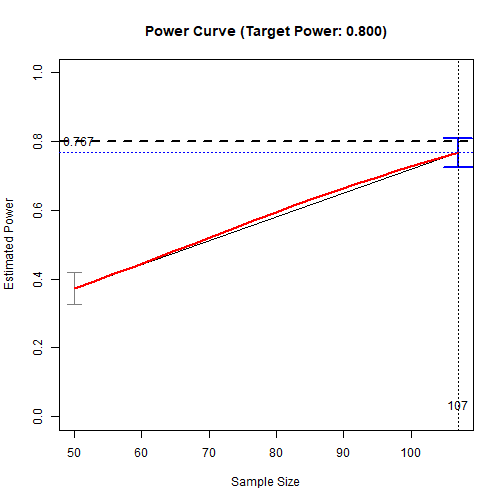
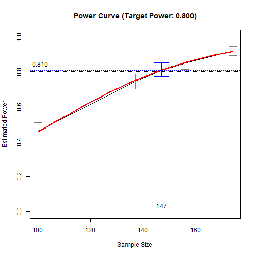

# Quick Template: Serial Mediation with Observed Variables

## Introduction

This and other “Quick Template” vignettes are examples of R code to do
power analysis or determine sample size in typical models using
[power4mome](https://sfcheung.github.io/power4mome/). Users can quickly
adapt them for their scenarios.

## Prerequisite

Basic knowledge about fitting models by `lavaan` and `power4mome` is
required.

This file is not intended to be an introduction on how to use functions
in `power4mome`. For details on how to use
[`power4test()`](https://sfcheung.github.io/power4mome/reference/power4test.md),
[`power4test_by_n()`](https://sfcheung.github.io/power4mome/reference/power4test_by_n.md),
and
[`n_from_power()`](https://sfcheung.github.io/power4mome/reference/x_from_power.md),
refer to the [Get-Started
article](https://sfcheung.github.io/power4mome/articles/power4mome.html),
and the
[article](https://sfcheung.github.io/power4mome/articles/x_from_power_for_n.html)
on finding the sample size given desired power using
[`n_from_power()`](https://sfcheung.github.io/power4mome/reference/x_from_power.md),
as well as the help pages of these functions.

## Common Flow

The following chart summarizes the steps covered below.

Common Workflow

In practice, steps can be repeated, and population values changed, until
the desired goal is achieved (e.g., a sample size with power close to
the target power is found).

## Scope

This file is for serial mediation models.

## Try One N

Estimate the power for a sample size.

The code:

``` r
library(power4mome)
#
# ====== Model: Form ======
# Omit any paths hypothesized to be zero
model <-
"
m1 ~ x
m2 ~ m1 + x
m3 ~ m2 + m1 + x
y ~ m3 + m2 + m1 + x
"
#
# ====== Model: Population Values ======
# l: large (.50 by default)
# m: medium (.30 by default)
# s: small (.10 by default)
# -l, -m, and -s denote negative values
# Can also set to a number directly
# Set each path to the hypothesized magnitude
model_es <-
"
m1 ~ x: l
m2 ~ m1: l
m3 ~ m2: l
y ~ m3: m
y ~ x: s
"
#
# ====== Test the Model Specification ======
out <- power4test(nrep = 2,
                  model = model,
                  pop_es = model_es,
                  n = 50000,
                  iseed = 1234)
#
# ====== Check the Data Generated ======
print(out,
      data_long = TRUE)
#
# ====== Estimate the Power ======
# For n = 100,
# when testing the indirect effect by
# Monte Carlo confidence interval
out <- power4test(nrep = 400,
                  model = model,
                  pop_es = model_es,
                  n = 50,
                  R = 1000,
                  ci_type = "mc",
                  test_fun = test_indirect_effect,
                  test_args = list(x = "x",
                                   m = c("m1", "m2", "m3"),
                                   y = "y",
                                   mc_ci = TRUE),
                  iseed = 1234,
                  parallel = TRUE)
#
# ====== Compute the Rejection Rate ======
rejection_rates(out)
```

The results:

``` r
print(out,
      data_long = TRUE)
#> 
#> ====================== Model Information ======================
#> 
#> == Model on Factors/Variables ==
#> 
#> m1 ~ x
#> m2 ~ m1 + x
#> m3 ~ m2 + m1 + x
#> y ~ m3 + m2 + m1 + x
#> 
#> == Model on Variables/Indicators ==
#> 
#> m1 ~ x
#> m2 ~ m1 + x
#> m3 ~ m2 + m1 + x
#> y ~ m3 + m2 + m1 + x
#> 
#> ====== Population Values ======
#> 
#> Regressions:
#>                    Population
#>   m1 ~                       
#>     x                 0.500  
#>   m2 ~                       
#>     m1                0.500  
#>     x                 0.000  
#>   m3 ~                       
#>     m2                0.500  
#>     m1                0.000  
#>     x                 0.000  
#>   y ~                        
#>     m3                0.300  
#>     m2                0.000  
#>     m1                0.000  
#>     x                 0.100  
#> 
#> Variances:
#>                    Population
#>    .m1                0.750  
#>    .m2                0.750  
#>    .m3                0.750  
#>    .y                 0.893  
#>     x                 1.000  
#> 
#> (Computing indirect effects for 8 paths ...)
#> 
#> == Population Conditional/Indirect Effect(s) ==
#> 
#> == Indirect Effect(s) ==
#> 
#>                            ind
#> x -> m1 -> m2 -> m3 -> y 0.037
#> x -> m1 -> m2 -> y       0.000
#> x -> m1 -> m3 -> y       0.000
#> x -> m1 -> y             0.000
#> x -> m2 -> m3 -> y       0.000
#> x -> m2 -> y             0.000
#> x -> m3 -> y             0.000
#> x -> y                   0.100
#> 
#>  - The 'ind' column shows the indirect effect(s).
#>  
#> ======================= Data Information =======================
#> 
#> Number of Replications:  400 
#> Sample Sizes:  50 
#> 
#> ==== Descriptive Statistics ====
#> 
#>    vars     n  mean   sd skew kurtosis   se
#> m1    1 20000 -0.01 1.00 0.03    -0.04 0.01
#> m2    2 20000  0.00 1.00 0.01     0.06 0.01
#> m3    3 20000 -0.01 1.00 0.01    -0.05 0.01
#> y     4 20000 -0.01 1.00 0.01    -0.03 0.01
#> x     5 20000  0.00 1.01 0.00    -0.02 0.01
#> 
#> ==== Parameter Estimates Based on All 400 Samples Combined ====
#> 
#> Total Sample Size: 20000 
#> 
#> ==== Standardized Estimates ====
#> 
#> Variances and error variances omitted.
#> 
#> Regressions:
#>                     est.std
#>   m1 ~                     
#>     x                 0.493
#>   m2 ~                     
#>     m1                0.498
#>     x                 0.010
#>   m3 ~                     
#>     m2                0.499
#>     m1               -0.001
#>     x                 0.011
#>   y ~                      
#>     m3                0.296
#>     m2               -0.002
#>     m1                0.014
#>     x                 0.086
#> 
#> 
#> ==================== Extra Element(s) Found ====================
#> 
#> - fit
#> - mc_out
#> 
#> === Element(s) of the First Dataset ===
#> 
#> ============ <fit> ============
#> 
#> lavaan 0.6-19 ended normally after 1 iteration
#> 
#>   Estimator                                         ML
#>   Optimization method                           NLMINB
#>   Number of model parameters                        14
#> 
#>   Number of observations                            50
#> 
#> Model Test User Model:
#>                                                       
#>   Test statistic                                 0.000
#>   Degrees of freedom                                 0
#> 
#> =========== <mc_out> ===========
#> 
#> 
#> == A 'mc_out' class object ==
#> 
#> Number of Monte Carlo replications: 1000 
#> 
#> 
#> ====================== Test(s) Conducted ======================
#> 
#> - test_indirect: x->m1->m2->m3->y
#> 
#> Call print() and set 'test_long = TRUE' for a detailed report.
rejection_rates(out)
#> [test]: test_indirect: x->m1->m2->m3->y 
#> [test_label]: Test 
#>     est   p.v reject r.cilo r.cihi
#> 1 0.036 1.000  0.372  0.325  0.420
#> Notes:
#> - p.v: The proportion of valid replications.
#> - est: The mean of the estimates in a test across replications.
#> - reject: The proportion of 'significant' replications, that is, the
#>   rejection rate. If the null hypothesis is true, this is the Type I
#>   error rate. If the null hypothesis is false, this is the power.
#> - r.cilo,r.cihi: The confidence interval of the rejection rate, based
#>   on normal approximation.
#> - Refer to the tests for the meanings of other columns.
```

## Try Another N

To rerun the simulation to estimate power for another sample size.

The code:

``` r
#
# ===== Reuse the output of power4test() =====
# Estimate power for n = 60
# Set n to 60
out_new_n <- power4test(out,
                        n = 60)
#
# ===== Compute Rejection Rate (Power) =====
rejection_rates(out_new_n)
```

The results:

``` r
rejection_rates(out_new_n)
#> [test]: test_indirect: x->m1->m2->m3->y 
#> [test_label]: Test 
#>     est   p.v reject r.cilo r.cihi
#> 1 0.037 1.000  0.507  0.459  0.556
#> Notes:
#> - p.v: The proportion of valid replications.
#> - est: The mean of the estimates in a test across replications.
#> - reject: The proportion of 'significant' replications, that is, the
#>   rejection rate. If the null hypothesis is true, this is the Type I
#>   error rate. If the null hypothesis is false, this is the power.
#> - r.cilo,r.cihi: The confidence interval of the rejection rate, based
#>   on normal approximation.
#> - Refer to the tests for the meanings of other columns.
```

## Try Several N’s

Rerun the simulation to estimate power for with several sample sizes.

The code:

``` r
#
# ===== Reuse the output of power4test() =====
# Estimate power for n = 70, 80, 90
# Use power4test_by_n()
out_ns <- power4test_by_n(out,
                          n = c(70, 80, 90),
                          by_seed = 5789)
#
# ===== Compute Rejection Rate (Power) =====
rejection_rates(out_ns)
```

The results:

``` r
rejection_rates(out_ns)
#> [test]: test_indirect: x->m1->m2->m3->y 
#> [test_label]: Test 
#>    n   est   p.v reject r.cilo r.cihi
#> 1 70 0.038 1.000  0.615  0.567  0.663
#> 2 80 0.038 1.000  0.688  0.642  0.733
#> 3 90 0.037 1.000  0.723  0.679  0.766
#> Notes:
#> - n: The sample size in a trial.
#> - p.v: The proportion of valid replications.
#> - est: The mean of the estimates in a test across replications.
#> - reject: The proportion of 'significant' replications, that is, the
#>   rejection rate. If the null hypothesis is true, this is the Type I
#>   error rate. If the null hypothesis is false, this is the power.
#> - r.cilo,r.cihi: The confidence interval of the rejection rate, based
#>   on normal approximation.
#> - Refer to the tests for the meanings of other columns.
```

## Search N With Target Power

Search, by simulation, the sample size with estimated power close to a
target level (e.g., .80).

### Use the Output of `power4test()`

Do this step after calling
[`power4test()`](https://sfcheung.github.io/power4mome/reference/power4test.md)
on a sample size.

It can take some time to run if the estimated power of the sample size
is too different from the target power.

The code:

``` r
#
# ===== Reuse the output of power4test() =====
# Call x_from_power()
# - Set target power: target_power = .80 (Default, can be omitted)
# To set desired precision:
# - Set final number of R: final_R = 1000 (Default, can be omitted)
# - Set final number of replications: final_nrep = 400 (Default, can be omitted)
n_power_80 <- x_from_power(out,
                           x = "n",
                           seed = 1357)
#
# ===== Print the Summary =====
summary(n_power_80)
#
# ===== Plot the (Crude) Power Curve =====
plot(n_power_80)
```

The results:

``` r
#
# ===== Print the Summary =====
summary(n_power_80)
#> 
#> ====== x_from_power Results ======
#> 
#> Call:
#> x_from_power(object = out, x = "n", seed = 1357)
#> 
#> Predictor (x): Sample Size 
#> 
#> - Target Power: 0.800 
#> - Goal: Find 'x' with the confidence interval of the estimated power
#>   enclosing the target power.
#> 
#> === Major Results ===
#> 
#> - Final Value (Sample Size): 107
#> 
#> - Final Estimated Power: 0.767 
#> - Confidence Interval: [0.726; 0.809]
#> - Level of confidence: 95.0%
#> - Based on 400 replications.
#> 
#> === Technical Information ===
#> 
#> - Algorithm: bisection 
#> - The range of values explored: 107 to 50 
#> - Time spent in the search: 22.53 secs 
#> - The final crude model for the power-predictor relation:
#> 
#> Model Type: Logistic Regression 
#> 
#> Call:
#> power_curve(object = by_x_1, formula = power_model, start = power_curve_start, 
#>     lower_bound = lower_bound, upper_bound = upper_bound, nls_args = nls_args, 
#>     nls_control = nls_control, verbose = progress)
#> 
#> Predictor: n (Sample Size)
#> 
#> Model:
#> 
#> Call:  stats::glm(formula = reject ~ x, family = "binomial", data = reject1)
#> 
#> Coefficients:
#> (Intercept)            x  
#>     -2.0266       0.0301  
#> 
#> Degrees of Freedom: 799 Total (i.e. Null);  798 Residual
#> Null Deviance:       1093 
#> Residual Deviance: 962   AIC: 966
#> 
#> - Detailed Results:
#> 
#> [test]: test_indirect: x->m1->m2->m3->y 
#> [test_label]: Test 
#>     n   est   p.v reject r.cilo r.cihi
#> 1  50 0.036 1.000  0.372  0.325  0.420
#> 2 107 0.036 1.000  0.767  0.726  0.809
#> Notes:
#> - n: The sample size in a trial.
#> - p.v: The proportion of valid replications.
#> - est: The mean of the estimates in a test across replications.
#> - reject: The proportion of 'significant' replications, that is, the
#>   rejection rate. If the null hypothesis is true, this is the Type I
#>   error rate. If the null hypothesis is false, this is the power.
#> - r.cilo,r.cihi: The confidence interval of the rejection rate, based
#>   on normal approximation.
#> - Refer to the tests for the meanings of other columns.
#
# ===== Plot the (Crude) Power Curve =====
plot(n_power_80)
```



Power Curve

### Use the Output of `power4test_by_n()`

Do this step after calling
[`power4test_by_n()`](https://sfcheung.github.io/power4mome/reference/power4test_by_n.md)
on a sample size.

Continue the search using the output on several sample sizes by calling
[`x_from_power()`](https://sfcheung.github.io/power4mome/reference/x_from_power.md)
on the output of
[`power4test_by_n()`](https://sfcheung.github.io/power4mome/reference/power4test_by_n.md).

It can take some time to run if the estimated levels of power of the
sample sizes are too different from the target power.

The code:

``` r
#
# ===== Reuse the output of power4test_by_n() =====
# Call x_from_power()
# - Set target power: target_power = .80 (Default, can be omitted)
# To set desired precision:
# - Set final number of R: final_R = 1000 (Default, can be omitted)
# - Set final number of replications: final_nrep = 400 (Default, can be omitted)
n_power_80_ns <- x_from_power(out_ns,
                              x = "n",
                              seed = 1357)
#
# ===== Print the Summary =====
summary(n_power_80_ns)
#
# ===== Plot the (Crude) Power Curve =====
plot(n_power_80_ns)
```

The results:

``` r
#
# ===== Print the Summary =====
summary(n_power_80_ns)
#> 
#> ====== x_from_power Results ======
#> 
#> Call:
#> x_from_power(object = out_ns, x = "n", seed = 1357)
#> 
#> Predictor (x): Sample Size 
#> 
#> - Target Power: 0.800 
#> - Goal: Find 'x' with the confidence interval of the estimated power
#>   enclosing the target power.
#> 
#> === Major Results ===
#> 
#> - Final Value (Sample Size): 119
#> 
#> - Final Estimated Power: 0.835 
#> - Confidence Interval: [0.799; 0.871]
#> - Level of confidence: 95.0%
#> - Based on 400 replications.
#> 
#> === Technical Information ===
#> 
#> - Algorithm: bisection 
#> - The range of values explored: 100 to 90 
#> - Time spent in the search: 1.446 mins 
#> - The final crude model for the power-predictor relation:
#> 
#> Model Type: Logistic Regression 
#> 
#> Call:
#> power_curve(object = by_x_1, formula = power_model, start = power_curve_start, 
#>     lower_bound = lower_bound, upper_bound = upper_bound, nls_args = nls_args, 
#>     nls_control = nls_control, verbose = progress)
#> 
#> Predictor: n (Sample Size)
#> 
#> Model:
#> 
#> Call:  stats::glm(formula = reject ~ x, family = "binomial", data = reject1)
#> 
#> Coefficients:
#> (Intercept)            x  
#>     -1.0876       0.0223  
#> 
#> Degrees of Freedom: 1999 Total (i.e. Null);  1998 Residual
#> Null Deviance:       1861 
#> Residual Deviance: 1763  AIC: 1767
#> 
#> - Detailed Results:
#> 
#> [test]: test_indirect: x->m1->m2->m3->y 
#> [test_label]: Test 
#>     n   est   p.v reject r.cilo r.cihi
#> 1  90 0.037 1.000  0.723  0.679  0.766
#> 2 100 0.037 1.000  0.752  0.710  0.795
#> 3 119 0.037 1.000  0.835  0.799  0.871
#> 4 137 0.039 1.000  0.860  0.826  0.894
#> 5 174 0.038 1.000  0.950  0.929  0.971
#> Notes:
#> - n: The sample size in a trial.
#> - p.v: The proportion of valid replications.
#> - est: The mean of the estimates in a test across replications.
#> - reject: The proportion of 'significant' replications, that is, the
#>   rejection rate. If the null hypothesis is true, this is the Type I
#>   error rate. If the null hypothesis is false, this is the power.
#> - r.cilo,r.cihi: The confidence interval of the rejection rate, based
#>   on normal approximation.
#> - Refer to the tests for the meanings of other columns.
#
# ===== Plot the (Crude) Power Curve =====
plot(n_power_80_ns)
```


Power Curve

## Change Population Values and Repeat

If necessary, change the population value(s) and repeat the steps.

For example, set all the paths along the indirect effect to medium
(.30).

The code:

``` r
model_es2 <-
"
m1 ~ x: m
m2 ~ m1: m
m3 ~ m2: m
y ~ m3: m
y ~ x: s
"
#
# ====== Estimate the Power ======
out2 <- power4test(nrep = 400,
                   model = model,
                   pop_es = model_es2,
                   n = 100,
                   R = 1000,
                   ci_type = "mc",
                   test_fun = test_indirect_effect,
                   test_args = list(x = "x",
                                    m = c("m1", "m2", "m3"),
                                    y = "y",
                                    mc_ci = TRUE),
                   iseed = 1234,
                   parallel = TRUE)
#
# ====== Compute the Rejection Rate ======
rejection_rates(out2)
```

The results:

``` r
print(out2,
      data_long = TRUE)
#> 
#> ====================== Model Information ======================
#> 
#> == Model on Factors/Variables ==
#> 
#> m1 ~ x
#> m2 ~ m1 + x
#> m3 ~ m2 + m1 + x
#> y ~ m3 + m2 + m1 + x
#> 
#> == Model on Variables/Indicators ==
#> 
#> m1 ~ x
#> m2 ~ m1 + x
#> m3 ~ m2 + m1 + x
#> y ~ m3 + m2 + m1 + x
#> 
#> ====== Population Values ======
#> 
#> Regressions:
#>                    Population
#>   m1 ~                       
#>     x                 0.300  
#>   m2 ~                       
#>     m1                0.300  
#>     x                 0.000  
#>   m3 ~                       
#>     m2                0.300  
#>     m1                0.000  
#>     x                 0.000  
#>   y ~                        
#>     m3                0.300  
#>     m2                0.000  
#>     m1                0.000  
#>     x                 0.100  
#> 
#> Variances:
#>                    Population
#>    .m1                0.910  
#>    .m2                0.910  
#>    .m3                0.910  
#>    .y                 0.898  
#>     x                 1.000  
#> 
#> (Computing indirect effects for 8 paths ...)
#> 
#> == Population Conditional/Indirect Effect(s) ==
#> 
#> == Indirect Effect(s) ==
#> 
#>                            ind
#> x -> m1 -> m2 -> m3 -> y 0.008
#> x -> m1 -> m2 -> y       0.000
#> x -> m1 -> m3 -> y       0.000
#> x -> m1 -> y             0.000
#> x -> m2 -> m3 -> y       0.000
#> x -> m2 -> y             0.000
#> x -> m3 -> y             0.000
#> x -> y                   0.100
#> 
#>  - The 'ind' column shows the indirect effect(s).
#>  
#> ======================= Data Information =======================
#> 
#> Number of Replications:  400 
#> Sample Sizes:  100 
#> 
#> ==== Descriptive Statistics ====
#> 
#>    vars     n  mean   sd  skew kurtosis   se
#> m1    1 40000 -0.01 1.00  0.00     0.01 0.01
#> m2    2 40000  0.00 1.01 -0.01    -0.01 0.01
#> m3    3 40000  0.00 1.01  0.02     0.03 0.01
#> y     4 40000  0.00 1.00 -0.01    -0.01 0.00
#> x     5 40000 -0.01 1.00  0.00    -0.03 0.01
#> 
#> ==== Parameter Estimates Based on All 400 Samples Combined ====
#> 
#> Total Sample Size: 40000 
#> 
#> ==== Standardized Estimates ====
#> 
#> Variances and error variances omitted.
#> 
#> Regressions:
#>                     est.std
#>   m1 ~                     
#>     x                 0.306
#>   m2 ~                     
#>     m1                0.303
#>     x                -0.001
#>   m3 ~                     
#>     m2                0.305
#>     m1                0.001
#>     x                -0.005
#>   y ~                      
#>     m3                0.300
#>     m2               -0.005
#>     m1                0.006
#>     x                 0.105
#> 
#> 
#> ==================== Extra Element(s) Found ====================
#> 
#> - fit
#> - mc_out
#> 
#> === Element(s) of the First Dataset ===
#> 
#> ============ <fit> ============
#> 
#> lavaan 0.6-19 ended normally after 1 iteration
#> 
#>   Estimator                                         ML
#>   Optimization method                           NLMINB
#>   Number of model parameters                        14
#> 
#>   Number of observations                           100
#> 
#> Model Test User Model:
#>                                                       
#>   Test statistic                                 0.000
#>   Degrees of freedom                                 0
#> 
#> =========== <mc_out> ===========
#> 
#> 
#> == A 'mc_out' class object ==
#> 
#> Number of Monte Carlo replications: 1000 
#> 
#> 
#> ====================== Test(s) Conducted ======================
#> 
#> - test_indirect: x->m1->m2->m3->y
#> 
#> Call print() and set 'test_long = TRUE' for a detailed report.
rejection_rates(out2)
#> [test]: test_indirect: x->m1->m2->m3->y 
#> [test_label]: Test 
#>     est   p.v reject r.cilo r.cihi
#> 1 0.009 1.000  0.460  0.411  0.509
#> Notes:
#> - p.v: The proportion of valid replications.
#> - est: The mean of the estimates in a test across replications.
#> - reject: The proportion of 'significant' replications, that is, the
#>   rejection rate. If the null hypothesis is true, this is the Type I
#>   error rate. If the null hypothesis is false, this is the power.
#> - r.cilo,r.cihi: The confidence interval of the rejection rate, based
#>   on normal approximation.
#> - Refer to the tests for the meanings of other columns.
```

For illustration, go directly to searching by
[`x_from_power()`](https://sfcheung.github.io/power4mome/reference/x_from_power.md):

The code:

``` r
#
# ===== Reuse the output of power4test() =====
n2_power_80 <- x_from_power(out2,
                            x = "n",
                            seed = 1357)
#
# ===== Print the Summary =====
summary(n2_power_80)
#
# ===== Plot the (Crude) Power Curve =====
plot(n2_power_80)
```

The results:

``` r
#
# ===== Print the Summary =====
summary(n2_power_80)
#> 
#> ====== x_from_power Results ======
#> 
#> Call:
#> x_from_power(object = out2, x = "n", seed = 1357)
#> 
#> Predictor (x): Sample Size 
#> 
#> - Target Power: 0.800 
#> - Goal: Find 'x' with the confidence interval of the estimated power
#>   enclosing the target power.
#> 
#> === Major Results ===
#> 
#> - Final Value (Sample Size): 147
#> 
#> - Final Estimated Power: 0.810 
#> - Confidence Interval: [0.772; 0.848]
#> - Level of confidence: 95.0%
#> - Based on 400 replications.
#> 
#> === Technical Information ===
#> 
#> - Algorithm: bisection 
#> - The range of values explored: 100 to 174 
#> - Time spent in the search: 1.55 mins 
#> - The final crude model for the power-predictor relation:
#> 
#> Model Type: Logistic Regression 
#> 
#> Call:
#> power_curve(object = by_x_1, formula = power_model, start = power_curve_start, 
#>     lower_bound = lower_bound, upper_bound = upper_bound, nls_args = nls_args, 
#>     nls_control = nls_control, verbose = progress)
#> 
#> Predictor: n (Sample Size)
#> 
#> Model:
#> 
#> Call:  stats::glm(formula = reject ~ x, family = "binomial", data = reject1)
#> 
#> Coefficients:
#> (Intercept)            x  
#>     -3.6239       0.0345  
#> 
#> Degrees of Freedom: 1999 Total (i.e. Null);  1998 Residual
#> Null Deviance:       2218 
#> Residual Deviance: 1957  AIC: 1961
#> 
#> - Detailed Results:
#> 
#> [test]: test_indirect: x->m1->m2->m3->y 
#> [test_label]: Test 
#>     n   est   p.v reject r.cilo r.cihi
#> 1 100 0.009 1.000  0.460  0.411  0.509
#> 2 137 0.008 1.000  0.745  0.702  0.788
#> 3 147 0.008 1.000  0.810  0.772  0.848
#> 4 156 0.008 1.000  0.850  0.815  0.885
#> 5 174 0.008 1.000  0.920  0.893  0.947
#> Notes:
#> - n: The sample size in a trial.
#> - p.v: The proportion of valid replications.
#> - est: The mean of the estimates in a test across replications.
#> - reject: The proportion of 'significant' replications, that is, the
#>   rejection rate. If the null hypothesis is true, this is the Type I
#>   error rate. If the null hypothesis is false, this is the power.
#> - r.cilo,r.cihi: The confidence interval of the rejection rate, based
#>   on normal approximation.
#> - Refer to the tests for the meanings of other columns.
#
# ===== Plot the (Crude) Power Curve =====
plot(n2_power_80)
```



Power Curve
