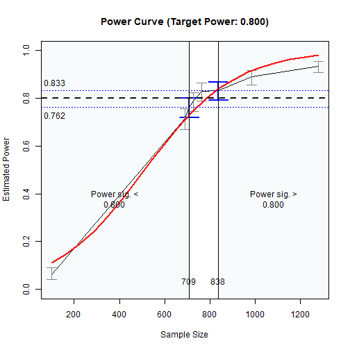

# Quick Template: Moderation with Observed Variables: Two Moderators

## Introduction

This and other “Quick Template” articles are examples of R code to
determine the range of sample sizes for a target level of power in
typical models using
[power4mome](https://sfcheung.github.io/power4mome/). Users can quickly
adapt them for their scenarios. A summary of the code examples can be
found in the section [Code Template](#code_template) at the end of this
document.

## Prerequisite

Basic knowledge about fitting models by `lavaan` and `power4mome` is
required.

This file is not intended to be an introduction on how to use functions
in `power4mome`. For details on how to use
[`power4test()`](https://sfcheung.github.io/power4mome/reference/power4test.md),
refer to the [Get-Started
article](https://sfcheung.github.io/power4mome/articles/power4mome.html).
Please also refer to the help page of
[`n_region_from_power()`](https://sfcheung.github.io/power4mome/reference/x_from_power.md),
and the
[article](https://sfcheung.github.io/power4mome/articles/x_from_power_for_n.html)
on
[`n_from_power()`](https://sfcheung.github.io/power4mome/reference/x_from_power.md),
which is called twice by
[`n_region_from_power()`](https://sfcheung.github.io/power4mome/reference/x_from_power.md)
to find the regions described below.

## Scope

This file is for moderation models with two or more moderators, and only
two-way interaction effects are involved.

## Functions Used in This Template

- [`power4test()`](https://sfcheung.github.io/power4mome/reference/power4test.md)

  - Set up the model and the population values, generate the data, and
    generate the Monte Carlo simulated estimates for Monte Carlo
    confidence interval.

- [`n_region_from_power()`](https://sfcheung.github.io/power4mome/reference/x_from_power.md)

  - Find the regions of sample sizes based on the target power.

- [`test_parameters()`](https://sfcheung.github.io/power4mome/reference/test_parameters.md)

  - Test selected parameters. Used by
    [`power4test()`](https://sfcheung.github.io/power4mome/reference/power4test.md)
    to test a selected product term (interaction term).

## Common Flow

The following chart summarizes the steps covered below.

Common Workflow

In practice, steps can be repeated, and population values changed, until
the desired goal is achieved (e.g., the region of sample sizes with
power close to the target power is found).

## Set Up The Model and Test

Load the package first:

``` r
library(power4mome)
```

Estimate the power for a sample size.

The case of two moderators is illustrated but the code can be easily
extended to any number of moderators.

The code for the model:

``` r
# ====== Model: Form ======

# Make sure all 1st order terms (w1, w2, w3, etc.) are included

model <-
"
y ~ x + w1 + w2 + x:w1 + x:w2
"

# ====== Model: Population Values ======

# For a regression coefficient
# l: large (.50 by default)
# m: medium (.30 by default)
# s: small (.10 by default)
# n: nil (.00 by default)
# For the product term:
# l: large (.15 by default)
# m: medium (.10 by default)
# s: small (.05 by default)
# -l, -m, and -s denote negative values
# Omitted paths are zero by default
# Can also set to a number directly
# Set each path to the hypothesized magnitude

# For a path moderated, the coefficient
# of a predictor is its standardized
# effect when the moderator equal to
# its mean.

model_es <-
"
y ~ x: s
y ~ w1: s
y ~ w2: s
y ~ x:w1: l
y ~ x:w2: m
"
```


The Model

``` r

# ====== Test the Model Specification ======

# Fit the model by regression using lm()
# Add: fit_model_args = list(fit_function = "lm")

out <- power4test(nrep = 2,
                  model = model,
                  pop_es = model_es,
                  n = 50000,
                  fit_model_args = list(fit_function = "lm"),
                  iseed = 1234)

# ====== Check the Data Generated ======

print(out,
      data_long = TRUE)

# ====== Estimate the Power ======

# For n = 200.
# Find the power with *both* x:w1 and x:w2 significant.
# in the regression results of lm().
# The test by CI is equivalent to the two-tailed t-test.
# Add omnibus = "all_sig" to find this power.

out <- power4test(nrep = 600,
                  model = model,
                  pop_es = model_es,
                  n = 200,
                  fit_model_args = list(fit_function = "lm"),
                  test_fun = test_parameters,
                  test_args = list(pars = c("y~x:w1",
                                            "y~x:w2"),
                                   omnibus = "all_sig"),
                  iseed = 1234,
                  parallel = TRUE)

# ====== Compute the Rejection Rate ======

rejection_rates(out)
```

The results:

``` r
print(out,
      data_long = TRUE)
#> 
#> ====================== Model Information ======================
#> 
#> == Model on Factors/Variables ==
#> 
#> y ~ x + w1 + w2 + x:w1 + x:w2
#> 
#> == Model on Variables/Indicators ==
#> 
#> y ~ x + w1 + w2 + x:w1 + x:w2
#> 
#> ====== Population Values ======
#> 
#> Regressions:
#>                    Population
#>   y ~                        
#>     x                 0.100  
#>     w1                0.100  
#>     w2                0.100  
#>     x:w1              0.150  
#>     x:w2              0.100  
#> 
#> Covariances:
#>                    Population
#>   x ~~                       
#>     w1                0.000  
#>     w2                0.000  
#>     x:w1              0.000  
#>     x:w2              0.000  
#>   w1 ~~                      
#>     w2                0.000  
#>     x:w1              0.000  
#>     x:w2              0.000  
#>   w2 ~~                      
#>     x:w1              0.000  
#>     x:w2              0.000  
#>   x:w1 ~~                    
#>     x:w2              0.000  
#> 
#> Variances:
#>                    Population
#>    .y                 0.937  
#>     x                 1.000  
#>     w1                1.000  
#>     w2                1.000  
#>     x:w1              1.000  
#>     x:w2              1.000  
#> 
#> (Computing conditional effects for 3 paths ...)
#> 
#> == Population Conditional/Indirect Effect(s) ==
#> 
#> == Conditional effects ==
#> 
#>  Path: x -> y
#>  Conditional on moderator(s): w1, w2
#>  Moderator(s) represented by: w1, w2
#> 
#>      [w1]    [w2] (w1) (w2)    ind
#> 1 M+1.0SD M+1.0SD    1    1  0.350
#> 2 M+1.0SD M-1.0SD    1   -1  0.150
#> 3 M-1.0SD M+1.0SD   -1    1  0.050
#> 4 M-1.0SD M-1.0SD   -1   -1 -0.150
#> 
#>  - The 'ind' column shows the conditional effects.
#>  
#> 
#> == Conditional effects ==
#> 
#>  Path: w1 -> y
#>  Conditional on moderator(s): x
#>  Moderator(s) represented by: x
#> 
#>       [x] (x)    ind
#> 1 M+1.0SD   1  0.250
#> 2 Mean      0  0.100
#> 3 M-1.0SD  -1 -0.050
#> 
#>  - The 'ind' column shows the conditional effects.
#>  
#> 
#> == Conditional effects ==
#> 
#>  Path: w2 -> y
#>  Conditional on moderator(s): x
#>  Moderator(s) represented by: x
#> 
#>       [x] (x)   ind
#> 1 M+1.0SD   1 0.200
#> 2 Mean      0 0.100
#> 3 M-1.0SD  -1 0.000
#> 
#>  - The 'ind' column shows the conditional effects.
#>  
#> 
#> ======================= Data Information =======================
#> 
#> Number of Replications:  600 
#> Sample Sizes:  200 
#> 
#> ==== Descriptive Statistics ====
#> 
#>      vars      n  mean sd  skew kurtosis se
#> y       1 120000  0.00  1  0.02     0.02  0
#> x       2 120000  0.00  1  0.00    -0.01  0
#> w1      3 120000  0.00  1  0.00    -0.01  0
#> w2      4 120000  0.00  1  0.00     0.00  0
#> x:w1    5 120000  0.00  1  0.03     5.84  0
#> x:w2    6 120000 -0.01  1 -0.06     5.90  0
#> 
#> ==== Parameter Estimates Based on All 600 Samples Combined ====
#> 
#> Total Sample Size: 120000 
#> 
#> ==== Standardized Estimates ====
#> 
#> Variances and error variances omitted.
#> 
#> Regressions:
#>                     est.std
#>   y ~                      
#>     x                 0.098
#>     w1                0.101
#>     w2                0.102
#>     x:w1              0.148
#>     x:w2              0.105
#> 
#> Covariances:
#>                     est.std
#>   x ~~                     
#>     w1               -0.002
#>     w2               -0.006
#>     x:w1             -0.005
#>     x:w2             -0.004
#>   w1 ~~                    
#>     w2                0.008
#>     x:w1             -0.007
#>     x:w2              0.002
#>   w2 ~~                    
#>     x:w1              0.002
#>     x:w2             -0.002
#>   x:w1 ~~                  
#>     x:w2              0.005
#> 
#> 
#> ==================== Extra Element(s) Found ====================
#> 
#> - fit
#> 
#> === Element(s) of the First Dataset ===
#> 
#> ============ <fit> ============
#> 
#> 
#> The models:
#> y ~ x + w1 + w2 + x:w1 + x:w2
#> <environment: 0x00000226b7872428>
#> 
#> 
#> ===== <test_parameters: CIs (pars: y~x:w1,y~x:w2)> =====
#> 
#> Mean(s) across replication:
#>   test_label  lhs   op  rhs  est   se pvalue cilo cihi   sig
#> 1    All sig <NA> <NA> <NA>  NaN  NaN    NaN  NaN  NaN 0.187
#> 
#> - The column 'sig' shows the rejection rates.
#> - If the null hypothesis is false, the rate is the power.
#> - Number of valid replications for rejection rate(s): 600 
#> - Proportion of valid replications for rejection rate(s): 1.000
rejection_rates(out)
#> [test]: test_parameters: CIs (pars: y~x:w1,y~x:w2) 
#> [test_label]: All sig 
#>    est   p.v reject r.cilo r.cihi
#> 1  NaN 1.000  0.187  0.158  0.220
#> Notes:
#> - p.v: The proportion of valid replications.
#> - est: The mean of the estimates in a test across replications.
#> - reject: The proportion of 'significant' replications, that is, the
#>   rejection rate. If the null hypothesis is true, this is the Type I
#>   error rate. If the null hypothesis is false, this is the power.
#> - r.cilo,r.cihi: The confidence interval of the rejection rate, based
#>   on Wilson's (1927) method.
#> - Refer to the tests for the meanings of other columns.
```

## Find the Regions of *N* Based on the Target Power

Search, by simulation, the following two regions of sample sizes:

- Sample sizes with estimated levels of power significantly below the
  target level (e.g., .80), tested by the confidence interval (95% by
  default).

- Sample sizes with estimated levels of power significantly above the
  target level (e.g., .80), tested by the confidence interval (95% by
  default).

In practice, we rarely need high precision for these regions for sample
size planning. Therefore, we only need to find the two sample sizes with
the corresponding confidence bounds *close* *enough* to the target
power, defined by a tolerance value. In the function below, this value
is .02 by default.

It can take some time to run if the estimated power of the sample size
is too different from the target power.

We can find the two regions by
[`n_region_from_power()`](https://sfcheung.github.io/power4mome/reference/x_from_power.md).

The code:

``` r
#
# ===== Reuse the output of power4test() =====
#
# Call n_region_from_power()
# - Set target power: target_power = .80 (Default, can be omitted)
# - Set the seed for the simulation: Integer. Should always be set.
# To set desired precision:
# - Set final number of R: final_R. If omitted,
#   it is set to 1000 or set to R in the original object.
# - Set final number of replications: final_nrep. If omitted,
#   it is set to 400 or set to nrep in the original object.

n_power_region <- n_region_from_power(out,
                                      seed = 1357)

# ===== Basic Results =====

n_power_region

# ===== Plot the (Crude) Power Curve and the Regions =====

plot(n_power_region)
```

The results:

``` r
# ===== Basic Results =====

n_power_region
#> Call:
#> n_region_from_power(object = out, seed = 1357)
#> 
#>                      Setting                                      
#> Predictor(x)         Sample Size                                  
#> Goal:                Power significantly below or above the target
#> algorithm:           bisection                                    
#> Level of confidence: 95.00%                                       
#> Target Power:        0.800                                        
#> 
#> Solution: 
#> 
#> Approximate region of sample sizes with power:
#> - not significantly different from 0.800: 703 to 782
#> - significantly lower than 0.800: 703
#> - significantly higher than 0.800: 782
#> 
#> Confidence intervals of the estimated power:
#> - for the lower bound (703): [0.745, 0.811]
#> - for the upper bound (782): [0.782, 0.844]
#> 
#> Call `summary()` for detailed results.

# ===== Plot the (Crude) Power Curve and the Regions =====

plot(n_power_region)
```



Power Curve

As shown above, approximately:

- sample sizes lower than 703 have power significantly lower than .80,
  and

- sample sizes higher than 782 have power significantly higher than .80.

In other words, sample sizes between 703 and 782 have power not
significantly different from .80.

If necessary, detailed results can be printed by
[`summary()`](https://rdrr.io/r/base/summary.html):

``` r
# ===== Detailed Results =====
summary(n_power_region)
#> 
#> ======<< Summary for the Lower Region >>======
#> 
#> 
#> ====== x_from_power Results ======
#> 
#> Call:
#> x_from_power(object = out, x = "n", what = "ub", goal = "close_enough", 
#>     final_nrep = 600, final_R = 1000, seed = 1357)
#> 
#> Predictor (x): Sample Size 
#> 
#> - Target Power: 0.800 
#> - Goal: Find 'x' with estimated upper confidence bound close enough to
#>   the target power.
#> 
#> === Major Results ===
#> 
#> - Final Value (Sample Size): 703
#> 
#> - Final Estimated Power: 0.780 
#> - Confidence Interval: [0.745; 0.811]
#> - Level of confidence: 95.0%
#> - Based on 600 replications.
#> 
#> === Technical Information ===
#> 
#> - Algorithm: bisection 
#> - Tolerance for 'close enough': Within 0.02000 of 0.800 
#> - The range of values explored: 200 to 857 
#> - Time spent in the search: 1.481 mins 
#> - The final crude model for the power-predictor relation:
#> 
#> Model Type: Logistic Regression 
#> 
#> Call:
#> power_curve(object = by_x_1, formula = power_model, start = power_curve_start, 
#>     lower_bound = lower_bound, upper_bound = upper_bound, nls_args = nls_args, 
#>     nls_control = nls_control, verbose = progress)
#> 
#> Predictor: n (Sample Size)
#> 
#> Model:
#> 
#> Call:  stats::glm(formula = reject ~ x, family = "binomial", data = reject1)
#> 
#> Coefficients:
#> (Intercept)            x  
#>   -2.191888     0.004842  
#> 
#> Degrees of Freedom: 4199 Total (i.e. Null);  4198 Residual
#> Null Deviance:       5451 
#> Residual Deviance: 4613  AIC: 4617
#> 
#> - Detailed Results:
#> 
#> [test]: test_parameters: CIs (pars: y~x:w1,y~x:w2) 
#> [test_label]: All sig 
#>     n  est   p.v reject r.cilo r.cihi
#> 1 200  NaN 1.000  0.187  0.158  0.220
#> 2 400  NaN 1.000  0.492  0.452  0.532
#> 3 629  NaN 1.000  0.727  0.690  0.761
#> 4 687  NaN 1.000  0.742  0.705  0.775
#> 5 696  NaN 1.000  0.745  0.709  0.778
#> 6 703  NaN 1.000  0.780  0.745  0.811
#> 7 857  NaN 1.000  0.862  0.832  0.887
#> Notes:
#> - n: The sample size in a trial.
#> - p.v: The proportion of valid replications.
#> - est: The mean of the estimates in a test across replications.
#> - reject: The proportion of 'significant' replications, that is, the
#>   rejection rate. If the null hypothesis is true, this is the Type I
#>   error rate. If the null hypothesis is false, this is the power.
#> - r.cilo,r.cihi: The confidence interval of the rejection rate, based
#>   on Wilson's (1927) method.
#> - Refer to the tests for the meanings of other columns.
#> 
#> 
#> 
#> ======<< Summary for the Upper Region >>======
#> 
#> 
#> ====== x_from_power Results ======
#> 
#> Call:
#> x_from_power(object = out, seed = 1357, final_nrep = 600, final_R = 1000, 
#>     x = "n", what = "lb", goal = "close_enough")
#> 
#> Predictor (x): Sample Size 
#> 
#> - Target Power: 0.800 
#> - Goal: Find 'x' with estimated lower confidence bound close enough to
#>   the target power.
#> 
#> === Major Results ===
#> 
#> - Final Value (Sample Size): 782
#> 
#> - Final Estimated Power: 0.815 
#> - Confidence Interval: [0.782; 0.844]
#> - Level of confidence: 95.0%
#> - Based on 600 replications.
#> 
#> === Technical Information ===
#> 
#> - Algorithm: bisection 
#> - Tolerance for 'close enough': Within 0.02000 of 0.800 
#> - The range of values explored: 200 to 857 
#> - Time spent in the search: 32.98 secs 
#> - The final crude model for the power-predictor relation:
#> 
#> Model Type: Logistic Regression 
#> 
#> Call:
#> power_curve(object = by_x_1, formula = power_model, start = power_curve_start, 
#>     lower_bound = lower_bound, upper_bound = upper_bound, nls_args = nls_args, 
#>     nls_control = nls_control, verbose = progress)
#> 
#> Predictor: n (Sample Size)
#> 
#> Model:
#> 
#> Call:  stats::glm(formula = reject ~ x, family = "binomial", data = reject1)
#> 
#> Coefficients:
#> (Intercept)            x  
#>   -2.159859     0.004778  
#> 
#> Degrees of Freedom: 5399 Total (i.e. Null);  5398 Residual
#> Null Deviance:       6918 
#> Residual Deviance: 5997  AIC: 6001
#> 
#> - Detailed Results:
#> 
#> [test]: test_parameters: CIs (pars: y~x:w1,y~x:w2) 
#> [test_label]: All sig 
#>     n  est   p.v reject r.cilo r.cihi
#> 1 200  NaN 1.000  0.187  0.158  0.220
#> 2 400  NaN 1.000  0.492  0.452  0.532
#> 3 529  NaN 1.000  0.598  0.559  0.637
#> 4 629  NaN 1.000  0.727  0.690  0.761
#> 5 687  NaN 1.000  0.742  0.705  0.775
#> 6 696  NaN 1.000  0.745  0.709  0.778
#> 7 703  NaN 1.000  0.780  0.745  0.811
#> 8 782  NaN 1.000  0.815  0.782  0.844
#> 9 857  NaN 1.000  0.862  0.832  0.887
#> Notes:
#> - n: The sample size in a trial.
#> - p.v: The proportion of valid replications.
#> - est: The mean of the estimates in a test across replications.
#> - reject: The proportion of 'significant' replications, that is, the
#>   rejection rate. If the null hypothesis is true, this is the Type I
#>   error rate. If the null hypothesis is false, this is the power.
#> - r.cilo,r.cihi: The confidence interval of the rejection rate, based
#>   on Wilson's (1927) method.
#> - Refer to the tests for the meanings of other columns.
```

## Code Template

This is the code used above:

``` r
library(power4mome)

# ====== Model and Effect Size (Population Values) ======

model <-
"
y ~ x + w1 + w2 + x:w1 + x:w2
"
model_es <-
"
y ~ x: s
y ~ w1: s
y ~ w2: s
y ~ x:w1: l
y ~ x:w2: m
"

# Test the Model Specification

out <- power4test(nrep = 2,
                  model = model,
                  pop_es = model_es,
                  n = 50000,
                  fit_model_args = list(fit_function = "lm"),
                  iseed = 1234)

# Check the Data Generated

print(out,
      data_long = TRUE)

# ====== Try One N and Estimate the Power ======

# For n = 200.
# Find the power with *both* x:w1 and x:w2 significant.
# in the regression results of lm().
# The test by CI is equivalent to the two-tailed t-test.
# Add omnibus = "all_sig" to find this power.

out <- power4test(nrep = 600,
                  model = model,
                  pop_es = model_es,
                  n = 200,
                  fit_model_args = list(fit_function = "lm"),
                  test_fun = test_parameters,
                  test_args = list(pars = c("y~x:w1",
                                            "y~x:w2"),
                                   omnibus = "all_sig"),
                  iseed = 1234,
                  parallel = TRUE)

rejection_rates(out)

# ====== Regions of Ns ======

# Call n_region_from_power()
# - Set target power: target_power = .80 (Default, can be omitted)
# - Set the seed for the simulation: Integer. Should always be set.
# To set desired precision:
# - Set final number of R: final_R. If omitted,
#   it is set to 1000 or set to R in the original object.
# - Set final number of replications: final_nrep. If omitted,
#   it is set to 400 or set to nrep in the original object.


n_power_region <- n_region_from_power(out,
                                      seed = 1357)
n_power_region
plot(n_power_region)
summary(n_power_region)
```

## Final Remarks

For a moderate to small `nrep`, the results may be sensitive to the
`seed`. It is advised to do a final check of the sample size to be used
using
[`power4test()`](https://sfcheung.github.io/power4mome/reference/power4test.md)
and an `nrep` of 1000 or 2000.

For other options of
[`power4test()`](https://sfcheung.github.io/power4mome/reference/power4test.md)
and
[`n_region_from_power()`](https://sfcheung.github.io/power4mome/reference/x_from_power.md),
please refer to their help pages, as well as the [Get-Started
article](https://sfcheung.github.io/power4mome/articles/power4mome.md)
and this
[article](https://sfcheung.github.io/power4mome/articles/x_from_power_for_n.md)
for
[`n_from_power()`](https://sfcheung.github.io/power4mome/reference/x_from_power.md),
which is the function to find one of the regions, called twice by
[`n_region_from_power()`](https://sfcheung.github.io/power4mome/reference/x_from_power.md).
