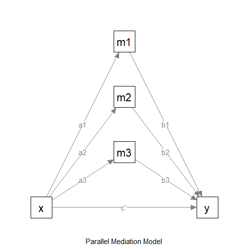

# Quick Function: Parallel Mediation with Observed Variables

## Introduction

This and other “Quick Function” articles are examples of R code to:

- estimate the power,

- search for a sample size with a target level of power, or

- determine the range of sample sizes for a target level of power

for a specific scenario in typical mediation models using
[`power4mome`](https://sfcheung.github.io/power4mome/). Users can
quickly adapt them for their scenarios. They are how-to guides and will
not cover the technical details involved.

## Prerequisite

These functions are wrappers to
[`power4test()`](https://sfcheung.github.io/power4mome/reference/power4test.md),
[`n_from_power()`](https://sfcheung.github.io/power4mome/reference/x_from_power.md),
and
[`n_region_from_power()`](https://sfcheung.github.io/power4mome/reference/x_from_power.md).
For simple scenarios, users do not need to know how to use these
advanced functions, though knowledge about them can help customizing the
search for the region. Further information on these functions can be
found in [Final Remarks](#final_remarks)

## Scope

This file is for parallel mediation models, and only use one function
[`q_power_mediation_parallel()`](https://sfcheung.github.io/power4mome/reference/q_power_mediation.md)
from the package [power4mome](https://sfcheung.github.io/power4mome/).

``` r
library(power4mome)
```

## The Model

Suppose this is the model:



The Model

We want to do power analysis for the indirect effects from `x` to `y`:
`x->m1->y`, `x->m2->y`, and `x->m2->y`. Suppose these are the expected
effects:

- `x->m1`: small

- `x->m2`: medium

- `x->m3`: medium

- `m1->y`: large

- `m2->y`: medium

- `m3->y`: large

- `x->y`: nil (no effect)

In `power4mome`, the convention for Pearson’s *r* is used just for
convenience. If necessary, users can specify the effect (on the
standardized metric) directly.

### Convention for the Effect Sizes

To make it easy to specify the standardized population values of
parameters, [`power4mome`](https://sfcheung.github.io/power4mome/)
adopted the convention for Pearson’s *r*, just for convenience.

- `"nil"`: Nil (.00).

- `"s"`: Small (.10).

- `"m"`: Medium (.30),

- `"l"`: Large (.50).

There are also two intermediate levels:

- `"sm"`: Small-to-medium (.20).

- `"ml"`: Medium-to-large (.40).

If the effect is negative, just add a minus sign. For example, use
`"-m"` to denote a negative medium effect.

For a path from one variable to another variable, the standardized
coefficient is equal to the correlation if there are not other
predictor, or if this predictor is uncorrelated with all other
predictors. Therefore, though may not be perfect, we believe the
convention of Pearson’s *r* is a reasonable one.

If necessary, users can specify the effect (on the standardized metric)
directly.

### Covariates in the Model to be Fitted

In applied research, the model to be fitted usually have other control
variables, such as educational level. It may not be practical to specify
all the probable effects of these control variables (though it is
possible in [`power4mome`](https://sfcheung.github.io/power4mome/)).

Therefore, as a conservative assessment of power, users can first decide
the population effects, and then adjust them slightly downward (e.g.,
from medium, `"m"`, to small-to-medium, `"sm"`) to take into account
potential decrease in effects due to control variables to be included.

### Model with Hypothesized Path Coefficients

This is the model with the effect sizes:


The Model (with Effect Sizes)

### Omnibus Power for All Indirect Paths

There are more than one indirect path, so there are more than one tests.
The function in `power4mome` supports finding the power for detecting
*all* the indirect paths, that is, the probability that all the *tests*
of indirect effects are significant. We call this power the *omnibus*
power for the indirect paths.

### Test to be Used

In practice, nonparametric bootstrapping is usually used to test
indirect effects. However, estimating its power using simulation is
slow. A good-enough proxy is to estimate the power when testing this
effect by Monte Carlo confidence interval. This is the default method in
[`power4mome`](https://sfcheung.github.io/power4mome/) for tests of
indirect effects.

## Find the Power

To estimate the power for a sample size, this is the code:

``` r
out_power <- q_power_mediation_parallel(
  as = c("s", "m", "m"),
  bs = c("l", "m", "l"),
  cp = "nil",
  nrep = 600,
  n = 400,
  R = 1000,
  seed = 1234
)
```

These are the arguments:

- `as`: The hypothesized standardized effects from the predictor `x` to
  each mediator. This should be a character vector with elements equal
  to the number of mediators for the path coefficients `x->m1`, `x->m2`,
  up to `x->mk`, `k` being the number of mediators. Can be one of the
  labels supported by the [convention](#convention), or a numeric value.

- `bs`: The hypothesized standardized effects from each mediator to the
  outcome variable `y`. This should be a character vector with elements
  equal to the number of mediators for the path coefficients `m1->y`,
  `m2->y`, up to `mk->y`, `k` being the number of mediators. Can be one
  of the labels supported by the [convention](#convention), or a numeric
  value.

- `cp`: The hypothesized standardized direct effect from the predictor
  `x` to the outcome variable `y`. Can be one of the labels supported by
  the [convention](#convention), or a numeric value.

- `nrep`: The number of replications when estimating the power for a
  sample size. Default is 400. For a crude estimate, 600 or 800 is
  sufficient. For the candidate sample size to be used, set it to 2000
  or even 5000 for a more precise estimate of the power.

- `R`: The number of random samples used in forming Monte Carlo or
  nonparametric bootstrapping confidence intervals. Although they should
  be large when testing an effect in one single sample, they can be
  smaller because the goal is to estimate power across replications, not
  to achieve high accuracy in each sample. Default is 1000. Can be
  omitted if the default is acceptable.

- `seed`: The seed for the random number generator. Note that, if
  parallel processing is used (this is the default), then the results
  are reproducible *only* if the configuration is exactly identical.
  Moreover, changes in the algorithm will also make results not
  reproducible even with the same seed. Nevertheless, it is still
  advised to set this seed to an integer, to make the results
  reproducible at least on the same machine and version of `power4mome`.
  For a moderate to small `nrep`, the results may be sensitive to the
  `seed`. It is advised to do a final check of the sample size to be
  used using an `nrep` of 2000 or 5000.

This is the output:

``` r
out_power
#> 
#> ========== power4test Results ==========
#> 
#> 
#> ====================== Model Information ======================
#> 
#> == Model on Factors/Variables ==
#> m1 ~ x
#> m2 ~ x
#> m3 ~ x
#> y ~ m1 + m2 + m3 + x
#> == Model on Variables/Indicators ==
#> m1 ~ x
#> m2 ~ x
#> m3 ~ x
#> y ~ m1 + m2 + m3 + x
#> ====== Population Values ======
#> 
#> Regressions:
#>                    Population
#>   m1 ~                       
#>     x                 0.100  
#>   m2 ~                       
#>     x                 0.300  
#>   m3 ~                       
#>     x                 0.300  
#>   y ~                        
#>     m1                0.500  
#>     m2                0.300  
#>     m3                0.500  
#>     x                 0.000  
#> 
#> Variances:
#>                    Population
#>    .m1                0.990  
#>    .m2                0.910  
#>    .m3                0.910  
#>    .y                 0.359  
#>     x                 1.000  
#> 
#> (Computing indirect effects for 4 paths ...)
#> 
#> == Population Conditional/Indirect Effect(s) ==
#> 
#> == Indirect Effect(s) ==
#> 
#>                ind
#> x -> m1 -> y 0.050
#> x -> m2 -> y 0.090
#> x -> m3 -> y 0.150
#> x -> y       0.000
#> 
#>  - The 'ind' column shows the indirect effect(s).
#>  
#> ======================= Data Information =======================
#> 
#> Number of Replications:  600 
#> Sample Sizes:  400 
#> 
#> Call print with 'data_long = TRUE' for further information.
#> 
#> ==================== Extra Element(s) Found ====================
#> 
#> - fit
#> - mc_out
#> 
#> === Element(s) of the First Dataset ===
#> 
#> ============ <fit> ============
#> 
#> lavaan 0.6-21 ended normally after 1 iteration
#> 
#>   Estimator                                         ML
#>   Optimization method                           NLMINB
#>   Number of model parameters                        11
#> 
#>   Number of observations                           400
#> 
#> Model Test User Model:
#>                                                       
#>   Test statistic                                 4.432
#>   Degrees of freedom                                 3
#>   P-value (Chi-square)                           0.218
#> 
#> =========== <mc_out> ===========
#> 
#> 
#> == A 'mc_out' class object ==
#> 
#> Number of Monte Carlo replications: 1000 
#> 
#> 
#> ============== <test_indirects: x-...->y> ==============
#> 
#> Mean(s) across replication:
#>           test_label  est cilo cihi pvalue   sig
#> 1 x-...->y (All sig)  NaN  NaN  NaN  0.156 0.505
#> 
#> - The column 'sig' shows the rejection rates.
#> - If the null hypothesis is false, the rate is the power.
#> - Number of valid replications for rejection rate(s): 600 
#> - Proportion of valid replications for rejection rate(s): 1.000 
#> 
#> ========== power4test Power ==========
#> 
#> [test]: test_indirects: x-...->y 
#> [test_label]: x-...->y (All sig) 
#>    est   p.v reject r.cilo r.cihi
#> 1  NaN 1.000  0.505  0.465  0.545
#> Notes:
#> - p.v: The proportion of valid replications.
#> - est: The mean of the estimates in a test across replications.
#> - reject: The proportion of 'significant' replications, that is, the
#>   rejection rate. If the null hypothesis is true, this is the Type I
#>   error rate. If the null hypothesis is false, this is the power.
#> - r.cilo,r.cihi: The confidence interval of the rejection rate, based
#>   on Wilson's (1927) method.
#> - Refer to the tests for the meanings of other columns.
```

The first set of output is the default printout of the output of
[`power4test()`](https://sfcheung.github.io/power4mome/reference/power4test.md).
This can be used to check the model specified. It also automatically
computes the population standardized indirect effect(s).

The second section is the output of
[`rejection_rates()`](https://sfcheung.github.io/power4mome/reference/rejection_rates.md),
showing the power under the column `reject`.

In this example, the power is about 0.50 for sample size 400, 95%
confidence interval \[0.47, 0.54\].

## Find the Sample Size with the Target Power

It is also possible to estimate the sample size with the target level of
power. This can be done by trying different sample sizes. However, if a
high level of precision is desired and so a large number of replications
(`nrep`), say 2000, is needed.

An alternative way is find the probable sample size using an algorithm.
This can be done with `mode = "n"`, to find the `n` (sample size). By
default, the probabilistic bisection algorithm by Waeber et al. (2013)
is used. See Chalmers (2024) for an introduction on using this algorithm
for power analysis (note that the original algorithm by Waeber et al.,
2013, is used in `power4mome`).

Finding the sample size with the target level of power can be done using
the same code above, with the argument `mode = "n"` added, and a few
more arguments:

``` r
out_n <- q_power_mediation_parallel(
  as = c("s", "m", "m"),
  bs = c("l", "m", "l"),
  cp = "nil",
  target_power = .80,
  x_interval = c(50, 2000),
  R = 199,
  final_nrep = 2000,
  final_R = 2000,
  seed = 1234,
  mode = "n"
)
```

These are the arguments for this mode:

- `target_power`: The target level of power. Default is .80, and can be
  omitted if this is the desired level of power.

- `n`: This is the initial `n`. Its value does not matter because the
  search will be based on an initial interval (`x_interval`). It can be
  omitted when `mode` is `"n"`.

- `x_interval`: The interval of sample sizes to search. Default is 50 to
  2000 and so this argument can be omitted is this range is desired. For
  the default algorithm, it is preferable to have a wide initial range.
  (If the model may be difficult to fit for a small sample size,
  increase the lower limit to a value large enough for the model.)

- `nrep`: This argument is not necessary and should be omitted.

- `R`: Set this number of a value supported by the method proposed by
  Boos & Zhang (2000) for the desired level of confidence (95% by
  default). The first few values are 39, 79, 119, 159, and 199. 199 is
  recommended to balance speed and accuracy.

- `final_nrep`: The desired number of replication. The search will use a
  much smaller value for `nrep`. However, the probable solution will be
  checked using this number of replications. a sample size will be
  returned as a solution only if it is close enough to `target_power`
  based on this number of replications.

- `final_R`: Although the search can use a much small value for `R` due
  to the method by Boos & Zhang (2000), users may want a larger number
  of `R` for the solution. To do this, set `final_R` to the `R` to be
  used in the checking a candidate sample size.

- `mode`: Setting `mode` to `"n"` enables this mode.

Note that this process can take a some time, sometimes more than 10
minutes. Nevertheless, power analysis is usually conducted in the
planning stage of a study, and so the slow processing time is acceptable
in this stage.

This is the printout, showing only the section from the output of
[`n_from_power()`](https://sfcheung.github.io/power4mome/reference/x_from_power.md):

    #> ========== n_from_power Results ==========
    #> 
    #> 
    #>                                      Setting
    #> Predictor(x):                    Sample Size
    #> Parameter:                               N/A
    #> goal:                           close_enough
    #> what:                                  point
    #> algorithm:           probabilistic_bisection
    #> Level of confidence:                  95.00%
    #> Target Power:                          0.800
    #> 
    #> - Final Value of Sample Size (n): 809
    #> 
    #> - Final Estimated Power (CI): 0.810 [0.792, 0.827]
    #> 
    #> Call `summary()` for detailed results.

In this example, the estimated sample size with power equal to (close
to) the target level (0.80) is 809.

Based on 2000 replications, determined by `final_rep`, the estimated
power for 809 is 0.810, 95% confidence interval \[0.792, 0.827\].

### How is Being “Close Enough” Defined

Being “Close enough” is defined by the tolerance value, which is
determined internally based on the number of replications
(`final_nrep`). For a smaller value of `final_rep`, the tolerance will
be larger, and so a sample with estimated power farther away from the
target power would be considered as “close enough.” For a `final_nrep`
of 2000, the default tolerance is 0.018, which should be practically
precise enough.

## Find the Region of Sample Sizes

If it is not necessary to have a high precision to find *the sample
size* with the target power, we can find an *approximate region* of
sample sizes with levels of power *not* significantly different from the
target power. This region is useful for determining a range of sample
sizes likely to have sufficient power, but are not greater than
necessary when resources are limited.

Note that, unlike mode `"n"`, this process use bisection by default, and
so the number of replications used in each trial (iteration) need to be
close to the desired final level of replication. Therefore, this process
can sometimes be very fast, but sometimes can be slow. Again, power
analysis is usually conducted in the planning stage of a study, and so
the slow processing time may be acceptable in this stage.

Finding the region can be done using the same code for estimating power
(mode `"power"`), with only the argument `mode = "region"` added:

``` r
out_region <- q_power_mediation_parallel(
  as = c("s", "m", "m"),
  bs = c("l", "m", "l"),
  cp = "nil",
  target_power = .80,
  nrep = 600,
  n = 400,
  R = 1000,
  seed = 1234,
  mode = "region"
)
```

These are the arguments for this mode:

- `target_power`: The target level of power. Default is .80, and can be
  omitted if this is the desired level of power

- `n`: This is the initial `n`. For bisection, this will affect the
  search because the initial interval will be estimated based on this
  value Nevertheless, even if this sample size’s power is very different
  from the target power, the search should still be able to find the
  target region, though may be slower. If omitted, it will be determined
  internally.

- `nrep`: This number of replications will be used for all iterations.
  Therefore, this should not be a large value, unlike mode `"n"`.

- `R`: For bisection, this value will be used for all iterations.

- `mode`: Setting `mode` to `"region"` enables this mode.

This is the printout, showing only the section from the output of
[`n_region_from_power()`](https://sfcheung.github.io/power4mome/reference/x_from_power.md):

    #> ========== n_region_from_power Results ==========
    #> 
    #> Call:
    #> n_region_from_power(object = `<hidden>`, target_power = 0.8, 
    #>     progress = TRUE, simulation_progress = NULL, max_trials = NULL, 
    #>     seed = 1234, algorithm = NULL)
    #> 
    #>                      Setting                                      
    #> Predictor(x)         Sample Size                                  
    #> Goal:                Power significantly below or above the target
    #> algorithm:           bisection                                    
    #> Level of confidence: 95.00%                                       
    #> Target Power:        0.800                                        
    #> 
    #> Solution: 
    #> 
    #> Approximate region of sample sizes with power:
    #> - not significantly different from 0.800: 727 to 839
    #> - significantly lower than 0.800: 727
    #> - significantly higher than 0.800: 839
    #> 
    #> Confidence intervals of the estimated power:
    #> - for the lower bound (727): [0.716, 0.785]
    #> - for the upper bound (839): [0.807, 0.866]
    #> 
    #> Call `summary()` for detailed results.

In this example, the range of the sample size is 727 to 839.

The large the `nrep`, the higher the precision and so the narrower this
region. However, it will also take longer to run.

The results can also be visualized using the
[`plot()`](https://rdrr.io/r/graphics/plot.default.html) function:


The Plot of Sample Sizes Searched

The region between the shaded areas is the approximate region of sample
sizes found.

## Final Remarks

### Other Models

Quick how-to articles on other common mediation models, including those
with latent variables, can be found from the [list of
articles](https://sfcheung.github.io/power4mome/articles/index.md)

The package [`power4mome`](https://sfcheung.github.io/power4mome/)
supports an arbitrary model specified by `lavaan` syntax, including
those with moderators. Interested users can refer to the articles above.

### Technical Details

For options of
[`power4test()`](https://sfcheung.github.io/power4mome/reference/power4test.md),
[`n_from_power()`](https://sfcheung.github.io/power4mome/reference/x_from_power.md),
and
[`n_region_from_power()`](https://sfcheung.github.io/power4mome/reference/x_from_power.md),
please refer to their help pages, as well as the [Get-Started
article](https://sfcheung.github.io/power4mome/articles/power4mome.html)
and this
[article](https://sfcheung.github.io/power4mome/articles/x_from_power_for_n.html)
for
[`n_from_power()`](https://sfcheung.github.io/power4mome/reference/x_from_power.md),
which is also the function to find one of the regions, called twice by
[`n_region_from_power()`](https://sfcheung.github.io/power4mome/reference/x_from_power.md).

## Reference(s)

Boos, D. D., & Zhang, J. (2000). Monte Carlo evaluation of
resampling-based hypothesis tests. *Journal of the American Statistical
Association*, *95*(450), 486–492.
<https://doi.org/10.1080/01621459.2000.10474226>

Chalmers, R. P. (2024). Solving variables with Monte Carlo simulation
experiments: A stochastic root-solving approach. *Psychological
Methods*. <https://doi.org/10.1037/met0000689>

Waeber, R., Frazier, P. I., & Henderson, S. G. (2013). Bisection search
with noisy responses. *SIAM Journal on Control and Optimization*,
*51*(3), 2261–2279. <https://doi.org/10.1137/120861898>
