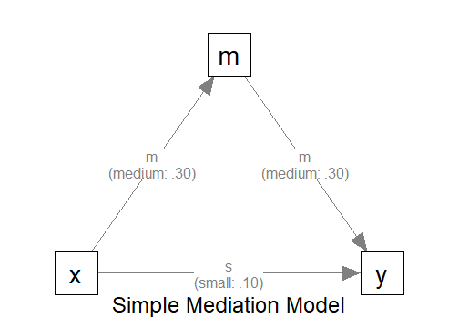

# Introduction

This article illustrates how to
do power analysis and sample size
determination in the presence of
missing data.
The package
[power4mome](https://sfcheung.github.io/power4mome/)
will be used for illustration.


# Prerequisite

Basic knowledge about fitting models
by `lavaan` and `power4mome` is required.

This file is not intended to be an introduction
on how to use functions in `power4mome`.
For details on how to use `power4test()`,
refer to the [Get-Started article](https://sfcheung.github.io/power4mome/articles/power4mome.html).
Please also refer to the help page
of `n_region_from_power()`, and the
[article](https://sfcheung.github.io/power4mome/articles/x_from_power_for_n.html)
on `n_from_power()`, which is called
twice by `n_region_from_power()` to
find the regions described below.

# Scope

A simple mediation model of observed variables
will be used as an example. Users new
to the package are recommended to
read the [article](articles/template_n_from_power_mediation_obs_simple.html)
on the steps for a path model with observed variables
having a multivariate normal distribution
(the default).

# Set Up the Model and Test

Load the packages first:


``` r
library(power4mome)
```

Estimate the power for a sample size.

The code for the model:


``` r
model <-
"
m ~ x
y ~ m + x
"

model_es <-
"
m ~ x: m
y ~ m: m
y ~ x: s
"
```

<div class="figure" style="text-align: center">

<p class="caption">The Model</p>
</div>

Refer to this [article](articles/power4test_latent_mediation.html)
on how to set `number_of_indicators` and
`reliability` when calling `power4test()`.

# Specify the Missing Data Mechanism

Suppose that missing data is expected
before data collection, maybe due to
the nature of the topic or population.
To make a realistic
power analysis and sample size
determination, the possibility of missing
data needs to be taken into account.

In real research, it is difficult, sometimes
impossible, to know in advance (a) the
missing data mechanism and (b) the proportion
of missing data.

Nevertheless, for sample size determination
and power analysis, a reasonable guess based
on previous studies or researcher's
expert knowledge would still be useful.
If necessary, a conservative expectation,
expecting the worst case scenario,
can enhance the chance to have a sample
size with sufficient power, even with missing data.

Although `power4mome` allows users to
have control many aspects of the missing data
mechanism [see @enders_applied_2022 for
a detailed Introduction to the major
mechanisms, missing completely at random,
missing at random, and missing not at random]
as well as the distribution of missing data
in the data cells, thanks to the excellent
function `ampute()` from the `mice` package,
this article illustrates only a simple
scenario: values are missing completely
at random (the chance that a value is missing
does not depend on any variable).

## Data Processor

The package [power4mome](https://sfcheung.github.io/power4mome/) comes with
some *data processors*,
functions for processing the generated
dataset before fitting a model to it.
A full list of them can
be found [here](reference/index.html#data-processors).

Power analysis with missing data can be
conducted through one of the processors,
`missing_values()`. It processes the generated
data by introducing missing values (*removing*
some values by replacing them with `NA`).
The processed
dataset, with missing data,
will then be used instead of the original
dataset for subsequent analyses, such as model
fitting and power analysis.

## An Example

Suppose we would like to estimate the
power to test the indirect effect using
Monte Carlo confidence interval. Without
prior knowledge to suggest otherwise,
we assume that values are
*missing completely at random* (MCAR).
To have a conservative estimate of the
sample size required, we assume that
about 30% of the case will missing data
on one variable.

## `missing_values()`

The data processor `missing_values()`
is a wrapper of `ampute()` from
the `mice` package, with the default
values for some arguments different from
those of `ampute()`. If users adopts
MCAR, the default, and only want to
specify the approximate proportion of
cases with missing data on one variable,
then only the argument `prop` needs to
be used.

For details on the missing data generation
processes and other available options,
please refer to the help page of
`missing_values()`, `mice::ampute()`,
and @schouten_generating_2018.

## Set the Missing Data Mechanism Using `process_data`

This section illustrates how to set up the call to
`power4test()` using `process_data`
and `missing_values()`.
We would
like to check the model first. Therefore,
the test of indirect effect is not added
for now.


``` r
out <- power4test(
  nrep = 600,
  model = model,
  pop_es = model_es,
  n = 100,
  process_data = list(
      fun = missing_values,
      args = list(prop = .30)
    ),
  iseed = 1234,
  parallel = TRUE)
```

### How to Use `process_data` and `missing_values()`

The argument `process_data` is used to specify
the function, as well as any arguments need,
to *process* the generated data.

The value must be a named list. The argument
`fun` is a required argument, which is
the argument to be used to process the data
(`missing_values` in the example above).

If additional arguments are to be passed to
this function, set them to a named list
for `args`, as shown above.

In the example above, the argument
`propr` is set, telling `missing_values()`
the proportion of cases with missing data.

## Check The Generated Data

To print the details of the generated data,
including the missing data patterns, if any,
use `print` with `data_long = TRUE`:


``` r
print(out,
      data_long = TRUE)
```


This is part of the output:


```
#> ===== Missing Data Pattern =====
#>
#> Missing data is present
#>
#>  P Prop   m   y   x # V
#>   .7028   O   O   O   3
#>   .0959   O   O   -   2
#>   .1013   O   -   O   2
#>   .1000   -   O   O   2
#>  V Prop .90 .90 .90
#>
#> Note:
#> - 'O': A variable has data in a pattern.
#> - '-': A variable has missing data in a pattern.
#> - P Prop: Proportion of each missing pattern.
#> - # V: Number of non-missing variable(s) in a pattern.
#> - V Prop: Proportion of non-missing data of each variables.
```

If missing data is presence, the missing data
patterns will be printed, using `mice::md.pattern()`
internally. As shown in the output,
about 30% of cases have missing data
on one of the variables. The proportions
are only approximate for each pattern because
the mechanism is random.

## Fit the Model by Full Information Maximum Likelihood (FIML)

Because of missing data,
we would like to estimate the power when
using an estimator that handle missing data. One
common method used in `lavaan` is FIML
(full information maximum likelihood).

The argument `fit_model_args` can be use
to pass arguments, as a named list,
to the fit function,
which is `lavaan::sem()` by default.

To use FIML in `lavaan::sem()`, we use
`missing = "fiml.x"`. `"fiml.x"` can
be used in this case because `x` is drawn
from a normal distribution. Therefore, we
add the argument
`fit_model_args = list(missing = "fiml.x")`
in the call to `power4test()`:


``` r
out <- power4test(
  nrep = 600,
  model = model,
  pop_es = model_es,
  n = 100,
  process_data = list(
      fun = missing_values,
      args = list(prop = .30)
    ),
  fit_model_args = list(missing = "fiml.x"),
  iseed = 1234,
  parallel = TRUE)
```

We can verify that FIML is used by printing the results:


``` r
print(out)
```


This is part of the output:


```
#> ============ <fit> ============
#>
#> lavaan 0.6-21 ended normally after 8 iterations
#>
#>   Estimator                                         ML
#>   Optimization method                           NLMINB
#>   Number of model parameters                         7
#>
#>   Number of observations                           100
#>   Number of missing patterns                         4
```

As shown in the printout, FIML was used
and so `lavaan` also reports the number
of missing patterns. The sample size
is the one we specified,
100, despite missing data,
confirming that all cases are used when
fitting the model.

## Add the Test and Estimate Power

We now can add the test and estimate
power.
See this [article](articles/template_n_from_power_mediation_lav_simple.html)
for details on the test function
`test_indirect_effect()` and how to
set the argument `test_fun` and `test_args`.
`R_for_bz(200)` is used to set `R` to the largest
value less than 200 that is supported by
the method proposed by @boos_monte_2000.
^[For tests that use Monte Carlo or bootstrapping
confidence interval, the method proposed
by @boos_monte_2000 to use a small number
of resamples or simulated samples is recommended.
This can be enabled automatically by setting
`R` to a supported value. The helper
`R_for_bz()` can be used. By default, it returns
the largest supported `R` which is less than
a target `R`, given a default
level of significance of .05 (two-tailed).
For example, `R_for_bz(200)` returns 199.]


``` r
out <- power4test(
  nrep = 600,
  model = model,
  pop_es = model_es,
  n = 100,
  process_data = list(
      fun = missing_values,
      args = list(prop = .30)
    ),
  fit_model_args = list(missing = "fiml.x"),
  R = R_for_bz(200),
  ci_type = "mc",
  test_fun = test_indirect_effect,
  test_args = list(x = "x",
                   m = "m",
                   y = "y",
                   mc_ci = TRUE),
  iseed = 1234,
  parallel = TRUE)
```

The rejection rate (power) for this
example can be found by `rejection_rates()`:


``` r
rejection_rates(out)
#> [test]: test_indirect: x->m->y
#> [test_label]: Test
#>     est   p.v reject r.cilo r.cihi
#> 1 0.093 1.000  0.591  0.552  0.630
#> Notes:
#> - p.v: The proportion of valid replications.
#> - est: The mean of the estimates in a test across replications.
#> - reject: The proportion of 'significant' replications, that is, the
#>   rejection rate. If the null hypothesis is true, this is the Type I
#>   error rate. If the null hypothesis is false, this is the power.
#> - Some or all values in 'reject' are estimated using the extrapolation
#>   method by Boos and Zhang (2000).
#> - r.cilo,r.cihi: The confidence interval of the rejection rate, based
#>   on Wilson's (1927) method.
#> - Wilson's (1927) method is used to approximate the confidence
#>   intervals of the rejection rates estimated by the method of Boos and
#>   Zhang (2000).
#> - Refer to the tests for the meanings of other columns.
```

For comparison, we can estimate the power
when listwise deletion is used. This is
the default method of `lavaan::sem()`.
Therefore, we can rerun the analysis with
`fit_model_args` removed:


``` r
out_listwise <- power4test(
  nrep = 600,
  model = model,
  pop_es = model_es,
  n = 100,
  process_data = list(
      fun = missing_values,
      args = list(prop = .30)
    ),
  R = R_for_bz(200),
  ci_type = "mc",
  test_fun = test_indirect_effect,
  test_args = list(x = "x",
                   m = "m",
                   y = "y",
                   mc_ci = TRUE),
  iseed = 1234,
  parallel = TRUE)
```


``` r
rejection_rates(out_listwise)
#> [test]: test_indirect: x->m->y
#> [test_label]: Test
#>     est   p.v reject r.cilo r.cihi
#> 1 0.093 1.000  0.503  0.463  0.543
#> Notes:
#> - p.v: The proportion of valid replications.
#> - est: The mean of the estimates in a test across replications.
#> - reject: The proportion of 'significant' replications, that is, the
#>   rejection rate. If the null hypothesis is true, this is the Type I
#>   error rate. If the null hypothesis is false, this is the power.
#> - Some or all values in 'reject' are estimated using the extrapolation
#>   method by Boos and Zhang (2000).
#> - r.cilo,r.cihi: The confidence interval of the rejection rate, based
#>   on Wilson's (1927) method.
#> - Wilson's (1927) method is used to approximate the confidence
#>   intervals of the rejection rates estimated by the method of Boos and
#>   Zhang (2000).
#> - Refer to the tests for the meanings of other columns.
```

In this scenario, the power is reduced by
nearly 10% if listwise deletion is used.

# Using `process_data` in Other Functions

Other functions that make use of
`power4test()` can also use the
arguments `process_data` and `fit_model_args`.

For example, the output above, with ordinal
indicators, can be used directly by
`n_from_power()` to find a sample size
given a target power:


``` r
n_power <- n_from_power(
              out,
              target_power = .80,
              final_nrep = 2000,
              seed = 1357
            )
```

The output with ordinal
indicators can also be used directly by
`n_power_region()` to find a region of
sample sizes
given a target power:


``` r
n_power_region <- n_region_from_power(
                      out,
                      seed = 1357
                    )
```

The quick functions, described
in these [articles](articles/index.html#common-mediation-models),
also support the `process_data`
and `fit_model_args` arguments. They are
set in the same way as in `power4test()`

This is an example for estimating the power
for a specific sample size:


``` r
q_power <- q_power_mediation_simple(
  a = "m",
  b = "m",
  cp = "s",
  process_data = list(
      fun = missing_values,
      args = list(prop = .30)
    ),
  fit_model_args = list(missing = "fiml.x"),
  target_power = .80,
  nrep = 600,
  n = 100,
  R = R_for_bz(200),
  seed = 1234
)
```

This is an example of finding a sample
size given a target power (mode `"n"`):


``` r
q_power_n <- q_power_mediation_simple(
  a = "m",
  b = "m",
  cp = "s",
  process_data = list(
      fun = missing_values,
      args = list(prop = .30)
    ),
  fit_model_args = list(missing = "fiml.x"),
  target_power = .80,
  R = R_for_bz(200),
  final_nrep = 2000,
  seed = 1234,
  mode = "n"
)
```

# Reference(s)
