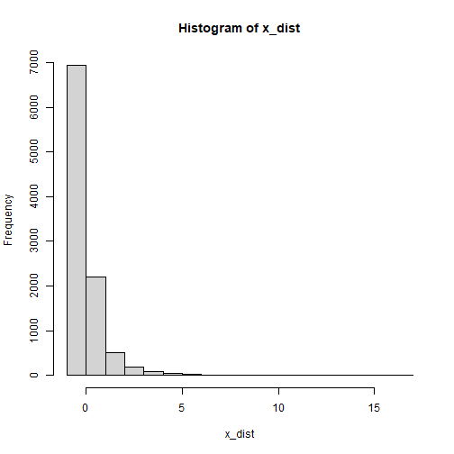
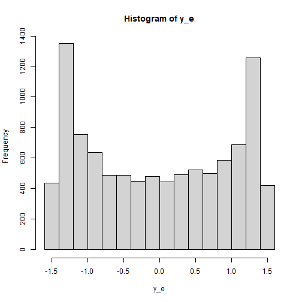

# Introduction

This article illustrates how to
do power analysis and sample size
determination in
some typical observed variable path models, with the variables
hypothesized to be nonnormally distributed
and the model to be estimated using
robust methods such as MLR in `lavaan`.
The package
[power4mome](https://sfcheung.github.io/power4mome/)
will be used for illustration.


# Prerequisite

Basic knowledge about fitting models
by `lavaan` and `power4mome` is required.

This file is not intended to be an introduction
on how to use functions in `power4mome`.
For details on how to use `power4test()`,
refer to the [Get-Started article](https://sfcheung.github.io/power4mome/articles/power4mome.html).
Please also refer to the help page
of `n_region_from_power()`, and the
[article](https://sfcheung.github.io/power4mome/articles/x_from_power_for_n.html)
on `n_from_power()`, which is called
twice by `n_region_from_power()` to
find the regions described below.

# Scope

A simple mediation model of observed variables
will be used as an example. Users new
to the package are recommended to
read the [article](articles/template_n_from_power_mediation_obs_simple.html)
on the steps for a path model with observed variables
having a multivariate normal distribution
(the default).

# Set Up the Model and Test

Load the packages first:


``` r
library(power4mome)
```

Estimate the power for a sample size.

The code for the model:


``` r
model <-
"
m ~ x
y ~ m + x
"

model_es <-
"
m ~ x: m
y ~ m: m
y ~ x: s
"
```

<div class="figure" style="text-align: center">

<p class="caption">The Model</p>
</div>

Refer to this [article](articles/power4test_latent_mediation.html)
on how to set `number_of_indicators` and
`reliability` when calling `power4test()`.

# Specify the Distributions

Suppose that we expect the predictor (`x`)
has a uniform distribution because cases
were sample more or less evenly across
a range of values of `x`. Moreover,
the outcome variable (`y`) is a measure
of a mental health problem and so its
error term is positively skewed.^[Note: In a
path model, the distribution of an endogenous
variable is determined jointly by its
predictors and its error term, and so its
distribution cannot be specified directly.]

Without real data, it is difficult
to know the actual distribution. Nevertheless,
we can select a distribution that reasonably
approximate the expected distribution of
a variable or an error term.

## Built-In Functions For Random Numbers

The package [power4mome](https://sfcheung.github.io/power4mome/) comes with
some ready-to-use function for generating
random error. A full list of them can
be found [here](reference/index.html#generate-random-numbers).
To be used in `power4test()`, these functions
need to have the distribution standardized
such that the population mean and standard
deviation are 0 and 1, respectively. All
the build-in functions already have the distributions
standardized.

For example, the function `rexp_rs()`
can be used to approximate a heavily
positively skewed distribution. The
function used is `stats::rexp()` from
base R, but, by default, the distribution is transformed
such that the population mean and standard
deviation are 0 and 1, respectively.

## An Example

Suppose we would like to estimate the
power to test the indirect effect using
Monte Carlo confidence interval. We expect
that one or more observed variable or
error term is not normally distributed.
For the sake of illustration, the following
distributions hypothesized for
the `x` and the error term of `y`.

### The Distribution of `x`

Let's assume that the distribution
of `x` is a severely positively
skewed distribution.
This can be simulated by the function
`rlnorm_rs()`.
This is an illustration of the distribution:


``` r
set.seed(1234)
x_dist <- rlnorm_rs(10000)
hist(x_dist)
```

<div class="figure" style="text-align: center">

<p class="caption">plot of chunk x_dist_obs</p>
</div>

### The Distribution of the Error Term of `y`

Last, let's assume that the distribution
of the error terms
of `y` is bounded and is bimodal. We
we `rbeta_rs()` to simulate this distribution,
setting the parameters `shape1` and `shape2`
to create the bimodal distribution:


``` r
set.seed(1234)
y_e <- rbeta_rs(10000,
                shape1 = .5,
                shape2 = .5)
hist(y_e)
```

<div class="figure" style="text-align: center">

<p class="caption">plot of chunk y_e_obs</p>
</div>

## Set the Distributions by `x_fun`

This section illustrates how to set up the call to
`power4test()`, with observed variables
or error terms generated
using the distributions described above. We would
like to check the model first. Therefore,
the test of indirect effect is not added
for now.


``` r
out <- power4test(
  nrep = 600,
  model = model,
  pop_es = model_es,
  n = 100,
  x_fun = list(x = list(rlnorm_rs),
               y = list(rbeta_rs, shape1 = .5, shape2 = .5)),
  iseed = 1234,
  parallel = TRUE)
```

### How to Use `x_fun`

The argument `x_fun` is used to specify
the function used to generate the observed
variables. If an observed variable is
a "pure" predictor (it is not predicted
by any other variables in the model),
then this is the function to generate its
values. If it is an endogenous variable
(it is predicted by at least one other
variable in the model), then this is the
function to generate its error term.

The value must be a named list, with the name
being one of variables (`x`, `m`, and `y`
in this example).

Each element must itself a list, with
the first argument is the function to be used.

- For example, `x = list(rlnorm_rs)` indicates
  that the function `rlnorm_rs` will be used
  to generate `x`.

If there are additional arguments to be
passed to this function, include them as
named arguments in the list.

- For example, if an element is
  `y = list(rbeta_rs, shape1 = .5, shape2 = .5)`,
  then `rbeta_rs` will be used to
  generate `y` or its error term, and the arguments
  `shape1` and `shape2` will both be set .5.

If a variable is not included in
the lists for `x_fun`, the default distribution
used is a normal distribution.

### Functions That `x_fun` and `e_fun` Can Use

In principle, any function can be used
to generate the numbers,
as long as it meets these requirements:

- It has an argument named `n`, the number
  of random numbers to be generated.

- It returns a numeric vector.

Though no error will be returned, to
ensure that the population standardized
coefficients are of the specified values,
the functions for `x_fun` and `e_fun` should generate
numbers from a population with mean and
standard deviation equal to 0 and 1,
respectively.

## Check The Generated Data

To print the details of the generated data,
including the descriptive statistics,
use `print` with `data_long = TRUE`:


``` r
print(out,
      data_long = TRUE)
```


This is part of the output:


```
#> ==== Descriptive Statistics ====
#> 
#>   vars     n mean   sd skew kurtosis se
#> m    1 60000 0.00 1.00 0.16     0.50  0
#> y    2 60000 0.00 1.06 0.04    -1.13  0
#> x    3 60000 0.01 1.00 5.24    53.74  0
```

The descriptive statistics shows that
the distributions are
not normal. As expected, those of `x` is positively
skewed, while those of `y` are nearly symmetric
but light tailed (negative excess kurtosis).

Note that the distribution of an endogenous
variable
depends on both its predictors and
and its error term. Therefore, even though
the error term of `m` is normally distributed,
`m` is still not normally distributed because
`x` is positively skewed.

## Fit the Model by MLR (Robust Maximum Likelihood)

Because of the nonnormal distribution,
we would like to estimate the power when
a robust estimation method is used. One
common method used in `lavaan` is MLR.
Although this method and the default,
maximum likelihood (ML), yield the same
point estimates, their standard errors are
different. Therefore, the results from
Monte Carlo confidence intervals are also
different.

The argument `fit_model_args` can be use
to pass arguments, as a named list,
to the fit function,
which is `lavaan::sem()` by default.

To use MLR in `lavaan::sem()`, we use
`estimator = "MLR"`. Therefore, we
add the argument
`fit_model_args = list(estimator = "MLR")`
in the call to `power4test()`:


``` r
out <- power4test(
  nrep = 600,
  model = model,
  pop_es = model_es,
  n = 100,
  x_fun = list(x = list(rlnorm_rs),
               y = list(rbeta_rs, shape1 = .5, shape2 = .5)),
  fit_model_args = list(estimator = "MLR"),
  iseed = 1234,
  parallel = TRUE)
```

We can verify that MLR is used by printing the results:


``` r
print(out)
```


This is part of the output:


```
#> ============ <fit> ============
#> 
#> lavaan 0.6-21 ended normally after 1 iteration
#> 
#>   Estimator                                         ML
#>   Optimization method                           NLMINB
#>   Number of model parameters                         5
#> 
#>   Number of observations                           100
#> 
#> Model Test User Model:
#>                                               Standard      Scaled
#>   Test Statistic                                 0.000       0.000
#>   Degrees of freedom                                 0           0
```

As shown in the printout, MLR was used
and so there is a column `Scaled` in the
printout of `lavaan`.

## Add the Test and Estimate Power

We now can add the test and estimate
power.
See this [article](articles/template_n_from_power_mediation_lav_simple.html)
for details on the test function
`test_indirect_effect()` and how to
set the argument `test_fun` and `test_args`.
`R_for_bz(200)` is used to set `R` to the largest
value less than 200 that is supported by
the method proposed by @boos_monte_2000.
^[For tests that use Monte Carlo or bootstrapping
confidence interval, the method proposed
by @boos_monte_2000 to use a small number
of resamples or simulated samples is recommended.
This can be enabled automatically by setting
`R` to a supported value. The helper
`R_for_bz()` can be used. By default, it returns
the largest supported `R` which is less than
a target `R`, given a default
level of significance of .05 (two-tailed).
For example, `R_for_bz(200)` returns 199.]


``` r
out <- power4test(
  nrep = 600,
  model = model,
  pop_es = model_es,
  n = 100,
  x_fun = list(x = list(rlnorm_rs),
               y = list(rbeta_rs, shape1 = .5, shape2 = .5)),
  fit_model_args = list(estimator = "MLR"),
  R = R_for_bz(200),
  ci_type = "mc",
  test_fun = test_indirect_effect,
  test_args = list(x = "x",
                   m = "m",
                   y = "y",
                   mc_ci = TRUE),
  iseed = 1234,
  parallel = TRUE)
```

The rejection rate (power) for this
example can be found by `rejection_rates()`:


``` r
rejection_rates(out)
#> [test]: test_indirect: x->m->y 
#> [test_label]: Test 
#>     est   p.v reject r.cilo r.cihi
#> 1 0.091 1.000  0.643  0.604  0.681
#> Notes:
#> - p.v: The proportion of valid replications.
#> - est: The mean of the estimates in a test across replications.
#> - reject: The proportion of 'significant' replications, that is, the
#>   rejection rate. If the null hypothesis is true, this is the Type I
#>   error rate. If the null hypothesis is false, this is the power.
#> - Some or all values in 'reject' are estimated using the extrapolation
#>   method by Boos and Zhang (2000).
#> - r.cilo,r.cihi: The confidence interval of the rejection rate, based
#>   on Wilson's (1927) method.
#> - Wilson's (1927) method is used to approximate the confidence
#>   intervals of the rejection rates estimated by the method of Boos and
#>   Zhang (2000).
#> - Refer to the tests for the meanings of other columns.
```

# Using `x_fun` in Other Functions

Other functions that make use of
`power4test()` can also use the
arguments `x_fun` and `fit_model_args`.

For example, the output above, with nonnormal
variables, can be used directly by
`n_from_power()` to find a sample size
given a target power:


``` r
n_power <- n_from_power(
              out,
              target_power = .80,
              x_interval = c(50, 200),
              final_nrep = 2000,
              seed = 1234
            )
```

The output with nonnormal
variables can also be used directly by
`n_power_region()` to find a region of
sample sizes
given a target power:


``` r
n_power_region <- n_region_from_power(
                      out,
                      seed = 1357
                    )
```

The quick functions, described
in these [articles](articles/index.html#common-mediation-models),
also support the `e_fun`
and `fit_model_args` arguments. They are
set in the same way as in `power4test()`

This is an example for estimating the power
for a specific sample size:


``` r
q_power <- q_power_mediation_simple(
  a = "m",
  b = "m",
  cp = "s",
  x_fun = list(x = list(rlnorm_rs),
               y = list(rbeta_rs, shape1 = .5, shape2 = .5)),
  fit_model_args = list(estimator = "MLR"),
  target_power = .80,
  nrep = 600,
  n = 100,
  R = R_for_bz(200),
  seed = 1234
)
```

This is an example of finding a sample
size given a target power (mode `"n"`):


``` r
q_power_n <- q_power_mediation_simple(
  a = "m",
  b = "m",
  cp = "s",
  x_fun = list(x = list(rlnorm_rs),
               y = list(rbeta_rs, shape1 = .5, shape2 = .5)),
  fit_model_args = list(estimator = "MLR"),
  target_power = .80,
  R = R_for_bz(200),
  x_interval = c(50, 300),
  final_nrep = 2000,
  seed = 1234,
  mode = "n"
)
```

# Reference(s)
