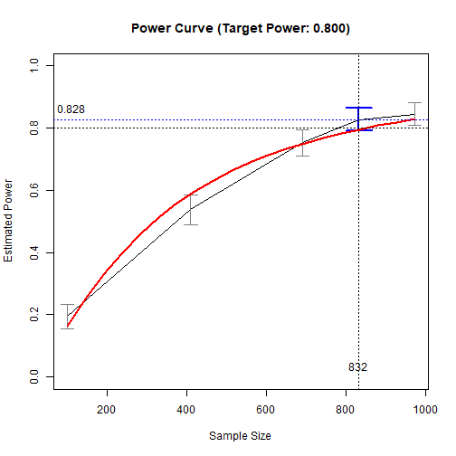
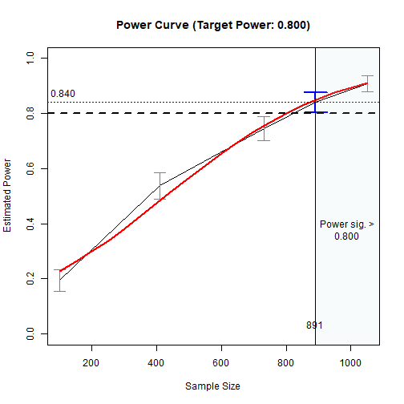
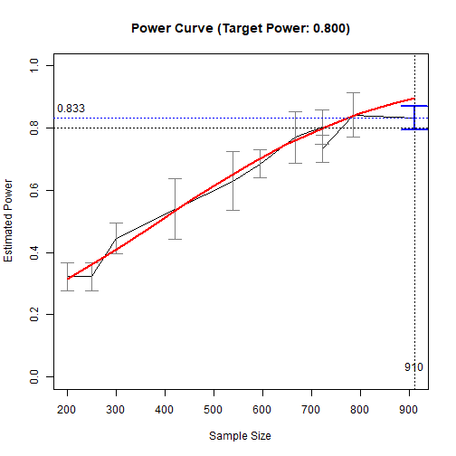
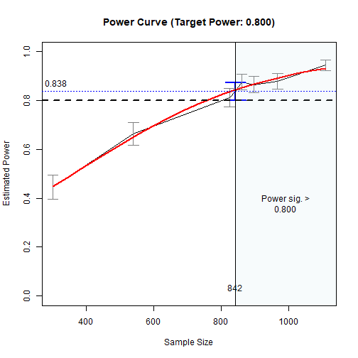
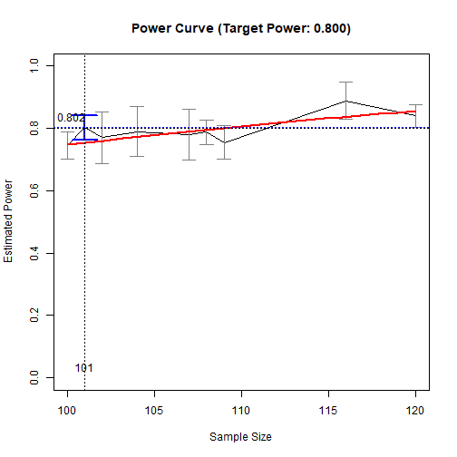
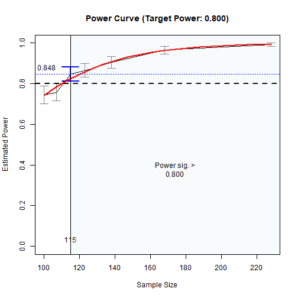

# Introduction

This and other "Quick Template" vignettes
are examples of R code to do power
analysis or determine sample size in
typical models using
[power4mome](https://sfcheung.github.io/power4mome/).
Users can quickly adapt
them for their scenarios.

# Prerequisite

Basic knowledge about fitting models
by `lavaan` and `power4mome` is required.

This file is not intended to be an introduction
on how to use functions in `power4mome`.
For details on how to use `power4test()`,
`power4test_by_n()`, and `x_from_power()`,
refer to the [Get-Started article](https://sfcheung.github.io/power4mome/articles/power4mome.html),
and the [article](https://sfcheung.github.io/power4mome/articles/x_from_power_for_n.html)
on finding the sample size
given desired power using `x_from_power()`,
as well as the help pages of these
functions.

# Common Flow

The following chart summarizes the steps covered
below.

```{r temp_med_obs_fig_flowchart, fig.cap="Common Workflow", fig.align="center", message=FALSE, echo=FALSE}
library(DiagrammeR)
# https://mermaid.live/edit#pako:eNqFk9tu4jAQhl_F8lUrASUHCHEpUrX0st1KVHuxmxUyZHKQHDtynKVZxLvXcQ4NFKl39sz3z-FPfMR7EQImOGLisE-oVOhtHfCAI7RntCjWEKEQIloyhaKUMcLSOFE7VsL9NcYeQLEE4PdNrUJVDJCSFW8AZIgKmO76mc_0KOwaUCMbUM91_ibA-oheRV4yqlLBkQkH-LalnjZfkV9UT1wsd_JutUxXuci3-naXrlrVTw4vWvQmKyQ4IP4JHkC6Cgp1czvAN_APJGWdpGiuiBdfddtdteUXYir3yYuZsT4hjg6pSpCiMtZDG2lX530bSZFtTeysyCMXKgHZTUCb6zeDG6PLXSxpnrRe_wlw697fc5cJIf0nHY9Xja-DYEMDD3vZ0wY9PKyMlZ2laDzppBfdzZ-gm7_Wc_bNjWZZV-n2G-7aZDrvr2WMseeFhvgw2qMdcJE4267vM9xnIL0MmxqDKB7hDGRG01A_tGPNBFgXzCDARB9bTwMc8JNGaanEpuJ7TJQsYYSlKOMEk4iyQt_KPKQK1inVRmZ9NKf8txBZJ4EwVUI-Ny_bPHCDYHLE75jYnjWZu9bCdxZz33Mdd4QrTGbuZGp7tjubu747s1xrfhrh_6bodOI5lufOp5bnO_bCt0c4lvUy7YDaKJA_RMkVJo5vOacPm8xrNw
mermaid('
flowchart TD
  classDef default fill:lightblue;
  classDef default2 fill:lightgreen;

  style tryn fill: lightyellow
  style model fill: lightyellow

  SetModel("Set Population Model")
  SetES("Set Population Values<br/><i>pop_es</i>")
  OneN("Try one n<br/><i>power4test()</i>")
  SeveralN("Try several ns<br/><i>power4test_by_n()</i>")
  SearchN("Search n with target power<br/><i>x_from_power()</i>")
  AnotherN("Try another n<br/><i>power4test()</i>")

  subgraph model ["Model"]

  SetModel:::default2 --> SetES:::default2

  end

  SetES ==> OneN
  OneN -.-> SetES

  subgraph tryn ["Power"]

  OneN <==> AnotherN
  AnotherN <==> SeveralN
  AnotherN <==> SearchN
  OneN <==> SeveralN
  OneN <==> SearchN
  SeveralN <==> SearchN

  end

  AnotherN -.-> SetES
  SeveralN -.-> SetES
  SearchN -.-> SetES
', height = 760, width = 500)
```

In practice, steps can be repeated,
and population values changed, until
the desired goal is achieved (e.g.,
a sample size with power close to
the target power is found).

# Scope

This file is for simple mediation models.

# Try One N

Estimate the power for a sample size.

The code:


``` r
library(power4mome)
#
# ====== Model: Form ======
model <-
"
m ~ x
y ~ m + x
"
#
# ====== Model: Population Values ======
# l: large (.50 by default)
# m: medium (.30 by default)
# s: small (.10 by default)
model_es <-
"
m ~ x: s
y ~ m: l
y ~ x: m
"
#
# ====== Test the Model Specification ======
out <- power4test(nrep = 2,
                  model = model,
                  pop_es = model_es,
                  n = 50000,
                  iseed = 1234)
#
# ====== Check the Data Generated ======
print(out,
      data_long = TRUE)
#
# ====== Estimate the Power ======
# For n = 100,
# when testing the indirect effect by
# Monte Carlo confidence interval
out <- power4test(nrep = 400,
                  model = model,
                  pop_es = model_es,
                  n = 100,
                  R = 1000,
                  ci_type = "mc",
                  test_fun = test_indirect_effect,
                  test_args = list(x = "x",
                                   m = "m",
                                   y = "y",
                                   mc_ci = TRUE),
                  iseed = 1234,
                  parallel = TRUE)
#
# ====== Compute the Rejection Rate ======
rejection_rates(out)
```

The results:


``` r
print(out,
      data_long = TRUE)
#> 
#> ====================== Model Information ======================
#> 
#> == Model on Factors/Variables ==
#> 
#> m ~ x
#> y ~ m + x
#> 
#> == Model on Variables/Indicators ==
#> 
#> m ~ x
#> y ~ m + x
#> 
#> ====== Population Values ======
#> 
#> Regressions:
#>                    Population
#>   m ~                        
#>     x                 0.100  
#>   y ~                        
#>     m                 0.500  
#>     x                 0.300  
#> 
#> Variances:
#>                    Population
#>    .m                 0.990  
#>    .y                 0.630  
#>     x                 1.000  
#> 
#> (Computing indirect effects for 1 paths ...)
#> 
#> == Population Indirect Effect(s) ==
#> 
#> == Indirect Effect(s) ==
#> 
#>               ind
#> x -> m -> y 0.050
#> 
#>  - The 'ind' column shows the indirect effect(s).
#>  
#> ======================= Data Information =======================
#> 
#> Number of Replications:  400 
#> Sample Sizes:  100 
#> 
#> ==== Descriptive Statistics ====
#> 
#>   vars     n  mean sd  skew kurtosis   se
#> m    1 40000  0.00  1  0.01    -0.01 0.01
#> y    2 40000 -0.01  1 -0.02    -0.03 0.01
#> x    3 40000  0.00  1  0.01    -0.02 0.01
#> 
#> ==== Parameter Estimates Based on All 400 Samples Combined ====
#> 
#> Total Sample Size: 40000 
#> 
#> ==== Standardized Estimates ====
#> 
#> Variances and error variances omitted.
#> 
#> Regressions:
#>                     est.std
#>   m ~                      
#>     x                 0.099
#>   y ~                      
#>     m                 0.499
#>     x                 0.305
#> 
#> 
#> ==================== Extra Element(s) Found ====================
#> 
#> - fit
#> - mc_out
#> 
#> === Element(s) of the First Dataset ===
#> 
#> ============ <fit> ============
#> 
#> lavaan 0.6-19 ended normally after 1 iteration
#> 
#>   Estimator                                         ML
#>   Optimization method                           NLMINB
#>   Number of model parameters                         5
#> 
#>   Number of observations                           100
#> 
#> Model Test User Model:
#>                                                       
#>   Test statistic                                 0.000
#>   Degrees of freedom                                 0
#> 
#> =========== <mc_out> ===========
#> 
#> 
#> == A 'mc_out' class object ==
#> 
#> Number of Monte Carlo replications: 1000 
#> 
#> 
#> ====================== Test(s) Conducted ======================
#> 
#> - test_indirect: x->m->y
#> 
#> Call print() and set 'test_long = TRUE' for a detailed report.
rejection_rates(out)
#> [test]: test_indirect: x->m->y 
#> [test_label]: Test 
#>     est   p.v reject r.cilo r.cihi
#> 1 0.049 1.000  0.195  0.156  0.234
#> Notes:
#> - p.v: The proportion of valid replications.
#> - est: The mean of the estimates in a test across replications.
#> - reject: The proportion of 'significant' replications, that is, the
#>   rejection rate. If the null hypothesis is true, this is the Type I
#>   error rate. If the null hypothesis is false, this is the power.
#> - r.cilo,r.cihi: The confidence interval of the rejection rate, based
#>   on normal approximation.
#> - Refer to the tests for the meanings of other columns.
```

# Try Another N

To rerun the simulation to estimate
power for another sample size.

The code:


``` r
#
# ===== Reuse the output of power4test() =====
# Estimate power for n = 150
# Set n to 150
out_new_n <- power4test(out,
                        n = 150)
#
# ===== Compute Rejection Rate (Power) =====
rejection_rates(out_new_n)
```

The results:


``` r
rejection_rates(out_new_n)
#> [test]: test_indirect: x->m->y 
#> [test_label]: Test 
#>     est   p.v reject r.cilo r.cihi
#> 1 0.053 1.000  0.290  0.246  0.334
#> Notes:
#> - p.v: The proportion of valid replications.
#> - est: The mean of the estimates in a test across replications.
#> - reject: The proportion of 'significant' replications, that is, the
#>   rejection rate. If the null hypothesis is true, this is the Type I
#>   error rate. If the null hypothesis is false, this is the power.
#> - r.cilo,r.cihi: The confidence interval of the rejection rate, based
#>   on normal approximation.
#> - Refer to the tests for the meanings of other columns.
```

# Try Several N's

Rerun the simulation to estimate
power for with several sample sizes.

The code:


``` r
#
# ===== Reuse the output of power4test() =====
# Estimate power for n = 200, 250, 300
# Use power4test_by_n()
out_ns <- power4test_by_n(out,
                          n = c(200, 250, 300),
                          by_seed = 5789)
#
# ===== Compute Rejection Rate (Power) =====
rejection_rates(out_ns)
```

The results:


``` r
rejection_rates(out_ns)
#> [test]: test_indirect: x->m->y 
#> [test_label]: Test 
#>     n   est   p.v reject r.cilo r.cihi
#> 1 200 0.053 1.000  0.323  0.277  0.368
#> 2 250 0.047 1.000  0.323  0.277  0.368
#> 3 300 0.052 1.000  0.445  0.396  0.494
#> Notes:
#> - n: The sample size in a trial.
#> - p.v: The proportion of valid replications.
#> - est: The mean of the estimates in a test across replications.
#> - reject: The proportion of 'significant' replications, that is, the
#>   rejection rate. If the null hypothesis is true, this is the Type I
#>   error rate. If the null hypothesis is false, this is the power.
#> - r.cilo,r.cihi: The confidence interval of the rejection rate, based
#>   on normal approximation.
#> - Refer to the tests for the meanings of other columns.
```

# Search N With Target Power

Search, by simulation, the sample size
with estimated either:

- Case 1: Sample size with the 95%
  confidence interval of its estimated
  power just below the target
  level (e.g., .80). That is,
  its upper bound (`ub`) close to the
  target level. Sample sizes lower
  than this sample size has their power
  levels significantly lower than the
  target level.

- Case 2: Sample size with the 95%
  confidence interval of its estimated
  power just above the target
  level (e.g., .80).  That is,
  its lower bound (`lb`) close to the
  target level. Sample sizes higher
  than this sample size has their power
  levels significantly higher than the
  target level.

## Use the Output of `power4test()`

Do this step after calling `power4test()`
on a sample size.

It can take some time to run if estimated power
of the sample size is too different from
the target power.

We consider Case 1 first: Sample sizes with power significantly
lower than the target level.

The code:


``` r
#
# ===== Reuse the output of power4test() =====
# Call n_from_power()
# - Set target power: target_power = .80 (Default, can be omitted)
# To set desired precision:
# - Set final number of R: final_R = 1000 (Default, can be omitted)
# - Set final number of replications: final_nrep = 400 (Default, can be omitted)
n_power_80_ub <- n_from_power(out,
                              what = "ub",
                              seed = 1357)
#
# ===== Print the Summary =====
summary(n_power_80_ub)
#
# ===== Plot the (Crude) Power Curve =====
plot(n_power_80_ub)
```

The results:


``` r
#
# ===== Print the Summary =====
summary(n_power_80_ub)
#> 
#> ====== x_from_power Results ======
#> 
#> Call:
#> power4mome::x_from_power(object = out, x = "n", what = "ub", 
#>     goal = "close_enough", seed = 1357)
#> 
#> Predictor (x): Sample Size 
#> 
#> - Target Power: 0.800 
#> - Goal: Find 'x' with estimated upper confidence bound close enough to
#>   the target power.
#> 
#> === Major Results ===
#> 
#> - Final Value (Sample Size): 654
#> 
#> - Final Estimated Power: 0.738 
#> - Confidence Interval: [0.694; 0.781]
#> - Level of confidence: 95.0%
#> - Based on 400 replications.
#> 
#> === Technical Information ===
#> 
#> - Algorithm: bisection 
#> - Tolerance for 'close enough': Within 0.02000 of 0.800 
#> - The range of values explored: 100 to 897 
#> - Time spent in the search: 54.66 secs 
#> - The final crude model for the power-predictor relation:
#> 
#> Model Type: Logistic Regression 
#> 
#> Call:
#> power_curve(object = by_x_1, formula = power_model, start = power_curve_start, 
#>     lower_bound = lower_bound, upper_bound = upper_bound, nls_args = nls_args, 
#>     nls_control = nls_control, verbose = progress)
#> 
#> Predictor: n (Sample Size)
#> 
#> Model:
#> 
#> Call:  stats::glm(formula = reject ~ x, family = "binomial", data = reject1)
#> 
#> Coefficients:
#> (Intercept)            x  
#>   -1.641485     0.003979  
#> 
#> Degrees of Freedom: 1599 Total (i.e. Null);  1598 Residual
#> Null Deviance:	    2178 
#> Residual Deviance: 1756 	AIC: 1760
#> 
#> - Detailed Results:
#> 
#> [test]: test_indirect: x->m->y 
#> [test_label]: Test 
#>     n   est   p.v reject r.cilo r.cihi
#> 1 100 0.049 1.000  0.195  0.156  0.234
#> 2 410 0.049 1.000  0.537  0.489  0.586
#> 3 654 0.050 1.000  0.738  0.694  0.781
#> 4 897 0.049 1.000  0.848  0.812  0.883
#> Notes:
#> - n: The sample size in a trial.
#> - p.v: The proportion of valid replications.
#> - est: The mean of the estimates in a test across replications.
#> - reject: The proportion of 'significant' replications, that is, the
#>   rejection rate. If the null hypothesis is true, this is the Type I
#>   error rate. If the null hypothesis is false, this is the power.
#> - r.cilo,r.cihi: The confidence interval of the rejection rate, based
#>   on normal approximation.
#> - Refer to the tests for the meanings of other columns.
#
# ===== Plot the (Crude) Power Curve =====
plot(n_power_80_ub)
```

<div class="figure" style="text-align: center">

<p class="caption">Power Curve</p>
</div>

Case 2: Sample sizes with power significantly
higher than the target level.

The code:


``` r
#
# ===== Reuse the output of power4test() =====
# Call n_from_power()
# - Set target power: target_power = .80 (Default, can be omitted)
# To set desired precision:
# - Set final number of R: final_R = 1000 (Default, can be omitted)
# - Set final number of replications: final_nrep = 400 (Default, can be omitted)
n_power_80_lb <- n_from_power(out,
                              what = "lb",
                              seed = 1357)
#
# ===== Print the Summary =====
summary(n_power_80_lb)
#
# ===== Plot the (Crude) Power Curve =====
plot(n_power_80_lb)
```

The results:


``` r
#
# ===== Print the Summary =====
summary(n_power_80_lb)
#> 
#> ====== x_from_power Results ======
#> 
#> Call:
#> power4mome::x_from_power(object = out, x = "n", what = "lb", 
#>     goal = "close_enough", seed = 1357)
#> 
#> Predictor (x): Sample Size 
#> 
#> - Target Power: 0.800 
#> - Goal: Find 'x' with estimated lower confidence bound close enough to
#>   the target power.
#> 
#> === Major Results ===
#> 
#> - Final Value (Sample Size): 891
#> 
#> - Final Estimated Power: 0.840 
#> - Confidence Interval: [0.804; 0.876]
#> - Level of confidence: 95.0%
#> - Based on 400 replications.
#> 
#> === Technical Information ===
#> 
#> - Algorithm: bisection 
#> - Tolerance for 'close enough': Within 0.02000 of 0.800 
#> - The range of values explored: 100 to 891 
#> - Time spent in the search: 1.231 mins 
#> - The final crude model for the power-predictor relation:
#> 
#> Model Type: Logistic Regression 
#> 
#> Call:
#> power_curve(object = by_x_1, formula = power_model, start = power_curve_start, 
#>     lower_bound = lower_bound, upper_bound = upper_bound, nls_args = nls_args, 
#>     nls_control = nls_control, verbose = progress)
#> 
#> Predictor: n (Sample Size)
#> 
#> Model:
#> 
#> Call:  stats::glm(formula = reject ~ x, family = "binomial", data = reject1)
#> 
#> Coefficients:
#> (Intercept)            x  
#>   -1.599650     0.003733  
#> 
#> Degrees of Freedom: 1999 Total (i.e. Null);  1998 Residual
#> Null Deviance:	    2602 
#> Residual Deviance: 2007 	AIC: 2011
#> 
#> - Detailed Results:
#> 
#> [test]: test_indirect: x->m->y 
#> [test_label]: Test 
#>      n   est   p.v reject r.cilo r.cihi
#> 1  100 0.049 1.000  0.195  0.156  0.234
#> 2  410 0.049 1.000  0.537  0.489  0.586
#> 3  731 0.049 1.000  0.745  0.702  0.788
#> 4  891 0.049 1.000  0.840  0.804  0.876
#> 5 1051 0.050 1.000  0.907  0.879  0.936
#> Notes:
#> - n: The sample size in a trial.
#> - p.v: The proportion of valid replications.
#> - est: The mean of the estimates in a test across replications.
#> - reject: The proportion of 'significant' replications, that is, the
#>   rejection rate. If the null hypothesis is true, this is the Type I
#>   error rate. If the null hypothesis is false, this is the power.
#> - r.cilo,r.cihi: The confidence interval of the rejection rate, based
#>   on normal approximation.
#> - Refer to the tests for the meanings of other columns.
#
# ===== Plot the (Crude) Power Curve =====
plot(n_power_80_lb)
```

<div class="figure" style="text-align: center">

<p class="caption">Power Curve</p>
</div>


## Use the Output of `power4test_by_n()`

Do this step after calling `power4test_by_n()`
on a sample size.

Continue the search using the output
on several sample sizes
by calling `n_from_power()` on the
output of `power4test_by_n()`.

It can take some time to run if estimated levels
of power
of the sample sizes are too different from
the target power.

The code for Case 1: Sample sizes with power significantly
lower than the target level.


``` r
#
# ===== Reuse the output of power4test_by_n() =====
# Call n_from_power()
# - Set target power: target_power = .80 (Default, can be omitted)
# To set desired precision:
# - Set final number of R: final_R = 1000 (Default, can be omitted)
# - Set final number of replications: final_nrep = 400 (Default, can be omitted)
n_power_80_ns_ub <- n_from_power(out_ns,
                                 what = "ub",
                                 seed = 1357)
#
# ===== Print the Summary =====
summary(n_power_80_ns_ub)
#
# ===== Plot the (Crude) Power Curve =====
plot(n_power_80_ns_ub)
```

The results:


``` r
#
# ===== Print the Summary =====
summary(n_power_80_ns_ub)
#> 
#> ====== x_from_power Results ======
#> 
#> Call:
#> power4mome::x_from_power(object = out_ns, x = "n", what = "ub", 
#>     goal = "close_enough", seed = 1357)
#> 
#> Predictor (x): Sample Size 
#> 
#> - Target Power: 0.800 
#> - Goal: Find 'x' with estimated upper confidence bound close enough to
#>   the target power.
#> 
#> === Major Results ===
#> 
#> - Final Value (Sample Size): 750
#> 
#> - Final Estimated Power: 0.740 
#> - Confidence Interval: [0.697; 0.783]
#> - Level of confidence: 95.0%
#> - Based on 400 replications.
#> 
#> === Technical Information ===
#> 
#> - Algorithm: bisection 
#> - Tolerance for 'close enough': Within 0.02000 of 0.800 
#> - The range of values explored: 300 to 961 
#> - Time spent in the search: 55.49 secs 
#> - The final crude model for the power-predictor relation:
#> 
#> Model Type: Logistic Regression 
#> 
#> Call:
#> power_curve(object = by_x_1, formula = power_model, start = power_curve_start, 
#>     lower_bound = lower_bound, upper_bound = upper_bound, nls_args = nls_args, 
#>     nls_control = nls_control, verbose = progress)
#> 
#> Predictor: n (Sample Size)
#> 
#> Model:
#> 
#> Call:  stats::glm(formula = reject ~ x, family = "binomial", data = reject1)
#> 
#> Coefficients:
#> (Intercept)            x  
#>   -1.125137     0.003117  
#> 
#> Degrees of Freedom: 1599 Total (i.e. Null);  1598 Residual
#> Null Deviance:	    2003 
#> Residual Deviance: 1821 	AIC: 1825
#> 
#> - Detailed Results:
#> 
#> [test]: test_indirect: x->m->y 
#> [test_label]: Test 
#>     n   est   p.v reject r.cilo r.cihi
#> 1 300 0.052 1.000  0.445  0.396  0.494
#> 2 539 0.051 1.000  0.662  0.616  0.709
#> 3 750 0.049 1.000  0.740  0.697  0.783
#> 4 961 0.050 1.000  0.877  0.845  0.910
#> Notes:
#> - n: The sample size in a trial.
#> - p.v: The proportion of valid replications.
#> - est: The mean of the estimates in a test across replications.
#> - reject: The proportion of 'significant' replications, that is, the
#>   rejection rate. If the null hypothesis is true, this is the Type I
#>   error rate. If the null hypothesis is false, this is the power.
#> - r.cilo,r.cihi: The confidence interval of the rejection rate, based
#>   on normal approximation.
#> - Refer to the tests for the meanings of other columns.
#
# ===== Plot the (Crude) Power Curve =====
plot(n_power_80_ns_ub)
```

<div class="figure" style="text-align: center">

<p class="caption">Power Curve</p>
</div>
The code for Case 2: Sample sizes with power significantly
higher than the target level.


``` r
#
# ===== Reuse the output of power4test_by_n() =====
# Call n_from_power()
# - Set target power: target_power = .80 (Default, can be omitted)
# To set desired precision:
# - Set final number of R: final_R = 1000 (Default, can be omitted)
# - Set final number of replications: final_nrep = 400 (Default, can be omitted)
n_power_80_ns_lb <- n_from_power(out_ns,
                                 what = "lb",
                                 seed = 1357)
#
# ===== Print the Summary =====
summary(n_power_80_ns_lb)
#
# ===== Plot the (Crude) Power Curve =====
plot(n_power_80_ns_lb)
```

The results:


``` r
#
# ===== Print the Summary =====
summary(n_power_80_ns_lb)
#> 
#> ====== x_from_power Results ======
#> 
#> Call:
#> power4mome::x_from_power(object = out_ns, x = "n", what = "lb", 
#>     goal = "close_enough", seed = 1357)
#> 
#> Predictor (x): Sample Size 
#> 
#> - Target Power: 0.800 
#> - Goal: Find 'x' with estimated lower confidence bound close enough to
#>   the target power.
#> 
#> === Major Results ===
#> 
#> - Final Value (Sample Size): 842
#> 
#> - Final Estimated Power: 0.838 
#> - Confidence Interval: [0.801; 0.874]
#> - Level of confidence: 95.0%
#> - Based on 400 replications.
#> 
#> === Technical Information ===
#> 
#> - Algorithm: bisection 
#> - Tolerance for 'close enough': Within 0.02000 of 0.800 
#> - The range of values explored: 1109 to 967 
#> - Time spent in the search: 1.978 mins 
#> - The final crude model for the power-predictor relation:
#> 
#> Model Type: Logistic Regression 
#> 
#> Call:
#> power_curve(object = by_x_1, formula = power_model, start = power_curve_start, 
#>     lower_bound = lower_bound, upper_bound = upper_bound, nls_args = nls_args, 
#>     nls_control = nls_control, verbose = progress)
#> 
#> Predictor: n (Sample Size)
#> 
#> Model:
#> 
#> Call:  stats::glm(formula = reject ~ x, family = "binomial", data = reject1)
#> 
#> Coefficients:
#> (Intercept)            x  
#>   -1.261561     0.003498  
#> 
#> Degrees of Freedom: 3199 Total (i.e. Null);  3198 Residual
#> Null Deviance:	    3289 
#> Residual Deviance: 2894 	AIC: 2898
#> 
#> - Detailed Results:
#> 
#> [test]: test_indirect: x->m->y 
#> [test_label]: Test 
#>      n   est   p.v reject r.cilo r.cihi
#> 1  300 0.052 1.000  0.445  0.396  0.494
#> 2  539 0.051 1.000  0.662  0.616  0.709
#> 3  824 0.048 1.000  0.812  0.774  0.851
#> 4  842 0.050 1.000  0.838  0.801  0.874
#> 5  860 0.050 1.000  0.875  0.843  0.907
#> 6  896 0.051 1.000  0.865  0.832  0.898
#> 7  967 0.049 1.000  0.877  0.845  0.910
#> 8 1109 0.051 1.000  0.945  0.923  0.967
#> Notes:
#> - n: The sample size in a trial.
#> - p.v: The proportion of valid replications.
#> - est: The mean of the estimates in a test across replications.
#> - reject: The proportion of 'significant' replications, that is, the
#>   rejection rate. If the null hypothesis is true, this is the Type I
#>   error rate. If the null hypothesis is false, this is the power.
#> - r.cilo,r.cihi: The confidence interval of the rejection rate, based
#>   on normal approximation.
#> - Refer to the tests for the meanings of other columns.
#
# ===== Plot the (Crude) Power Curve =====
plot(n_power_80_ns_lb)
```

<div class="figure" style="text-align: center">

<p class="caption">Power Curve</p>
</div>

# Change Population Values and Repeat

If necessary, change the population value(s)
and repeat the steps.

For example, set both the `m ~ x` path
and `y ~ m` path to medium (.30)
(population indirect effect .09).

The code:


``` r
model_es2 <-
"
m ~ x: m
y ~ m: m
y ~ x: m
"
#
# ====== Estimate the Power ======
out2 <- power4test(nrep = 400,
                   model = model,
                   pop_es = model_es2,
                   n = 100,
                   R = 1000,
                   ci_type = "mc",
                   test_fun = test_indirect_effect,
                   test_args = list(x = "x",
                                    m = "m",
                                    y = "y",
                                    mc_ci = TRUE),
                   iseed = 1234,
                   parallel = TRUE)
#
# ====== Compute the Rejection Rate ======
rejection_rates(out2)
```

The results:


``` r
print(out2,
      data_long = TRUE)
#> 
#> ====================== Model Information ======================
#> 
#> == Model on Factors/Variables ==
#> 
#> m ~ x
#> y ~ m + x
#> 
#> == Model on Variables/Indicators ==
#> 
#> m ~ x
#> y ~ m + x
#> 
#> ====== Population Values ======
#> 
#> Regressions:
#>                    Population
#>   m ~                        
#>     x                 0.300  
#>   y ~                        
#>     m                 0.300  
#>     x                 0.300  
#> 
#> Variances:
#>                    Population
#>    .m                 0.910  
#>    .y                 0.766  
#>     x                 1.000  
#> 
#> (Computing indirect effects for 1 paths ...)
#> 
#> == Population Indirect Effect(s) ==
#> 
#> == Indirect Effect(s) ==
#> 
#>               ind
#> x -> m -> y 0.090
#> 
#>  - The 'ind' column shows the indirect effect(s).
#>  
#> ======================= Data Information =======================
#> 
#> Number of Replications:  400 
#> Sample Sizes:  100 
#> 
#> ==== Descriptive Statistics ====
#> 
#>   vars     n  mean sd  skew kurtosis   se
#> m    1 40000  0.00  1  0.01     0.00 0.01
#> y    2 40000 -0.01  1 -0.01    -0.01 0.01
#> x    3 40000  0.00  1  0.01    -0.02 0.01
#> 
#> ==== Parameter Estimates Based on All 400 Samples Combined ====
#> 
#> Total Sample Size: 40000 
#> 
#> ==== Standardized Estimates ====
#> 
#> Variances and error variances omitted.
#> 
#> Regressions:
#>                     est.std
#>   m ~                      
#>     x                 0.299
#>   y ~                      
#>     m                 0.298
#>     x                 0.306
#> 
#> 
#> ==================== Extra Element(s) Found ====================
#> 
#> - fit
#> - mc_out
#> 
#> === Element(s) of the First Dataset ===
#> 
#> ============ <fit> ============
#> 
#> lavaan 0.6-19 ended normally after 1 iteration
#> 
#>   Estimator                                         ML
#>   Optimization method                           NLMINB
#>   Number of model parameters                         5
#> 
#>   Number of observations                           100
#> 
#> Model Test User Model:
#>                                                       
#>   Test statistic                                 0.000
#>   Degrees of freedom                                 0
#> 
#> =========== <mc_out> ===========
#> 
#> 
#> == A 'mc_out' class object ==
#> 
#> Number of Monte Carlo replications: 1000 
#> 
#> 
#> ====================== Test(s) Conducted ======================
#> 
#> - test_indirect: x->m->y
#> 
#> Call print() and set 'test_long = TRUE' for a detailed report.
rejection_rates(out2)
#> [test]: test_indirect: x->m->y 
#> [test_label]: Test 
#>     est   p.v reject r.cilo r.cihi
#> 1 0.089 1.000  0.745  0.702  0.788
#> Notes:
#> - p.v: The proportion of valid replications.
#> - est: The mean of the estimates in a test across replications.
#> - reject: The proportion of 'significant' replications, that is, the
#>   rejection rate. If the null hypothesis is true, this is the Type I
#>   error rate. If the null hypothesis is false, this is the power.
#> - r.cilo,r.cihi: The confidence interval of the rejection rate, based
#>   on normal approximation.
#> - Refer to the tests for the meanings of other columns.
```

For illustration, go directly to
searching by `n_from_power()`:

The code for Case 1: Sample sizes with power significantly
lower than the target level.


``` r
#
# ===== Reuse the output of power4test() =====
n2_power_80_ub <- n_from_power(out2,
                            what = "ub",
                            seed = 1357)
#
# ===== Print the Summary =====
summary(n2_power_80_ub)
#
# ===== Plot the (Crude) Power Curve =====
plot(n2_power_80_ub)
```

The results:


``` r
#
# ===== Print the Summary =====
summary(n2_power_80_ub)
#> 
#> ====== x_from_power Results ======
#> 
#> Call:
#> power4mome::x_from_power(object = out2, x = "n", what = "ub", 
#>     goal = "close_enough", seed = 1357)
#> 
#> Predictor (x): Sample Size 
#> 
#> - Target Power: 0.800 
#> - Goal: Find 'x' with estimated upper confidence bound close enough to
#>   the target power.
#> 
#> === Major Results ===
#> 
#> - Final Value (Sample Size): 100
#> 
#> - Final Estimated Power: 0.745 
#> - Confidence Interval: [0.702; 0.788]
#> - Level of confidence: 95.0%
#> - Based on 400 replications.
#> 
#> === Technical Information ===
#> 
#> - Algorithm: bisection 
#> - Tolerance for 'close enough': Within 0.02000 of 0.800 
#> - The range of values explored: 100 to 107 
#> - Time spent in the search: 17.23 secs 
#> - The final crude model for the power-predictor relation:
#> 
#> Model Type: Logistic Regression 
#> 
#> Call:
#> power_curve(object = by_x_1, formula = power_model, start = power_curve_start, 
#>     lower_bound = lower_bound, upper_bound = upper_bound, nls_args = nls_args, 
#>     nls_control = nls_control, verbose = progress)
#> 
#> Predictor: n (Sample Size)
#> 
#> Model:
#> 
#> Call:  stats::glm(formula = reject ~ x, family = "binomial", data = reject1)
#> 
#> Coefficients:
#> (Intercept)            x  
#>    0.116390     0.009557  
#> 
#> Degrees of Freedom: 799 Total (i.e. Null);  798 Residual
#> Null Deviance:	    897.5 
#> Residual Deviance: 897.4 	AIC: 901.4
#> 
#> - Detailed Results:
#> 
#> [test]: test_indirect: x->m->y 
#> [test_label]: Test 
#>     n   est   p.v reject r.cilo r.cihi
#> 1 100 0.089 1.000  0.745  0.702  0.788
#> 2 107 0.088 1.000  0.757  0.715  0.800
#> Notes:
#> - n: The sample size in a trial.
#> - p.v: The proportion of valid replications.
#> - est: The mean of the estimates in a test across replications.
#> - reject: The proportion of 'significant' replications, that is, the
#>   rejection rate. If the null hypothesis is true, this is the Type I
#>   error rate. If the null hypothesis is false, this is the power.
#> - r.cilo,r.cihi: The confidence interval of the rejection rate, based
#>   on normal approximation.
#> - Refer to the tests for the meanings of other columns.
#
# ===== Plot the (Crude) Power Curve =====
plot(n2_power_80_ub)
```

<div class="figure" style="text-align: center">

<p class="caption">Power Curve</p>
</div>

The code for Case 2: Sample sizes with power significantly
higher than the target level.


``` r
#
# ===== Reuse the output of power4test() =====
n2_power_80_lb <- n_from_power(out2,
                            what = "lb",
                            seed = 1357)
#
# ===== Print the Summary =====
summary(n2_power_80_lb)
#
# ===== Plot the (Crude) Power Curve =====
plot(n2_power_80_lb)
```

The results:


``` r
#
# ===== Print the Summary =====
summary(n2_power_80_lb)
#> 
#> ====== x_from_power Results ======
#> 
#> Call:
#> power4mome::x_from_power(object = out2, x = "n", what = "lb", 
#>     goal = "close_enough", seed = 1357)
#> 
#> Predictor (x): Sample Size 
#> 
#> - Target Power: 0.800 
#> - Goal: Find 'x' with estimated lower confidence bound close enough to
#>   the target power.
#> 
#> === Major Results ===
#> 
#> - Final Value (Sample Size): 115
#> 
#> - Final Estimated Power: 0.848 
#> - Confidence Interval: [0.812; 0.883]
#> - Level of confidence: 95.0%
#> - Based on 400 replications.
#> 
#> === Technical Information ===
#> 
#> - Algorithm: bisection 
#> - Tolerance for 'close enough': Within 0.02000 of 0.800 
#> - The range of values explored: 100 to 228 
#> - Time spent in the search: 1.731 mins 
#> - The final crude model for the power-predictor relation:
#> 
#> Model Type: Logistic Regression 
#> 
#> Call:
#> power_curve(object = by_x_1, formula = power_model, start = power_curve_start, 
#>     lower_bound = lower_bound, upper_bound = upper_bound, nls_args = nls_args, 
#>     nls_control = nls_control, verbose = progress)
#> 
#> Predictor: n (Sample Size)
#> 
#> Model:
#> 
#> Call:  stats::glm(formula = reject ~ x, family = "binomial", data = reject1)
#> 
#> Coefficients:
#> (Intercept)            x  
#>    -2.18323      0.03245  
#> 
#> Degrees of Freedom: 2799 Total (i.e. Null);  2798 Residual
#> Null Deviance:	    2183 
#> Residual Deviance: 1967 	AIC: 1971
#> 
#> - Detailed Results:
#> 
#> [test]: test_indirect: x->m->y 
#> [test_label]: Test 
#>     n   est   p.v reject r.cilo r.cihi
#> 1 100 0.089 1.000  0.745  0.702  0.788
#> 2 107 0.088 1.000  0.757  0.715  0.800
#> 3 115 0.090 1.000  0.848  0.812  0.883
#> 4 123 0.089 1.000  0.865  0.832  0.898
#> 5 138 0.091 1.000  0.905  0.876  0.934
#> 6 168 0.091 1.000  0.965  0.947  0.983
#> 7 228 0.089 1.000  0.993  0.984  1.001
#> Notes:
#> - n: The sample size in a trial.
#> - p.v: The proportion of valid replications.
#> - est: The mean of the estimates in a test across replications.
#> - reject: The proportion of 'significant' replications, that is, the
#>   rejection rate. If the null hypothesis is true, this is the Type I
#>   error rate. If the null hypothesis is false, this is the power.
#> - r.cilo,r.cihi: The confidence interval of the rejection rate, based
#>   on normal approximation.
#> - Refer to the tests for the meanings of other columns.
#
# ===== Plot the (Crude) Power Curve =====
plot(n2_power_80_lb)
```

<div class="figure" style="text-align: center">

<p class="caption">Power Curve</p>
</div>
