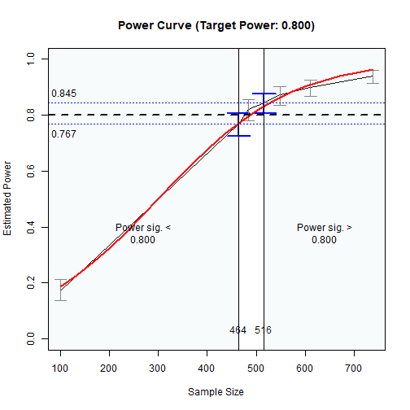

# Introduction

This and other "Quick Template" articles
are examples of R code to determine the
range of sample sizes for a target level of power in
typical models using
[power4mome](https://sfcheung.github.io/power4mome/).
Users can quickly adapt
them for their scenarios. A summary
of the code examples can be found
in the section [Code Template](#code_template)
at the end of this document.

# Prerequisite

Basic knowledge about fitting models
by `lavaan` and `power4mome` is required.

This file is not intended to be an introduction
on how to use functions in `power4mome`.
For details on how to use `power4test()`,
refer to the [Get-Started article](https://sfcheung.github.io/power4mome/articles/power4mome.html).
Please also refer to the help page
of `n_region_from_power()`, and the
[article](https://sfcheung.github.io/power4mome/articles/x_from_power_for_n.html)
on `n_from_power()`, which is called
twice by `n_region_from_power()` to
find the regions described below.

# Scope

This file is for parallel mediation models.


# Functions Used in This Template

- `power4test()`

    - Set up the model and
      the population values, generate the
      data, and generate the Monte Carlo
      simulated estimates for Monte Carlo
      confidence interval.

- `n_region_from_power()`

    - Find the regions of sample sizes
      based on the target power.

- `test_k_indirect_effects()`

    - Test several indirect effects as one test, using
      Monte Carlo or bootstrap confidence
      intervals. Used by `power4test()`.

# Common Flow

The following chart summarizes the steps covered
below.

```{r temp_n_med_obs_fig_flowchart, fig.cap="Common Workflow", fig.align="center", message=FALSE, echo=FALSE}
library(DiagrammeR)
# https://mermaid.live/edit#pako:eNp9VF1vmzAU_SuWpUqJlKb5gBRoGmlq9th2GtkeNqbICZeAZmxkzDqa5r_PNh8jNNubfc8518fnWj7iPQ8Bezii_GUfEyHRZh2wgCG0pyTP1xChECJSUImihFKPJodY7mgBd5c4sw7pIADYXdUrlyUFJEXJKgIyjBKoOvUvnior9BJBU3yQjxofBFgt0ZcMyRjQJ54VlMiEM2RQNFgmK9NneZOshgEe1tqPfi3sqb4SdZfcyDKebSHv6p4ZPCnZQwz7n0aoGhTZciduVob_AsKSkMvBUKtq0dWVov0CQajWbkSJ8mqLWP5eut2VW3am94GIffxk7OqVOVjAQbnNEY86Xdi2Km8jwdOt6dl38oFxJReNE1JtEfvvHcxEit1BkCyuh_L9LPUqasJCtFHKAP84H5Hnee17uL5eVfF3iu1IDKpDrvTAwmqhjOsquh436p4p85KUp40y89lkoJPxSZqpZ-Qnr5C3pqpGpo_JtROxLr_pWJ51KCaSdy_jrXt-42t5f79qo-0lXYHNC_gH2Do569gTdYGuoKH1sH6C7ZndFM8bXEDqYFoAj3AKIiVJqD6Jo6YFWLVNIcCeWtYjDXDATopKCsn9ku2xJ0UBIyx4cYixFxGaq12RhUTCOiFqiGlbzQj7xnnaSCBMJBeP1a9kPidDwd4R_8bedDofO7a9cF371pkuFjNrhEtdtsfOfDqZOXN36jqudRrhV9N0Mnas2a01txcKdyf21Bnhg9C3qR2qyEA88IJJ7FkL6_QHa0Si0g
mermaid('
flowchart TD

  classDef default fill:lightblue;
  classDef default2 fill:lightgreen;

  style tryn fill: lightyellow
  style model fill: lightyellow

  SetModel("Set Up the Population Model (<i>model</i>)")
  SetES("Set the Population Values (<i>pop_es</i>)")
  OneN("Check the Setup<br/><i>power4test()</i>")
  %% SeveralN("Try several ns<br/><i>power4test_by_n()</i>")
  SearchN("Search the regions of ns<br/><i>n_region_from_power()</i>")
  %% AnotherN("Try another n<br/><i>power4test()</i>")

  subgraph model ["Set Up the Model and Test"]

  SetModel:::default2 --> SetES:::default2
  SetES --> OneN

  end

  %% OneN -.-> SetES

  subgraph tryn ["The Region of Sample Sizes"]

  OneN --> SearchN
  SearchN -->|Try Other<br/>Population Values| SetES

  %% OneN <==> AnotherN
  %% AnotherN <==> SeveralN
  %% AnotherN <==> SearchN
  %% OneN <==> SeveralN
  %% OneN <==> SearchN
  %% SeveralN <==> SearchN

  end

  %% AnotherN -.-> SetES
  %% SeveralN -.-> SetES
  %% SearchN -.-> SetES
', height = 550, width = 500)
```

In practice, steps can be repeated,
and population values changed, until
the desired goal is achieved (e.g.,
the region of sample sizes with power close to
the target power is found).

# Set Up The Model and Test

Load the package first:


``` r
library(power4mome)
```

Estimate the power for a sample size.

A parallel mediation model has several
parallel paths (three in the following
example). The test function
`test_k_indirect_effects()` can be used
to estimate the power for having all selected indirect
paths significant if `omnibus` is set to
`"all_sig"`.

The code:


``` r
# ====== Model: Form ======

model <-
"
m1 ~ x
m2 ~ x
m3 ~ x
y ~ m1 + m2 + m3 + x
"

# ====== Model: Population Values ======
# l: large (.50 by default)
# m: medium (.30 by default)
# s: small (.10 by default)
# n: nil (.00 by default)
# -l, -m, and -s denote negative values
# Omitted paths are zero by default
# Can also set to a number directly
# Set each path to the hypothesized magnitude

model_es <-
"
m1 ~ x: m
m2 ~ x: m
m3 ~ x: m
y ~ m1: s
y ~ m2: m
y ~ m3: l
y ~ x: s
"
```


<div class="figure" style="text-align: center">

<p class="caption">The Model</p>
</div>


``` r

# ====== Test the Model Specification ======

out <- power4test(nrep = 2,
                  model = model,
                  pop_es = model_es,
                  n = 50000,
                  iseed = 1234)

# ====== Check the Data Generated ======

print(out,
      data_long = TRUE)

# ====== Estimate the Power ======

# For n = 200,
# when testing all indirect effects by
# Monte Carlo confidence intervals

out <- power4test(nrep = 600,
                  model = model,
                  pop_es = model_es,
                  n = 200,
                  R = 1000,
                  ci_type = "mc",
                  test_fun = test_k_indirect_effects,
                  test_args = list(x = "x",
                                   y = "y",
                                   mc_ci = TRUE,
                                   omnibus = "all_sig"),
                  iseed = 1234,
                  parallel = TRUE)

# ====== Compute the Rejection Rate ======

rejection_rates(out)
```

The results:


``` r
print(out,
      data_long = TRUE)
#> 
#> ====================== Model Information ======================
#> 
#> == Model on Factors/Variables ==
#> 
#> m1 ~ x
#> m2 ~ x
#> m3 ~ x
#> y ~ m1 + m2 + m3 + x
#> 
#> == Model on Variables/Indicators ==
#> 
#> m1 ~ x
#> m2 ~ x
#> m3 ~ x
#> y ~ m1 + m2 + m3 + x
#> 
#> ====== Population Values ======
#> 
#> Regressions:
#>                    Population
#>   m1 ~                       
#>     x                 0.300  
#>   m2 ~                       
#>     x                 0.300  
#>   m3 ~                       
#>     x                 0.300  
#>   y ~                        
#>     m1                0.100  
#>     m2                0.300  
#>     m3                0.500  
#>     x                 0.100  
#> 
#> Variances:
#>                    Population
#>    .m1                0.910  
#>    .m2                0.910  
#>    .m3                0.910  
#>    .y                 0.545  
#>     x                 1.000  
#> 
#> (Computing indirect effects for 4 paths ...)
#> 
#> == Population Conditional/Indirect Effect(s) ==
#> 
#> == Indirect Effect(s) ==
#> 
#>                ind
#> x -> m1 -> y 0.030
#> x -> m2 -> y 0.090
#> x -> m3 -> y 0.150
#> x -> y       0.100
#> 
#>  - The 'ind' column shows the indirect effect(s).
#>  
#> ======================= Data Information =======================
#> 
#> Number of Replications:  600 
#> Sample Sizes:  200 
#> 
#> ==== Descriptive Statistics ====
#> 
#>    vars      n mean sd  skew kurtosis se
#> m1    1 120000    0  1 -0.01    -0.01  0
#> m2    2 120000    0  1 -0.01     0.01  0
#> m3    3 120000    0  1  0.00     0.01  0
#> y     4 120000    0  1  0.00    -0.02  0
#> x     5 120000    0  1  0.00    -0.01  0
#> 
#> ==== Parameter Estimates Based on All 600 Samples Combined ====
#> 
#> Total Sample Size: 120000 
#> 
#> ==== Standardized Estimates ====
#> 
#> Variances and error variances omitted.
#> 
#> Regressions:
#>                     est.std
#>   m1 ~                     
#>     x                 0.301
#>   m2 ~                     
#>     x                 0.296
#>   m3 ~                     
#>     x                 0.300
#>   y ~                      
#>     m1                0.102
#>     m2                0.298
#>     m3                0.504
#>     x                 0.098
#> 
#> 
#> ==================== Extra Element(s) Found ====================
#> 
#> - fit
#> - mc_out
#> 
#> === Element(s) of the First Dataset ===
#> 
#> ============ <fit> ============
#> 
#> lavaan 0.6-21 ended normally after 1 iteration
#> 
#>   Estimator                                         ML
#>   Optimization method                           NLMINB
#>   Number of model parameters                        11
#> 
#>   Number of observations                           200
#> 
#> Model Test User Model:
#>                                                       
#>   Test statistic                                 1.105
#>   Degrees of freedom                                 3
#>   P-value (Chi-square)                           0.776
#> 
#> =========== <mc_out> ===========
#> 
#> 
#> == A 'mc_out' class object ==
#> 
#> Number of Monte Carlo replications: 1000 
#> 
#> 
#> ============== <test_indirects: x-...->y> ==============
#> 
#> Mean(s) across replication:
#>           test_label  est cilo cihi pvalue   sig
#> 1 x-...->y (All sig)  NaN  NaN  NaN  0.173 0.457
#> 
#> - The column 'sig' shows the rejection rates.
#> - If the null hypothesis is false, the rate is the power.
#> - Number of valid replications for rejection rate(s): 600 
#> - Proportion of valid replications for rejection rate(s): 1.000
rejection_rates(out)
#> [test]: test_indirects: x-...->y 
#> [test_label]: x-...->y (All sig) 
#>    est   p.v reject r.cilo r.cihi
#> 1  NaN 1.000  0.457  0.417  0.497
#> Notes:
#> - p.v: The proportion of valid replications.
#> - est: The mean of the estimates in a test across replications.
#> - reject: The proportion of 'significant' replications, that is, the
#>   rejection rate. If the null hypothesis is true, this is the Type I
#>   error rate. If the null hypothesis is false, this is the power.
#> - r.cilo,r.cihi: The confidence interval of the rejection rate, based
#>   on Wilson's (1927) method.
#> - Refer to the tests for the meanings of other columns.
```

(`est` is `NaN` because the test is for
all three paths and so there is no single
point estimate for the test.)


# Find the Regions of *N* Based on the Target Power

Search, by simulation, the following
two regions of sample sizes:

- Sample sizes with estimated levels of
  power significantly below the target
  level (e.g., .80), tested by the
  confidence interval (95% by default).

- Sample sizes with estimated levels of
  power significantly above the target
  level (e.g., .80), tested by the
  confidence interval (95% by default).

In practice, we rarely need high precision
for these regions for sample size planning.
Therefore, we only need to find the two
sample sizes with the corresponding
confidence bounds *close* *enough* to
the target power, defined by a tolerance value.
In the function below, this value is .02
by default.

It can take some time to run if the estimated power
of the sample size is too different from
the target power.

We can find the two regions by `n_region_from_power()`.

The code:


``` r
#
# ===== Reuse the output of power4test() =====
#
# Call n_region_from_power()
# - Set target power: target_power = .80 (Default, can be omitted)
# - Set the seed for the simulation: Integer. Should always be set.
# To set desired precision:
# - Set final number of R: final_R. If omitted,
#   it is set to 1000 or set to R in the original object.
# - Set final number of replications: final_nrep. If omitted,
#   it is set to 400 or set to nrep in the original object.

n_power_region <- n_region_from_power(out,
                                      seed = 1357)

# ===== Basic Results =====

n_power_region

# ===== Plot the (Crude) Power Curve and the Regions =====

plot(n_power_region)
```

The results:


``` r
# ===== Basic Results =====

n_power_region
#> Call:
#> n_region_from_power(object = out, seed = 1357)
#> 
#>                      Setting                                      
#> Predictor(x)         Sample Size                                  
#> Goal:                Power significantly below or above the target
#> algorithm:           bisection                                    
#> Level of confidence: 95.00%                                       
#> Target Power:        0.800                                        
#> 
#> Solution: 
#> 
#> Approximate region of sample sizes with power:
#> - not significantly different from 0.800: 445 to 500
#> - significantly lower than 0.800: 445
#> - significantly higher than 0.800: 500
#> 
#> Confidence intervals of the estimated power:
#> - for the lower bound (445): [0.743, 0.810]
#> - for the upper bound (500): [0.793, 0.853]
#> 
#> Call `summary()` for detailed results.

# ===== Plot the (Crude) Power Curve and the Regions =====

plot(n_power_region)
```

<div class="figure" style="text-align: center">

<p class="caption">Power Curve</p>
</div>


As shown above, approximately:

- sample sizes lower than
  445 have
  power significantly lower than .80, and

- sample sizes higher than
  500 have
  power significantly higher than .80.

In other words, sample sizes between
445 and
500 have
power not significantly different from
.80.

If necessary, detailed results can be
printed by `summary()`:


``` r
# ===== Detailed Results =====
summary(n_power_region)
#> 
#> ======<< Summary for the Lower Region >>======
#> 
#> 
#> ====== x_from_power Results ======
#> 
#> Call:
#> x_from_power(object = out, x = "n", what = "ub", goal = "close_enough", 
#>     final_nrep = 600, final_R = 1000, seed = 1357)
#> 
#> Predictor (x): Sample Size 
#> 
#> - Target Power: 0.800 
#> - Goal: Find 'x' with estimated upper confidence bound close enough to
#>   the target power.
#> 
#> === Major Results ===
#> 
#> - Final Value (Sample Size): 445
#> 
#> - Final Estimated Power: 0.778 
#> - Confidence Interval: [0.743; 0.810]
#> - Level of confidence: 95.0%
#> - Based on 600 replications.
#> 
#> === Technical Information ===
#> 
#> - Algorithm: bisection 
#> - Tolerance for 'close enough': Within 0.02000 of 0.800 
#> - The range of values explored: 200 to 650 
#> - Time spent in the search: 4.593 mins 
#> - The final crude model for the power-predictor relation:
#> 
#> Model Type: Logistic Regression 
#> 
#> Call:
#> power_curve(object = by_x_1, formula = power_model, start = power_curve_start, 
#>     lower_bound = lower_bound, upper_bound = upper_bound, nls_args = nls_args, 
#>     nls_control = nls_control, verbose = progress)
#> 
#> Predictor: n (Sample Size)
#> 
#> Model:
#> 
#> Call:  stats::glm(formula = reject ~ x, family = "binomial", data = reject1)
#> 
#> Coefficients:
#> (Intercept)            x  
#>   -1.289931     0.005615  
#> 
#> Degrees of Freedom: 3599 Total (i.e. Null);  3598 Residual
#> Null Deviance:	    4187 
#> Residual Deviance: 3814 	AIC: 3818
#> 
#> - Detailed Results:
#> 
#> [test]: test_indirects: x-...->y 
#> [test_label]: x-...->y (All sig) 
#>     n  est   p.v reject r.cilo r.cihi
#> 1 200  NaN 1.000  0.457  0.417  0.497
#> 2 350  NaN 1.000  0.670  0.631  0.706
#> 3 440  NaN 1.000  0.747  0.710  0.780
#> 4 445  NaN 1.000  0.778  0.743  0.810
#> 5 500  NaN 1.000  0.825  0.793  0.853
#> 6 650  NaN 1.000  0.913  0.888  0.933
#> Notes:
#> - n: The sample size in a trial.
#> - p.v: The proportion of valid replications.
#> - est: The mean of the estimates in a test across replications.
#> - reject: The proportion of 'significant' replications, that is, the
#>   rejection rate. If the null hypothesis is true, this is the Type I
#>   error rate. If the null hypothesis is false, this is the power.
#> - r.cilo,r.cihi: The confidence interval of the rejection rate, based
#>   on Wilson's (1927) method.
#> - Refer to the tests for the meanings of other columns.
#> 
#> 
#> 
#> ======<< Summary for the Upper Region >>======
#> 
#> 
#> ====== x_from_power Results ======
#> 
#> Call:
#> x_from_power(object = out, seed = 1357, final_nrep = 600, final_R = 1000, 
#>     x = "n", what = "lb", goal = "close_enough")
#> 
#> Predictor (x): Sample Size 
#> 
#> - Target Power: 0.800 
#> - Goal: Find 'x' with estimated lower confidence bound close enough to
#>   the target power.
#> 
#> === Major Results ===
#> 
#> - Final Value (Sample Size): 500
#> 
#> - Final Estimated Power: 0.825 
#> - Confidence Interval: [0.793; 0.853]
#> - Level of confidence: 95.0%
#> - Based on 600 replications.
#> 
#> === Technical Information ===
#> 
#> - Algorithm: bisection 
#> - Tolerance for 'close enough': Within 0.02000 of 0.800 
#> - The range of values explored: 200 to 650 
#> - Time spent in the search: 0.8058 secs 
#> - The final crude model for the power-predictor relation:
#> 
#> Model Type: Logistic Regression 
#> 
#> Call:
#> power_curve(object = by_x_1, formula = power_curve_args$power_model, 
#>     start = power_curve_args$start, lower_bound = power_curve_args$lower_bound, 
#>     upper_bound = power_curve_args$upper_bound, nls_args = power_curve_args$nls_args, 
#>     nls_control = power_curve_args$nls_control, verbose = progress)
#> 
#> Predictor: n (Sample Size)
#> 
#> Model:
#> 
#> Call:  stats::glm(formula = reject ~ x, family = "binomial", data = reject1)
#> 
#> Coefficients:
#> (Intercept)            x  
#>   -1.289931     0.005615  
#> 
#> Degrees of Freedom: 3599 Total (i.e. Null);  3598 Residual
#> Null Deviance:	    4187 
#> Residual Deviance: 3814 	AIC: 3818
#> 
#> - Detailed Results:
#> 
#> [test]: test_indirects: x-...->y 
#> [test_label]: x-...->y (All sig) 
#>     n  est   p.v reject r.cilo r.cihi
#> 1 200  NaN 1.000  0.457  0.417  0.497
#> 2 350  NaN 1.000  0.670  0.631  0.706
#> 3 440  NaN 1.000  0.747  0.710  0.780
#> 4 445  NaN 1.000  0.778  0.743  0.810
#> 5 500  NaN 1.000  0.825  0.793  0.853
#> 6 650  NaN 1.000  0.913  0.888  0.933
#> Notes:
#> - n: The sample size in a trial.
#> - p.v: The proportion of valid replications.
#> - est: The mean of the estimates in a test across replications.
#> - reject: The proportion of 'significant' replications, that is, the
#>   rejection rate. If the null hypothesis is true, this is the Type I
#>   error rate. If the null hypothesis is false, this is the power.
#> - r.cilo,r.cihi: The confidence interval of the rejection rate, based
#>   on Wilson's (1927) method.
#> - Refer to the tests for the meanings of other columns.
```

# Code Template {#code_template}

This is the code used above:


``` r
library(power4mome)

# ====== Model and Effect Size (Population Values) ======

model <-
"
m1 ~ x
m2 ~ x
m3 ~ x
y ~ m1 + m2 + m3 + x
"

model_es <-
"
m1 ~ x: m
m2 ~ x: m
m3 ~ x: m
y ~ m1: s
y ~ m2: m
y ~ m3: l
y ~ x: s
"

# Test the Model Specification

out <- power4test(nrep = 2,
                  model = model,
                  pop_es = model_es,
                  n = 50000,
                  iseed = 1234)

# Check the Data Generated

print(out,
      data_long = TRUE)

# ====== Try One N and Estimate the Power ======

# For n = 300,
# when testing all indirect effects by
# Monte Carlo confidence intervals

out <- power4test(nrep = 600,
                  model = model,
                  pop_es = model_es,
                  n = 200,
                  R = 1000,
                  ci_type = "mc",
                  test_fun = test_k_indirect_effects,
                  test_args = list(x = "x",
                                   y = "y",
                                   mc_ci = TRUE,
                                   omnibus = "all_sig"),
                  iseed = 1234,
                  parallel = TRUE)

rejection_rates(out)

# ====== Regions of Ns ======

# Call n_region_from_power()
# - Set target power: target_power = .80 (Default, can be omitted)
# - Set the seed for the simulation: Integer. Should always be set.
# To set desired precision:
# - Set final number of R: final_R. If omitted,
#   it is set to 1000 or set to R in the original object.
# - Set final number of replications: final_nrep. If omitted,
#   it is set to 400 or set to nrep in the original object.

n_power_region <- n_region_from_power(out,
                                      seed = 1357)
n_power_region
plot(n_power_region)
summary(n_power_region)
```


# Final Remarks

For a moderate to small `nrep`, the
results may be
sensitive to the `seed`. It is
advised to do a final check of the
sample size to be used using
`power4test()` and an `nrep` of 1000
or 2000.

For other options of `power4test()`
and `n_region_from_power()`, please refer to
their help pages, as well as the
[Get-Started article](power4mome.html)
and this [article](x_from_power_for_n.html)
for `n_from_power()`, which is the
function to find one of the regions,
called twice by `n_region_from_power()`.

