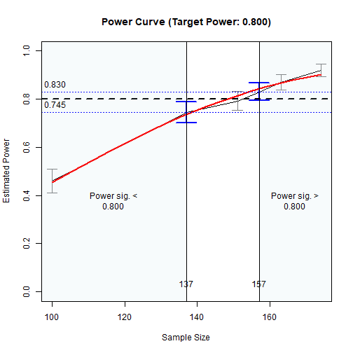

# Introduction

This and other "Quick Template" articles
are examples of R code to determine
sample size for a target level of power in
typical models using
[power4mome](https://sfcheung.github.io/power4mome/).
Users can quickly adapt
them for their scenarios. A summary
of the code examples can be found
in the section [Code Template](#code_template)
at the end of this document.

# Prerequisite

Basic knowledge about fitting models
by `lavaan` and `power4mome` is required.

This file is not intended to be an introduction
on how to use functions in `power4mome`.
For details on how to use `power4test()`,
and `n_from_power()`,
refer to the [Get-Started article](https://sfcheung.github.io/power4mome/articles/power4mome.html),
and this [article](https://sfcheung.github.io/power4mome/articles/x_from_power_for_n.html)
on finding the sample size
given desired power using `n_from_power()`,
as well as the help pages of these
functions.

# Common Flow

The following chart summarizes the steps covered
below.

```{r temp_n_med_obs_fig_flowchart, fig.cap="Common Workflow", fig.align="center", message=FALSE, echo=FALSE}
library(DiagrammeR)
# https://mermaid.live/edit#pako:eNqFVGtr2zAU_StCUEggSRM_8nDTwFj2sV2Zyz5sHkGxrx8gS0aW17lp_vtk-THHTdk36d5zjo7OFTphnweAHRxS_uLHREj0vPeYxxDyKcnzPYQogJAUVKIwodShSRTLIy3g7hrG6IEiAcDuaq1clhSQFCWrAUgjSqDq1H_9VFmh1wAVxAX5UPVHHt6DnwRKLgb0xLOCEplwhnQXjbbJTutsb5Pd2MPjhvvF_ZD4najr5JqZ8ewAeZ_6lcGjYj6LEnEGiG2P4nankS8gLAm5HI0rfAO_uVGH_QZBaMvK6y1i-Xvq4Vge2AXfBSL8uOLWK-1VQFT55GFPhB1CwdOD1ho6-MS4oonWAam3__Gux1AcI0GyuJnEz5qvIkCPHv51OQfHcbqhT6e7OuNesctdd6sYaz6woF4oo1UVTWcte2BCP5fKg4rgWxeBS9JMvRU3eYW8M1ULaR2dXy_Kqvymr6FDeDf3t_7Zraft_f2ui3GQat1sp_xBs3NxoTgg9Rt9Qgsb9IbpdWf2E7wUuNJpQukaeIJTEClJAvULnCqYh5VsCh521LIZp4c9dlZQUkjulszHjhQFTLDgRRRjJyQ0V7siC4iEfULUANOumhH2g_O0pUCQSC4e6m9H_z4agp0T_oOdhWHMlubCtNdra2MvTXM5wWVV3sw21mK-tA3LMu3lxjxP8KtWnc9UzV6tLdtYLObGZm5PcCSq6zQWVWYgPvOCSezYq9X5L5kXl5M
mermaid('
flowchart TD

  classDef default fill:lightblue;
  classDef default2 fill:lightgreen;

  style tryn fill: lightyellow
  style model fill: lightyellow

  SetModel("Decide the Population Model (<i>model</i>)")
  SetES("Decide the Population Values (<i>pop_es</i>)")
  OneN("Try one n<br/><i>power4test()</i>")
  %% SeveralN("Try several ns<br/><i>power4test_by_n()</i>")
  SearchN("Search the region of ns<br/><i>n_from_power()</i>")
  %% AnotherN("Try another n<br/><i>power4test()</i>")

  subgraph model ["Try One N"]

  SetModel:::default2 --> SetES:::default2
  SetES --> OneN

  end

  %% OneN -.-> SetES

  subgraph tryn ["The Region of Sample Sizes"]

  OneN --> SearchN
  SearchN -->|Try Other Population Values| SetES

  %% OneN <==> AnotherN
  %% AnotherN <==> SeveralN
  %% AnotherN <==> SearchN
  %% OneN <==> SeveralN
  %% OneN <==> SearchN
  %% SeveralN <==> SearchN

  end

  %% AnotherN -.-> SetES
  %% SeveralN -.-> SetES
  %% SearchN -.-> SetES
', height = 550, width = 500)
```

In practice, steps can be repeated,
and population values changed, until
the desired goal is achieved (e.g.,
a sample size with power close to
the target power is found).

# Scope

This file is for serial mediation models.

# Try One N

Estimate the power for a sample size.

The code:


``` r
library(power4mome)
#
# ====== Model: Form ======
# Omit any paths hypothesized to be zero
model <-
"
m1 ~ x
m2 ~ m1 + x
m3 ~ m2 + m1 + x
y ~ m3 + m2 + m1 + x
"
#
# ====== Model: Population Values ======
# l: large (.50 by default)
# m: medium (.30 by default)
# s: small (.10 by default)
# -l, -m, and -s denote negative values
# Can also set to a number directly
# Set each path to the hypothesized magnitude
model_es <-
"
m1 ~ x: l
m2 ~ m1: l
m3 ~ m2: l
y ~ m3: m
y ~ x: s
"
#
# ====== Test the Model Specification ======
out <- power4test(nrep = 2,
                  model = model,
                  pop_es = model_es,
                  n = 50000,
                  iseed = 1234)
#
# ====== Check the Data Generated ======
print(out,
      data_long = TRUE)
#
# ====== Estimate the Power ======
# For n = 50,
# when testing the indirect effect by
# Monte Carlo confidence interval
out <- power4test(nrep = 400,
                  model = model,
                  pop_es = model_es,
                  n = 50,
                  R = 1000,
                  ci_type = "mc",
                  test_fun = test_indirect_effect,
                  test_args = list(x = "x",
                                   m = c("m1", "m2", "m3"),
                                   y = "y",
                                   mc_ci = TRUE),
                  iseed = 1234,
                  parallel = TRUE)
#
# ====== Compute the Rejection Rate ======
rejection_rates(out)
```

The results:


``` r
print(out,
      data_long = TRUE)
#> 
#> ====================== Model Information ======================
#> 
#> == Model on Factors/Variables ==
#> 
#> m1 ~ x
#> m2 ~ m1 + x
#> m3 ~ m2 + m1 + x
#> y ~ m3 + m2 + m1 + x
#> 
#> == Model on Variables/Indicators ==
#> 
#> m1 ~ x
#> m2 ~ m1 + x
#> m3 ~ m2 + m1 + x
#> y ~ m3 + m2 + m1 + x
#> 
#> ====== Population Values ======
#> 
#> Regressions:
#>                    Population
#>   m1 ~                       
#>     x                 0.500  
#>   m2 ~                       
#>     m1                0.500  
#>     x                 0.000  
#>   m3 ~                       
#>     m2                0.500  
#>     m1                0.000  
#>     x                 0.000  
#>   y ~                        
#>     m3                0.300  
#>     m2                0.000  
#>     m1                0.000  
#>     x                 0.100  
#> 
#> Variances:
#>                    Population
#>    .m1                0.750  
#>    .m2                0.750  
#>    .m3                0.750  
#>    .y                 0.893  
#>     x                 1.000  
#> 
#> (Computing indirect effects for 7 paths ...)
#> 
#> == Population Indirect Effect(s) ==
#> 
#> == Indirect Effect(s) ==
#> 
#>                            ind
#> x -> m1 -> m2 -> m3 -> y 0.037
#> x -> m1 -> m2 -> y       0.000
#> x -> m1 -> m3 -> y       0.000
#> x -> m1 -> y             0.000
#> x -> m2 -> m3 -> y       0.000
#> x -> m2 -> y             0.000
#> x -> m3 -> y             0.000
#> 
#>  - The 'ind' column shows the indirect effect(s).
#>  
#> ======================= Data Information =======================
#> 
#> Number of Replications:  400 
#> Sample Sizes:  50 
#> 
#> ==== Descriptive Statistics ====
#> 
#>    vars     n  mean   sd skew kurtosis   se
#> m1    1 20000 -0.01 1.00 0.03    -0.04 0.01
#> m2    2 20000  0.00 1.00 0.01     0.06 0.01
#> m3    3 20000 -0.01 1.00 0.01    -0.05 0.01
#> y     4 20000 -0.01 1.00 0.01    -0.03 0.01
#> x     5 20000  0.00 1.01 0.00    -0.02 0.01
#> 
#> ==== Parameter Estimates Based on All 400 Samples Combined ====
#> 
#> Total Sample Size: 20000 
#> 
#> ==== Standardized Estimates ====
#> 
#> Variances and error variances omitted.
#> 
#> Regressions:
#>                     est.std
#>   m1 ~                     
#>     x                 0.493
#>   m2 ~                     
#>     m1                0.498
#>     x                 0.010
#>   m3 ~                     
#>     m2                0.499
#>     m1               -0.001
#>     x                 0.011
#>   y ~                      
#>     m3                0.296
#>     m2               -0.002
#>     m1                0.014
#>     x                 0.086
#> 
#> 
#> ==================== Extra Element(s) Found ====================
#> 
#> - fit
#> - mc_out
#> 
#> === Element(s) of the First Dataset ===
#> 
#> ============ <fit> ============
#> 
#> lavaan 0.6-19 ended normally after 1 iteration
#> 
#>   Estimator                                         ML
#>   Optimization method                           NLMINB
#>   Number of model parameters                        14
#> 
#>   Number of observations                            50
#> 
#> Model Test User Model:
#>                                                       
#>   Test statistic                                 0.000
#>   Degrees of freedom                                 0
#> 
#> =========== <mc_out> ===========
#> 
#> 
#> == A 'mc_out' class object ==
#> 
#> Number of Monte Carlo replications: 1000 
#> 
#> 
#> ====================== Test(s) Conducted ======================
#> 
#> - test_indirect: x->m1->m2->m3->y
#> 
#> Call print() and set 'test_long = TRUE' for a detailed report.
rejection_rates(out)
#> [test]: test_indirect: x->m1->m2->m3->y 
#> [test_label]: Test 
#>     est   p.v reject r.cilo r.cihi
#> 1 0.036 1.000  0.372  0.325  0.420
#> Notes:
#> - p.v: The proportion of valid replications.
#> - est: The mean of the estimates in a test across replications.
#> - reject: The proportion of 'significant' replications, that is, the
#>   rejection rate. If the null hypothesis is true, this is the Type I
#>   error rate. If the null hypothesis is false, this is the power.
#> - r.cilo,r.cihi: The confidence interval of the rejection rate, based
#>   on normal approximation.
#> - Refer to the tests for the meanings of other columns.
```

## Try Another N

We can rerun the simulation to estimate
power for another sample size before going
to the next step. This can be useful if
the estimated power of the initial attempt
is too different from the target power.

However, this step is optional because
the next step, though may take longer,
should still be able to find the
desired region.

The code:


``` r
#
# ===== Reuse the output of power4test() =====
# Estimate power for n = 150
# Set n to 150
out_new_n <- power4test(out,
                        n = 150)
#
# ===== Compute Rejection Rate (Power) =====
rejection_rates(out_new_n)
```

The results:


``` r
rejection_rates(out_new_n)
#> [test]: test_indirect: x->m1->m2->m3->y 
#> [test_label]: Test 
#>     est   p.v reject r.cilo r.cihi
#> 1 0.038 1.000  0.927  0.902  0.953
#> Notes:
#> - p.v: The proportion of valid replications.
#> - est: The mean of the estimates in a test across replications.
#> - reject: The proportion of 'significant' replications, that is, the
#>   rejection rate. If the null hypothesis is true, this is the Type I
#>   error rate. If the null hypothesis is false, this is the power.
#> - r.cilo,r.cihi: The confidence interval of the rejection rate, based
#>   on normal approximation.
#> - Refer to the tests for the meanings of other columns.
```

# Find the Regions of *N* Based on the Target Power

Search, by simulation, the following
two regions of sample sizes:

- Sample sizes with estimated levels of
  power significantly below the target
  level (e.g., .80). That is, we find
  the largest sample size with
  the *upper bound* (`ub`) of the
  confidence interval of its power
  touches to the
  target level.

- Sample sizes with estimated levels of
  power significantly above the target
  level (e.g., .80). That is, we find
  the smallest sample size with
  the *lower bound* (`ub`) of the
  confidence interval of its power
  touches to the
  target level.

In practice, we nearly need high precision
for these regions for sample size planning.
Therefore, we only need to find the two
sample sizes with the corresponding
confidence bounds *close* *enough* to
the target power, defined by a tolerance value.
In the function below, this value is .02
by default.

Do this step after calling `power4test()`
on a sample size.

It can take some time to run if estimated power
of the sample size is too different from
the target power.

## Finding the Two Regions Using `n_region_from_power()`

Instead of doing the search by calling
`n_from_power()` twice, we can find them
by calling `n_region_from_power()`.

The code:


``` r
#
# ===== Reuse the output of power4test() =====
# Call n_from_power()
# - Set target power: target_power = .80 (Default, can be omitted)
# - Set the seed for the simulation: Integer. Should always be set.
# To set desired precision:
# - Set final number of R: final_R = 1000 (Default, can be omitted)
# - Set final number of replications: final_nrep = 400 (Default, can be omitted)
n_power_region <- n_region_from_power(out,
                                      seed = 1357)
#
# ===== Basic Results =====
n_power_region
#
# ===== Plot the (Crude) Power Curve and the Regions =====
plot(n_power_region)
```

The results:


``` r
#
# ===== Basic Results =====
n_power_region
#> Call:
#> n_region_from_power(object = out, seed = 1357)
#> 
#>                      Setting                                      
#> Predictor(x)         Sample Size                                  
#> Goal:                Power significantly below or above the target
#> algorithm:           bisection                                    
#> Level of confidence: 95.00%                                       
#> Target Power:        0.800                                        
#> 
#> Solution: 
#> 
#> Approximate region of sample sizes with power:
#> - not significantly different from 0.800: 107 to 121
#> - significantly lower than 0.800: 107
#> - significantly higher than 0.800: 121
#> 
#> Confidence intervals of the estimated power:
#> - for the lower bound (107): [0.726, 0.809]
#> - for the upper bound (121): [0.815, 0.885]
#> 
#> Call `summary()` for detailed results.
#
# ===== Plot the (Crude) Power Curve and the Regions =====
plot(n_power_region)
```

<div class="figure" style="text-align: center">

<p class="caption">Power Curve</p>
</div>

As shown above, approximately:

- sample sizes lower than
  107 have
  power significantly lower than .80, and

- sample sizes higher than
  121 have
  power significantly higher than .80.

In other words, sample sizes between
107 and
121 have
power not significantly different from
.80.

If necessary, detailed results can be
printed by `summary()`:


``` r
# ===== Detailed Results =====
summary(n_power_region)
#> 
#> ======<< Summary for the Lower Region >>======
#> 
#> 
#> ====== x_from_power Results ======
#> 
#> Call:
#> power4mome::x_from_power(object = out, x = "n", what = "ub", 
#>     goal = "close_enough", seed = 1357)
#> 
#> Predictor (x): Sample Size 
#> 
#> - Target Power: 0.800 
#> - Goal: Find 'x' with estimated upper confidence bound close enough to
#>   the target power.
#> 
#> === Major Results ===
#> 
#> - Final Value (Sample Size): 107
#> 
#> - Final Estimated Power: 0.767 
#> - Confidence Interval: [0.726; 0.809]
#> - Level of confidence: 95.0%
#> - Based on 400 replications.
#> 
#> === Technical Information ===
#> 
#> - Algorithm: bisection 
#> - Tolerance for 'close enough': Within 0.02000 of 0.800 
#> - The range of values explored: 107 to 50 
#> - Time spent in the search: 21.14 secs 
#> - The final crude model for the power-predictor relation:
#> 
#> Model Type: Logistic Regression 
#> 
#> Call:
#> power_curve(object = by_x_1, formula = power_model, start = power_curve_start, 
#>     lower_bound = lower_bound, upper_bound = upper_bound, nls_args = nls_args, 
#>     nls_control = nls_control, verbose = progress)
#> 
#> Predictor: n (Sample Size)
#> 
#> Model:
#> 
#> Call:  stats::glm(formula = reject ~ x, family = "binomial", data = reject1)
#> 
#> Coefficients:
#> (Intercept)            x  
#>     -2.0266       0.0301  
#> 
#> Degrees of Freedom: 799 Total (i.e. Null);  798 Residual
#> Null Deviance:	    1093 
#> Residual Deviance: 962 	AIC: 966
#> 
#> - Detailed Results:
#> 
#> [test]: test_indirect: x->m1->m2->m3->y 
#> [test_label]: Test 
#>     n   est   p.v reject r.cilo r.cihi
#> 1  50 0.036 1.000  0.372  0.325  0.420
#> 2 107 0.036 1.000  0.767  0.726  0.809
#> Notes:
#> - n: The sample size in a trial.
#> - p.v: The proportion of valid replications.
#> - est: The mean of the estimates in a test across replications.
#> - reject: The proportion of 'significant' replications, that is, the
#>   rejection rate. If the null hypothesis is true, this is the Type I
#>   error rate. If the null hypothesis is false, this is the power.
#> - r.cilo,r.cihi: The confidence interval of the rejection rate, based
#>   on normal approximation.
#> - Refer to the tests for the meanings of other columns.
#> 
#> 
#> 
#> ======<< Summary for the Upper Region >>======
#> 
#> 
#> ====== x_from_power Results ======
#> 
#> Call:
#> power4mome::x_from_power(object = out, seed = 1357, x = "n", 
#>     what = "lb", goal = "close_enough")
#> 
#> Predictor (x): Sample Size 
#> 
#> - Target Power: 0.800 
#> - Goal: Find 'x' with estimated lower confidence bound close enough to
#>   the target power.
#> 
#> === Major Results ===
#> 
#> - Final Value (Sample Size): 121
#> 
#> - Final Estimated Power: 0.850 
#> - Confidence Interval: [0.815; 0.885]
#> - Level of confidence: 95.0%
#> - Based on 400 replications.
#> 
#> === Technical Information ===
#> 
#> - Algorithm: bisection 
#> - Tolerance for 'close enough': Within 0.02000 of 0.800 
#> - The range of values explored: 107 to 180 
#> - Time spent in the search: 1.751 mins 
#> - The final crude model for the power-predictor relation:
#> 
#> Model Type: Logistic Regression 
#> 
#> Call:
#> power_curve(object = by_x_1, formula = power_model, start = power_curve_start, 
#>     lower_bound = lower_bound, upper_bound = upper_bound, nls_args = nls_args, 
#>     nls_control = nls_control, verbose = progress)
#> 
#> Predictor: n (Sample Size)
#> 
#> Model:
#> 
#> Call:  stats::glm(formula = reject ~ x, family = "binomial", data = reject1)
#> 
#> Coefficients:
#> (Intercept)            x  
#>    -1.37603      0.02473  
#> 
#> Degrees of Freedom: 2399 Total (i.e. Null);  2398 Residual
#> Null Deviance:	    1980 
#> Residual Deviance: 1902 	AIC: 1906
#> 
#> - Detailed Results:
#> 
#> [test]: test_indirect: x->m1->m2->m3->y 
#> [test_label]: Test 
#>     n   est   p.v reject r.cilo r.cihi
#> 1 107 0.036 1.000  0.767  0.726  0.809
#> 2 112 0.038 1.000  0.795  0.755  0.835
#> 3 121 0.037 1.000  0.850  0.815  0.885
#> 4 129 0.038 1.000  0.868  0.834  0.901
#> 5 146 0.037 1.000  0.905  0.876  0.934
#> 6 180 0.038 1.000  0.950  0.929  0.971
#> Notes:
#> - n: The sample size in a trial.
#> - p.v: The proportion of valid replications.
#> - est: The mean of the estimates in a test across replications.
#> - reject: The proportion of 'significant' replications, that is, the
#>   rejection rate. If the null hypothesis is true, this is the Type I
#>   error rate. If the null hypothesis is false, this is the power.
#> - r.cilo,r.cihi: The confidence interval of the rejection rate, based
#>   on normal approximation.
#> - Refer to the tests for the meanings of other columns.
```

# Change Population Values and Repeat

If necessary, change the population value(s)
and repeat the steps.

For example, set all the paths along
the indirect effect to medium (.30).

The code:


``` r
model_es2 <-
"
m1 ~ x: m
m2 ~ m1: m
m3 ~ m2: m
y ~ m3: m
y ~ x: s
"
#
# ====== Estimate the Power ======
out2 <- power4test(nrep = 400,
                   model = model,
                   pop_es = model_es2,
                   n = 100,
                   R = 1000,
                   ci_type = "mc",
                   test_fun = test_indirect_effect,
                   test_args = list(x = "x",
                                    m = c("m1", "m2", "m3"),
                                    y = "y",
                                    mc_ci = TRUE),
                   iseed = 1234,
                   parallel = TRUE)
#
# ====== Compute the Rejection Rate ======
rejection_rates(out2)
```

The results:


``` r
print(out2,
      data_long = TRUE)
#> 
#> ====================== Model Information ======================
#> 
#> == Model on Factors/Variables ==
#> 
#> m1 ~ x
#> m2 ~ m1 + x
#> m3 ~ m2 + m1 + x
#> y ~ m3 + m2 + m1 + x
#> 
#> == Model on Variables/Indicators ==
#> 
#> m1 ~ x
#> m2 ~ m1 + x
#> m3 ~ m2 + m1 + x
#> y ~ m3 + m2 + m1 + x
#> 
#> ====== Population Values ======
#> 
#> Regressions:
#>                    Population
#>   m1 ~                       
#>     x                 0.300  
#>   m2 ~                       
#>     m1                0.300  
#>     x                 0.000  
#>   m3 ~                       
#>     m2                0.300  
#>     m1                0.000  
#>     x                 0.000  
#>   y ~                        
#>     m3                0.300  
#>     m2                0.000  
#>     m1                0.000  
#>     x                 0.100  
#> 
#> Variances:
#>                    Population
#>    .m1                0.910  
#>    .m2                0.910  
#>    .m3                0.910  
#>    .y                 0.898  
#>     x                 1.000  
#> 
#> (Computing indirect effects for 7 paths ...)
#> 
#> == Population Indirect Effect(s) ==
#> 
#> == Indirect Effect(s) ==
#> 
#>                            ind
#> x -> m1 -> m2 -> m3 -> y 0.008
#> x -> m1 -> m2 -> y       0.000
#> x -> m1 -> m3 -> y       0.000
#> x -> m1 -> y             0.000
#> x -> m2 -> m3 -> y       0.000
#> x -> m2 -> y             0.000
#> x -> m3 -> y             0.000
#> 
#>  - The 'ind' column shows the indirect effect(s).
#>  
#> ======================= Data Information =======================
#> 
#> Number of Replications:  400 
#> Sample Sizes:  100 
#> 
#> ==== Descriptive Statistics ====
#> 
#>    vars     n  mean   sd  skew kurtosis   se
#> m1    1 40000 -0.01 1.00  0.00     0.01 0.01
#> m2    2 40000  0.00 1.01 -0.01    -0.01 0.01
#> m3    3 40000  0.00 1.01  0.02     0.03 0.01
#> y     4 40000  0.00 1.00 -0.01    -0.01 0.00
#> x     5 40000 -0.01 1.00  0.00    -0.03 0.01
#> 
#> ==== Parameter Estimates Based on All 400 Samples Combined ====
#> 
#> Total Sample Size: 40000 
#> 
#> ==== Standardized Estimates ====
#> 
#> Variances and error variances omitted.
#> 
#> Regressions:
#>                     est.std
#>   m1 ~                     
#>     x                 0.306
#>   m2 ~                     
#>     m1                0.303
#>     x                -0.001
#>   m3 ~                     
#>     m2                0.305
#>     m1                0.001
#>     x                -0.005
#>   y ~                      
#>     m3                0.300
#>     m2               -0.005
#>     m1                0.006
#>     x                 0.105
#> 
#> 
#> ==================== Extra Element(s) Found ====================
#> 
#> - fit
#> - mc_out
#> 
#> === Element(s) of the First Dataset ===
#> 
#> ============ <fit> ============
#> 
#> lavaan 0.6-19 ended normally after 1 iteration
#> 
#>   Estimator                                         ML
#>   Optimization method                           NLMINB
#>   Number of model parameters                        14
#> 
#>   Number of observations                           100
#> 
#> Model Test User Model:
#>                                                       
#>   Test statistic                                 0.000
#>   Degrees of freedom                                 0
#> 
#> =========== <mc_out> ===========
#> 
#> 
#> == A 'mc_out' class object ==
#> 
#> Number of Monte Carlo replications: 1000 
#> 
#> 
#> ====================== Test(s) Conducted ======================
#> 
#> - test_indirect: x->m1->m2->m3->y
#> 
#> Call print() and set 'test_long = TRUE' for a detailed report.
rejection_rates(out2)
#> [test]: test_indirect: x->m1->m2->m3->y 
#> [test_label]: Test 
#>     est   p.v reject r.cilo r.cihi
#> 1 0.009 1.000  0.460  0.411  0.509
#> Notes:
#> - p.v: The proportion of valid replications.
#> - est: The mean of the estimates in a test across replications.
#> - reject: The proportion of 'significant' replications, that is, the
#>   rejection rate. If the null hypothesis is true, this is the Type I
#>   error rate. If the null hypothesis is false, this is the power.
#> - r.cilo,r.cihi: The confidence interval of the rejection rate, based
#>   on normal approximation.
#> - Refer to the tests for the meanings of other columns.
```

## Find the Two Regions Using `n_region_from_power()`


``` r
#
# ===== Reuse the output of power4test() =====
n_power_region2 <- n_region_from_power(out2,
                                       seed = 1357)
#
# ===== Basic Results =====
n_power_region2
#
# ===== Plot the (Crude) Power Curve and the Regions =====
plot(n_power_region2)
```

The results:


``` r
#
# ===== Basic Results =====
n_power_region2
#> Call:
#> n_region_from_power(object = out2, seed = 1357)
#> 
#>                      Setting                                      
#> Predictor(x)         Sample Size                                  
#> Goal:                Power significantly below or above the target
#> algorithm:           bisection                                    
#> Level of confidence: 95.00%                                       
#> Target Power:        0.800                                        
#> 
#> Solution: 
#> 
#> Approximate region of sample sizes with power:
#> - not significantly different from 0.800: 137 to 157
#> - significantly lower than 0.800: 137
#> - significantly higher than 0.800: 157
#> 
#> Confidence intervals of the estimated power:
#> - for the lower bound (137): [0.702, 0.788]
#> - for the upper bound (157): [0.793, 0.867]
#> 
#> Call `summary()` for detailed results.
#
# ===== Plot the (Crude) Power Curve and the Regions =====
plot(n_power_region2)
```

<div class="figure" style="text-align: center">

<p class="caption">Power Curve</p>
</div>

As shown above, with the indirect effect
decreased, approximately:

- sample sizes lower than
  137 have
  power significantly lower than .80, and

- sample sizes higher than
  157 have
  power significantly higher than .80.

In other words, sample sizes between
137 and
157 have
power not significantly different from
.80. The required sample sizes are
larger than the original case.

If necessary, detailed results can be
printed by `summary()`:


``` r
# ===== Detailed Results =====
summary(n_power_region2)
#> 
#> ======<< Summary for the Lower Region >>======
#> 
#> 
#> ====== x_from_power Results ======
#> 
#> Call:
#> power4mome::x_from_power(object = out2, x = "n", what = "ub", 
#>     goal = "close_enough", seed = 1357)
#> 
#> Predictor (x): Sample Size 
#> 
#> - Target Power: 0.800 
#> - Goal: Find 'x' with estimated upper confidence bound close enough to
#>   the target power.
#> 
#> === Major Results ===
#> 
#> - Final Value (Sample Size): 137
#> 
#> - Final Estimated Power: 0.745 
#> - Confidence Interval: [0.702; 0.788]
#> - Level of confidence: 95.0%
#> - Based on 400 replications.
#> 
#> === Technical Information ===
#> 
#> - Algorithm: bisection 
#> - Tolerance for 'close enough': Within 0.02000 of 0.800 
#> - The range of values explored: 100 to 174 
#> - Time spent in the search: 41.43 secs 
#> - The final crude model for the power-predictor relation:
#> 
#> Model Type: Logistic Regression 
#> 
#> Call:
#> power_curve(object = by_x_1, formula = power_model, start = power_curve_start, 
#>     lower_bound = lower_bound, upper_bound = upper_bound, nls_args = nls_args, 
#>     nls_control = nls_control, verbose = progress)
#> 
#> Predictor: n (Sample Size)
#> 
#> Model:
#> 
#> Call:  stats::glm(formula = reject ~ x, family = "binomial", data = reject1)
#> 
#> Coefficients:
#> (Intercept)            x  
#>    -3.64706      0.03472  
#> 
#> Degrees of Freedom: 1199 Total (i.e. Null);  1198 Residual
#> Null Deviance:	    1449 
#> Residual Deviance: 1229 	AIC: 1233
#> 
#> - Detailed Results:
#> 
#> [test]: test_indirect: x->m1->m2->m3->y 
#> [test_label]: Test 
#>     n   est   p.v reject r.cilo r.cihi
#> 1 100 0.009 1.000  0.460  0.411  0.509
#> 2 137 0.008 1.000  0.745  0.702  0.788
#> 3 174 0.008 1.000  0.920  0.893  0.947
#> Notes:
#> - n: The sample size in a trial.
#> - p.v: The proportion of valid replications.
#> - est: The mean of the estimates in a test across replications.
#> - reject: The proportion of 'significant' replications, that is, the
#>   rejection rate. If the null hypothesis is true, this is the Type I
#>   error rate. If the null hypothesis is false, this is the power.
#> - r.cilo,r.cihi: The confidence interval of the rejection rate, based
#>   on normal approximation.
#> - Refer to the tests for the meanings of other columns.
#> 
#> 
#> 
#> ======<< Summary for the Upper Region >>======
#> 
#> 
#> ====== x_from_power Results ======
#> 
#> Call:
#> power4mome::x_from_power(object = out2, seed = 1357, x = "n", 
#>     what = "lb", goal = "close_enough")
#> 
#> Predictor (x): Sample Size 
#> 
#> - Target Power: 0.800 
#> - Goal: Find 'x' with estimated lower confidence bound close enough to
#>   the target power.
#> 
#> === Major Results ===
#> 
#> - Final Value (Sample Size): 157
#> 
#> - Final Estimated Power: 0.830 
#> - Confidence Interval: [0.793; 0.867]
#> - Level of confidence: 95.0%
#> - Based on 400 replications.
#> 
#> === Technical Information ===
#> 
#> - Algorithm: bisection 
#> - Tolerance for 'close enough': Within 0.02000 of 0.800 
#> - The range of values explored: 151 to 174 
#> - Time spent in the search: 1.039 mins 
#> - The final crude model for the power-predictor relation:
#> 
#> Model Type: Logistic Regression 
#> 
#> Call:
#> power_curve(object = by_x_1, formula = power_model, start = power_curve_start, 
#>     lower_bound = lower_bound, upper_bound = upper_bound, nls_args = nls_args, 
#>     nls_control = nls_control, verbose = progress)
#> 
#> Predictor: n (Sample Size)
#> 
#> Model:
#> 
#> Call:  stats::glm(formula = reject ~ x, family = "binomial", data = reject1)
#> 
#> Coefficients:
#> (Intercept)            x  
#>    -5.93723      0.04809  
#> 
#> Degrees of Freedom: 1599 Total (i.e. Null);  1598 Residual
#> Null Deviance:	    1335 
#> Residual Deviance: 1305 	AIC: 1309
#> 
#> - Detailed Results:
#> 
#> [test]: test_indirect: x->m1->m2->m3->y 
#> [test_label]: Test 
#>     n   est   p.v reject r.cilo r.cihi
#> 1 151 0.008 1.000  0.792  0.753  0.832
#> 2 157 0.008 1.000  0.830  0.793  0.867
#> 3 163 0.008 1.000  0.870  0.837  0.903
#> 4 174 0.008 1.000  0.920  0.893  0.947
#> Notes:
#> - n: The sample size in a trial.
#> - p.v: The proportion of valid replications.
#> - est: The mean of the estimates in a test across replications.
#> - reject: The proportion of 'significant' replications, that is, the
#>   rejection rate. If the null hypothesis is true, this is the Type I
#>   error rate. If the null hypothesis is false, this is the power.
#> - r.cilo,r.cihi: The confidence interval of the rejection rate, based
#>   on normal approximation.
#> - Refer to the tests for the meanings of other columns.
```

# Code Template {#code_template}

This is the code used above:


``` r
library(power4mome)

# ====== Model and Effect Size (Population Values) ======

model <-
"
m1 ~ x
m2 ~ m1 + x
m3 ~ m2 + m1 + x
y ~ m3 + m2 + m1 + x
"

model_es <-
"
m1 ~ x: l
m2 ~ m1: l
m3 ~ m2: l
y ~ m3: m
y ~ x: s
"

# Test the Model Specification

out <- power4test(nrep = 2,
                  model = model,
                  pop_es = model_es,
                  n = 50000,
                  iseed = 1234)

# Check the Data Generated

print(out,
      data_long = TRUE)

# ====== Try One N and Estimate the Power ======

# For n = 100,
# when testing the indirect effect by
# Monte Carlo confidence interval

out <- power4test(nrep = 400,
                  model = model,
                  pop_es = model_es,
                  n = 100,
                  R = 1000,
                  ci_type = "mc",
                  test_fun = test_indirect_effect,
                  test_args = list(x = "x",
                                   m = c("m1", "m2", "m3"),
                                   y = "y",
                                   mc_ci = TRUE),
                  iseed = 1234,
                  parallel = TRUE)
rejection_rates(out)

# ====== Regions of Ns ======

# Call n_from_power()
# - Set target power: target_power = .80 (Default, can be omitted)
# - Set the seed for the simulation: Integer. Should always be set.
# To set desired precision:
# - Set final number of R: final_R = 1000 (Default, can be omitted)
# - Set final number of replications: final_nrep = 400 (Default, can be omitted)

n_power_region <- n_region_from_power(out,
                                      seed = 1357)
n_power_region
plot(n_power_region)
summary(n_power_region)
```


# Final Remarks

For other options of `power4test()`
and `n_from_power()`, please refer to
their help pages, as well as
[Get-Started article](https://sfcheung.github.io/power4mome/articles/power4mome.html)
and this [article](https://sfcheung.github.io/power4mome/articles/x_from_power_for_n.html)
for `n_from_power()`.


