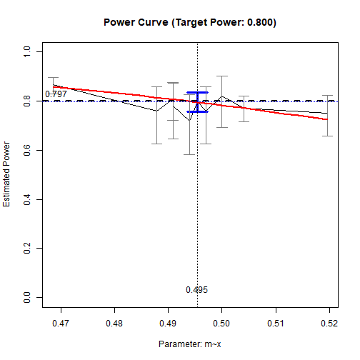
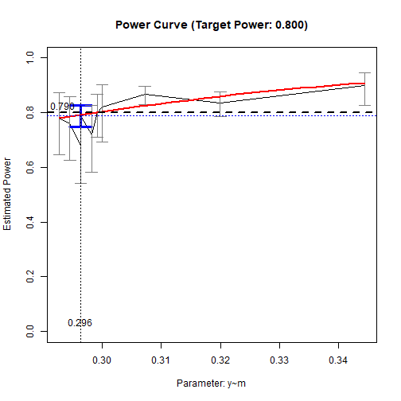

# Introduction

This article is a brief illustration of how
to use `x_from_power()` and `power4test()`
from the package
[power4mome](https://sfcheung.github.io/power4mome/)
to do find by simulation, given the
sample size, the
desired power, as well as some other
factors, the minimum effect
size to be detected with this level of
power (see the note below on "minimum").

The illustration will use an indirect
effect tested by Monte Carlo confidence
interval as an example, though the
procedure is similar for other tests
supported by `power4test()`.

# Prerequisite

Basic knowledge about fitting models
by `lavaan` is required. Readers are
also expected to know how to use
`power4test()`
(see this [get-started](power4mome.html)
for an introduction).

# Scope

This is a brief illustration. More
complicated scenarios and other features
of `x_from_power()` will be described in
other vignettes.

Some sections are repeated from other
vignettes to make this vignette
self-contained.

# Package

This illustration needs the following
package(s):


``` r
library(power4mome)
```

# Workflow

Three functions, along with some methods,
are sufficient for estimating the sample
size, given the desired power, along with
other factors such as the test,
the model, and sample size. This is the
basic workflow:

1.  Specify the model syntax for the
    population model, in `lavaan`
    style, and set the initial
    population values of
    the model parameters.

3.  Call `power4test()` to examine the setup
    and the datasets generated. Repeat
    previous steps until the model is
    specified correctly.

4.  Call `power4test()` again, with the
    test to do specified, using the
    sample size to be examined.

5.  Call `rejection_rates()` to
    compute the power and verify that
    the test is setup correctly.

6.  Call `x_from_power()` to estimated
    the minimum effect size that can be
    detected, given other factors,
    including the sample size to be
    examined and the target power.

# Mediation

Let's consider a simple mediation
model, and the effect of concern is
an indirect effect tested
by Monte Carlo confidence interval.

There is a special consideration regarding
an indirect effect: This effect is
a function of two or more model parameters.
For example, for a simple mediation with
the *a*-path from the predictor to the
mediator, and the *b*-path from the
mediator to the outcome variable, the
indirect effect is *ab*. It has been
found that the power to detect a
particular value of *ab*, say 0.25,
is not the same for all combinations
of *a* and *b*. For example, @kenny_power_2014
found that the required sample size to
have a power of .80 to detect an *ab* of
.0225 can vary from about 450 to as large
as more than 5000, depending on the values
of *both* *a* and *b*.

Therefore, even if we would like to
find the minimum *ab* that can be detected
with a power of .80 given a sample size,
we should still manipulate one parameter
(e.g., *a* or *b*) one at a time.

Two additional notes on the notion
"minimum". First, for simplicity, only
positive population values are considered.
However, there may be cases in which
the population values under consideration
are negative. In these cases, "minimum"
refers to minimum in *magnitude*.

Second, there may be cases in which,
even keeping the values considered
positive, the relation between power
and the parameter being varied is
U-shaped. In these cases, two or more
values of the selected parameters may
have the same target power.
The plot of the relation (described lated)
should be examined to see whether the
solution is likely the minimum value
in the range examined.


This will be illustrated in this vignette.

## Specify the Population Model

This is the model syntax


``` r
mod <-
"
m ~ x
y ~ m + x
"
```

Note that, even if we are going to
test mediation, we do not need to add
any labels or defined any user-parameters.
This will be taken care of by the
test functions, through the use of
the package
[`manymome`](https://sfcheung.github.io/manymome/)
[@cheung_manymome_2024].


## Specify The Population Values {#es_convention}

There are two approaches to do this:
using named vectors or lists, or using
a long string similar to `lavaan`
model syntax. The second approach is
demonstrated below.

Suppose we want to estimate the power
when:

- The path from `x` to `m` are "large"
  in strength.

- The path from `m` to `y` are "medium"
  in strength.

- The path from `x` to `m` are "small"
  in strength.

By default, `power4mome` use this convention
for regression path and correlation:^[
Users can explicitly specify the values
if this convention is not suitable.]

- Small: .10 (or -.10)

- Medium: .30 (or -.30)

- Large: .50 (or -.50)

All these values are for the standardized
solution (the so-called "betas").

The following string denotes the desired
values:


``` r
mod_es <-
"
m ~ x: l
y ~ m: m
y ~ x: s
"
```

Each line starts with a *tag*, which
is the parameter presented in `lavaan`
syntax. The tag ends with a colon, `:`.

After the colon is population value, which
can be:

- A word denoting the value. By default:

    - `s`: Small. (`-s` for small and negative.)

    - `m`: Medium. (`-m` for medium and negative.)

    - `l`: Large. (`-l` for large and negative.)

    - `nil`: Zero.

All regression coefficients and covariances,
if not specified, are set to zero.

## Call `power4test()` to Check the Model


``` r
out <- power4test(nrep = 2,
                  model = mod,
                  pop_es = mod_es,
                  n = 50000,
                  iseed = 1234)
```

These are the arguments used:

- `nrep`: The number of replications.
  In this stage, a small number can
  be used. It is more important to
  have a large sample size than to have
  more replications.

- `model`: The model syntax.

- `pop_es`: The string setting the
  population values.

- `n`: The sample size in each replications.
  In this stage, just for checking the
  model and the data generation, this
  number can be set to a large one unless
  the model is slow to fit when the
  sample size is large.

- `iseed`: If supplied, it is used to
  set the seed for the random number
  generator. It is advised to always set
  this to an arbitrary integer, to make
  the results reproducible.^[The functions
  used are `parallel::clusterSetRNGStream()`
  for parallel processing, and `set.seed()`
  for serial processing.]

The population values can be shown by
print this object:


``` r
print(out,
      data_long = TRUE)
#> 
#> ============================== Model Information ==============================
#> 
#> ====== Model on Factors/Variables ======
#> 
#> m ~ x
#> y ~ m + x
#> 
#> ==== Model on Variables/Indicators ====
#> 
#> m ~ x
#> y ~ m + x
#> 
#> ========== Population Values ==========
#> 
#> Regressions:
#>                    Population
#>   m ~                        
#>     x                 0.500  
#>   y ~                        
#>     m                 0.300  
#>     x                 0.100  
#> 
#> Variances:
#>                    Population
#>    .m                 0.750  
#>    .y                 0.870  
#>     x                 1.000  
#> 
#> (Computing indirect effects for 2 paths ...)
#> 
#> == Population Conditional/Indirect Effect(s) ==
#> 
#> == Indirect Effect(s) ==
#> 
#>               ind
#> x -> m -> y 0.150
#> x -> y      0.100
#> 
#>  - The 'ind' column shows the indirect effect(s).
#>  
#> =============================== Data Information ===============================
#> 
#> Number of Replications:  2 
#> Sample Sizes:  50000 
#> 
#> ======== Descriptive Statistics ========
#> 
#>   vars     n mean sd skew kurtosis se
#> m    1 1e+05 0.00  1 0.01     0.03  0
#> y    2 1e+05 0.01  1 0.01     0.00  0
#> x    3 1e+05 0.00  1 0.01     0.01  0
#> 
#> ============= Parameter Estimates Based on All 2 Samples Combined =============
#> 
#> Total Sample Size: 100000 
#> 
#> ======== Standardized Estimates ========
#> 
#> Variances and error variances omitted.
#> 
#> Regressions:
#>                     est.std
#>   m ~                      
#>     x                 0.500
#>   y ~                      
#>     m                 0.295
#>     x                 0.102
#> 
#> 
#> ============================ Extra Element(s) Found ============================
#> 
#> - fit
#> 
#> ======== Element(s) of the First Dataset ========
#> 
#> ================ <fit> ================
#> 
#> lavaan 0.6-19 ended normally after 1 iteration
#> 
#>   Estimator                                         ML
#>   Optimization method                           NLMINB
#>   Number of model parameters                         5
#> 
#>   Number of observations                         50000
#> 
#> Model Test User Model:
#>                                                       
#>   Test statistic                                 0.000
#>   Degrees of freedom                                 0
```

The argument `data_long = TRUE` is
used to verify the simulation.

The population values for the regression
paths in the section
`Population Values` are what we specified.
So the model is specified correctly.

The section `Descriptive Statistics`, generated
by `psych::describe()`, shows basic
descriptive statistics for the observed
variables. As expected, they have means
close to zero and standard deviations
close to one, because the datasets were
generated using the standardized model.

The section `Parameter Estimates Based on`
shows the parameter estimates when the
population model is fitted to all the
datasets combined. When the total
sample size is large, these estimates
should be close to the population values.

By the default, the population model
will be fitted to each dataset, hence
the section `<fit>`. This section just
verifies that the population can be
fitted

The results show that population model
is the desired one. We can proceed to
the next stage

## Call `power4test()` to Do the Target Test {#med_power}

We can now do the simulation to estimate
power for an initial values of *a* (`m ~ x`)
and *b* (`y ~ m`), given a target sample
size to
verify the test we want to do.
A large number of datasets (e.g., 500)
of the target sample size and initial
population values of the model are to be generated,
and then the target test will be conducted
in each of these datasets.

Suppose we start with *a* and hold *b*
to *medium* (.30) and direct effect (`y ~ x`)
to *small* (.10), with a sample size
of 100, and would like to estimate the
power of using Monte Carlo confidence interval
to test the indirect effect from `x` to
`y` through `m`, when *a* is also *medium*.
This is the call, based on the previous
one:


``` r
out <- power4test(nrep = 50,
                  model = mod,
                  pop_es = mod_es,
                  n = 100,
                  R = 2000,
                  ci_type = "mc",
                  test_fun = test_indirect_effect,
                  test_args = list(x = "x",
                                   m = "m",
                                   y = "y",
                                   mc_ci = TRUE),
                  iseed = 1234,
                  parallel = TRUE)
```

If our goal is to find a value of a
parameter, *a* in this case, for
a specific level of power and sample size,
with sufficient
precision, we do not need a large number
of replications (`nrep`) in this stage.
We can use as few as 50. We can set the
target number of replications when
calling the function
`x_from_power()`. It will successively
increase `nrep` in the search, and
accepts a solution based on the target
number of replications.

These are the new arguments used:

- `R`: The number of replications used
  to generate the Monte Carlo simulated
  estimates, 2000 in this example.

- `ci_type`: The method used to
  generate estimates. Support Monte
  Carlo (`"mc"`) and nonparametric
  bootstrapping (`"boot"`).^[They
  are implemented by `manymome::do_mc()`
  and `manymome::do_boot()`, respectively.]
  Although bootstrapping is usually used
  to test an indirect effect, it is very
  slow to do `R` bootstrapping in `nrep`
  datasets (the model will be fitted
  `R * nrep` times). Therefore, it is
  preferable to use Monte Carlo to do
  the initial estimation.

- `test_fun`: The function to be used
  to do the test for each replication.
  Any function following a specific
  requirement can be used, and
  `power4mome` comes with several
  built-in function for some tests.
  The function `test_indirect_effect()`
  is used to test an indirect effect
  in the model.

- `test_args`: A named list of arguments
  to be supplied to `test_fun`.
  For `test_indirect_effect()`, it is
  a named list specifying the predictor
  (`x`), the mediator(s) (`m`), and
  the outcome (`y`). A path with any
  number of mediators can be supported.
  Please refer to the help page of
  `test_indirect_effect()`.^[The test
  is implemented by `manymome::indirect()`.]

- `parallel`: If the test to be conducted
  is slow, which is the case for
  test done by Monte Carlo or nonparametric
  bootstrapping confidence interval,
  it is advised to enable parallel
  processing by setting `parallel` to
  `TRUE`.^[The number of cores is determined
  automatically but can be set directly
  by the `ncores` argument.]

Note that the simulation can take some
time to run (3 to 4 minutes using 20 cores).
Progress will be printed when run in an
interactive session.

This is the default printout:


``` r
print(out,
      test_long = TRUE)
#> 
#> ============================== Model Information ==============================
#> 
#> ====== Model on Factors/Variables ======
#> 
#> m ~ x
#> y ~ m + x
#> 
#> ==== Model on Variables/Indicators ====
#> 
#> m ~ x
#> y ~ m + x
#> 
#> ========== Population Values ==========
#> 
#> Regressions:
#>                    Population
#>   m ~                        
#>     x                 0.500  
#>   y ~                        
#>     m                 0.300  
#>     x                 0.100  
#> 
#> Variances:
#>                    Population
#>    .m                 0.750  
#>    .y                 0.870  
#>     x                 1.000  
#> 
#> (Computing indirect effects for 2 paths ...)
#> 
#> == Population Conditional/Indirect Effect(s) ==
#> 
#> == Indirect Effect(s) ==
#> 
#>               ind
#> x -> m -> y 0.150
#> x -> y      0.100
#> 
#>  - The 'ind' column shows the indirect effect(s).
#>  
#> =============================== Data Information ===============================
#> 
#> Number of Replications:  50 
#> Sample Sizes:  100 
#> 
#> Call print with 'data_long = TRUE' for further information.
#> 
#> ============================ Extra Element(s) Found ============================
#> 
#> - fit
#> - mc_out
#> 
#> ======== Element(s) of the First Dataset ========
#> 
#> ================ <fit> ================
#> 
#> lavaan 0.6-19 ended normally after 1 iteration
#> 
#>   Estimator                                         ML
#>   Optimization method                           NLMINB
#>   Number of model parameters                         5
#> 
#>   Number of observations                           100
#> 
#> Model Test User Model:
#>                                                       
#>   Test statistic                                 0.000
#>   Degrees of freedom                                 0
#> 
#> =============== <mc_out> ===============
#> 
#> 
#> == A 'mc_out' class object ==
#> 
#> Number of Monte Carlo replications: 2000 
#> 
#> 
#> ====================== <test_indirect: x->m->y> ======================
#> 
#> Mean(s) across replication:
#>    est  cilo  cihi   sig
#>  0.145 0.036 0.273 0.820
#> 
#> - The value 'sig' is the rejection rate.
#> - If the null hypothesis is false, this is the power.
#> - Number of valid replications for rejection rate: 50 
#> - Proportion of valid replications for rejection rate: 1.000
```

The argument `test_long = TRUE` is added
to verify the test we set up.

As shown above, the setup is correct.
We can now call `x_from_power()` to
do the search.

## Call `x_from_power()` to Estimate the Minimum Value of *a*

This is a simplified description of
how `x_from_power()` works:

- It rerun the simulation and test
  in an output of `power4test()`
  for different values of the selected
  parameter, and then
  estimate the power levels for each
  of them.

- It will try to estimate the relation
  between the power and the value of the
  selected parameter,
  and select the next value(s) to
  try.

- It will adopt a value as the
  solution if (a) the confidence interval
  of the estimated power includes the
  target power (default level 95%), and (b)
  the number of replications used
  in the estimation is the target one
  (to ensure the standard error is of
  the desired level).


``` r
out_es_a <- x_from_power(out,
                         x = "es",
                         pop_es_name = "m~x",
                         target_power = .80,
                         final_nrep = 400,
                         seed = 4567)
```

The argument used above:

- `x`: What we want to find, `"es"`
  stands for effect sizes.

- `pop_es_name`: The name of the parameter
  with its value varied. The name should be
  the one used by `lavaan` when using
  `coef()`. See `power4test_by_es()`
  for setting the name.

- `target_power`: The target power.
  Default is .80.

- `final_nrep`: The number of replications
  desired in the solution. When using
  the normal approximation to form the
  95% confidence interval for a sample
  proportion (power in this case). For
  `nrep = 400`, the 95% confidence limits
  for a power of .80 are about .04 below
  and above .80. This should be precise
  enough for estimating the sample size
  required.

- `seed`: To make the search reproducible,
  if possible, set this seed to an
  integer.

## Examine the Output

This is the basic output:


``` r
out_es_a
#> Call:
#> x_from_power(object = out, x = "es", pop_es_name = "m~x", target_power = 0.8, 
#>     final_nrep = 400, seed = 4567)
#> 
#>                          Setting
#> Predictor(x):        Effect Size
#> Parameter:                   m~x
#> goal:                     ci_hit
#> what:                      point
#> algorithm:           power_curve
#> Level of confidence:      95.00%
#> Target Power:              0.800
#> 
#> - Final Value of'm~x': 0.494
#> 
#> - Final Estimated Power (CI): 0.802 [0.763, 0.842]
#> 
#> Call `summary()` for detailed results.
```

The estimated value of *a* to have a power
close to .80 power to detect the indirect effect
(*ab*, with *b* equal to .30 in the population)
by Monte Carlo interval is
0.494. The estimated power
based on simulation is
0.802.

That is, given the model and a sample
size of 100, if the population value
of *b* is medium (.30), the test has an
approximate power of .80 when the population
value of *a* is about
0.494.
The corresponding indirect effect is
about
0.148

To obtain a more detailed results for
the search, we can use the `summary()`
method:


``` r
summary(out_es_a)
#> 
#> ====== x_from_power Results ======
#> 
#> Call:
#> x_from_power(object = out, x = "es", pop_es_name = "m~x", target_power = 0.8, 
#>     final_nrep = 400, seed = 4567)
#> 
#> Predictor (x): Effect Size 
#> Parameter Name (pop_es_name): m~x 
#> 
#> - Target Power: 0.800 
#> - Goal: Find 'x' with the confidence interval of the estimated power enclosing the target
#>   power.
#> 
#> === Major Results ===
#> 
#> - Final Value (m~x): 0.494
#> 
#> - Final Estimated Power: 0.802 
#> - Confidence Interval: [0.763; 0.842]
#> - Level of confidence: 95.0%
#> - Based on 400 replications.
#> 
#> === Technical Information ===
#> 
#> - Algorithm: power_curve 
#> - The range of values explored: 0.488 to 0.519 
#> - Time spent in the search: 1.245 mins 
#> - The final crude model for the power-predictor relation:
#> 
#> Model Type: Logistic Regression 
#> 
#> Call:
#> power_curve(object = by_x_i, formula = power_model, start = start, 
#>     lower_bound = lower_bound, upper_bound = upper_bound, nls_args = nls_args, 
#>     nls_control = nls_control, verbose = progress, models = c("glm", 
#>         "lm"))
#> 
#> Predictor: es (Effect Size)
#> 
#> Model:
#> 
#> Call:  stats::glm(formula = reject ~ x, family = "binomial", data = reject1)
#> 
#> Coefficients:
#> (Intercept)            x  
#>      -7.903       18.428  
#> 
#> Degrees of Freedom: 249 Total (i.e. Null);  248 Residual
#> Null Deviance:	    270.8 
#> Residual Deviance: 270.6 	AIC: 274.6
#> 
#> - Detailed Results:
#> 
#> [test]: test_indirect: x->m->y 
#> [test_label]: Test 
#>    par    es   est   p.v reject r.cilo r.cihi
#> 1  m~x 0.488 0.151 1.000  0.760  0.642  0.878
#> 2  m~x 0.491 0.147 1.000  0.780  0.665  0.895
#> 3  m~x 0.492 0.150 1.000  0.790  0.710  0.870
#> 4  m~x 0.494 0.140 1.000  0.720  0.596  0.844
#> 5  m~x 0.494 0.148 1.000  0.802  0.763  0.842
#> 6  m~x 0.497 0.150 1.000  0.760  0.642  0.878
#> 7  m~x 0.500 0.145 1.000  0.820  0.714  0.926
#> 8  m~x 0.501 0.150 1.000  0.767  0.726  0.809
#> 9  m~x 0.504 0.150 1.000  0.772  0.720  0.824
#> 10 m~x 0.519 0.155 1.000  0.740  0.654  0.826
#> Notes:
#> - par: The parameter being varied.
#> - es: The population value of 'par' in a trial.
#> - p.v: The proportion of valid replications.
#> - est: The mean of the estimates in a test across replications.
#> - reject: The proportion of 'significant' replications, that is, the rejection rate. If
#>   the null hypothesis is true, this is the Type I error rate. If the null hypothesis is
#>   false, this is the power.
#> - r.cilo,r.cihi: The confidence interval of the rejection rate, based on normal
#>   approximation.
#> - Refer to the tests for the meanings of other columns.
```

It reports the 95% confidence interval
of the estimated power,
[0.763; 0.842].

It also reports major technical
information regarding
the search, such as the range of
values tried, the time spent,
and the table with all the values
examined, along with the estimated
power levels and confidence intervals.

It also prints the model, the "power curve",
used to estimate
the relation between the power and the
value of the selected parameter. Note that this is only
a crude model intended only for the
values examined. It is
not intended to estimate power for
values outside the range studied.

Even though the model is a crude one,
it can still give a rough idea about
the relation. A simple plot can be
requested by `plot()`:


``` r
plot(out_es_a)
```

<div class="figure" style="text-align: center">

<p class="caption">The Power Curve</p>
</div>

The black line is the plot of the
sample sizes studied, along with the
estimated power levels and the 95%
confidence intervals. The intervals
vary in width because of different number
of replications.

The red line is the plot based on the
model (a logistic model in this case),
along the range of sample sizes examined.

## Finding the Minimum Value of *b* When Holding *a* to .30

We can also find the minimum value of
*b* when holding *a* to medium (.30).
Just call `x_from_power()` again,
setting `pop_es_name` to `"y~m"`.


``` r
out_es_b <- x_from_power(out,
                         x = "es",
                         pop_es_name = "y~m",
                         target_power = .80,
                         final_nrep = 400,
                         seed = 4567)
```

The estimated value of *b* to have a power
close to .80 power to detect the indirect effect
(*ab*, with *a* equal to .30 in the population)
by Monte Carlo interval is
0.307. The estimated power
based on simulation is
0.823.

That is, given the model and a sample
size of 100, if the population value
of *a* is medium (.30), the test has an
approximate power of .80 when the population
value of *b* is about
0.307.
The corresponding indirect effect is
about
0.092,
slightly lower than the indirect effect
when *b* is hold to .30.

These are the detailed results for
the search when *b* is varied:


``` r
summary(out_es_b)
#> 
#> ====== x_from_power Results ======
#> 
#> Call:
#> x_from_power(object = out, x = "es", pop_es_name = "y~m", target_power = 0.8, 
#>     final_nrep = 400, seed = 4567)
#> 
#> Predictor (x): Effect Size 
#> Parameter Name (pop_es_name): y~m 
#> 
#> - Target Power: 0.800 
#> - Goal: Find 'x' with the confidence interval of the estimated power enclosing the target
#>   power.
#> 
#> === Major Results ===
#> 
#> - Final Value (y~m): 0.307
#> 
#> - Final Estimated Power: 0.823 
#> - Confidence Interval: [0.785; 0.860]
#> - Level of confidence: 95.0%
#> - Based on 400 replications.
#> 
#> === Technical Information ===
#> 
#> - Algorithm: power_curve 
#> - The range of values explored: 0.293 to 0.343 
#> - Time spent in the search: 1.228 mins 
#> - The final crude model for the power-predictor relation:
#> 
#> Model Type: Logistic Regression 
#> 
#> Call:
#> power_curve(object = by_x_i, formula = power_model, start = start, 
#>     lower_bound = lower_bound, upper_bound = upper_bound, nls_args = nls_args, 
#>     nls_control = nls_control, verbose = progress, models = c("glm", 
#>         "lm"))
#> 
#> Predictor: es (Effect Size)
#> 
#> Model:
#> 
#> Call:  stats::glm(formula = reject ~ x, family = "binomial", data = reject1)
#> 
#> Coefficients:
#> (Intercept)            x  
#>      -2.366       11.727  
#> 
#> Degrees of Freedom: 249 Total (i.e. Null);  248 Residual
#> Null Deviance:	    280.1 
#> Residual Deviance: 280 	AIC: 284
#> 
#> - Detailed Results:
#> 
#> [test]: test_indirect: x->m->y 
#> [test_label]: Test 
#>    par    es   est   p.v reject r.cilo r.cihi
#> 1  y~m 0.293 0.151 1.000  0.780  0.665  0.895
#> 2  y~m 0.295 0.147 1.000  0.760  0.642  0.878
#> 3  y~m 0.296 0.140 1.000  0.680  0.551  0.809
#> 4  y~m 0.298 0.150 1.000  0.720  0.596  0.844
#> 5  y~m 0.300 0.145 1.000  0.820  0.714  0.926
#> 6  y~m 0.300 0.153 1.000  0.780  0.699  0.861
#> 7  y~m 0.307 0.153 1.000  0.823  0.785  0.860
#> 8  y~m 0.317 0.158 1.000  0.820  0.782  0.858
#> 9  y~m 0.320 0.158 1.000  0.836  0.790  0.882
#> 10 y~m 0.343 0.171 1.000  0.870  0.804  0.936
#> Notes:
#> - par: The parameter being varied.
#> - es: The population value of 'par' in a trial.
#> - p.v: The proportion of valid replications.
#> - est: The mean of the estimates in a test across replications.
#> - reject: The proportion of 'significant' replications, that is, the rejection rate. If
#>   the null hypothesis is true, this is the Type I error rate. If the null hypothesis is
#>   false, this is the power.
#> - r.cilo,r.cihi: The confidence interval of the rejection rate, based on normal
#>   approximation.
#> - Refer to the tests for the meanings of other columns.
```

It reports the 95% confidence interval
of the estimated power,
[0.785; 0.860].


``` r
plot(out_es_b)
```

<div class="figure" style="text-align: center">

<p class="caption">The Power Curve (b varied)</p>
</div>

# Advanced Features

This brief illustration only covers
basic features of `x_from_power()`.
There are other ways to customize the
search, such as the range of values
of the parameter to examine (the default is 0 to 0.7),
the level of confidence for the
confidence interval, and the number of
trials (10 by default). Please refer
to the help page of `x_from_power()`
for these and other options.


# References

