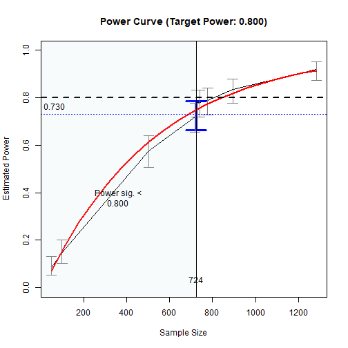
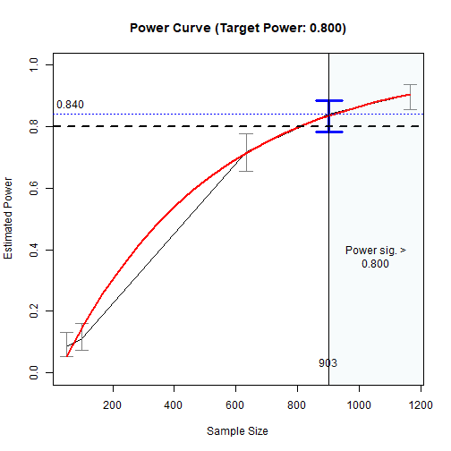
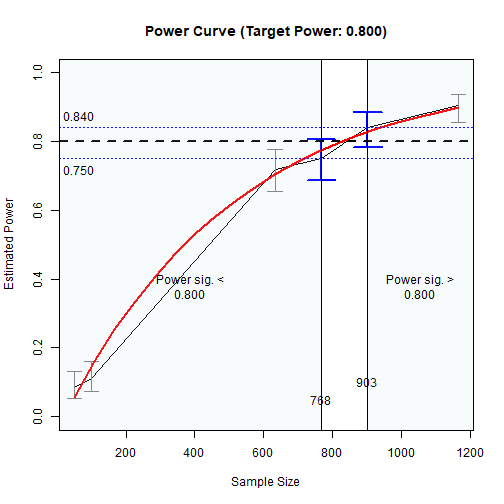

# NOTE

This article is for internal testing
of the printout.


``` r
library(power4mome)
options(power4mome.bz = TRUE)
```


``` r
mod <-
"
m ~ x
y ~ m + x
"
```


``` r
mod_es <-
"
m ~ x: m
y ~ m: s
y ~ x: s
"
```


``` r
out <- power4test(nrep = 2,
                  model = mod,
                  pop_es = mod_es,
                  n = 50000,
                  iseed = 1234)
```


``` r
print(out,
      data_long = TRUE)
#> 
#> ====================== Model Information ======================
#> 
#> == Model on Factors/Variables ==
#> 
#> m ~ x
#> y ~ m + x
#> 
#> == Model on Variables/Indicators ==
#> 
#> m ~ x
#> y ~ m + x
#> 
#> ====== Population Values ======
#> 
#> Regressions:
#>                    Population
#>   m ~                        
#>     x                 0.300  
#>   y ~                        
#>     m                 0.100  
#>     x                 0.100  
#> 
#> Variances:
#>                    Population
#>    .m                 0.910  
#>    .y                 0.974  
#>     x                 1.000  
#> 
#> (Computing indirect effects for 2 paths ...)
#> 
#> == Population Conditional/Indirect Effect(s) ==
#> 
#> == Indirect Effect(s) ==
#> 
#>               ind
#> x -> m -> y 0.030
#> x -> y      0.100
#> 
#>  - The 'ind' column shows the indirect effect(s).
#>  
#> ======================= Data Information =======================
#> 
#> Number of Replications:  2 
#> Sample Sizes:  50000 
#> 
#> ==== Descriptive Statistics ====
#> 
#>   vars     n mean sd skew kurtosis se
#> m    1 1e+05 0.00  1 0.01     0.03  0
#> y    2 1e+05 0.01  1 0.01     0.00  0
#> x    3 1e+05 0.00  1 0.01     0.01  0
#> 
#> ===== Parameter Estimates Based on All 2 Samples Combined =====
#> 
#> Total Sample Size: 100000 
#> 
#> ==== Standardized Estimates ====
#> 
#> Variances and error variances omitted.
#> 
#> Regressions:
#>                     est.std
#>   m ~                      
#>     x                 0.301
#>   y ~                      
#>     m                 0.095
#>     x                 0.101
#> 
#> 
#> ==================== Extra Element(s) Found ====================
#> 
#> - fit
#> 
#> === Element(s) of the First Dataset ===
#> 
#> ============ <fit> ============
#> 
#> lavaan 0.6-21 ended normally after 1 iteration
#> 
#>   Estimator                                         ML
#>   Optimization method                           NLMINB
#>   Number of model parameters                         5
#> 
#>   Number of observations                         50000
#> 
#> Model Test User Model:
#>                                                       
#>   Test statistic                                 0.000
#>   Degrees of freedom                                 0
```


``` r
out <- power4test(nrep = 200,
                  model = mod,
                  pop_es = mod_es,
                  n = 50,
                  R = 1000,
                  ci_type = "mc",
                  test_fun = test_indirect_effect,
                  test_args = list(x = "x",
                                   m = "m",
                                   y = "y",
                                   mc_ci = TRUE),
                  iseed = 2345,
                  parallel = TRUE)
```


``` r
print(out,
      test_long = TRUE)
#> 
#> ====================== Model Information ======================
#> 
#> == Model on Factors/Variables ==
#> 
#> m ~ x
#> y ~ m + x
#> 
#> == Model on Variables/Indicators ==
#> 
#> m ~ x
#> y ~ m + x
#> 
#> ====== Population Values ======
#> 
#> Regressions:
#>                    Population
#>   m ~                        
#>     x                 0.300  
#>   y ~                        
#>     m                 0.100  
#>     x                 0.100  
#> 
#> Variances:
#>                    Population
#>    .m                 0.910  
#>    .y                 0.974  
#>     x                 1.000  
#> 
#> (Computing indirect effects for 2 paths ...)
#> 
#> == Population Conditional/Indirect Effect(s) ==
#> 
#> == Indirect Effect(s) ==
#> 
#>               ind
#> x -> m -> y 0.030
#> x -> y      0.100
#> 
#>  - The 'ind' column shows the indirect effect(s).
#>  
#> ======================= Data Information =======================
#> 
#> Number of Replications:  200 
#> Sample Sizes:  50 
#> 
#> Call print with 'data_long = TRUE' for further information.
#> 
#> ==================== Extra Element(s) Found ====================
#> 
#> - fit
#> - mc_out
#> 
#> === Element(s) of the First Dataset ===
#> 
#> ============ <fit> ============
#> 
#> lavaan 0.6-21 ended normally after 1 iteration
#> 
#>   Estimator                                         ML
#>   Optimization method                           NLMINB
#>   Number of model parameters                         5
#> 
#>   Number of observations                            50
#> 
#> Model Test User Model:
#>                                                       
#>   Test statistic                                 0.000
#>   Degrees of freedom                                 0
#> 
#> =========== <mc_out> ===========
#> 
#> 
#> == A 'mc_out' class object ==
#> 
#> Number of Monte Carlo replications: 1000 
#> 
#> 
#> =============== <test_indirect: x->m->y> ===============
#> 
#> Mean(s) across replication:
#>    est   cilo  cihi   sig pvalue
#>  0.032 -0.075 0.155 0.085  0.463
#> 
#> - The value 'sig' is the rejection rate.
#> - If the null hypothesis is false, this is the power.
#> - Number of valid replications for rejection rate: 200 
#> - Proportion of valid replications for rejection rate: 1.000
```


``` r
out_n <- n_from_power(out,
                      what = "ub",
                      seed = 4567)
#> 
#> --- Setting ---
#> 
#> Algorithm:  bisection 
#> Goal:  close_enough 
#> What:  ub   (Upper bound of the confidence interval) 
#> 
#> --- Progress  ---
#> 
#> - Set 'progress = FALSE' to suppress displaying the progress.
#> - Set 'simulation progress = FALSE' to suppress displaying the progress
#>   in the simulation.
#> 
#> Initial interval: [50, 100] 
#> 
#> 
#> Do the simulation for the upper bound:
#> 
#> Try x = 100 
#> 
#> Updating the simulation for sample size: 100 
#> Re-simulate the data:
#> Fit the model(s):
#> Generate Monte Carlo estimates:
#> Update the test(s):
#> Update test_indirect: x->m->y :
#> 
#> Estimated power at 100: 0.145, 95.0% confidence interval: [0.103,0.200]
#> 
#> Initial interval: [50, 100] 
#> 
#> - Rejection Rates:
#> [test]: test_indirect: x->m->y 
#> [test_label]: Test 
#>     n   est   p.v reject r.cilo r.cihi
#> 1  50 0.032 1.000  0.085  0.054  0.132
#> 2 100 0.030 1.000  0.145  0.103  0.200
#> 
#> 
#> == Enter extending interval ...
#> Current interval: [50, 100] 
#> Interval below the solution. Extend the upper bound ...
#> 
#> Try x = 504 
#> 
#> Updating the simulation for sample size: 504 
#> Re-simulate the data:
#> Fit the model(s):
#> Generate Monte Carlo estimates:
#> Update the test(s):
#> Update test_indirect: x->m->y :
#> 
#> Estimated power at 504: 0.575, 95.0% confidence interval: [0.506,0.641]
#> 
#> 
#> (Extending the interval) Iteration: 1 
#> 
#> New interval: [100, 504] 
#> 
#> Try x = 1284 
#> 
#> Updating the simulation for sample size: 1284 
#> Re-simulate the data:
#> Fit the model(s):
#> Generate Monte Carlo estimates:
#> Update the test(s):
#> Update test_indirect: x->m->y :
#> 
#> Estimated power at 1284: 0.920, 95.0% confidence interval: [0.874,0.950]
#> 
#> 
#> (Extending the interval) Iteration: 2 
#> 
#> New interval: [504, 1284] 
#> Interval OK.
#> Final extended interval: [504, 1284] 
#> == Exit extending interval ...
#> 
#> Iteration # 1 
#> 
#> Try x = 894 
#> 
#> Updating the simulation for sample size: 894 
#> Re-simulate the data:
#> Fit the model(s):
#> Generate Monte Carlo estimates:
#> Update the test(s):
#> Update test_indirect: x->m->y :
#> 
#> Estimated power at 894: 0.835, 95.0% confidence interval: [0.777,0.880]
#> - Rejection Rates:
#> [test]: test_indirect: x->m->y 
#> [test_label]: Test 
#>      n   est   p.v reject r.cilo r.cihi
#> 1   50 0.032 1.000  0.085  0.054  0.132
#> 2  100 0.030 1.000  0.145  0.103  0.200
#> 3  504 0.030 1.000  0.575  0.506  0.641
#> 4  894 0.030 1.000  0.835  0.777  0.880
#> 5 1284 0.029 1.000  0.920  0.874  0.950
#> 
#> New interval: [504, 894] 
#> Power curve used to find the next x ...
#> Updated x: 719 
#> 
#> Iteration # 2 
#> 
#> Try x = 719 
#> 
#> Updating the simulation for sample size: 719 
#> Re-simulate the data:
#> Fit the model(s):
#> Generate Monte Carlo estimates:
#> Update the test(s):
#> Update test_indirect: x->m->y :
#> 
#> Estimated power at 719: 0.720, 95.0% confidence interval: [0.654,0.778]
#> - Rejection Rates:
#> [test]: test_indirect: x->m->y 
#> [test_label]: Test 
#>      n   est   p.v reject r.cilo r.cihi
#> 1   50 0.032 1.000  0.085  0.054  0.132
#> 2  100 0.030 1.000  0.145  0.103  0.200
#> 3  504 0.030 1.000  0.575  0.506  0.641
#> 4  719 0.030 1.000  0.720  0.654  0.778
#> 5  894 0.030 1.000  0.835  0.777  0.880
#> 6 1284 0.029 1.000  0.920  0.874  0.950
#> 
#> New interval: [719, 894] 
#> Power curve used to find the next x ...
#> Updated x: 778 
#> 
#> Iteration # 3 
#> 
#> Try x = 778 
#> 
#> Updating the simulation for sample size: 778 
#> Re-simulate the data:
#> Fit the model(s):
#> Generate Monte Carlo estimates:
#> Update the test(s):
#> Update test_indirect: x->m->y :
#> 
#> Estimated power at 778: 0.790, 95.0% confidence interval: [0.728,0.841]
#> - Rejection Rates:
#> [test]: test_indirect: x->m->y 
#> [test_label]: Test 
#>      n   est   p.v reject r.cilo r.cihi
#> 1   50 0.032 1.000  0.085  0.054  0.132
#> 2  100 0.030 1.000  0.145  0.103  0.200
#> 3  504 0.030 1.000  0.575  0.506  0.641
#> 4  719 0.030 1.000  0.720  0.654  0.778
#> 5  778 0.031 1.000  0.790  0.728  0.841
#> 6  894 0.030 1.000  0.835  0.777  0.880
#> 7 1284 0.029 1.000  0.920  0.874  0.950
#> 
#> New interval: [719, 778] 
#> Power curve used to find the next x ...
#> Updated x: 741 
#> 
#> Iteration # 4 
#> 
#> Try x = 741 
#> 
#> Updating the simulation for sample size: 741 
#> Re-simulate the data:
#> Fit the model(s):
#> Generate Monte Carlo estimates:
#> Update the test(s):
#> Update test_indirect: x->m->y :
#> 
#> Estimated power at 741: 0.780, 95.0% confidence interval: [0.718,0.832]
#> - Rejection Rates:
#> [test]: test_indirect: x->m->y 
#> [test_label]: Test 
#>      n   est   p.v reject r.cilo r.cihi
#> 1   50 0.032 1.000  0.085  0.054  0.132
#> 2  100 0.030 1.000  0.145  0.103  0.200
#> 3  504 0.030 1.000  0.575  0.506  0.641
#> 4  719 0.030 1.000  0.720  0.654  0.778
#> 5  741 0.032 1.000  0.780  0.718  0.832
#> 6  778 0.031 1.000  0.790  0.728  0.841
#> 7  894 0.030 1.000  0.835  0.777  0.880
#> 8 1284 0.029 1.000  0.920  0.874  0.950
#> 
#> New interval: [719, 741] 
#> Power curve used to find the next x ...
#> Updated x: 726 
#> 
#> Iteration # 5 
#> 
#> Try x = 726 
#> 
#> Updating the simulation for sample size: 726 
#> Re-simulate the data:
#> Fit the model(s):
#> Generate Monte Carlo estimates:
#> Update the test(s):
#> Update test_indirect: x->m->y :
#> 
#> Estimated power at 726: 0.780, 95.0% confidence interval: [0.718,0.832]
#> - Rejection Rates:
#> [test]: test_indirect: x->m->y 
#> [test_label]: Test 
#>      n   est   p.v reject r.cilo r.cihi
#> 1   50 0.032 1.000  0.085  0.054  0.132
#> 2  100 0.030 1.000  0.145  0.103  0.200
#> 3  504 0.030 1.000  0.575  0.506  0.641
#> 4  719 0.030 1.000  0.720  0.654  0.778
#> 5  726 0.031 1.000  0.780  0.718  0.832
#> 6  741 0.032 1.000  0.780  0.718  0.832
#> 7  778 0.031 1.000  0.790  0.728  0.841
#> 8  894 0.030 1.000  0.835  0.777  0.880
#> 9 1284 0.029 1.000  0.920  0.874  0.950
#> 
#> New interval: [719, 726] 
#> Power curve used to find the next x ...
#> Updated x: 724 
#> 
#> Iteration # 6 
#> 
#> Try x = 724 
#> 
#> Updating the simulation for sample size: 724 
#> Re-simulate the data:
#> Fit the model(s):
#> Generate Monte Carlo estimates:
#> Update the test(s):
#> Update test_indirect: x->m->y :
#> 
#> Estimated power at 724: 0.730, 95.0% confidence interval: [0.665,0.787]
#> - Rejection Rates:
#> [test]: test_indirect: x->m->y 
#> [test_label]: Test 
#>       n   est   p.v reject r.cilo r.cihi
#> 1    50 0.032 1.000  0.085  0.054  0.132
#> 2   100 0.030 1.000  0.145  0.103  0.200
#> 3   504 0.030 1.000  0.575  0.506  0.641
#> 4   719 0.030 1.000  0.720  0.654  0.778
#> 5   724 0.031 1.000  0.730  0.665  0.787
#> 6   726 0.031 1.000  0.780  0.718  0.832
#> 7   741 0.032 1.000  0.780  0.718  0.832
#> 8   778 0.031 1.000  0.790  0.728  0.841
#> 9   894 0.030 1.000  0.835  0.777  0.880
#> 10 1284 0.029 1.000  0.920  0.874  0.950
#> 
#> Solution found.
#> 
#> ========== Final Stage ==========
#> 
#> - Start at 2026-02-28 10:45:49 
#> - Rejection Rates:
#> 
#> [test]: test_indirect: x->m->y 
#> [test_label]: Test 
#>       n   est   p.v reject r.cilo r.cihi
#> 1    50 0.032 1.000  0.085  0.054  0.132
#> 2   100 0.030 1.000  0.145  0.103  0.200
#> 3   504 0.030 1.000  0.575  0.506  0.641
#> 4   719 0.030 1.000  0.720  0.654  0.778
#> 5   724 0.031 1.000  0.730  0.665  0.787
#> 6   726 0.031 1.000  0.780  0.718  0.832
#> 7   741 0.032 1.000  0.780  0.718  0.832
#> 8   778 0.031 1.000  0.790  0.728  0.841
#> 9   894 0.030 1.000  0.835  0.777  0.880
#> 10 1284 0.029 1.000  0.920  0.874  0.950
#> Notes:
#> - n: The sample size in a trial.
#> - p.v: The proportion of valid replications.
#> - est: The mean of the estimates in a test across replications.
#> - reject: The proportion of 'significant' replications, that is, the
#>   rejection rate. If the null hypothesis is true, this is the Type I
#>   error rate. If the null hypothesis is false, this is the power.
#> - r.cilo,r.cihi: The confidence interval of the rejection rate, based
#>   on Wilson's (1927) method.
#> - Refer to the tests for the meanings of other columns.
#> 
#> - Estimated Power Curve:
#> 
#> Call:
#> power_curve(object = by_x_1, formula = power_model, start = power_curve_start, 
#>     lower_bound = lower_bound, upper_bound = upper_bound, nls_args = nls_args, 
#>     nls_control = nls_control, verbose = progress)
#> 
#> Predictor: n (Sample Size)
#> 
#> Model:
#> Nonlinear regression model
#>   model: reject ~ 1 - I(exp((a - x)/b))
#>    data: "(Omitted)"
#>     a     b 
#>  13.0 515.3 
#>  residual sum-of-squares: 0.9911
#> 
#> Algorithm "port", convergence message: relative convergence (4)
#> 
#> 
#> - Final Value: 724 
#> 
#> - Final Estimated Power: 0.7300 
#> - Confidence Interval: [0.6646; 0.7868]
#> - CI Level: 95.00%
```


``` r
out_n
#> Call:
#> power4mome::x_from_power(object = out, x = "n", what = "ub", 
#>     goal = "close_enough", final_nrep = 200, final_R = 1000, 
#>     seed = 4567)
#> 
#>                           Setting
#> Predictor(x):         Sample Size
#> Parameter:                    N/A
#> goal:                close_enough
#> what:                          ub
#> algorithm:              bisection
#> Level of confidence:       95.00%
#> Target Power:               0.800
#> 
#> - Final Value of Sample Size (n): 724
#> 
#> - Final Estimated Power (CI): 0.730 [0.665, 0.787]
#> 
#> Call `summary()` for detailed results.
```


``` r
summary(out_n)
#> 
#> ====== x_from_power Results ======
#> 
#> Call:
#> x_from_power(object = out, x = "n", what = "ub", goal = "close_enough", 
#>     final_nrep = 200, final_R = 1000, seed = 4567)
#> 
#> Predictor (x): Sample Size 
#> 
#> - Target Power: 0.800 
#> - Goal: Find 'x' with estimated upper confidence bound close enough to
#>   the target power.
#> 
#> === Major Results ===
#> 
#> - Final Value (Sample Size): 724
#> 
#> - Final Estimated Power: 0.730 
#> - Confidence Interval: [0.665; 0.787]
#> - Level of confidence: 95.0%
#> - Based on 200 replications.
#> 
#> === Technical Information ===
#> 
#> - Algorithm: bisection 
#> - Tolerance for 'close enough': Within 0.02000 of 0.800 
#> - The range of values explored: 100 to 894 
#> - Time spent in the search: 1.053 mins 
#> - The final crude model for the power-predictor relation:
#> 
#> Model Type: Nonlinear Regression Model 
#> 
#> Call:
#> power_curve(object = by_x_1, formula = power_model, start = power_curve_start, 
#>     lower_bound = lower_bound, upper_bound = upper_bound, nls_args = nls_args, 
#>     nls_control = nls_control, verbose = progress)
#> 
#> Predictor: n (Sample Size)
#> 
#> Model:
#> Nonlinear regression model
#>   model: reject ~ 1 - I(exp((a - x)/b))
#>    data: "(Omitted)"
#>     a     b 
#>  13.0 515.3 
#>  residual sum-of-squares: 0.9911
#> 
#> Algorithm "port", convergence message: relative convergence (4)
#> 
#> - Detailed Results:
#> 
#> [test]: test_indirect: x->m->y 
#> [test_label]: Test 
#>       n   est   p.v reject r.cilo r.cihi
#> 1    50 0.032 1.000  0.085  0.054  0.132
#> 2   100 0.030 1.000  0.145  0.103  0.200
#> 3   504 0.030 1.000  0.575  0.506  0.641
#> 4   719 0.030 1.000  0.720  0.654  0.778
#> 5   724 0.031 1.000  0.730  0.665  0.787
#> 6   726 0.031 1.000  0.780  0.718  0.832
#> 7   741 0.032 1.000  0.780  0.718  0.832
#> 8   778 0.031 1.000  0.790  0.728  0.841
#> 9   894 0.030 1.000  0.835  0.777  0.880
#> 10 1284 0.029 1.000  0.920  0.874  0.950
#> Notes:
#> - n: The sample size in a trial.
#> - p.v: The proportion of valid replications.
#> - est: The mean of the estimates in a test across replications.
#> - reject: The proportion of 'significant' replications, that is, the
#>   rejection rate. If the null hypothesis is true, this is the Type I
#>   error rate. If the null hypothesis is false, this is the power.
#> - r.cilo,r.cihi: The confidence interval of the rejection rate, based
#>   on Wilson's (1927) method.
#> - Refer to the tests for the meanings of other columns.
```


``` r
plot(out_n)
```

<div class="figure" style="text-align: center">

<p class="caption">The Power Curve</p>
</div>


``` r
out_n_lb <- n_from_power(out,
                         what = "lb",
                         seed = 2345)
#> 
#> --- Setting ---
#> 
#> Algorithm:  bisection 
#> Goal:  close_enough 
#> What:  lb   (Lower bound of the confidence interval) 
#> 
#> --- Progress  ---
#> 
#> - Set 'progress = FALSE' to suppress displaying the progress.
#> - Set 'simulation progress = FALSE' to suppress displaying the progress
#>   in the simulation.
#> 
#> Initial interval: [50, 100] 
#> 
#> 
#> Do the simulation for the upper bound:
#> 
#> Try x = 100 
#> 
#> Updating the simulation for sample size: 100 
#> Re-simulate the data:
#> Fit the model(s):
#> Generate Monte Carlo estimates:
#> Update the test(s):
#> Update test_indirect: x->m->y :
#> 
#> Estimated power at 100: 0.110, 95.0% confidence interval: [0.074,0.161]
#> 
#> Initial interval: [50, 100] 
#> 
#> - Rejection Rates:
#> [test]: test_indirect: x->m->y 
#> [test_label]: Test 
#>     n   est   p.v reject r.cilo r.cihi
#> 1  50 0.032 1.000  0.085  0.054  0.132
#> 2 100 0.028 1.000  0.110  0.074  0.161
#> 
#> 
#> == Enter extending interval ...
#> Current interval: [50, 100] 
#> Interval below the solution. Extend the upper bound ...
#> 
#> Try x = 1166 
#> 
#> Updating the simulation for sample size: 1166 
#> Re-simulate the data:
#> Fit the model(s):
#> Generate Monte Carlo estimates:
#> Update the test(s):
#> Update test_indirect: x->m->y :
#> 
#> Estimated power at 1166: 0.905, 95.0% confidence interval: [0.856,0.938]
#> 
#> 
#> (Extending the interval) Iteration: 1 
#> 
#> New interval: [100, 1166] 
#> Interval OK.
#> Final extended interval: [100, 1166] 
#> == Exit extending interval ...
#> 
#> Iteration # 1 
#> 
#> Try x = 633 
#> 
#> Updating the simulation for sample size: 633 
#> Re-simulate the data:
#> Fit the model(s):
#> Generate Monte Carlo estimates:
#> Update the test(s):
#> Update test_indirect: x->m->y :
#> 
#> Estimated power at 633: 0.720, 95.0% confidence interval: [0.654,0.778]
#> - Rejection Rates:
#> [test]: test_indirect: x->m->y 
#> [test_label]: Test 
#>      n   est   p.v reject r.cilo r.cihi
#> 1   50 0.032 1.000  0.085  0.054  0.132
#> 2  100 0.028 1.000  0.110  0.074  0.161
#> 3  633 0.030 1.000  0.720  0.654  0.778
#> 4 1166 0.030 1.000  0.905  0.856  0.938
#> 
#> New interval: [633, 1166] 
#> Power curve used to find the next x ...
#> Updated x: 903 
#> 
#> Iteration # 2 
#> 
#> Try x = 903 
#> 
#> Updating the simulation for sample size: 903 
#> Re-simulate the data:
#> Fit the model(s):
#> Generate Monte Carlo estimates:
#> Update the test(s):
#> Update test_indirect: x->m->y :
#> 
#> Estimated power at 903: 0.840, 95.0% confidence interval: [0.783,0.884]
#> - Rejection Rates:
#> [test]: test_indirect: x->m->y 
#> [test_label]: Test 
#>      n   est   p.v reject r.cilo r.cihi
#> 1   50 0.032 1.000  0.085  0.054  0.132
#> 2  100 0.028 1.000  0.110  0.074  0.161
#> 3  633 0.030 1.000  0.720  0.654  0.778
#> 4  903 0.029 1.000  0.840  0.783  0.884
#> 5 1166 0.030 1.000  0.905  0.856  0.938
#> 
#> Solution found.
#> 
#> ========== Final Stage ==========
#> 
#> - Start at 2026-02-28 10:46:17 
#> - Rejection Rates:
#> 
#> [test]: test_indirect: x->m->y 
#> [test_label]: Test 
#>      n   est   p.v reject r.cilo r.cihi
#> 1   50 0.032 1.000  0.085  0.054  0.132
#> 2  100 0.028 1.000  0.110  0.074  0.161
#> 3  633 0.030 1.000  0.720  0.654  0.778
#> 4  903 0.029 1.000  0.840  0.783  0.884
#> 5 1166 0.030 1.000  0.905  0.856  0.938
#> Notes:
#> - n: The sample size in a trial.
#> - p.v: The proportion of valid replications.
#> - est: The mean of the estimates in a test across replications.
#> - reject: The proportion of 'significant' replications, that is, the
#>   rejection rate. If the null hypothesis is true, this is the Type I
#>   error rate. If the null hypothesis is false, this is the power.
#> - r.cilo,r.cihi: The confidence interval of the rejection rate, based
#>   on Wilson's (1927) method.
#> - Refer to the tests for the meanings of other columns.
#> 
#> - Estimated Power Curve:
#> 
#> Call:
#> power_curve(object = by_x_1, formula = power_model, start = power_curve_start, 
#>     lower_bound = lower_bound, upper_bound = upper_bound, nls_args = nls_args, 
#>     nls_control = nls_control, verbose = progress)
#> 
#> Predictor: n (Sample Size)
#> 
#> Model:
#> Nonlinear regression model
#>   model: reject ~ 1 - I(exp((a - x)/b))
#>    data: "(Omitted)"
#>      a      b 
#>  22.77 486.96 
#>  residual sum-of-squares: 0.4659
#> 
#> Algorithm "port", convergence message: relative convergence (4)
#> 
#> 
#> - Final Value: 903 
#> 
#> - Final Estimated Power: 0.8400 
#> - Confidence Interval: [0.7829; 0.8843]
#> - CI Level: 95.00%
```


``` r
out_n_lb
#> Call:
#> power4mome::x_from_power(object = out, x = "n", what = "lb", 
#>     goal = "close_enough", final_nrep = 200, final_R = 1000, 
#>     seed = 2345)
#> 
#>                           Setting
#> Predictor(x):         Sample Size
#> Parameter:                    N/A
#> goal:                close_enough
#> what:                          lb
#> algorithm:              bisection
#> Level of confidence:       95.00%
#> Target Power:               0.800
#> 
#> - Final Value of Sample Size (n): 903
#> 
#> - Final Estimated Power (CI): 0.840 [0.783, 0.884]
#> 
#> Call `summary()` for detailed results.
```


``` r
summary(out_n_lb)
#> 
#> ====== x_from_power Results ======
#> 
#> Call:
#> x_from_power(object = out, x = "n", what = "lb", goal = "close_enough", 
#>     final_nrep = 200, final_R = 1000, seed = 2345)
#> 
#> Predictor (x): Sample Size 
#> 
#> - Target Power: 0.800 
#> - Goal: Find 'x' with estimated lower confidence bound close enough to
#>   the target power.
#> 
#> === Major Results ===
#> 
#> - Final Value (Sample Size): 903
#> 
#> - Final Estimated Power: 0.840 
#> - Confidence Interval: [0.783; 0.884]
#> - Level of confidence: 95.0%
#> - Based on 200 replications.
#> 
#> === Technical Information ===
#> 
#> - Algorithm: bisection 
#> - Tolerance for 'close enough': Within 0.02000 of 0.800 
#> - The range of values explored: 100 to 903 
#> - Time spent in the search: 27.94 secs 
#> - The final crude model for the power-predictor relation:
#> 
#> Model Type: Nonlinear Regression Model 
#> 
#> Call:
#> power_curve(object = by_x_1, formula = power_model, start = power_curve_start, 
#>     lower_bound = lower_bound, upper_bound = upper_bound, nls_args = nls_args, 
#>     nls_control = nls_control, verbose = progress)
#> 
#> Predictor: n (Sample Size)
#> 
#> Model:
#> Nonlinear regression model
#>   model: reject ~ 1 - I(exp((a - x)/b))
#>    data: "(Omitted)"
#>      a      b 
#>  22.77 486.96 
#>  residual sum-of-squares: 0.4659
#> 
#> Algorithm "port", convergence message: relative convergence (4)
#> 
#> - Detailed Results:
#> 
#> [test]: test_indirect: x->m->y 
#> [test_label]: Test 
#>      n   est   p.v reject r.cilo r.cihi
#> 1   50 0.032 1.000  0.085  0.054  0.132
#> 2  100 0.028 1.000  0.110  0.074  0.161
#> 3  633 0.030 1.000  0.720  0.654  0.778
#> 4  903 0.029 1.000  0.840  0.783  0.884
#> 5 1166 0.030 1.000  0.905  0.856  0.938
#> Notes:
#> - n: The sample size in a trial.
#> - p.v: The proportion of valid replications.
#> - est: The mean of the estimates in a test across replications.
#> - reject: The proportion of 'significant' replications, that is, the
#>   rejection rate. If the null hypothesis is true, this is the Type I
#>   error rate. If the null hypothesis is false, this is the power.
#> - r.cilo,r.cihi: The confidence interval of the rejection rate, based
#>   on Wilson's (1927) method.
#> - Refer to the tests for the meanings of other columns.
```


``` r
plot(out_n_lb)
```

<div class="figure" style="text-align: center">

<p class="caption">The Power Curve</p>
</div>


``` r
n_power_region <- n_region_from_power(out,
                                      seed = 2468)
#> 
#> =========== Phase 1: Upper Bound ===========
#> 
#> Find the approximate region with power significantly below 0.8 ...
#> 
#> --- Setting ---
#> 
#> Algorithm:  bisection 
#> Goal:  close_enough 
#> What:  ub   (Upper bound of the confidence interval) 
#> 
#> --- Progress  ---
#> 
#> - Set 'progress = FALSE' to suppress displaying the progress.
#> - Set 'simulation progress = FALSE' to suppress displaying the progress
#>   in the simulation.
#> 
#> Initial interval: [50, 100] 
#> 
#> 
#> Do the simulation for the upper bound:
#> 
#> Try x = 100 
#> 
#> Updating the simulation for sample size: 100 
#> Re-simulate the data:
#> Fit the model(s):
#> Generate Monte Carlo estimates:
#> Update the test(s):
#> Update test_indirect: x->m->y :
#> 
#> Estimated power at 100: 0.125, 95.0% confidence interval: [0.086,0.178]
#> 
#> Initial interval: [50, 100] 
#> 
#> - Rejection Rates:
#> [test]: test_indirect: x->m->y 
#> [test_label]: Test 
#>     n   est   p.v reject r.cilo r.cihi
#> 1  50 0.032 1.000  0.085  0.054  0.132
#> 2 100 0.027 1.000  0.125  0.086  0.178
#> 
#> 
#> == Enter extending interval ...
#> Current interval: [50, 100] 
#> Interval below the solution. Extend the upper bound ...
#> 
#> Try x = 675 
#> 
#> Updating the simulation for sample size: 675 
#> Re-simulate the data:
#> Fit the model(s):
#> Generate Monte Carlo estimates:
#> Update the test(s):
#> Update test_indirect: x->m->y :
#> 
#> Estimated power at 675: 0.675, 95.0% confidence interval: [0.607,0.736]
#> 
#> 
#> (Extending the interval) Iteration: 1 
#> 
#> New interval: [100, 675] 
#> 
#> Try x = 1490 
#> 
#> Updating the simulation for sample size: 1490 
#> Re-simulate the data:
#> Fit the model(s):
#> Generate Monte Carlo estimates:
#> Update the test(s):
#> Update test_indirect: x->m->y :
#> 
#> Estimated power at 1490: 0.930, 95.0% confidence interval: [0.886,0.958]
#> 
#> 
#> (Extending the interval) Iteration: 2 
#> 
#> New interval: [675, 1490] 
#> Interval OK.
#> Final extended interval: [675, 1490] 
#> == Exit extending interval ...
#> 
#> Iteration # 1 
#> 
#> Try x = 1083 
#> 
#> Updating the simulation for sample size: 1083 
#> Re-simulate the data:
#> Fit the model(s):
#> Generate Monte Carlo estimates:
#> Update the test(s):
#> Update test_indirect: x->m->y :
#> 
#> Estimated power at 1083: 0.905, 95.0% confidence interval: [0.856,0.938]
#> - Rejection Rates:
#> [test]: test_indirect: x->m->y 
#> [test_label]: Test 
#>      n   est   p.v reject r.cilo r.cihi
#> 1   50 0.032 1.000  0.085  0.054  0.132
#> 2  100 0.027 1.000  0.125  0.086  0.178
#> 3  675 0.029 1.000  0.675  0.607  0.736
#> 4 1083 0.031 1.000  0.905  0.856  0.938
#> 5 1490 0.030 1.000  0.930  0.886  0.958
#> 
#> New interval: [675, 1083] 
#> Power curve used to find the next x ...
#> Updated x: 859 
#> 
#> Iteration # 2 
#> 
#> Try x = 859 
#> 
#> Updating the simulation for sample size: 859 
#> Re-simulate the data:
#> Fit the model(s):
#> Generate Monte Carlo estimates:
#> Update the test(s):
#> Update test_indirect: x->m->y :
#> 
#> Estimated power at 859: 0.825, 95.0% confidence interval: [0.766,0.871]
#> - Rejection Rates:
#> [test]: test_indirect: x->m->y 
#> [test_label]: Test 
#>      n   est   p.v reject r.cilo r.cihi
#> 1   50 0.032 1.000  0.085  0.054  0.132
#> 2  100 0.027 1.000  0.125  0.086  0.178
#> 3  675 0.029 1.000  0.675  0.607  0.736
#> 4  859 0.031 1.000  0.825  0.766  0.871
#> 5 1083 0.031 1.000  0.905  0.856  0.938
#> 6 1490 0.030 1.000  0.930  0.886  0.958
#> 
#> New interval: [675, 859] 
#> Power curve used to find the next x ...
#> Updated x: 750 
#> 
#> Iteration # 3 
#> 
#> Try x = 750 
#> 
#> Updating the simulation for sample size: 750 
#> Re-simulate the data:
#> Fit the model(s):
#> Generate Monte Carlo estimates:
#> Update the test(s):
#> Update test_indirect: x->m->y :
#> 
#> Estimated power at 750: 0.790, 95.0% confidence interval: [0.728,0.841]
#> - Rejection Rates:
#> [test]: test_indirect: x->m->y 
#> [test_label]: Test 
#>      n   est   p.v reject r.cilo r.cihi
#> 1   50 0.032 1.000  0.085  0.054  0.132
#> 2  100 0.027 1.000  0.125  0.086  0.178
#> 3  675 0.029 1.000  0.675  0.607  0.736
#> 4  750 0.032 1.000  0.790  0.728  0.841
#> 5  859 0.031 1.000  0.825  0.766  0.871
#> 6 1083 0.031 1.000  0.905  0.856  0.938
#> 7 1490 0.030 1.000  0.930  0.886  0.958
#> 
#> New interval: [675, 750] 
#> Power curve used to find the next x ...
#> Updated x: 713 
#> 
#> Iteration # 4 
#> 
#> Try x = 713 
#> 
#> Updating the simulation for sample size: 713 
#> Re-simulate the data:
#> Fit the model(s):
#> Generate Monte Carlo estimates:
#> Update the test(s):
#> Update test_indirect: x->m->y :
#> 
#> Estimated power at 713: 0.755, 95.0% confidence interval: [0.691,0.809]
#> - Rejection Rates:
#> [test]: test_indirect: x->m->y 
#> [test_label]: Test 
#>      n   est   p.v reject r.cilo r.cihi
#> 1   50 0.032 1.000  0.085  0.054  0.132
#> 2  100 0.027 1.000  0.125  0.086  0.178
#> 3  675 0.029 1.000  0.675  0.607  0.736
#> 4  713 0.030 1.000  0.755  0.691  0.809
#> 5  750 0.032 1.000  0.790  0.728  0.841
#> 6  859 0.031 1.000  0.825  0.766  0.871
#> 7 1083 0.031 1.000  0.905  0.856  0.938
#> 8 1490 0.030 1.000  0.930  0.886  0.958
#> 
#> Solution found.
#> 
#> ========== Final Stage ==========
#> 
#> - Start at 2026-02-28 10:47:08 
#> - Rejection Rates:
#> 
#> [test]: test_indirect: x->m->y 
#> [test_label]: Test 
#>      n   est   p.v reject r.cilo r.cihi
#> 1   50 0.032 1.000  0.085  0.054  0.132
#> 2  100 0.027 1.000  0.125  0.086  0.178
#> 3  675 0.029 1.000  0.675  0.607  0.736
#> 4  713 0.030 1.000  0.755  0.691  0.809
#> 5  750 0.032 1.000  0.790  0.728  0.841
#> 6  859 0.031 1.000  0.825  0.766  0.871
#> 7 1083 0.031 1.000  0.905  0.856  0.938
#> 8 1490 0.030 1.000  0.930  0.886  0.958
#> Notes:
#> - n: The sample size in a trial.
#> - p.v: The proportion of valid replications.
#> - est: The mean of the estimates in a test across replications.
#> - reject: The proportion of 'significant' replications, that is, the
#>   rejection rate. If the null hypothesis is true, this is the Type I
#>   error rate. If the null hypothesis is false, this is the power.
#> - r.cilo,r.cihi: The confidence interval of the rejection rate, based
#>   on Wilson's (1927) method.
#> - Refer to the tests for the meanings of other columns.
#> 
#> - Estimated Power Curve:
#> 
#> Call:
#> power_curve(object = by_x_1, formula = power_model, start = power_curve_start, 
#>     lower_bound = lower_bound, upper_bound = upper_bound, nls_args = nls_args, 
#>     nls_control = nls_control, verbose = progress)
#> 
#> Predictor: n (Sample Size)
#> 
#> Model:
#> Nonlinear regression model
#>   model: reject ~ 1 - I(exp((a - x)/b))
#>    data: "(Omitted)"
#>     a     b 
#>  17.9 506.0 
#>  residual sum-of-squares: 1.153
#> 
#> Algorithm "port", convergence message: relative convergence (4)
#> 
#> 
#> - Final Value: 713 
#> 
#> - Final Estimated Power: 0.7550 
#> - Confidence Interval: [0.6910; 0.8094]
#> - CI Level: 95.00%
#> 
#> =========== Phase 2: Lower Bound ===========
#> 
#> Find the approximate region with power significantly above 0.8 ...
#> 
#> --- Setting ---
#> 
#> Algorithm:  bisection 
#> Goal:  close_enough 
#> What:  lb   (Lower bound of the confidence interval) 
#> 
#> --- Progress  ---
#> 
#> - Set 'progress = FALSE' to suppress displaying the progress.
#> - Set 'simulation progress = FALSE' to suppress displaying the progress
#>   in the simulation.
#> 
#> Initial interval: [859, 1083] 
#> 
#> 
#> Initial interval: [859, 1083] 
#> 
#> - Rejection Rates:
#> [test]: test_indirect: x->m->y 
#> [test_label]: Test 
#>      n   est   p.v reject r.cilo r.cihi
#> 1   50 0.032 1.000  0.085  0.054  0.132
#> 2  100 0.027 1.000  0.125  0.086  0.178
#> 3  675 0.029 1.000  0.675  0.607  0.736
#> 4  713 0.030 1.000  0.755  0.691  0.809
#> 5  750 0.032 1.000  0.790  0.728  0.841
#> 6  859 0.031 1.000  0.825  0.766  0.871
#> 7 1083 0.031 1.000  0.905  0.856  0.938
#> 8 1490 0.030 1.000  0.930  0.886  0.958
#> 
#> 
#> == Enter extending interval ...
#> The interval is already valid: [859, 1083] 
#> == Exit extending interval ...
#> 
#> Iteration # 1 
#> 
#> Try x = 971 
#> 
#> Updating the simulation for sample size: 971 
#> Re-simulate the data:
#> Fit the model(s):
#> Generate Monte Carlo estimates:
#> Update the test(s):
#> Update test_indirect: x->m->y :
#> 
#> Estimated power at 971: 0.790, 95.0% confidence interval: [0.728,0.841]
#> - Rejection Rates:
#> [test]: test_indirect: x->m->y 
#> [test_label]: Test 
#>      n   est   p.v reject r.cilo r.cihi
#> 1   50 0.032 1.000  0.085  0.054  0.132
#> 2  100 0.027 1.000  0.125  0.086  0.178
#> 3  675 0.029 1.000  0.675  0.607  0.736
#> 4  713 0.030 1.000  0.755  0.691  0.809
#> 5  750 0.032 1.000  0.790  0.728  0.841
#> 6  859 0.031 1.000  0.825  0.766  0.871
#> 7  971 0.029 1.000  0.790  0.728  0.841
#> 8 1083 0.031 1.000  0.905  0.856  0.938
#> 9 1490 0.030 1.000  0.930  0.886  0.958
#> 
#> New interval: [971, 1083] 
#> Power curve used to find the next x ...
#> Updated x: 1025 
#> 
#> Iteration # 2 
#> 
#> Try x = 1025 
#> 
#> Updating the simulation for sample size: 1025 
#> Re-simulate the data:
#> Fit the model(s):
#> Generate Monte Carlo estimates:
#> Update the test(s):
#> Update test_indirect: x->m->y :
#> 
#> Estimated power at 1025: 0.875, 95.0% confidence interval: [0.822,0.914]
#> - Rejection Rates:
#> [test]: test_indirect: x->m->y 
#> [test_label]: Test 
#>       n   est   p.v reject r.cilo r.cihi
#> 1    50 0.032 1.000  0.085  0.054  0.132
#> 2   100 0.027 1.000  0.125  0.086  0.178
#> 3   675 0.029 1.000  0.675  0.607  0.736
#> 4   713 0.030 1.000  0.755  0.691  0.809
#> 5   750 0.032 1.000  0.790  0.728  0.841
#> 6   859 0.031 1.000  0.825  0.766  0.871
#> 7   971 0.029 1.000  0.790  0.728  0.841
#> 8  1025 0.030 1.000  0.875  0.822  0.914
#> 9  1083 0.031 1.000  0.905  0.856  0.938
#> 10 1490 0.030 1.000  0.930  0.886  0.958
#> 
#> New interval: [971, 1025] 
#> Power curve used to find the next x ...
#> Updated x: 1007 
#> 
#> Iteration # 3 
#> 
#> Try x = 1007 
#> 
#> Updating the simulation for sample size: 1007 
#> Re-simulate the data:
#> Fit the model(s):
#> Generate Monte Carlo estimates:
#> Update the test(s):
#> Update test_indirect: x->m->y :
#> 
#> Estimated power at 1007: 0.860, 95.0% confidence interval: [0.805,0.901]
#> - Rejection Rates:
#> [test]: test_indirect: x->m->y 
#> [test_label]: Test 
#>       n   est   p.v reject r.cilo r.cihi
#> 1    50 0.032 1.000  0.085  0.054  0.132
#> 2   100 0.027 1.000  0.125  0.086  0.178
#> 3   675 0.029 1.000  0.675  0.607  0.736
#> 4   713 0.030 1.000  0.755  0.691  0.809
#> 5   750 0.032 1.000  0.790  0.728  0.841
#> 6   859 0.031 1.000  0.825  0.766  0.871
#> 7   971 0.029 1.000  0.790  0.728  0.841
#> 8  1007 0.030 1.000  0.860  0.805  0.901
#> 9  1025 0.030 1.000  0.875  0.822  0.914
#> 10 1083 0.031 1.000  0.905  0.856  0.938
#> 11 1490 0.030 1.000  0.930  0.886  0.958
#> 
#> Solution found.
#> 
#> ========== Final Stage ==========
#> 
#> - Start at 2026-02-28 10:47:29 
#> - Rejection Rates:
#> 
#> [test]: test_indirect: x->m->y 
#> [test_label]: Test 
#>       n   est   p.v reject r.cilo r.cihi
#> 1    50 0.032 1.000  0.085  0.054  0.132
#> 2   100 0.027 1.000  0.125  0.086  0.178
#> 3   675 0.029 1.000  0.675  0.607  0.736
#> 4   713 0.030 1.000  0.755  0.691  0.809
#> 5   750 0.032 1.000  0.790  0.728  0.841
#> 6   859 0.031 1.000  0.825  0.766  0.871
#> 7   971 0.029 1.000  0.790  0.728  0.841
#> 8  1007 0.030 1.000  0.860  0.805  0.901
#> 9  1025 0.030 1.000  0.875  0.822  0.914
#> 10 1083 0.031 1.000  0.905  0.856  0.938
#> 11 1490 0.030 1.000  0.930  0.886  0.958
#> Notes:
#> - n: The sample size in a trial.
#> - p.v: The proportion of valid replications.
#> - est: The mean of the estimates in a test across replications.
#> - reject: The proportion of 'significant' replications, that is, the
#>   rejection rate. If the null hypothesis is true, this is the Type I
#>   error rate. If the null hypothesis is false, this is the power.
#> - r.cilo,r.cihi: The confidence interval of the rejection rate, based
#>   on Wilson's (1927) method.
#> - Refer to the tests for the meanings of other columns.
#> 
#> - Estimated Power Curve:
#> 
#> Call:
#> power_curve(object = by_x_1, formula = power_model, start = power_curve_start, 
#>     lower_bound = lower_bound, upper_bound = upper_bound, nls_args = nls_args, 
#>     nls_control = nls_control, verbose = progress)
#> 
#> Predictor: n (Sample Size)
#> 
#> Model:
#> Nonlinear regression model
#>   model: reject ~ 1 - I(exp((a - x)/b))
#>    data: "(Omitted)"
#>     a     b 
#>  16.6 515.1 
#>  residual sum-of-squares: 1.81
#> 
#> Algorithm "port", convergence message: relative convergence (4)
#> 
#> 
#> - Final Value: 1007 
#> 
#> - Final Estimated Power: 0.8600 
#> - Confidence Interval: [0.8051; 0.9013]
#> - CI Level: 95.00%
n_power_region
#> Call:
#> n_region_from_power(object = out, seed = 2468)
#> 
#>                      Setting                                      
#> Predictor(x)         Sample Size                                  
#> Goal:                Power significantly below or above the target
#> algorithm:           bisection                                    
#> Level of confidence: 95.00%                                       
#> Target Power:        0.800                                        
#> 
#> Solution: 
#> 
#> Approximate region of sample sizes with power:
#> - not significantly different from 0.800: 713 to 1007
#> - significantly lower than 0.800: 713
#> - significantly higher than 0.800: 1007
#> 
#> Confidence intervals of the estimated power:
#> - for the lower bound (713): [0.691, 0.809]
#> - for the upper bound (1007): [0.805, 0.901]
#> 
#> Call `summary()` for detailed results.
```


``` r
plot(n_power_region)
```

<div class="figure" style="text-align: center">

<p class="caption">The Power Curve (Region)</p>
</div>


``` r
n_power_region2 <- n_region_from_power(out_n_lb,
                                      seed = 24680)
#> 
#> =========== Phase 1: Upper Bound ===========
#> 
#> Find the approximate region with power significantly below 0.8 ...
#> 
#> --- Setting ---
#> 
#> Algorithm:  bisection 
#> Goal:  close_enough 
#> What:  ub   (Upper bound of the confidence interval) 
#> 
#> --- Progress  ---
#> 
#> - Set 'progress = FALSE' to suppress displaying the progress.
#> - Set 'simulation progress = FALSE' to suppress displaying the progress
#>   in the simulation.
#> 
#> Initial interval: [633, 903] 
#> 
#> 
#> Initial interval: [633, 903] 
#> 
#> - Rejection Rates:
#> [test]: test_indirect: x->m->y 
#> [test_label]: Test 
#>      n   est   p.v reject r.cilo r.cihi
#> 1   50 0.032 1.000  0.085  0.054  0.132
#> 2  100 0.028 1.000  0.110  0.074  0.161
#> 3  633 0.030 1.000  0.720  0.654  0.778
#> 4  903 0.029 1.000  0.840  0.783  0.884
#> 5 1166 0.030 1.000  0.905  0.856  0.938
#> 
#> 
#> == Enter extending interval ...
#> The interval is already valid: [633, 903] 
#> == Exit extending interval ...
#> 
#> Iteration # 1 
#> 
#> Try x = 768 
#> 
#> Updating the simulation for sample size: 768 
#> Re-simulate the data:
#> Fit the model(s):
#> Generate Monte Carlo estimates:
#> Update the test(s):
#> Update test_indirect: x->m->y :
#> 
#> Estimated power at 768: 0.750, 95.0% confidence interval: [0.686,0.805]
#> - Rejection Rates:
#> [test]: test_indirect: x->m->y 
#> [test_label]: Test 
#>      n   est   p.v reject r.cilo r.cihi
#> 1   50 0.032 1.000  0.085  0.054  0.132
#> 2  100 0.028 1.000  0.110  0.074  0.161
#> 3  633 0.030 1.000  0.720  0.654  0.778
#> 4  768 0.030 1.000  0.750  0.686  0.805
#> 5  903 0.029 1.000  0.840  0.783  0.884
#> 6 1166 0.030 1.000  0.905  0.856  0.938
#> 
#> Solution found.
#> 
#> ========== Final Stage ==========
#> 
#> - Start at 2026-02-28 10:47:36 
#> - Rejection Rates:
#> 
#> [test]: test_indirect: x->m->y 
#> [test_label]: Test 
#>      n   est   p.v reject r.cilo r.cihi
#> 1   50 0.032 1.000  0.085  0.054  0.132
#> 2  100 0.028 1.000  0.110  0.074  0.161
#> 3  633 0.030 1.000  0.720  0.654  0.778
#> 4  768 0.030 1.000  0.750  0.686  0.805
#> 5  903 0.029 1.000  0.840  0.783  0.884
#> 6 1166 0.030 1.000  0.905  0.856  0.938
#> Notes:
#> - n: The sample size in a trial.
#> - p.v: The proportion of valid replications.
#> - est: The mean of the estimates in a test across replications.
#> - reject: The proportion of 'significant' replications, that is, the
#>   rejection rate. If the null hypothesis is true, this is the Type I
#>   error rate. If the null hypothesis is false, this is the power.
#> - r.cilo,r.cihi: The confidence interval of the rejection rate, based
#>   on Wilson's (1927) method.
#> - Refer to the tests for the meanings of other columns.
#> 
#> - Estimated Power Curve:
#> 
#> Call:
#> power_curve(object = by_x_1, formula = power_model, start = power_curve_start, 
#>     lower_bound = lower_bound, upper_bound = upper_bound, nls_args = nls_args, 
#>     nls_control = nls_control, verbose = progress)
#> 
#> Predictor: n (Sample Size)
#> 
#> Model:
#> Nonlinear regression model
#>   model: reject ~ 1 - I(exp((a - x)/b))
#>    data: "(Omitted)"
#>      a      b 
#>  21.32 502.00 
#>  residual sum-of-squares: 0.6271
#> 
#> Algorithm "port", convergence message: relative convergence (4)
#> 
#> 
#> - Final Value: 768 
#> 
#> - Final Estimated Power: 0.7500 
#> - Confidence Interval: [0.6857; 0.8049]
#> - CI Level: 95.00%
#> 
#> =========== Phase 2: Lower Bound ===========
#> 
#> Find the approximate region with power significantly above 0.8 ...
#> 
#> --- Setting ---
#> 
#> Algorithm:  bisection 
#> Goal:  close_enough 
#> What:  lb   (Lower bound of the confidence interval) 
#> 
#> --- Progress  ---
#> 
#> - Set 'progress = FALSE' to suppress displaying the progress.
#> - Set 'simulation progress = FALSE' to suppress displaying the progress
#>   in the simulation.
#> 
#> --- Solution Already Found ---
#> 
#> Solution already found in the object. Search will be skipped.
#> 
#> ========== Final Stage ==========
#> 
#> - Start at 2026-02-28 10:47:36 
#> - Rejection Rates:
#> 
#> [test]: test_indirect: x->m->y 
#> [test_label]: Test 
#>      n   est   p.v reject r.cilo r.cihi
#> 1   50 0.032 1.000  0.085  0.054  0.132
#> 2  100 0.028 1.000  0.110  0.074  0.161
#> 3  633 0.030 1.000  0.720  0.654  0.778
#> 4  768 0.030 1.000  0.750  0.686  0.805
#> 5  903 0.029 1.000  0.840  0.783  0.884
#> 6 1166 0.030 1.000  0.905  0.856  0.938
#> Notes:
#> - n: The sample size in a trial.
#> - p.v: The proportion of valid replications.
#> - est: The mean of the estimates in a test across replications.
#> - reject: The proportion of 'significant' replications, that is, the
#>   rejection rate. If the null hypothesis is true, this is the Type I
#>   error rate. If the null hypothesis is false, this is the power.
#> - r.cilo,r.cihi: The confidence interval of the rejection rate, based
#>   on Wilson's (1927) method.
#> - Refer to the tests for the meanings of other columns.
#> 
#> - Estimated Power Curve:
#> 
#> Call:
#> power_curve(object = by_x_1, formula = power_curve_args$power_model, 
#>     start = power_curve_args$start, lower_bound = power_curve_args$lower_bound, 
#>     upper_bound = power_curve_args$upper_bound, nls_args = power_curve_args$nls_args, 
#>     nls_control = power_curve_args$nls_control, verbose = progress)
#> 
#> Predictor: n (Sample Size)
#> 
#> Model:
#> Nonlinear regression model
#>   model: reject ~ 1 - I(exp((a - x)/b))
#>    data: "(Omitted)"
#>      a      b 
#>  21.32 502.00 
#>  residual sum-of-squares: 0.6271
#> 
#> Algorithm "port", convergence message: relative convergence (4)
#> 
#> 
#> - Final Value: 903 
#> 
#> - Final Estimated Power: 0.8400 
#> - Confidence Interval: [0.7829; 0.8843]
#> - CI Level: 95.00%
n_power_region2
#> Call:
#> n_region_from_power(object = out_n_lb, seed = 24680)
#> 
#>                      Setting                                      
#> Predictor(x)         Sample Size                                  
#> Goal:                Power significantly below or above the target
#> algorithm:           bisection                                    
#> Level of confidence: 95.00%                                       
#> Target Power:        0.800                                        
#> 
#> Solution: 
#> 
#> Approximate region of sample sizes with power:
#> - not significantly different from 0.800: 768 to 903
#> - significantly lower than 0.800: 768
#> - significantly higher than 0.800: 903
#> 
#> Confidence intervals of the estimated power:
#> - for the lower bound (768): [0.686, 0.805]
#> - for the upper bound (903): [0.783, 0.884]
#> 
#> Call `summary()` for detailed results.
```


``` r
plot(n_power_region2)
```

<div class="figure" style="text-align: center">

<p class="caption">The Power Curve (Region) Version 2</p>
</div>


