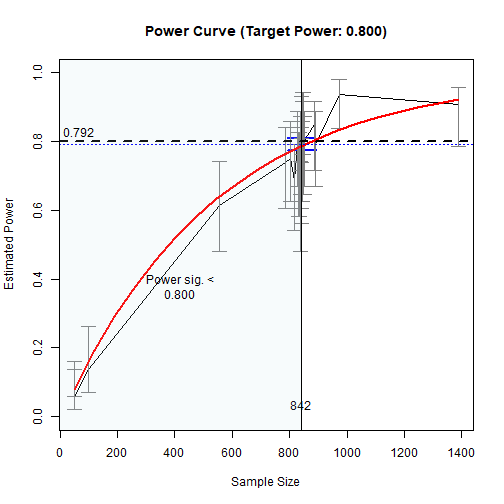
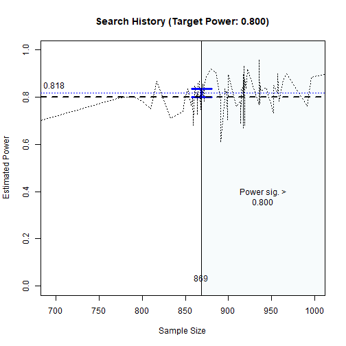
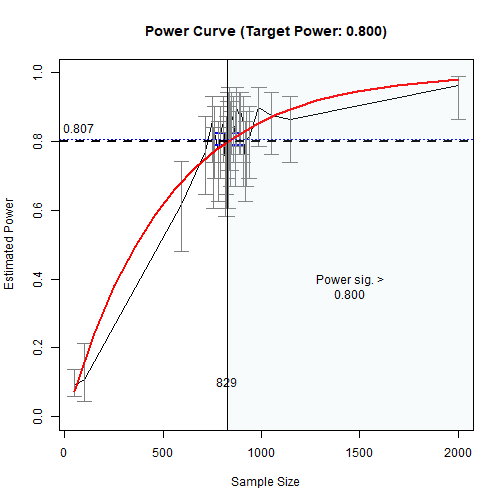

# NOTE

This article is for internal testing
of the printout.


``` r
library(power4mome)
options(power4mome.bz = TRUE)
```


``` r
mod <-
"
m ~ x
y ~ m + x
"
```


``` r
mod_es <-
"
m ~ x: m
y ~ m: s
y ~ x: s
"
```


``` r
out <- power4test(nrep = 2,
                  model = mod,
                  pop_es = mod_es,
                  n = 50000,
                  iseed = 1234)
```


``` r
print(out,
      data_long = TRUE)
#> 
#> ====================== Model Information ======================
#> 
#> == Model on Factors/Variables ==
#> 
#> m ~ x
#> y ~ m + x
#> 
#> == Model on Variables/Indicators ==
#> 
#> m ~ x
#> y ~ m + x
#> 
#> ====== Population Values ======
#> 
#> Regressions:
#>                    Population
#>   m ~                        
#>     x                 0.300  
#>   y ~                        
#>     m                 0.100  
#>     x                 0.100  
#> 
#> Variances:
#>                    Population
#>    .m                 0.910  
#>    .y                 0.974  
#>     x                 1.000  
#> 
#> (Computing indirect effects for 2 paths ...)
#> 
#> == Population Conditional/Indirect Effect(s) ==
#> 
#> == Indirect Effect(s) ==
#> 
#>               ind
#> x -> m -> y 0.030
#> x -> y      0.100
#> 
#>  - The 'ind' column shows the indirect effect(s).
#>  
#> ======================= Data Information =======================
#> 
#> Number of Replications:  2 
#> Sample Sizes:  50000 
#> 
#> ==== Descriptive Statistics ====
#> 
#>   vars     n mean sd skew kurtosis se
#> m    1 1e+05 0.00  1 0.01     0.03  0
#> y    2 1e+05 0.01  1 0.01     0.00  0
#> x    3 1e+05 0.00  1 0.01     0.01  0
#> 
#> ===== Parameter Estimates Based on All 2 Samples Combined =====
#> 
#> Total Sample Size: 100000 
#> 
#> ==== Standardized Estimates ====
#> 
#> Variances and error variances omitted.
#> 
#> Regressions:
#>                     est.std
#>   m ~                      
#>     x                 0.301
#>   y ~                      
#>     m                 0.095
#>     x                 0.101
#> 
#> 
#> ==================== Extra Element(s) Found ====================
#> 
#> - fit
#> 
#> === Element(s) of the First Dataset ===
#> 
#> ============ <fit> ============
#> 
#> lavaan 0.6-21 ended normally after 1 iteration
#> 
#>   Estimator                                         ML
#>   Optimization method                           NLMINB
#>   Number of model parameters                         5
#> 
#>   Number of observations                         50000
#> 
#> Model Test User Model:
#>                                                       
#>   Test statistic                                 0.000
#>   Degrees of freedom                                 0
```


``` r
out <- power4test(nrep = 200,
                  model = mod,
                  pop_es = mod_es,
                  n = 50,
                  R = 199,
                  ci_type = "mc",
                  test_fun = test_indirect_effect,
                  test_args = list(x = "x",
                                   m = "m",
                                   y = "y",
                                   mc_ci = TRUE),
                  iseed = 2345,
                  parallel = TRUE)
```


``` r
print(out,
      test_long = TRUE)
#> 
#> ====================== Model Information ======================
#> 
#> == Model on Factors/Variables ==
#> 
#> m ~ x
#> y ~ m + x
#> 
#> == Model on Variables/Indicators ==
#> 
#> m ~ x
#> y ~ m + x
#> 
#> ====== Population Values ======
#> 
#> Regressions:
#>                    Population
#>   m ~                        
#>     x                 0.300  
#>   y ~                        
#>     m                 0.100  
#>     x                 0.100  
#> 
#> Variances:
#>                    Population
#>    .m                 0.910  
#>    .y                 0.974  
#>     x                 1.000  
#> 
#> (Computing indirect effects for 2 paths ...)
#> 
#> == Population Conditional/Indirect Effect(s) ==
#> 
#> == Indirect Effect(s) ==
#> 
#>               ind
#> x -> m -> y 0.030
#> x -> y      0.100
#> 
#>  - The 'ind' column shows the indirect effect(s).
#>  
#> ======================= Data Information =======================
#> 
#> Number of Replications:  200 
#> Sample Sizes:  50 
#> 
#> Call print with 'data_long = TRUE' for further information.
#> 
#> ==================== Extra Element(s) Found ====================
#> 
#> - fit
#> - mc_out
#> 
#> === Element(s) of the First Dataset ===
#> 
#> ============ <fit> ============
#> 
#> lavaan 0.6-21 ended normally after 1 iteration
#> 
#>   Estimator                                         ML
#>   Optimization method                           NLMINB
#>   Number of model parameters                         5
#> 
#>   Number of observations                            50
#> 
#> Model Test User Model:
#>                                                       
#>   Test statistic                                 0.000
#>   Degrees of freedom                                 0
#> 
#> =========== <mc_out> ===========
#> 
#> 
#> == A 'mc_out' class object ==
#> 
#> Number of Monte Carlo replications: 199 
#> 
#> 
#> =============== <test_indirect: x->m->y> ===============
#> 
#> Mean(s) across replication:
#>    est cilo cihi   sig pvalue       R   nlt0 alpha bz_39 bz_79 bz_119 bz_159
#>  0.032  NaN  NaN 0.092  0.458 199.000 66.395 0.050 0.075 0.084  0.085  0.087
#>  bz_199
#>   0.090
#> 
#> - The value 'sig' is the rejection rate.
#> - If the null hypothesis is false, this is the power.
#> - Number of valid replications for rejection rate: 200 
#> - Proportion of valid replications for rejection rate: 1.000
```


``` r
out_n <- n_from_power(out,
                      what = "ub",
                      seed = 4567,
                      final_nrep = 2000,
                      algorithm = "probabilistic_bisection")
#> 
#> --- Setting ---
#> 
#> Algorithm:  probabilistic_bisection 
#> Goal:  close_enough 
#> What:  ub   (Upper bound of the confidence interval) 
#> 
#> --- Progress  ---
#> 
#> - Set 'progress = FALSE' to suppress displaying the progress.
#> Initial interval: [50, 100] 
#> Do the simulation for the lower bound ...
#> Do the simulation for the upper bound ...
#> 
#> == Enter extending interval ...
#> Current interval: [50, 100] 
#> Interval below the solution. Extend the upper bound ...
#> 
#> Try x = 555 
#> 
#> Estimated power at 555: 0.614, 95.0% confidence interval: [0.592,0.635]
#> 
#> 
#> (Extending the interval) Iteration: 1 
#> 
#> New interval: [100, 555] 
#> 
#> Try x = 1388 
#> 
#> Estimated power at 1388: 0.907, 95.0% confidence interval: [0.893,0.918]
#> 
#> 
#> (Extending the interval) Iteration: 2 
#> 
#> New interval: [555, 1388] 
#> Interval OK.
#> Final extended interval: [555, 1388] 
#> == Exit extending interval ...
#> Search Progress Note:
#> - #: Iteration number
#> - nrep: The number of replications
#> - n/es: The value to try
#> - TE: Time elapsed
#> - ETA: Estimated time to do all 5000 replications and one final check
#> - Rep: The number of replications used out of the total number of replications
#> - Dx: The range of changes of x in the last 5 iterations
#> - Df: The range of changes of f in the last 5 iterations
#> - PP: The region(s) of probable power
#> #:1|nrep:50|n:972|Rep:50/5000

 #:1|nrep:50|n:972|TE:0.0211 secs|Rep:50/5000

#> #:1|nrep:50|n:972|TE:0.0211 secs|Rep:50/5000|PP:[0.525,0.878]

#> #:2|nrep:50|n:787|TE:1.63 secs|ETA:1.76 mins|Rep:100/5000|PP:[0.525,0.878]

#> #:2|nrep:50|n:787|TE:1.63 secs|ETA:1.76 mins|Rep:100/5000|PP:[0.519,0.873]

#> #:3|nrep:50|n:853|TE:3.25 secs|ETA:2.34 mins|Rep:150/5000|PP:[0.519,0.873]

#> #:3|nrep:50|n:853|TE:3.25 secs|ETA:2.34 mins|Rep:150/5000|PP:[0.647,0.840]

#> #:4|nrep:50|n:832|TE:4.85 secs|ETA:2.61 mins|Rep:200/5000|PP:[0.647,0.840]

#> #:4|nrep:50|n:832|TE:4.85 secs|ETA:2.61 mins|Rep:200/5000|PP:[0.634,0.829]

#> #:5|nrep:50|n:890|TE:6.5 secs|ETA:2.78 mins|Rep:250/5000|PP:[0.634,0.829]
#> #:5|nrep:50|n:890|TE:6.5 secs|ETA:2.78
#> mins|Rep:250/5000|Dx:185|Df:0.212|PP:[0.634,0.829]

 #:5|nrep:50|n:890|TE:6.5
#> secs|ETA:2.78 mins|Rep:250/5000|Dx:185|Df:0.212|PP:[0.633,0.828]

#> #:6|nrep:50|n:887|TE:8.15 secs|ETA:2.89
#> mins|Rep:300/5000|Dx:185|Df:0.212|PP:[0.633,0.828]

 #:6|nrep:50|n:887|TE:8.15
#> secs|ETA:2.89 mins|Rep:300/5000|Dx:103|Df:0.124|PP:[0.633,0.828]

#> #:6|nrep:50|n:887|TE:8.15 secs|ETA:2.89
#> mins|Rep:300/5000|Dx:103|Df:0.124|PP:[0.640,0.834]

 #:7|nrep:50|n:844|TE:9.84
#> secs|ETA:2.96 mins|Rep:350/5000|Dx:103|Df:0.124|PP:[0.640,0.834]

#> #:7|nrep:50|n:844|TE:9.84 secs|ETA:2.96
#> mins|Rep:350/5000|Dx:58|Df:0.124|PP:[0.640,0.834] #:7|nrep:50|n:844|TE:9.84
#> secs|ETA:2.96 mins|Rep:350/5000|Dx:58|Df:0.124|PP:[0.637,0.831]

#> #:8|nrep:50|n:850|TE:12.2 secs|ETA:3.18
#> mins|Rep:400/5000|Dx:58|Df:0.124|PP:[0.637,0.831]

 #:8|nrep:50|n:850|TE:12.2
#> secs|ETA:3.18 mins|Rep:400/5000|Dx:58|Df:0.124|PP:[0.637,0.831]

#> #:8|nrep:50|n:850|TE:12.2 secs|ETA:3.18
#> mins|Rep:400/5000|Dx:58|Df:0.124|PP:[0.636,0.831]

 #:9|nrep:50|n:849|TE:14
#> secs|ETA:3.21 mins|Rep:450/5000|Dx:58|Df:0.124|PP:[0.636,0.831]
#> #:9|nrep:50|n:849|TE:14 secs|ETA:3.21
#> mins|Rep:450/5000|Dx:46|Df:0.117|PP:[0.636,0.831]

 #:9|nrep:50|n:849|TE:14
#> secs|ETA:3.21 mins|Rep:450/5000|Dx:46|Df:0.117|PP:[0.646,0.812]

#> #:10|nrep:50|n:804|TE:15.9 secs|ETA:3.24
#> mins|Rep:500/5000|Dx:46|Df:0.117|PP:[0.646,0.812]

 #:10|nrep:50|n:804|TE:15.9
#> secs|ETA:3.24 mins|Rep:500/5000|Dx:83|Df:0.130|PP:[0.646,0.812]

#> #:10|nrep:50|n:804|TE:15.9 secs|ETA:3.24
#> mins|Rep:500/5000|Dx:83|Df:0.130|PP:[0.643,0.809]

 #:11|nrep:50|n:828|TE:17.6
#> secs|ETA:3.24 mins|Rep:550/5000|Dx:83|Df:0.130|PP:[0.643,0.809]

#> #:11|nrep:50|n:828|TE:17.6 secs|ETA:3.24
#> mins|Rep:550/5000|Dx:46|Df:0.130|PP:[0.643,0.809]

 #:11|nrep:50|n:828|TE:17.6
#> secs|ETA:3.24 mins|Rep:550/5000|Dx:46|Df:0.130|PP:[0.645,0.811]

#> #:12|nrep:50|n:817|TE:19.3 secs|ETA:3.23
#> mins|Rep:600/5000|Dx:46|Df:0.130|PP:[0.645,0.811]

 #:12|nrep:50|n:817|TE:19.3
#> secs|ETA:3.23 mins|Rep:600/5000|Dx:46|Df:0.194|PP:[0.645,0.811]

#> #:12|nrep:50|n:817|TE:19.3 secs|ETA:3.23
#> mins|Rep:600/5000|Dx:46|Df:0.194|PP:[0.763,0.831]

 #:13|nrep:50|n:840|TE:21.1
#> secs|ETA:3.23 mins|Rep:650/5000|Dx:46|Df:0.194|PP:[0.763,0.831]

#> #:13|nrep:50|n:840|TE:21.1 secs|ETA:3.23
#> mins|Rep:650/5000|Dx:45|Df:0.194|PP:[0.763,0.831]

 #:13|nrep:50|n:840|TE:21.1
#> secs|ETA:3.23 mins|Rep:650/5000|Dx:45|Df:0.194|PP:[0.762,0.830]

#> #:14|nrep:50|n:841|TE:22.8 secs|ETA:3.21
#> mins|Rep:700/5000|Dx:45|Df:0.194|PP:[0.762,0.830]

 #:14|nrep:50|n:841|TE:22.8
#> secs|ETA:3.21 mins|Rep:700/5000|Dx:37|Df:0.114|PP:[0.762,0.830]

#> #:14|nrep:50|n:841|TE:22.8 secs|ETA:3.21
#> mins|Rep:700/5000|Dx:37|Df:0.114|PP:[0.757,0.826]

 #:15|nrep:50|n:847|TE:24.6
#> secs|ETA:3.2 mins|Rep:750/5000|Dx:37|Df:0.114|PP:[0.757,0.826]
#> #:15|nrep:50|n:847|TE:24.6 secs|ETA:3.2
#> mins|Rep:750/5000|Dx:30|Df:0.143|PP:[0.757,0.826]

 #:15|nrep:50|n:847|TE:24.6
#> secs|ETA:3.2 mins|Rep:750/5000|Dx:30|Df:0.143|PP:[0.760,0.829]

#> #:16|nrep:50|n:844|TE:26.3 secs|ETA:3.18
#> mins|Rep:800/5000|Dx:30|Df:0.143|PP:[0.760,0.829]

 #:16|nrep:50|n:844|TE:26.3
#> secs|ETA:3.18 mins|Rep:800/5000|Dx:30|Df:0.201|PP:[0.760,0.829]

#> #:16|nrep:50|n:844|TE:26.3 secs|ETA:3.18
#> mins|Rep:800/5000|Dx:30|Df:0.201|PP:[0.640,0.807]

 #:17|nrep:50|n:839|TE:28
#> secs|ETA:3.16 mins|Rep:850/5000|Dx:30|Df:0.201|PP:[0.640,0.807]
#> #:17|nrep:50|n:839|TE:28 secs|ETA:3.16
#> mins|Rep:850/5000|Dx:8|Df:0.179|PP:[0.640,0.807] #:17|nrep:50|n:839|TE:28
#> secs|ETA:3.16 mins|Rep:850/5000|Dx:8|Df:0.179|PP:[0.639,0.805]

#> #:18|nrep:50|n:841|TE:29.7 secs|ETA:3.14
#> mins|Rep:900/5000|Dx:8|Df:0.179|PP:[0.639,0.805]

 #:18|nrep:50|n:841|TE:29.7
#> secs|ETA:3.14 mins|Rep:900/5000|Dx:8|Df:0.179|PP:[0.639,0.805]

#> #:18|nrep:50|n:841|TE:29.7 secs|ETA:3.14
#> mins|Rep:900/5000|Dx:8|Df:0.179|PP:[0.643,0.795]

 #:19|nrep:50|n:833|TE:31.3
#> secs|ETA:3.11 mins|Rep:950/5000|Dx:8|Df:0.179|PP:[0.643,0.795]

#> #:19|nrep:50|n:833|TE:31.3 secs|ETA:3.11
#> mins|Rep:950/5000|Dx:14|Df:0.169|PP:[0.643,0.795]

 #:19|nrep:50|n:833|TE:31.3
#> secs|ETA:3.11 mins|Rep:950/5000|Dx:14|Df:0.169|PP:[0.765,0.805]

#> #:20|nrep:50|n:838|TE:33 secs|ETA:3.08
#> mins|Rep:1000/5000|Dx:14|Df:0.169|PP:[0.765,0.805] #:20|nrep:50|n:838|TE:33
#> secs|ETA:3.08 mins|Rep:1000/5000|Dx:11|Df:0.169|PP:[0.765,0.805]

#> #:20|nrep:50|n:838|TE:33 secs|ETA:3.08
#> mins|Rep:1000/5000|Dx:11|Df:0.169|PP:[0.766,0.805]

 #:21|nrep:50|n:838|TE:34.7
#> secs|ETA:3.06 mins|Rep:1050/5000|Dx:11|Df:0.169|PP:[0.766,0.805]

#> #:21|nrep:50|n:838|TE:34.7 secs|ETA:3.06
#> mins|Rep:1050/5000|Dx:8|Df:0.237|PP:[0.766,0.805] #:21|nrep:50|n:838|TE:34.7
#> secs|ETA:3.06 mins|Rep:1050/5000|Dx:8|Df:0.237|PP:[0.771,0.827]

#> #:22|nrep:50|n:841|TE:36.4 secs|ETA:3.04
#> mins|Rep:1100/5000|Dx:8|Df:0.237|PP:[0.771,0.827]

 #:22|nrep:50|n:841|TE:36.4
#> secs|ETA:3.04 mins|Rep:1100/5000|Dx:8|Df:0.237|PP:[0.771,0.827]

#> #:22|nrep:50|n:841|TE:36.4 secs|ETA:3.04
#> mins|Rep:1100/5000|Dx:8|Df:0.237|PP:[0.769,0.797]
#> 
#> Do Final Check 1: The width of the dominant region of probable power is 0.0361 or less.
#> #:23|nrep:2000|n:842|TE:38.1 secs|ETA:3.18
#> mins|Rep:1100/5000|Dx:8|Df:0.237|PP:[0.769,0.797]

 #:23|nrep:2000|n:842|TE:38.1
#> secs|ETA:3.18 mins|Rep:1100/5000|Dx:8|Df:0.237|PP:[0.772,0.805]
#> 
#> ** Search ended **: Solution found.
#> Summary:
#> - Number of iterations: 23 
#> - Number of replications: 1100 
#> - Time elapsed: 1.097 mins 
#> - The range of changes x in the last 5 iteration: 8 
#> - The range of changes f in the last 5 iteration: 0.237 
#> Solution found.
#> 
#> 
#> ========== Final Stage ==========
#> 
#> - Start at 2026-02-28 11:49:24 
#> - Rejection Rates:
#> 
#> [test]: test_indirect: x->m->y 
#> [test_label]: Test 
#>       n   est   p.v reject r.cilo r.cihi
#> 1    50 0.032 1.000  0.092  0.058  0.138
#> 2    50 0.030 1.000  0.059  0.021  0.162
#> 3   100 0.024 1.000  0.136  0.070  0.262
#> 4   555 0.027 1.000  0.614  0.482  0.741
#> 5   787 0.031 1.000  0.738  0.604  0.841
#> 6   804 0.029 1.000  0.752  0.626  0.857
#> 7   817 0.027 1.000  0.688  0.542  0.792
#> 8   828 0.030 1.000  0.802  0.670  0.888
#> 9   832 0.028 1.000  0.725  0.583  0.825
#> 10  833 0.028 1.000  0.719  0.583  0.825
#> 11  838 0.027 1.000  0.790  0.670  0.888
#> 12  838 0.027 1.000  0.624  0.482  0.741
#> 13  839 0.031 1.000  0.762  0.626  0.857
#> 14  840 0.030 1.000  0.773  0.648  0.872
#> 15  841 0.027 1.000  0.709  0.562  0.809
#> 16  841 0.030 1.000  0.861  0.738  0.930
#> 17  841 0.030 1.000  0.736  0.604  0.841
#> 18  842 0.030 1.000  0.792  0.774  0.810
#> 19  844 0.031 1.000  0.764  0.626  0.857
#> 20  844 0.032 1.000  0.888  0.762  0.944
#> 21  847 0.032 1.000  0.830  0.715  0.917
#> 22  849 0.030 1.000  0.882  0.762  0.944
#> 23  850 0.029 1.000  0.787  0.648  0.872
#> 24  853 0.030 1.000  0.803  0.670  0.888
#> 25  887 0.031 1.000  0.849  0.715  0.917
#> 26  890 0.028 1.000  0.791  0.670  0.888
#> 27  972 0.031 1.000  0.938  0.838  0.979
#> 28 1388 0.030 1.000  0.907  0.786  0.957
#> Notes:
#> - n: The sample size in a trial.
#> - p.v: The proportion of valid replications.
#> - est: The mean of the estimates in a test across replications.
#> - reject: The proportion of 'significant' replications, that is, the
#>   rejection rate. If the null hypothesis is true, this is the Type I
#>   error rate. If the null hypothesis is false, this is the power.
#> - r.cilo,r.cihi: The confidence interval of the rejection rate, based
#>   on Wilson's (1927) method.
#> - Refer to the tests for the meanings of other columns.
#> 
#> - Estimated Power Curve:
#> 
#> Call:
#> power_curve(object = by_x_1, formula = power_model, start = power_curve_start, 
#>     lower_bound = lower_bound, upper_bound = upper_bound, nls_args = nls_args, 
#>     nls_control = nls_control, verbose = progress)
#> 
#> Predictor: n (Sample Size)
#> 
#> Model:
#> Nonlinear regression model
#>   model: reject ~ 1 - I(exp((a - x)/b))
#>    data: "(Omitted)"
#>       a       b 
#>   5.208 540.199 
#>  weighted residual sum-of-squares: 4.786
#> 
#> Algorithm "port", convergence message: relative convergence (4)
#> 
#> 
#> - Final Value: 842 
#> 
#> - Final Estimated Power: 0.7925 
#> - Confidence Interval: [0.7742; 0.8097]
#> - CI Level: 95.00%
```


``` r
out_n
#> Call:
#> power4mome::x_from_power(object = out, x = "n", what = "ub", 
#>     goal = "close_enough", final_nrep = 2000, final_R = 199, 
#>     seed = 4567, algorithm = "probabilistic_bisection")
#> 
#>                                      Setting
#> Predictor(x):                    Sample Size
#> Parameter:                               N/A
#> goal:                           close_enough
#> what:                                     ub
#> algorithm:           probabilistic_bisection
#> Level of confidence:                  95.00%
#> Target Power:                          0.800
#> 
#> - Final Value of Sample Size (n): 842
#> 
#> - Final Estimated Power (CI): 0.792 [0.774, 0.810]
#> 
#> Call `summary()` for detailed results.
```


``` r
summary(out_n)
#> 
#> ====== x_from_power Results ======
#> 
#> Call:
#> x_from_power(object = out, x = "n", what = "ub", goal = "close_enough", 
#>     final_nrep = 2000, final_R = 199, seed = 4567, algorithm = "probabilistic_bisection")
#> 
#> Predictor (x): Sample Size 
#> 
#> - Target Power: 0.800 
#> - Goal: Find 'x' with estimated upper confidence bound close enough to
#>   the target power.
#> 
#> === Major Results ===
#> 
#> - Final Value (Sample Size): 842
#> 
#> - Final Estimated Power: 0.792 
#> - Confidence Interval: [0.774; 0.810]
#> - Level of confidence: 95.0%
#> - Based on 2000 replications.
#> 
#> === Technical Information ===
#> 
#> - Algorithm: probabilistic_bisection 
#> - Tolerance for 'close enough': Within 0.01580 of 0.800 
#> - The range of values explored: 100 to 972 
#> - Time spent in the search: 1.218 mins 
#> - The final crude model for the power-predictor relation:
#> 
#> Model Type: Nonlinear Regression Model 
#> 
#> Call:
#> power_curve(object = by_x_1, formula = power_model, start = power_curve_start, 
#>     lower_bound = lower_bound, upper_bound = upper_bound, nls_args = nls_args, 
#>     nls_control = nls_control, verbose = progress)
#> 
#> Predictor: n (Sample Size)
#> 
#> Model:
#> Nonlinear regression model
#>   model: reject ~ 1 - I(exp((a - x)/b))
#>    data: "(Omitted)"
#>       a       b 
#>   5.208 540.199 
#>  weighted residual sum-of-squares: 4.786
#> 
#> Algorithm "port", convergence message: relative convergence (4)
#> 
#> - Detailed Results:
#> 
#> [test]: test_indirect: x->m->y 
#> [test_label]: Test 
#>       n   est   p.v reject r.cilo r.cihi
#> 1    50 0.032 1.000  0.092  0.058  0.138
#> 2    50 0.030 1.000  0.059  0.021  0.162
#> 3   100 0.024 1.000  0.136  0.070  0.262
#> 4   555 0.027 1.000  0.614  0.482  0.741
#> 5   787 0.031 1.000  0.738  0.604  0.841
#> 6   804 0.029 1.000  0.752  0.626  0.857
#> 7   817 0.027 1.000  0.688  0.542  0.792
#> 8   828 0.030 1.000  0.802  0.670  0.888
#> 9   832 0.028 1.000  0.725  0.583  0.825
#> 10  833 0.028 1.000  0.719  0.583  0.825
#> 11  838 0.027 1.000  0.790  0.670  0.888
#> 12  838 0.027 1.000  0.624  0.482  0.741
#> 13  839 0.031 1.000  0.762  0.626  0.857
#> 14  840 0.030 1.000  0.773  0.648  0.872
#> 15  841 0.027 1.000  0.709  0.562  0.809
#> 16  841 0.030 1.000  0.861  0.738  0.930
#> 17  841 0.030 1.000  0.736  0.604  0.841
#> 18  842 0.030 1.000  0.792  0.774  0.810
#> 19  844 0.031 1.000  0.764  0.626  0.857
#> 20  844 0.032 1.000  0.888  0.762  0.944
#> 21  847 0.032 1.000  0.830  0.715  0.917
#> 22  849 0.030 1.000  0.882  0.762  0.944
#> 23  850 0.029 1.000  0.787  0.648  0.872
#> 24  853 0.030 1.000  0.803  0.670  0.888
#> 25  887 0.031 1.000  0.849  0.715  0.917
#> 26  890 0.028 1.000  0.791  0.670  0.888
#> 27  972 0.031 1.000  0.938  0.838  0.979
#> 28 1388 0.030 1.000  0.907  0.786  0.957
#> Notes:
#> - n: The sample size in a trial.
#> - p.v: The proportion of valid replications.
#> - est: The mean of the estimates in a test across replications.
#> - reject: The proportion of 'significant' replications, that is, the
#>   rejection rate. If the null hypothesis is true, this is the Type I
#>   error rate. If the null hypothesis is false, this is the power.
#> - r.cilo,r.cihi: The confidence interval of the rejection rate, based
#>   on Wilson's (1927) method.
#> - Refer to the tests for the meanings of other columns.
```


``` r
plot(out_n)
```

<div class="figure" style="text-align: center">

<p class="caption">The Power Curve</p>
</div>


``` r
out_n_lb <- n_from_power(out,
                         what = "lb",
                         seed = 2345,
                         final_nrep = 2000,
                         algorithm = "probabilistic_bisection")
#> 
#> --- Setting ---
#> 
#> Algorithm:  probabilistic_bisection 
#> Goal:  close_enough 
#> What:  lb   (Lower bound of the confidence interval) 
#> 
#> --- Progress  ---
#> 
#> - Set 'progress = FALSE' to suppress displaying the progress.
#> Initial interval: [50, 100] 
#> Do the simulation for the lower bound ...
#> Do the simulation for the upper bound ...
#> 
#> == Enter extending interval ...
#> Current interval: [50, 100] 
#> Interval below the solution. Extend the upper bound ...
#> 
#> Try x = 2000 
#> 
#> Estimated power at 2000: 0.964, 95.0% confidence interval: [0.955,0.971]
#> 
#> 
#> (Extending the interval) Iteration: 1 
#> 
#> New interval: [100, 2000] 
#> Interval OK.
#> Final extended interval: [100, 2000] 
#> == Exit extending interval ...
#> Search Progress Note:
#> - #: Iteration number
#> - nrep: The number of replications
#> - n/es: The value to try
#> - TE: Time elapsed
#> - ETA: Estimated time to do all 5000 replications and one final check
#> - Rep: The number of replications used out of the total number of replications
#> - Dx: The range of changes of x in the last 5 iterations
#> - Df: The range of changes of f in the last 5 iterations
#> - PP: The region(s) of probable power
#> #:1|nrep:50|n:1050|Rep:50/5000

 #:1|nrep:50|n:1050|TE:0.0154 secs|Rep:50/5000

#> #:1|nrep:50|n:1050|TE:0.0154 secs|Rep:50/5000|PP:[0.110,0.813]

#> #:2|nrep:50|n:717|TE:1.53 secs|ETA:1.67 mins|Rep:100/5000|PP:[0.110,0.813]

#> #:2|nrep:50|n:717|TE:1.53 secs|ETA:1.67 mins|Rep:100/5000|PP:[0.120,0.887]

#> #:3|nrep:50|n:907|TE:3.05 secs|ETA:2.23 mins|Rep:150/5000|PP:[0.120,0.887]

#> #:3|nrep:50|n:907|TE:3.05 secs|ETA:2.23 mins|Rep:150/5000|PP:[0.121,0.900]

#> #:4|nrep:50|n:790|TE:4.62 secs|ETA:2.51 mins|Rep:200/5000|PP:[0.121,0.900]

#> #:4|nrep:50|n:790|TE:4.62 secs|ETA:2.51 mins|Rep:200/5000|PP:[0.122,0.913]

#> #:5|nrep:50|n:784|TE:6.16 secs|ETA:2.66 mins|Rep:250/5000|PP:[0.122,0.913]

#> #:5|nrep:50|n:784|TE:6.16 secs|ETA:2.66
#> mins|Rep:250/5000|Dx:333|Df:0.108|PP:[0.122,0.913]

 #:5|nrep:50|n:784|TE:6.16
#> secs|ETA:2.66 mins|Rep:250/5000|Dx:333|Df:0.108|PP:[0.122,0.913]

#> #:6|nrep:50|n:886|TE:7.86 secs|ETA:2.79
#> mins|Rep:300/5000|Dx:333|Df:0.108|PP:[0.122,0.913]

 #:6|nrep:50|n:886|TE:7.86
#> secs|ETA:2.79 mins|Rep:300/5000|Dx:190|Df:0.109|PP:[0.122,0.913]

#> #:6|nrep:50|n:886|TE:7.86 secs|ETA:2.79
#> mins|Rep:300/5000|Dx:190|Df:0.109|PP:[0.122,0.918]

 #:7|nrep:50|n:809|TE:9.44
#> secs|ETA:2.84 mins|Rep:350/5000|Dx:190|Df:0.109|PP:[0.122,0.918]

#> #:7|nrep:50|n:809|TE:9.44 secs|ETA:2.84
#> mins|Rep:350/5000|Dx:123|Df:0.109|PP:[0.122,0.918]

 #:7|nrep:50|n:809|TE:9.44
#> secs|ETA:2.84 mins|Rep:350/5000|Dx:123|Df:0.109|PP:[0.123,0.925]

#> #:8|nrep:50|n:751|TE:11 secs|ETA:2.88
#> mins|Rep:400/5000|Dx:123|Df:0.109|PP:[0.123,0.925] #:8|nrep:50|n:751|TE:11
#> secs|ETA:2.88 mins|Rep:400/5000|Dx:135|Df:0.109|PP:[0.123,0.925]

#> #:8|nrep:50|n:751|TE:11 secs|ETA:2.88
#> mins|Rep:400/5000|Dx:135|Df:0.109|PP:[0.125,0.873]

 #:9|nrep:50|n:595|TE:12.6
#> secs|ETA:2.9 mins|Rep:450/5000|Dx:135|Df:0.109|PP:[0.125,0.873]

#> #:9|nrep:50|n:595|TE:12.6 secs|ETA:2.9
#> mins|Rep:450/5000|Dx:291|Df:0.258|PP:[0.125,0.873]

 #:9|nrep:50|n:595|TE:12.6
#> secs|ETA:2.9 mins|Rep:450/5000|Dx:291|Df:0.258|PP:[0.171,0.888]

#> #:10|nrep:50|n:761|TE:14.2 secs|ETA:2.92
#> mins|Rep:500/5000|Dx:291|Df:0.258|PP:[0.171,0.888]

 #:10|nrep:50|n:761|TE:14.2
#> secs|ETA:2.92 mins|Rep:500/5000|Dx:291|Df:0.258|PP:[0.171,0.888]

#> #:10|nrep:50|n:761|TE:14.2 secs|ETA:2.92
#> mins|Rep:500/5000|Dx:291|Df:0.258|PP:[0.172,0.890]

 #:11|nrep:50|n:756|TE:15.8
#> secs|ETA:2.94 mins|Rep:550/5000|Dx:291|Df:0.258|PP:[0.172,0.890]

#> #:11|nrep:50|n:756|TE:15.8 secs|ETA:2.94
#> mins|Rep:550/5000|Dx:214|Df:0.243|PP:[0.172,0.890]

 #:11|nrep:50|n:756|TE:15.8
#> secs|ETA:2.94 mins|Rep:550/5000|Dx:214|Df:0.243|PP:[0.705,0.886]

#> #:12|nrep:50|n:819|TE:17.7 secs|ETA:2.98
#> mins|Rep:600/5000|Dx:214|Df:0.243|PP:[0.705,0.886]

 #:12|nrep:50|n:819|TE:17.7
#> secs|ETA:2.98 mins|Rep:600/5000|Dx:224|Df:0.243|PP:[0.705,0.886]

#> #:12|nrep:50|n:819|TE:17.7 secs|ETA:2.98
#> mins|Rep:600/5000|Dx:224|Df:0.243|PP:[0.764,0.983]

 #:13|nrep:50|n:873|TE:19.3
#> secs|ETA:2.97 mins|Rep:650/5000|Dx:224|Df:0.243|PP:[0.764,0.983]

#> #:13|nrep:50|n:873|TE:19.3 secs|ETA:2.97
#> mins|Rep:650/5000|Dx:278|Df:0.280|PP:[0.764,0.983]

 #:13|nrep:50|n:873|TE:19.3
#> secs|ETA:2.97 mins|Rep:650/5000|Dx:278|Df:0.280|PP:[0.703,0.884]

#> #:14|nrep:50|n:842|TE:20.9 secs|ETA:2.97
#> mins|Rep:700/5000|Dx:278|Df:0.280|PP:[0.703,0.884]

 #:14|nrep:50|n:842|TE:20.9
#> secs|ETA:2.97 mins|Rep:700/5000|Dx:117|Df:0.173|PP:[0.703,0.884]

#> #:14|nrep:50|n:842|TE:20.9 secs|ETA:2.97
#> mins|Rep:700/5000|Dx:117|Df:0.173|PP:[0.701,0.883]

 #:15|nrep:50|n:845|TE:22.5
#> secs|ETA:2.96 mins|Rep:750/5000|Dx:117|Df:0.173|PP:[0.701,0.883]

#> #:15|nrep:50|n:845|TE:22.5 secs|ETA:2.96
#> mins|Rep:750/5000|Dx:117|Df:0.173|PP:[0.701,0.883]

 #:15|nrep:50|n:845|TE:22.5
#> secs|ETA:2.96 mins|Rep:750/5000|Dx:117|Df:0.173|PP:[0.703,0.844]

#> #:16|nrep:50|n:836|TE:24.2 secs|ETA:2.96
#> mins|Rep:800/5000|Dx:117|Df:0.173|PP:[0.703,0.844]

 #:16|nrep:50|n:836|TE:24.2
#> secs|ETA:2.96 mins|Rep:800/5000|Dx:54|Df:0.182|PP:[0.703,0.844]
#> #:16|nrep:50|n:836|TE:24.2 secs|ETA:2.96
#> mins|Rep:800/5000|Dx:54|Df:0.182|PP:[0.709,0.842]

 #:17|nrep:50|n:820|TE:25.9
#> secs|ETA:2.94 mins|Rep:850/5000|Dx:54|Df:0.182|PP:[0.709,0.842]

#> #:17|nrep:50|n:820|TE:25.9 secs|ETA:2.94
#> mins|Rep:850/5000|Dx:53|Df:0.170|PP:[0.709,0.842]

 #:17|nrep:50|n:820|TE:25.9
#> secs|ETA:2.94 mins|Rep:850/5000|Dx:53|Df:0.170|PP:[0.704,0.845]

#> #:18|nrep:50|n:829|TE:27.5 secs|ETA:2.93
#> mins|Rep:900/5000|Dx:53|Df:0.170|PP:[0.704,0.845]

 #:18|nrep:50|n:829|TE:27.5
#> secs|ETA:2.93 mins|Rep:900/5000|Dx:25|Df:0.170|PP:[0.704,0.845]

#> #:18|nrep:50|n:829|TE:27.5 secs|ETA:2.93
#> mins|Rep:900/5000|Dx:25|Df:0.170|PP:[0.767,0.882]

 #:19|nrep:50|n:833|TE:29.2
#> secs|ETA:2.92 mins|Rep:950/5000|Dx:25|Df:0.170|PP:[0.767,0.882]

#> #:19|nrep:50|n:833|TE:29.2 secs|ETA:2.92
#> mins|Rep:950/5000|Dx:25|Df:0.170|PP:[0.767,0.882]

 #:19|nrep:50|n:833|TE:29.2
#> secs|ETA:2.92 mins|Rep:950/5000|Dx:25|Df:0.170|PP:[0.766,0.882]

#> #:20|nrep:50|n:834|TE:31 secs|ETA:2.91
#> mins|Rep:1000/5000|Dx:25|Df:0.170|PP:[0.766,0.882] #:20|nrep:50|n:834|TE:31
#> secs|ETA:2.91 mins|Rep:1000/5000|Dx:16|Df:0.170|PP:[0.766,0.882]

#> #:20|nrep:50|n:834|TE:31 secs|ETA:2.91
#> mins|Rep:1000/5000|Dx:16|Df:0.170|PP:[0.768,0.883]

 #:21|nrep:50|n:831|TE:32.8
#> secs|ETA:2.91 mins|Rep:1050/5000|Dx:16|Df:0.170|PP:[0.768,0.883]

#> #:21|nrep:50|n:831|TE:32.8 secs|ETA:2.91
#> mins|Rep:1050/5000|Dx:14|Df:0.140|PP:[0.768,0.883]

 #:21|nrep:50|n:831|TE:32.8
#> secs|ETA:2.91 mins|Rep:1050/5000|Dx:14|Df:0.140|PP:[0.705,0.839]

#> #:22|nrep:50|n:829|TE:34.7 secs|ETA:2.9
#> mins|Rep:1100/5000|Dx:14|Df:0.140|PP:[0.705,0.839] #:22|nrep:50|n:829|TE:34.7
#> secs|ETA:2.9 mins|Rep:1100/5000|Dx:5|Df:0.120|PP:[0.705,0.839]
#> #:22|nrep:50|n:829|TE:34.7 secs|ETA:2.9
#> mins|Rep:1100/5000|Dx:5|Df:0.120|PP:[0.706,0.840]

 #:23|nrep:50|n:826|TE:36.5
#> secs|ETA:2.9 mins|Rep:1150/5000|Dx:5|Df:0.120|PP:[0.706,0.840]

#> #:23|nrep:50|n:826|TE:36.5 secs|ETA:2.9
#> mins|Rep:1150/5000|Dx:8|Df:0.066|PP:[0.706,0.840]

 #:23|nrep:50|n:826|TE:36.5
#> secs|ETA:2.9 mins|Rep:1150/5000|Dx:8|Df:0.066|PP:[0.708,0.837]

#> #:24|nrep:50|n:823|TE:38.4 secs|ETA:2.89
#> mins|Rep:1200/5000|Dx:8|Df:0.066|PP:[0.708,0.837]

 #:24|nrep:50|n:823|TE:38.4
#> secs|ETA:2.89 mins|Rep:1200/5000|Dx:11|Df:0.090|PP:[0.708,0.837]

#> #:24|nrep:50|n:823|TE:38.4 secs|ETA:2.89
#> mins|Rep:1200/5000|Dx:11|Df:0.090|PP:[0.706,0.840]

 #:25|nrep:50|n:825|TE:40.1
#> secs|ETA:2.87 mins|Rep:1250/5000|Dx:11|Df:0.090|PP:[0.706,0.840]

#> #:25|nrep:50|n:825|TE:40.1 secs|ETA:2.87
#> mins|Rep:1250/5000|Dx:8|Df:0.090|PP:[0.706,0.840] #:25|nrep:50|n:825|TE:40.1
#> secs|ETA:2.87 mins|Rep:1250/5000|Dx:8|Df:0.090|PP:[0.706,0.840]

#> #:26|nrep:50|n:825|TE:41.9 secs|ETA:2.86
#> mins|Rep:1300/5000|Dx:8|Df:0.090|PP:[0.706,0.840]

 #:26|nrep:50|n:825|TE:41.9
#> secs|ETA:2.86 mins|Rep:1300/5000|Dx:6|Df:0.096|PP:[0.706,0.840]

#> #:26|nrep:50|n:825|TE:41.9 secs|ETA:2.86
#> mins|Rep:1300/5000|Dx:6|Df:0.096|PP:[0.770,0.844]

 #:27|nrep:50|n:829|TE:43.7
#> secs|ETA:2.85 mins|Rep:1350/5000|Dx:6|Df:0.096|PP:[0.770,0.844]

#> #:27|nrep:50|n:829|TE:43.7 secs|ETA:2.85
#> mins|Rep:1350/5000|Dx:6|Df:0.093|PP:[0.770,0.844]

 #:27|nrep:50|n:829|TE:43.7
#> secs|ETA:2.85 mins|Rep:1350/5000|Dx:6|Df:0.093|PP:[0.785,0.843]

#> #:28|nrep:50|n:830|TE:45.5 secs|ETA:2.83
#> mins|Rep:1400/5000|Dx:6|Df:0.093|PP:[0.785,0.843]

 #:28|nrep:50|n:830|TE:45.5
#> secs|ETA:2.83 mins|Rep:1400/5000|Dx:7|Df:0.089|PP:[0.785,0.843]

#> #:28|nrep:50|n:830|TE:45.5 secs|ETA:2.83
#> mins|Rep:1400/5000|Dx:7|Df:0.089|PP:[0.786,0.843]

 #:29|nrep:50|n:829|TE:47.3
#> secs|ETA:2.81 mins|Rep:1450/5000|Dx:7|Df:0.089|PP:[0.786,0.843]

#> #:29|nrep:50|n:829|TE:47.3 secs|ETA:2.81
#> mins|Rep:1450/5000|Dx:5|Df:0.089|PP:[0.786,0.843]

 #:29|nrep:50|n:829|TE:47.3
#> secs|ETA:2.81 mins|Rep:1450/5000|Dx:5|Df:0.089|PP:[0.787,0.844]

#> #:30|nrep:50|n:829|TE:49 secs|ETA:2.79
#> mins|Rep:1500/5000|Dx:5|Df:0.089|PP:[0.787,0.844] #:30|nrep:50|n:829|TE:49
#> secs|ETA:2.79 mins|Rep:1500/5000|Dx:5|Df:0.089|PP:[0.787,0.844]

#> #:30|nrep:50|n:829|TE:49 secs|ETA:2.79
#> mins|Rep:1500/5000|Dx:5|Df:0.089|PP:[0.785,0.842]

 #:31|nrep:50|n:830|TE:50.7
#> secs|ETA:2.77 mins|Rep:1550/5000|Dx:5|Df:0.089|PP:[0.785,0.842]

#> #:31|nrep:50|n:830|TE:50.7 secs|ETA:2.77
#> mins|Rep:1550/5000|Dx:1|Df:0.109|PP:[0.785,0.842]

 #:31|nrep:50|n:830|TE:50.7
#> secs|ETA:2.77 mins|Rep:1550/5000|Dx:1|Df:0.109|PP:[0.786,0.836]

#> #:32|nrep:50|n:829|TE:52.5 secs|ETA:2.75
#> mins|Rep:1600/5000|Dx:1|Df:0.109|PP:[0.786,0.836]

 #:32|nrep:50|n:829|TE:52.5
#> secs|ETA:2.75 mins|Rep:1600/5000|Dx:1|Df:0.111|PP:[0.786,0.836]

#> #:32|nrep:50|n:829|TE:52.5 secs|ETA:2.75
#> mins|Rep:1600/5000|Dx:1|Df:0.111|PP:[0.788,0.838]

 #:33|nrep:50|n:829|TE:54.3
#> secs|ETA:2.73 mins|Rep:1650/5000|Dx:1|Df:0.111|PP:[0.788,0.838]

#> #:33|nrep:50|n:829|TE:54.3 secs|ETA:2.73
#> mins|Rep:1650/5000|Dx:1|Df:0.111|PP:[0.788,0.838]

 #:33|nrep:50|n:829|TE:54.3
#> secs|ETA:2.73 mins|Rep:1650/5000|Dx:1|Df:0.111|PP:[0.771,0.839]

#> #:34|nrep:50|n:828|TE:56.1 secs|ETA:2.71
#> mins|Rep:1700/5000|Dx:1|Df:0.111|PP:[0.771,0.839]

 #:34|nrep:50|n:828|TE:56.1
#> secs|ETA:2.71 mins|Rep:1700/5000|Dx:2|Df:0.155|PP:[0.771,0.839]

#> #:34|nrep:50|n:828|TE:56.1 secs|ETA:2.71
#> mins|Rep:1700/5000|Dx:2|Df:0.155|PP:[0.786,0.836]

 #:35|nrep:50|n:829|TE:57.9
#> secs|ETA:2.69 mins|Rep:1750/5000|Dx:2|Df:0.155|PP:[0.786,0.836]

#> #:35|nrep:50|n:829|TE:57.9 secs|ETA:2.69
#> mins|Rep:1750/5000|Dx:2|Df:0.155|PP:[0.786,0.836]

 #:35|nrep:50|n:829|TE:57.9
#> secs|ETA:2.69 mins|Rep:1750/5000|Dx:2|Df:0.155|PP:[0.810,0.841]
#> 
#> Do Final Check 1: The width of the dominant region of probable power is 0.0338 or less.
#> #:36|nrep:2000|n:829|TE:59.7 secs|ETA:2.77
#> mins|Rep:1750/5000|Dx:2|Df:0.155|PP:[0.810,0.841]

 #:36|nrep:2000|n:829|TE:59.7
#> secs|ETA:2.77 mins|Rep:1750/5000|Dx:2|Df:0.155|PP:[0.807,0.838]
#> 
#> ** Search ended **: Solution found.
#> Summary:
#> - Number of iterations: 36 
#> - Number of replications: 1750 
#> - Time elapsed: 1.465 mins 
#> - The range of changes x in the last 5 iteration: 2 
#> - The range of changes f in the last 5 iteration: 0.155 
#> Solution found.
#> 
#> 
#> ========== Final Stage ==========
#> 
#> - Start at 2026-02-28 11:50:57 
#> - Rejection Rates:
#> 
#> [test]: test_indirect: x->m->y 
#> [test_label]: Test 
#>       n   est   p.v reject r.cilo r.cihi
#> 1    50 0.032 1.000  0.092  0.058  0.138
#> 2    50 0.033 1.000  0.085  0.032  0.188
#> 3   100 0.025 1.000  0.109  0.043  0.214
#> 4   595 0.029 1.000  0.619  0.482  0.741
#> 5   717 0.029 1.000  0.771  0.648  0.872
#> 6   751 0.032 1.000  0.862  0.738  0.930
#> 7   756 0.030 1.000  0.734  0.604  0.841
#> 8   761 0.032 1.000  0.826  0.692  0.902
#> 9   784 0.029 1.000  0.768  0.626  0.857
#> 10  790 0.031 1.000  0.820  0.692  0.902
#> 11  809 0.032 1.000  0.857  0.738  0.930
#> 12  819 0.028 1.000  0.725  0.583  0.825
#> 13  820 0.030 1.000  0.738  0.604  0.841
#> 14  823 0.029 1.000  0.788  0.648  0.872
#> 15  825 0.031 1.000  0.813  0.692  0.902
#> 16  825 0.029 1.000  0.754  0.626  0.857
#> 17  826 0.032 1.000  0.846  0.715  0.917
#> 18  828 0.028 1.000  0.713  0.583  0.825
#> 19  829 0.031 1.000  0.757  0.626  0.857
#> 20  829 0.029 1.000  0.850  0.715  0.917
#> 21  829 0.032 1.000  0.760  0.626  0.857
#> 22  829 0.029 1.000  0.824  0.692  0.902
#> 23  829 0.028 1.000  0.757  0.626  0.857
#> 24  829 0.030 1.000  0.868  0.738  0.930
#> 25  829 0.032 1.000  0.858  0.738  0.930
#> 26  829 0.029 1.000  0.756  0.626  0.857
#> 27  829 0.030 1.000  0.807  0.789  0.824
#> 28  830 0.030 1.000  0.842  0.715  0.917
#> 29  830 0.032 1.000  0.866  0.738  0.930
#> 30  831 0.031 1.000  0.877  0.762  0.944
#> 31  833 0.028 1.000  0.811  0.692  0.902
#> 32  834 0.033 1.000  0.853  0.738  0.930
#> 33  836 0.033 1.000  0.908  0.786  0.957
#> 34  842 0.031 1.000  0.805  0.670  0.888
#> 35  845 0.032 1.000  0.843  0.715  0.917
#> 36  873 0.031 1.000  0.899  0.786  0.957
#> 37  886 0.032 1.000  0.877  0.762  0.944
#> 38  907 0.029 1.000  0.857  0.738  0.930
#> 39 1050 0.031 1.000  0.875  0.762  0.944
#> 40 2000 0.033 1.000  0.964  0.865  0.989
#> Notes:
#> - n: The sample size in a trial.
#> - p.v: The proportion of valid replications.
#> - est: The mean of the estimates in a test across replications.
#> - reject: The proportion of 'significant' replications, that is, the
#>   rejection rate. If the null hypothesis is true, this is the Type I
#>   error rate. If the null hypothesis is false, this is the power.
#> - r.cilo,r.cihi: The confidence interval of the rejection rate, based
#>   on Wilson's (1927) method.
#> - Refer to the tests for the meanings of other columns.
#> 
#> - Estimated Power Curve:
#> 
#> Call:
#> power_curve(object = by_x_1, formula = power_model, start = power_curve_start, 
#>     lower_bound = lower_bound, upper_bound = upper_bound, nls_args = nls_args, 
#>     nls_control = nls_control, verbose = progress)
#> 
#> Predictor: n (Sample Size)
#> 
#> Model:
#> Nonlinear regression model
#>   model: reject ~ 1 - I(exp((a - x)/b))
#>    data: "(Omitted)"
#>       a       b 
#>   9.355 493.057 
#>  weighted residual sum-of-squares: 4.893
#> 
#> Algorithm "port", convergence message: both X-convergence and relative convergence (5)
#> 
#> 
#> - Final Value: 829 
#> 
#> - Final Estimated Power: 0.8068 
#> - Confidence Interval: [0.7891; 0.8237]
#> - CI Level: 95.00%
```


``` r
out_n_lb
#> Call:
#> power4mome::x_from_power(object = out, x = "n", what = "lb", 
#>     goal = "close_enough", final_nrep = 2000, final_R = 199, 
#>     seed = 2345, algorithm = "probabilistic_bisection")
#> 
#>                                      Setting
#> Predictor(x):                    Sample Size
#> Parameter:                               N/A
#> goal:                           close_enough
#> what:                                     lb
#> algorithm:           probabilistic_bisection
#> Level of confidence:                  95.00%
#> Target Power:                          0.800
#> 
#> - Final Value of Sample Size (n): 829
#> 
#> - Final Estimated Power (CI): 0.807 [0.789, 0.824]
#> 
#> Call `summary()` for detailed results.
```


``` r
summary(out_n_lb)
#> 
#> ====== x_from_power Results ======
#> 
#> Call:
#> x_from_power(object = out, x = "n", what = "lb", goal = "close_enough", 
#>     final_nrep = 2000, final_R = 199, seed = 2345, algorithm = "probabilistic_bisection")
#> 
#> Predictor (x): Sample Size 
#> 
#> - Target Power: 0.800 
#> - Goal: Find 'x' with estimated lower confidence bound close enough to
#>   the target power.
#> 
#> === Major Results ===
#> 
#> - Final Value (Sample Size): 829
#> 
#> - Final Estimated Power: 0.807 
#> - Confidence Interval: [0.789; 0.824]
#> - Level of confidence: 95.0%
#> - Based on 2000 replications.
#> 
#> === Technical Information ===
#> 
#> - Algorithm: probabilistic_bisection 
#> - Tolerance for 'close enough': Within 0.01509 of 0.800 
#> - The range of values explored: 100 to 907 
#> - Time spent in the search: 1.558 mins 
#> - The final crude model for the power-predictor relation:
#> 
#> Model Type: Nonlinear Regression Model 
#> 
#> Call:
#> power_curve(object = by_x_1, formula = power_model, start = power_curve_start, 
#>     lower_bound = lower_bound, upper_bound = upper_bound, nls_args = nls_args, 
#>     nls_control = nls_control, verbose = progress)
#> 
#> Predictor: n (Sample Size)
#> 
#> Model:
#> Nonlinear regression model
#>   model: reject ~ 1 - I(exp((a - x)/b))
#>    data: "(Omitted)"
#>       a       b 
#>   9.355 493.057 
#>  weighted residual sum-of-squares: 4.893
#> 
#> Algorithm "port", convergence message: both X-convergence and relative convergence (5)
#> 
#> - Detailed Results:
#> 
#> [test]: test_indirect: x->m->y 
#> [test_label]: Test 
#>       n   est   p.v reject r.cilo r.cihi
#> 1    50 0.032 1.000  0.092  0.058  0.138
#> 2    50 0.033 1.000  0.085  0.032  0.188
#> 3   100 0.025 1.000  0.109  0.043  0.214
#> 4   595 0.029 1.000  0.619  0.482  0.741
#> 5   717 0.029 1.000  0.771  0.648  0.872
#> 6   751 0.032 1.000  0.862  0.738  0.930
#> 7   756 0.030 1.000  0.734  0.604  0.841
#> 8   761 0.032 1.000  0.826  0.692  0.902
#> 9   784 0.029 1.000  0.768  0.626  0.857
#> 10  790 0.031 1.000  0.820  0.692  0.902
#> 11  809 0.032 1.000  0.857  0.738  0.930
#> 12  819 0.028 1.000  0.725  0.583  0.825
#> 13  820 0.030 1.000  0.738  0.604  0.841
#> 14  823 0.029 1.000  0.788  0.648  0.872
#> 15  825 0.031 1.000  0.813  0.692  0.902
#> 16  825 0.029 1.000  0.754  0.626  0.857
#> 17  826 0.032 1.000  0.846  0.715  0.917
#> 18  828 0.028 1.000  0.713  0.583  0.825
#> 19  829 0.031 1.000  0.757  0.626  0.857
#> 20  829 0.029 1.000  0.850  0.715  0.917
#> 21  829 0.032 1.000  0.760  0.626  0.857
#> 22  829 0.029 1.000  0.824  0.692  0.902
#> 23  829 0.028 1.000  0.757  0.626  0.857
#> 24  829 0.030 1.000  0.868  0.738  0.930
#> 25  829 0.032 1.000  0.858  0.738  0.930
#> 26  829 0.029 1.000  0.756  0.626  0.857
#> 27  829 0.030 1.000  0.807  0.789  0.824
#> 28  830 0.030 1.000  0.842  0.715  0.917
#> 29  830 0.032 1.000  0.866  0.738  0.930
#> 30  831 0.031 1.000  0.877  0.762  0.944
#> 31  833 0.028 1.000  0.811  0.692  0.902
#> 32  834 0.033 1.000  0.853  0.738  0.930
#> 33  836 0.033 1.000  0.908  0.786  0.957
#> 34  842 0.031 1.000  0.805  0.670  0.888
#> 35  845 0.032 1.000  0.843  0.715  0.917
#> 36  873 0.031 1.000  0.899  0.786  0.957
#> 37  886 0.032 1.000  0.877  0.762  0.944
#> 38  907 0.029 1.000  0.857  0.738  0.930
#> 39 1050 0.031 1.000  0.875  0.762  0.944
#> 40 2000 0.033 1.000  0.964  0.865  0.989
#> Notes:
#> - n: The sample size in a trial.
#> - p.v: The proportion of valid replications.
#> - est: The mean of the estimates in a test across replications.
#> - reject: The proportion of 'significant' replications, that is, the
#>   rejection rate. If the null hypothesis is true, this is the Type I
#>   error rate. If the null hypothesis is false, this is the power.
#> - r.cilo,r.cihi: The confidence interval of the rejection rate, based
#>   on Wilson's (1927) method.
#> - Refer to the tests for the meanings of other columns.
```


``` r
plot(out_n_lb)
```

<div class="figure" style="text-align: center">

<p class="caption">The Power Curve</p>
</div>


``` r
n_power_region <- n_region_from_power(out,
                                      seed = 2468,
                                      final_nrep = 2000,
                                      algorithm = "probabilistic_bisection")
#> 
#> =========== Phase 1: Upper Bound ===========
#> 
#> Find the approximate region with power significantly below 0.8 ...
#> 
#> --- Setting ---
#> 
#> Algorithm:  probabilistic_bisection 
#> Goal:  close_enough 
#> What:  ub   (Upper bound of the confidence interval) 
#> 
#> --- Progress  ---
#> 
#> - Set 'progress = FALSE' to suppress displaying the progress.
#> Initial interval: [50, 100] 
#> Do the simulation for the lower bound ...
#> Do the simulation for the upper bound ...
#> 
#> == Enter extending interval ...
#> Current interval: [50, 100] 
#> Interval below the solution. Extend the upper bound ...
#> 
#> Try x = 521 
#> 
#> Estimated power at 521: 0.580, 95.0% confidence interval: [0.558,0.601]
#> 
#> 
#> (Extending the interval) Iteration: 1 
#> 
#> New interval: [100, 521] 
#> 
#> Try x = 1370 
#> 
#> Estimated power at 1370: 0.887, 95.0% confidence interval: [0.872,0.900]
#> 
#> 
#> (Extending the interval) Iteration: 2 
#> 
#> New interval: [521, 1370] 
#> Interval OK.
#> Final extended interval: [521, 1370] 
#> == Exit extending interval ...
#> Search Progress Note:
#> - #: Iteration number
#> - nrep: The number of replications
#> - n/es: The value to try
#> - TE: Time elapsed
#> - ETA: Estimated time to do all 5000 replications and one final check
#> - Rep: The number of replications used out of the total number of replications
#> - Dx: The range of changes of x in the last 5 iterations
#> - Df: The range of changes of f in the last 5 iterations
#> - PP: The region(s) of probable power
#> #:1|nrep:50|n:946|Rep:50/5000

 #:1|nrep:50|n:946|TE:0.00751 secs|Rep:50/5000

#> #:1|nrep:50|n:946|TE:0.00751 secs|Rep:50/5000|PP:[0.780,0.888]

#> #:2|nrep:50|n:1007|TE:1.53 secs|ETA:1.68 mins|Rep:100/5000|PP:[0.780,0.888]

#> #:2|nrep:50|n:1007|TE:1.53 secs|ETA:1.68 mins|Rep:100/5000|PP:[0.567,0.801]

#> #:3|nrep:50|n:950|TE:3.09 secs|ETA:2.25 mins|Rep:150/5000|PP:[0.567,0.801]
#> #:3|nrep:50|n:950|TE:3.09 secs|ETA:2.25 mins|Rep:150/5000|PP:[0.585,0.817]

#> #:4|nrep:50|n:781|TE:5.11 secs|ETA:2.78 mins|Rep:200/5000|PP:[0.585,0.817]

#> #:4|nrep:50|n:781|TE:5.11 secs|ETA:2.78 mins|Rep:200/5000|PP:[0.588,0.820]

#> #:5|nrep:50|n:837|TE:7.17 secs|ETA:3.09 mins|Rep:250/5000|PP:[0.588,0.820]

#> #:5|nrep:50|n:837|TE:7.17 secs|ETA:3.09
#> mins|Rep:250/5000|Dx:226|Df:0.185|PP:[0.588,0.820]

 #:5|nrep:50|n:837|TE:7.17
#> secs|ETA:3.09 mins|Rep:250/5000|Dx:226|Df:0.185|PP:[0.618,0.788]

#> #:6|nrep:50|n:721|TE:9.82 secs|ETA:3.51
#> mins|Rep:300/5000|Dx:226|Df:0.185|PP:[0.618,0.788]

 #:6|nrep:50|n:721|TE:9.82
#> secs|ETA:3.51 mins|Rep:300/5000|Dx:286|Df:0.261|PP:[0.618,0.788]

#> #:6|nrep:50|n:721|TE:9.82 secs|ETA:3.51
#> mins|Rep:300/5000|Dx:286|Df:0.261|PP:[0.608,0.838]

 #:7|nrep:50|n:795|TE:11.5
#> secs|ETA:3.48 mins|Rep:350/5000|Dx:286|Df:0.261|PP:[0.608,0.838]

#> #:7|nrep:50|n:795|TE:11.5 secs|ETA:3.48
#> mins|Rep:350/5000|Dx:229|Df:0.261|PP:[0.608,0.838]

 #:7|nrep:50|n:795|TE:11.5
#> secs|ETA:3.48 mins|Rep:350/5000|Dx:229|Df:0.261|PP:[0.621,0.791]

#> #:8|nrep:50|n:762|TE:13.2 secs|ETA:3.48
#> mins|Rep:400/5000|Dx:229|Df:0.261|PP:[0.621,0.791]

 #:8|nrep:50|n:762|TE:13.2
#> secs|ETA:3.48 mins|Rep:400/5000|Dx:116|Df:0.261|PP:[0.621,0.791]

#> #:8|nrep:50|n:762|TE:13.2 secs|ETA:3.48
#> mins|Rep:400/5000|Dx:116|Df:0.261|PP:[0.618,0.788]

 #:9|nrep:50|n:782|TE:15.1
#> secs|ETA:3.52 mins|Rep:450/5000|Dx:116|Df:0.261|PP:[0.618,0.788]

#> #:9|nrep:50|n:782|TE:15.1 secs|ETA:3.52
#> mins|Rep:450/5000|Dx:116|Df:0.261|PP:[0.618,0.788]

 #:9|nrep:50|n:782|TE:15.1
#> secs|ETA:3.52 mins|Rep:450/5000|Dx:116|Df:0.261|PP:[0.618,0.788]

#> #:10|nrep:50|n:784|TE:17 secs|ETA:3.52
#> mins|Rep:500/5000|Dx:116|Df:0.261|PP:[0.618,0.788] #:10|nrep:50|n:784|TE:17
#> secs|ETA:3.52 mins|Rep:500/5000|Dx:74|Df:0.180|PP:[0.618,0.788]
#> #:10|nrep:50|n:784|TE:17 secs|ETA:3.52
#> mins|Rep:500/5000|Dx:74|Df:0.180|PP:[0.614,0.825]

 #:11|nrep:50|n:793|TE:18.9
#> secs|ETA:3.52 mins|Rep:550/5000|Dx:74|Df:0.180|PP:[0.614,0.825]

#> #:11|nrep:50|n:793|TE:18.9 secs|ETA:3.52
#> mins|Rep:550/5000|Dx:33|Df:0.133|PP:[0.614,0.825]

 #:11|nrep:50|n:793|TE:18.9
#> secs|ETA:3.52 mins|Rep:550/5000|Dx:33|Df:0.133|PP:[0.731,0.841]

#> #:12|nrep:50|n:806|TE:20.6 secs|ETA:3.5
#> mins|Rep:600/5000|Dx:33|Df:0.133|PP:[0.731,0.841] #:12|nrep:50|n:806|TE:20.6
#> secs|ETA:3.5 mins|Rep:600/5000|Dx:44|Df:0.099|PP:[0.731,0.841]

#> #:12|nrep:50|n:806|TE:20.6 secs|ETA:3.5
#> mins|Rep:600/5000|Dx:44|Df:0.099|PP:[0.616,0.827]

 #:13|nrep:50|n:794|TE:22.4
#> secs|ETA:3.48 mins|Rep:650/5000|Dx:44|Df:0.099|PP:[0.616,0.827]

#> #:13|nrep:50|n:794|TE:22.4 secs|ETA:3.48
#> mins|Rep:650/5000|Dx:24|Df:0.099|PP:[0.616,0.827]

 #:13|nrep:50|n:794|TE:22.4
#> secs|ETA:3.48 mins|Rep:650/5000|Dx:24|Df:0.099|PP:[0.732,0.842]

#> #:14|nrep:50|n:804|TE:24.2 secs|ETA:3.46
#> mins|Rep:700/5000|Dx:24|Df:0.099|PP:[0.732,0.842]

 #:14|nrep:50|n:804|TE:24.2
#> secs|ETA:3.46 mins|Rep:700/5000|Dx:22|Df:0.099|PP:[0.732,0.842]

#> #:14|nrep:50|n:804|TE:24.2 secs|ETA:3.46
#> mins|Rep:700/5000|Dx:22|Df:0.099|PP:[0.733,0.842]

 #:15|nrep:50|n:805|TE:25.9
#> secs|ETA:3.42 mins|Rep:750/5000|Dx:22|Df:0.099|PP:[0.733,0.842]

#> #:15|nrep:50|n:805|TE:25.9 secs|ETA:3.42
#> mins|Rep:750/5000|Dx:13|Df:0.196|PP:[0.733,0.842]

 #:15|nrep:50|n:805|TE:25.9
#> secs|ETA:3.42 mins|Rep:750/5000|Dx:13|Df:0.196|PP:[0.743,0.833]

#> #:16|nrep:50|n:794|TE:27.7 secs|ETA:3.4
#> mins|Rep:800/5000|Dx:13|Df:0.196|PP:[0.743,0.833] #:16|nrep:50|n:794|TE:27.7
#> secs|ETA:3.4 mins|Rep:800/5000|Dx:12|Df:0.196|PP:[0.743,0.833]

#> #:16|nrep:50|n:794|TE:27.7 secs|ETA:3.4
#> mins|Rep:800/5000|Dx:12|Df:0.196|PP:[0.747,0.797]

 #:17|nrep:50|n:789|TE:29.4
#> secs|ETA:3.37 mins|Rep:850/5000|Dx:12|Df:0.196|PP:[0.747,0.797]

#> #:17|nrep:50|n:789|TE:29.4 secs|ETA:3.37
#> mins|Rep:850/5000|Dx:16|Df:0.196|PP:[0.747,0.797]

 #:17|nrep:50|n:789|TE:29.4
#> secs|ETA:3.37 mins|Rep:850/5000|Dx:16|Df:0.196|PP:[0.748,0.798]

#> #:18|nrep:50|n:788|TE:31.2 secs|ETA:3.35
#> mins|Rep:900/5000|Dx:16|Df:0.196|PP:[0.748,0.798]

 #:18|nrep:50|n:788|TE:31.2
#> secs|ETA:3.35 mins|Rep:900/5000|Dx:17|Df:0.147|PP:[0.748,0.798]

#> #:18|nrep:50|n:788|TE:31.2 secs|ETA:3.35
#> mins|Rep:900/5000|Dx:17|Df:0.147|PP:[0.750,0.800]

 #:19|nrep:50|n:785|TE:33
#> secs|ETA:3.32 mins|Rep:950/5000|Dx:17|Df:0.147|PP:[0.750,0.800]
#> #:19|nrep:50|n:785|TE:33 secs|ETA:3.32
#> mins|Rep:950/5000|Dx:20|Df:0.130|PP:[0.750,0.800]

 #:19|nrep:50|n:785|TE:33
#> secs|ETA:3.32 mins|Rep:950/5000|Dx:20|Df:0.130|PP:[0.634,0.790]

#> #:20|nrep:50|n:779|TE:34.8 secs|ETA:3.29
#> mins|Rep:1000/5000|Dx:20|Df:0.130|PP:[0.634,0.790]

 #:20|nrep:50|n:779|TE:34.8
#> secs|ETA:3.29 mins|Rep:1000/5000|Dx:15|Df:0.148|PP:[0.634,0.790]

#> #:20|nrep:50|n:779|TE:34.8 secs|ETA:3.29
#> mins|Rep:1000/5000|Dx:15|Df:0.148|PP:[0.748,0.798]

 #:21|nrep:50|n:786|TE:36.6
#> secs|ETA:3.27 mins|Rep:1050/5000|Dx:15|Df:0.148|PP:[0.748,0.798]

#> #:21|nrep:50|n:786|TE:36.6 secs|ETA:3.27
#> mins|Rep:1050/5000|Dx:10|Df:0.128|PP:[0.748,0.798]

 #:21|nrep:50|n:786|TE:36.6
#> secs|ETA:3.27 mins|Rep:1050/5000|Dx:10|Df:0.128|PP:[0.744,0.795]

#> #:22|nrep:50|n:791|TE:38.4 secs|ETA:3.24
#> mins|Rep:1100/5000|Dx:10|Df:0.128|PP:[0.744,0.795]

 #:22|nrep:50|n:791|TE:38.4
#> secs|ETA:3.24 mins|Rep:1100/5000|Dx:12|Df:0.134|PP:[0.744,0.795]

#> #:22|nrep:50|n:791|TE:38.4 secs|ETA:3.24
#> mins|Rep:1100/5000|Dx:12|Df:0.134|PP:[0.747,0.785]

 #:23|nrep:50|n:788|TE:40.3
#> secs|ETA:3.22 mins|Rep:1150/5000|Dx:12|Df:0.134|PP:[0.747,0.785]

#> #:23|nrep:50|n:788|TE:40.3 secs|ETA:3.22
#> mins|Rep:1150/5000|Dx:12|Df:0.134|PP:[0.747,0.785]

 #:23|nrep:50|n:788|TE:40.3
#> secs|ETA:3.22 mins|Rep:1150/5000|Dx:12|Df:0.134|PP:[0.764,0.795]
#> 
#> Do Final Check 1: The width of the dominant region of probable power is 0.0361 or less.
#> #:24|nrep:2000|n:790|TE:42.1 secs|ETA:3.36
#> mins|Rep:1150/5000|Dx:12|Df:0.134|PP:[0.764,0.795]

 #:24|nrep:2000|n:790|TE:42.1
#> secs|ETA:3.36 mins|Rep:1150/5000|Dx:12|Df:0.134|PP:[0.761,0.793]
#> 
#> ** Search ended **: Solution found.
#> Summary:
#> - Number of iterations: 24 
#> - Number of replications: 1150 
#> - Time elapsed: 1.232 mins 
#> - The range of changes x in the last 5 iteration: 12 
#> - The range of changes f in the last 5 iteration: 0.134 
#> Solution found.
#> 
#> 
#> ========== Final Stage ==========
#> 
#> - Start at 2026-02-28 11:52:19 
#> - Rejection Rates:
#> 
#> [test]: test_indirect: x->m->y 
#> [test_label]: Test 
#>       n   est   p.v reject r.cilo r.cihi
#> 1    50 0.032 1.000  0.092  0.058  0.138
#> 2    50 0.021 1.000  0.036  0.011  0.135
#> 3   100 0.034 1.000  0.149  0.070  0.262
#> 4   521 0.030 1.000  0.580  0.442  0.706
#> 5   721 0.028 1.000  0.675  0.542  0.792
#> 6   762 0.030 1.000  0.738  0.604  0.841
#> 7   779 0.028 1.000  0.696  0.562  0.809
#> 8   781 0.030 1.000  0.751  0.626  0.857
#> 9   782 0.030 1.000  0.767  0.626  0.857
#> 10  784 0.028 1.000  0.722  0.583  0.825
#> 11  785 0.030 1.000  0.824  0.692  0.902
#> 12  786 0.030 1.000  0.698  0.562  0.809
#> 13  788 0.030 1.000  0.815  0.692  0.902
#> 14  788 0.029 1.000  0.720  0.583  0.825
#> 15  789 0.030 1.000  0.795  0.670  0.888
#> 16  790 0.030 1.000  0.772  0.754  0.790
#> 17  791 0.029 1.000  0.830  0.715  0.917
#> 18  793 0.029 1.000  0.743  0.604  0.841
#> 19  794 0.028 1.000  0.729  0.583  0.825
#> 20  794 0.031 1.000  0.844  0.715  0.917
#> 21  795 0.031 1.000  0.855  0.738  0.930
#> 22  804 0.031 1.000  0.779  0.648  0.872
#> 23  805 0.035 1.000  0.926  0.812  0.968
#> 24  806 0.032 1.000  0.821  0.692  0.902
#> 25  837 0.032 1.000  0.936  0.838  0.979
#> 26  946 0.028 1.000  0.760  0.626  0.857
#> 27  950 0.030 1.000  0.863  0.738  0.930
#> 28 1007 0.031 1.000  0.806  0.670  0.888
#> 29 1370 0.029 1.000  0.887  0.762  0.944
#> Notes:
#> - n: The sample size in a trial.
#> - p.v: The proportion of valid replications.
#> - est: The mean of the estimates in a test across replications.
#> - reject: The proportion of 'significant' replications, that is, the
#>   rejection rate. If the null hypothesis is true, this is the Type I
#>   error rate. If the null hypothesis is false, this is the power.
#> - r.cilo,r.cihi: The confidence interval of the rejection rate, based
#>   on Wilson's (1927) method.
#> - Refer to the tests for the meanings of other columns.
#> 
#> - Estimated Power Curve:
#> 
#> Call:
#> power_curve(object = by_x_1, formula = power_model, start = power_curve_start, 
#>     lower_bound = lower_bound, upper_bound = upper_bound, nls_args = nls_args, 
#>     nls_control = nls_control, verbose = progress)
#> 
#> Predictor: n (Sample Size)
#> 
#> Model:
#> Nonlinear regression model
#>   model: reject ~ 1 - I(exp((a - x)/b))
#>    data: "(Omitted)"
#>       a       b 
#>   7.446 526.564 
#>  weighted residual sum-of-squares: 5.052
#> 
#> Algorithm "port", convergence message: both X-convergence and relative convergence (5)
#> 
#> 
#> - Final Value: 790 
#> 
#> - Final Estimated Power: 0.7724 
#> - Confidence Interval: [0.7536; 0.7903]
#> - CI Level: 95.00%
#> 
#> =========== Phase 2: Lower Bound ===========
#> 
#> Find the approximate region with power significantly above 0.8 ...
#> 
#> --- Setting ---
#> 
#> Algorithm:  probabilistic_bisection 
#> Goal:  close_enough 
#> What:  lb   (Lower bound of the confidence interval) 
#> 
#> --- Progress  ---
#> 
#> - Set 'progress = FALSE' to suppress displaying the progress.
#> Initial interval: [50, 805] 
#> Do the simulation for the lower bound ...
#> Search Progress Note:
#> - #: Iteration number
#> - nrep: The number of replications
#> - n/es: The value to try
#> - TE: Time elapsed
#> - ETA: Estimated time to do all 5000 replications and one final check
#> - Rep: The number of replications used out of the total number of replications
#> - Dx: The range of changes of x in the last 5 iterations
#> - Df: The range of changes of f in the last 5 iterations
#> - PP: The region(s) of probable power
#> #:1|nrep:50|n:428|Rep:50/5000

 #:1|nrep:50|n:428|TE:0.00701 secs|Rep:50/5000

#> #:1|nrep:50|n:428|TE:0.00701 secs|Rep:50/5000|PP:[0.550,0.779]

#> #:2|nrep:50|n:435|TE:1.85 secs|ETA:1.94 mins|Rep:100/5000|PP:[0.550,0.779]

#> #:2|nrep:50|n:435|TE:1.85 secs|ETA:1.94 mins|Rep:100/5000|PP:[0.547,0.779]

#> #:3|nrep:50|n:442|TE:3.69 secs|ETA:2.55 mins|Rep:150/5000|PP:[0.547,0.779]

#> #:3|nrep:50|n:442|TE:3.69 secs|ETA:2.55 mins|Rep:150/5000|PP:[0.545,0.777]

#> #:4|nrep:50|n:449|TE:5.52 secs|ETA:2.84 mins|Rep:200/5000|PP:[0.545,0.777]

#> #:4|nrep:50|n:449|TE:5.52 secs|ETA:2.84 mins|Rep:200/5000|PP:[0.550,0.779]

#> #:5|nrep:50|n:607|TE:7.32 secs|ETA:3 mins|Rep:250/5000|PP:[0.550,0.779]
#> #:5|nrep:50|n:607|TE:7.32 secs|ETA:3
#> mins|Rep:250/5000|Dx:179|Df:0.114|PP:[0.550,0.779]

 #:5|nrep:50|n:607|TE:7.32
#> secs|ETA:3 mins|Rep:250/5000|Dx:179|Df:0.114|PP:[0.546,0.776]

#> #:6|nrep:50|n:611|TE:9.2 secs|ETA:3.11
#> mins|Rep:300/5000|Dx:179|Df:0.114|PP:[0.546,0.776]

 #:6|nrep:50|n:611|TE:9.2
#> secs|ETA:3.11 mins|Rep:300/5000|Dx:176|Df:0.139|PP:[0.546,0.776]

#> #:6|nrep:50|n:611|TE:9.2 secs|ETA:3.11
#> mins|Rep:300/5000|Dx:176|Df:0.139|PP:[0.675,0.775]

 #:7|nrep:50|n:697|TE:11.1
#> secs|ETA:3.18 mins|Rep:350/5000|Dx:176|Df:0.139|PP:[0.675,0.775]

#> #:7|nrep:50|n:697|TE:11.1 secs|ETA:3.18
#> mins|Rep:350/5000|Dx:255|Df:0.224|PP:[0.675,0.775]

 #:7|nrep:50|n:697|TE:11.1
#> secs|ETA:3.18 mins|Rep:350/5000|Dx:255|Df:0.224|PP:[0.725,0.775]

#> #:8|nrep:50|n:742|TE:12.9 secs|ETA:3.22
#> mins|Rep:400/5000|Dx:255|Df:0.224|PP:[0.725,0.775]

 #:8|nrep:50|n:742|TE:12.9
#> secs|ETA:3.22 mins|Rep:400/5000|Dx:293|Df:0.246|PP:[0.725,0.775]

#> #:8|nrep:50|n:742|TE:12.9 secs|ETA:3.22
#> mins|Rep:400/5000|Dx:293|Df:0.246|PP:[0.725,0.775]

 #:9|nrep:50|n:766|TE:14.9
#> secs|ETA:3.27 mins|Rep:450/5000|Dx:293|Df:0.246|PP:[0.725,0.775]

#> #:9|nrep:50|n:766|TE:14.9 secs|ETA:3.27
#> mins|Rep:450/5000|Dx:159|Df:0.246|PP:[0.725,0.775]

 #:9|nrep:50|n:766|TE:14.9
#> secs|ETA:3.27 mins|Rep:450/5000|Dx:159|Df:0.246|PP:[0.741,0.769]

#> #:10|nrep:50|n:783|TE:16.8 secs|ETA:3.3
#> mins|Rep:500/5000|Dx:159|Df:0.246|PP:[0.741,0.769]

 #:10|nrep:50|n:783|TE:16.8
#> secs|ETA:3.3 mins|Rep:500/5000|Dx:172|Df:0.107|PP:[0.741,0.769]

#> #:10|nrep:50|n:783|TE:16.8 secs|ETA:3.3
#> mins|Rep:500/5000|Dx:172|Df:0.107|PP:[0.750,0.768]

 #:11|nrep:50|n:792|TE:18.8
#> secs|ETA:3.33 mins|Rep:550/5000|Dx:172|Df:0.107|PP:[0.750,0.768]

#> #:11|nrep:50|n:792|TE:18.8 secs|ETA:3.33
#> mins|Rep:550/5000|Dx:95|Df:0.179|PP:[0.750,0.768] #:11|nrep:50|n:792|TE:18.8
#> secs|ETA:3.33 mins|Rep:550/5000|Dx:95|Df:0.179|PP:[0.753,0.770]

#> #:12|nrep:50|n:790|TE:20.8 secs|ETA:3.34
#> mins|Rep:600/5000|Dx:95|Df:0.179|PP:[0.753,0.770]

 #:12|nrep:50|n:790|TE:20.8
#> secs|ETA:3.34 mins|Rep:600/5000|Dx:50|Df:0.179|PP:[0.753,0.770]

#> #:12|nrep:50|n:790|TE:20.8 secs|ETA:3.34
#> mins|Rep:600/5000|Dx:50|Df:0.179|PP:[0.754,0.771]

 #:13|nrep:50|n:791|TE:22.8
#> secs|ETA:3.35 mins|Rep:650/5000|Dx:50|Df:0.179|PP:[0.754,0.771]

#> #:13|nrep:50|n:791|TE:22.8 secs|ETA:3.35
#> mins|Rep:650/5000|Dx:26|Df:0.179|PP:[0.754,0.771]

 #:13|nrep:50|n:791|TE:22.8
#> secs|ETA:3.35 mins|Rep:650/5000|Dx:26|Df:0.179|PP:[0.754,0.771]

#> #:14|nrep:50|n:790|TE:23.3 secs|ETA:3.13
#> mins|Rep:700/5000|Dx:26|Df:0.179|PP:[0.754,0.771]

 #:14|nrep:50|n:790|TE:23.3
#> secs|ETA:3.13 mins|Rep:700/5000|Dx:9|Df:0.125|PP:[0.754,0.771]
#> #:14|nrep:50|n:790|TE:23.3 secs|ETA:3.13
#> mins|Rep:700/5000|Dx:9|Df:0.125|PP:[0.755,0.773]

 #:15|nrep:50|n:790|TE:25.3
#> secs|ETA:3.15 mins|Rep:750/5000|Dx:9|Df:0.125|PP:[0.755,0.773]

#> #:15|nrep:50|n:790|TE:25.3 secs|ETA:3.15
#> mins|Rep:750/5000|Dx:2|Df:0.078|PP:[0.755,0.773]

 #:15|nrep:50|n:790|TE:25.3
#> secs|ETA:3.15 mins|Rep:750/5000|Dx:2|Df:0.078|PP:[0.747,0.776]

#> #:16|nrep:50|n:786|TE:29.8 secs|ETA:3.48
#> mins|Rep:800/5000|Dx:2|Df:0.078|PP:[0.747,0.776]

 #:16|nrep:50|n:786|TE:29.8
#> secs|ETA:3.48 mins|Rep:800/5000|Dx:5|Df:0.185|PP:[0.747,0.776]

#> #:16|nrep:50|n:786|TE:29.8 secs|ETA:3.48
#> mins|Rep:800/5000|Dx:5|Df:0.185|PP:[0.759,0.776]

 #:17|nrep:50|n:789|TE:30.3
#> secs|ETA:3.29 mins|Rep:850/5000|Dx:5|Df:0.185|PP:[0.759,0.776]

#> #:17|nrep:50|n:789|TE:30.3 secs|ETA:3.29
#> mins|Rep:850/5000|Dx:5|Df:0.185|PP:[0.759,0.776]

 #:17|nrep:50|n:789|TE:30.3
#> secs|ETA:3.29 mins|Rep:850/5000|Dx:5|Df:0.185|PP:[0.759,0.776]

#> #:18|nrep:50|n:789|TE:30.8 secs|ETA:3.12
#> mins|Rep:900/5000|Dx:5|Df:0.185|PP:[0.759,0.776]

 #:18|nrep:50|n:789|TE:30.8
#> secs|ETA:3.12 mins|Rep:900/5000|Dx:4|Df:0.185|PP:[0.759,0.776]

#> #:18|nrep:50|n:789|TE:30.8 secs|ETA:3.12
#> mins|Rep:900/5000|Dx:4|Df:0.185|PP:[0.759,0.777]

 #:19|nrep:50|n:789|TE:32.9
#> secs|ETA:3.13 mins|Rep:950/5000|Dx:4|Df:0.185|PP:[0.759,0.777]

#> #:19|nrep:50|n:789|TE:32.9 secs|ETA:3.13
#> mins|Rep:950/5000|Dx:4|Df:0.185|PP:[0.759,0.777]

 #:19|nrep:50|n:789|TE:32.9
#> secs|ETA:3.13 mins|Rep:950/5000|Dx:4|Df:0.185|PP:[0.762,0.779]

#> #:20|nrep:50|n:788|TE:35 secs|ETA:3.13
#> mins|Rep:1000/5000|Dx:4|Df:0.185|PP:[0.762,0.779] #:20|nrep:50|n:788|TE:35
#> secs|ETA:3.13 mins|Rep:1000/5000|Dx:3|Df:0.182|PP:[0.762,0.779]

#> #:20|nrep:50|n:788|TE:35 secs|ETA:3.13
#> mins|Rep:1000/5000|Dx:3|Df:0.182|PP:[0.762,0.779]

 #:21|nrep:50|n:788|TE:35.5
#> secs|ETA:2.99 mins|Rep:1050/5000|Dx:3|Df:0.182|PP:[0.762,0.779]

#> #:21|nrep:50|n:788|TE:35.5 secs|ETA:2.99
#> mins|Rep:1050/5000|Dx:1|Df:0.096|PP:[0.762,0.779]

 #:21|nrep:50|n:788|TE:35.5
#> secs|ETA:2.99 mins|Rep:1050/5000|Dx:1|Df:0.096|PP:[0.763,0.780]

#> #:22|nrep:50|n:788|TE:37.6 secs|ETA:3
#> mins|Rep:1100/5000|Dx:1|Df:0.096|PP:[0.763,0.780] #:22|nrep:50|n:788|TE:37.6
#> secs|ETA:3 mins|Rep:1100/5000|Dx:1|Df:0.096|PP:[0.763,0.780]

#> #:22|nrep:50|n:788|TE:37.6 secs|ETA:3
#> mins|Rep:1100/5000|Dx:1|Df:0.096|PP:[0.764,0.781]

 #:23|nrep:50|n:788|TE:39.7
#> secs|ETA:3 mins|Rep:1150/5000|Dx:1|Df:0.096|PP:[0.764,0.781]

#> #:23|nrep:50|n:788|TE:39.7 secs|ETA:3
#> mins|Rep:1150/5000|Dx:1|Df:0.125|PP:[0.764,0.781]

 #:23|nrep:50|n:788|TE:39.7
#> secs|ETA:3 mins|Rep:1150/5000|Dx:1|Df:0.125|PP:[0.772,0.781]

#> #:24|nrep:50|n:789|TE:41.8 secs|ETA:3
#> mins|Rep:1200/5000|Dx:1|Df:0.125|PP:[0.772,0.781]

 #:24|nrep:50|n:789|TE:41.8
#> secs|ETA:3 mins|Rep:1200/5000|Dx:1|Df:0.091|PP:[0.772,0.781]

#> #:24|nrep:50|n:789|TE:41.8 secs|ETA:3
#> mins|Rep:1200/5000|Dx:1|Df:0.091|PP:[0.771,0.781]

 #:25|nrep:50|n:791|TE:43.9
#> secs|ETA:3 mins|Rep:1250/5000|Dx:1|Df:0.091|PP:[0.771,0.781]

#> #:25|nrep:50|n:791|TE:43.9 secs|ETA:3
#> mins|Rep:1250/5000|Dx:3|Df:0.091|PP:[0.771,0.781]

 #:25|nrep:50|n:791|TE:43.9
#> secs|ETA:3 mins|Rep:1250/5000|Dx:3|Df:0.091|PP:[0.771,0.781]

#> #:26|nrep:50|n:795|TE:46 secs|ETA:2.99
#> mins|Rep:1300/5000|Dx:3|Df:0.091|PP:[0.771,0.781]

 #:26|nrep:50|n:795|TE:46
#> secs|ETA:2.99 mins|Rep:1300/5000|Dx:7|Df:0.091|PP:[0.771,0.781]

#> #:26|nrep:50|n:795|TE:46 secs|ETA:2.99
#> mins|Rep:1300/5000|Dx:7|Df:0.091|PP:[0.772,0.782]

 #:27|nrep:50|n:795|TE:48.1
#> secs|ETA:2.99 mins|Rep:1350/5000|Dx:7|Df:0.091|PP:[0.772,0.782]

#> #:27|nrep:50|n:795|TE:48.1 secs|ETA:2.99
#> mins|Rep:1350/5000|Dx:7|Df:0.072|PP:[0.772,0.782]

 #:27|nrep:50|n:795|TE:48.1
#> secs|ETA:2.99 mins|Rep:1350/5000|Dx:7|Df:0.072|PP:[0.773,0.782]

#> #:28|nrep:50|n:796|TE:50.3 secs|ETA:2.98
#> mins|Rep:1400/5000|Dx:7|Df:0.072|PP:[0.773,0.782]

 #:28|nrep:50|n:796|TE:50.3
#> secs|ETA:2.98 mins|Rep:1400/5000|Dx:7|Df:0.077|PP:[0.773,0.782]

#> #:28|nrep:50|n:796|TE:50.3 secs|ETA:2.98
#> mins|Rep:1400/5000|Dx:7|Df:0.077|PP:[0.773,0.782]

 #:29|nrep:50|n:800|TE:52.5
#> secs|ETA:2.98 mins|Rep:1450/5000|Dx:7|Df:0.077|PP:[0.773,0.782]

#> #:29|nrep:50|n:800|TE:52.5 secs|ETA:2.98
#> mins|Rep:1450/5000|Dx:9|Df:0.081|PP:[0.773,0.782]

 #:29|nrep:50|n:800|TE:52.5
#> secs|ETA:2.98 mins|Rep:1450/5000|Dx:9|Df:0.081|PP:[0.773,0.781]

#> #:30|nrep:50|n:802|TE:54.6 secs|ETA:2.97
#> mins|Rep:1500/5000|Dx:9|Df:0.081|PP:[0.773,0.781]

 #:30|nrep:50|n:802|TE:54.6
#> secs|ETA:2.97 mins|Rep:1500/5000|Dx:7|Df:0.081|PP:[0.773,0.781]

#> #:30|nrep:50|n:802|TE:54.6 secs|ETA:2.97
#> mins|Rep:1500/5000|Dx:7|Df:0.081|PP:[0.774,0.781]

 #:31|nrep:50|n:803|TE:56.7
#> secs|ETA:2.96 mins|Rep:1550/5000|Dx:7|Df:0.081|PP:[0.774,0.781]

#> #:31|nrep:50|n:803|TE:56.7 secs|ETA:2.96
#> mins|Rep:1550/5000|Dx:8|Df:0.112|PP:[0.774,0.781]

 #:31|nrep:50|n:803|TE:56.7
#> secs|ETA:2.96 mins|Rep:1550/5000|Dx:8|Df:0.112|PP:[0.772,0.779]

#> #:32|nrep:50|n:804|TE:58.9 secs|ETA:2.94
#> mins|Rep:1600/5000|Dx:8|Df:0.112|PP:[0.772,0.779]

 #:32|nrep:50|n:804|TE:58.9
#> secs|ETA:2.94 mins|Rep:1600/5000|Dx:8|Df:0.120|PP:[0.772,0.779]

#> #:32|nrep:50|n:804|TE:58.9 secs|ETA:2.94
#> mins|Rep:1600/5000|Dx:8|Df:0.120|PP:[0.772,0.780]

 #:33|nrep:50|n:804|TE:1.02
#> mins|ETA:2.93 mins|Rep:1650/5000|Dx:8|Df:0.120|PP:[0.772,0.780]

#> #:33|nrep:50|n:804|TE:1.02 mins|ETA:2.93
#> mins|Rep:1650/5000|Dx:4|Df:0.156|PP:[0.772,0.780]

 #:33|nrep:50|n:804|TE:1.02
#> mins|ETA:2.93 mins|Rep:1650/5000|Dx:4|Df:0.156|PP:[0.773,0.781]

#> #:34|nrep:50|n:804|TE:1.06 mins|ETA:2.93
#> mins|Rep:1700/5000|Dx:4|Df:0.156|PP:[0.773,0.781]

 #:34|nrep:50|n:804|TE:1.06
#> mins|ETA:2.93 mins|Rep:1700/5000|Dx:2|Df:0.156|PP:[0.773,0.781]

#> #:34|nrep:50|n:804|TE:1.06 mins|ETA:2.93
#> mins|Rep:1700/5000|Dx:2|Df:0.156|PP:[0.774,0.781]

 #:35|nrep:50|n:804|TE:1.09
#> mins|ETA:2.91 mins|Rep:1750/5000|Dx:2|Df:0.156|PP:[0.774,0.781]

#> #:35|nrep:50|n:804|TE:1.09 mins|ETA:2.91
#> mins|Rep:1750/5000|Dx:1|Df:0.156|PP:[0.774,0.781]

 #:35|nrep:50|n:804|TE:1.09
#> mins|ETA:2.91 mins|Rep:1750/5000|Dx:1|Df:0.156|PP:[0.776,0.780]

#> #:36|nrep:50|n:804|TE:1.13 mins|ETA:2.89
#> mins|Rep:1800/5000|Dx:1|Df:0.156|PP:[0.776,0.780]

 #:36|nrep:50|n:804|TE:1.13
#> mins|ETA:2.89 mins|Rep:1800/5000|Dx:0|Df:0.106|PP:[0.776,0.780]

#> #:36|nrep:50|n:804|TE:1.13 mins|ETA:2.89
#> mins|Rep:1800/5000|Dx:0|Df:0.106|PP:[0.776,0.780]

 #:37|nrep:50|n:804|TE:1.16
#> mins|ETA:2.88 mins|Rep:1850/5000|Dx:0|Df:0.106|PP:[0.776,0.780]

#> #:37|nrep:50|n:804|TE:1.16 mins|ETA:2.88
#> mins|Rep:1850/5000|Dx:0|Df:0.106|PP:[0.776,0.780]

 #:37|nrep:50|n:804|TE:1.16
#> mins|ETA:2.88 mins|Rep:1850/5000|Dx:0|Df:0.106|PP:[0.778,0.780]

#> #:38|nrep:50|n:804|TE:1.2 mins|ETA:2.86
#> mins|Rep:1900/5000|Dx:0|Df:0.106|PP:[0.778,0.780] #:38|nrep:50|n:804|TE:1.2
#> mins|ETA:2.86 mins|Rep:1900/5000|Dx:0|Df:0.126|PP:[0.778,0.780]

#> #:38|nrep:50|n:804|TE:1.2 mins|ETA:2.86
#> mins|Rep:1900/5000|Dx:0|Df:0.126|PP:[0.777,0.778]

 #:39|nrep:50|n:804|TE:1.23
#> mins|ETA:2.84 mins|Rep:1950/5000|Dx:0|Df:0.126|PP:[0.777,0.778]

#> #:39|nrep:50|n:804|TE:1.23 mins|ETA:2.84
#> mins|Rep:1950/5000|Dx:0|Df:0.118|PP:[0.777,0.778]

 #:39|nrep:50|n:804|TE:1.23
#> mins|ETA:2.84 mins|Rep:1950/5000|Dx:0|Df:0.118|PP:[0.777,0.777]

#> #:40|nrep:50|n:804|TE:1.27 mins|ETA:2.82
#> mins|Rep:2000/5000|Dx:0|Df:0.118|PP:[0.777,0.777]

 #:40|nrep:50|n:804|TE:1.27
#> mins|ETA:2.82 mins|Rep:2000/5000|Dx:0|Df:0.118|PP:[0.777,0.777]
#> Error in `hdr_power[[hdr_power_dominant_i]]`:
#> ! subscript out of bounds
#> 
n_power_region
#> Error:
#> ! object 'n_power_region' not found
```


``` r
plot(n_power_region)
#> Error:
#> ! object 'n_power_region' not found
```


``` r
n_power_region2 <- n_region_from_power(out_n_lb,
                                       seed = 24680,
                                       final_nrep = 2000,
                                       algorithm = "probabilistic_bisection")
#> 
#> =========== Phase 1: Upper Bound ===========
#> 
#> Find the approximate region with power significantly below 0.8 ...
#> 
#> --- Setting ---
#> 
#> Algorithm:  probabilistic_bisection 
#> Goal:  close_enough 
#> What:  ub   (Upper bound of the confidence interval) 
#> 
#> --- Progress  ---
#> 
#> - Set 'progress = FALSE' to suppress displaying the progress.
#> Initial interval: [50, 829] 
#> Do the simulation for the lower bound ...
#> Do the simulation for the upper bound ...
#> 
#> == Enter extending interval ...
#> Current interval: [50, 829] 
#> Interval below the solution. Extend the upper bound ...
#> 
#> Try x = 1145 
#> 
#> Estimated power at 1145: 0.864, 95.0% confidence interval: [0.848,0.878]
#> 
#> 
#> (Extending the interval) Iteration: 1 
#> 
#> New interval: [829, 1145] 
#> Interval OK.
#> Final extended interval: [829, 1145] 
#> == Exit extending interval ...
#> Search Progress Note:
#> - #: Iteration number
#> - nrep: The number of replications
#> - n/es: The value to try
#> - TE: Time elapsed
#> - ETA: Estimated time to do all 5000 replications and one final check
#> - Rep: The number of replications used out of the total number of replications
#> - Dx: The range of changes of x in the last 5 iterations
#> - Df: The range of changes of f in the last 5 iterations
#> - PP: The region(s) of probable power
#> #:1|nrep:50|n:987|Rep:50/5000

 #:1|nrep:50|n:987|TE:0.00719 secs|Rep:50/5000

#> #:1|nrep:50|n:987|TE:0.00719 secs|Rep:50/5000|PP:[0.810,0.862]

#> #:2|nrep:50|n:918|TE:1.97 secs|ETA:2.05 mins|Rep:100/5000|PP:[0.810,0.862]

#> #:2|nrep:50|n:918|TE:1.97 secs|ETA:2.05 mins|Rep:100/5000|PP:[0.808,0.861]

#> #:3|nrep:50|n:937|TE:3.87 secs|ETA:2.67 mins|Rep:150/5000|PP:[0.808,0.861]

#> #:3|nrep:50|n:937|TE:3.87 secs|ETA:2.67 mins|Rep:150/5000|PP:[0.808,0.860]

#> #:4|nrep:50|n:922|TE:5.77 secs|ETA:2.95 mins|Rep:200/5000|PP:[0.808,0.860]

#> #:4|nrep:50|n:922|TE:5.77 secs|ETA:2.95 mins|Rep:200/5000|PP:[0.808,0.860]

#> #:5|nrep:50|n:908|TE:7.68 secs|ETA:3.12 mins|Rep:250/5000|PP:[0.808,0.860]

#> #:5|nrep:50|n:908|TE:7.68 secs|ETA:3.12
#> mins|Rep:250/5000|Dx:79|Df:0.148|PP:[0.808,0.860]

 #:5|nrep:50|n:908|TE:7.68
#> secs|ETA:3.12 mins|Rep:250/5000|Dx:79|Df:0.148|PP:[0.807,0.860]

#> #:6|nrep:50|n:896|TE:9.66 secs|ETA:3.24
#> mins|Rep:300/5000|Dx:79|Df:0.148|PP:[0.807,0.860]

 #:6|nrep:50|n:896|TE:9.66
#> secs|ETA:3.24 mins|Rep:300/5000|Dx:41|Df:0.137|PP:[0.807,0.860]

#> #:6|nrep:50|n:896|TE:9.66 secs|ETA:3.24
#> mins|Rep:300/5000|Dx:41|Df:0.137|PP:[0.808,0.845]

 #:7|nrep:50|n:867|TE:11.7
#> secs|ETA:3.33 mins|Rep:350/5000|Dx:41|Df:0.137|PP:[0.808,0.845]

#> #:7|nrep:50|n:867|TE:11.7 secs|ETA:3.33
#> mins|Rep:350/5000|Dx:70|Df:0.083|PP:[0.808,0.845]

 #:7|nrep:50|n:867|TE:11.7
#> secs|ETA:3.33 mins|Rep:350/5000|Dx:70|Df:0.083|PP:[0.808,0.845]

#> #:8|nrep:50|n:860|TE:13.6 secs|ETA:3.37
#> mins|Rep:400/5000|Dx:70|Df:0.083|PP:[0.808,0.845]

 #:8|nrep:50|n:860|TE:13.6
#> secs|ETA:3.37 mins|Rep:400/5000|Dx:62|Df:0.083|PP:[0.808,0.845]

#> #:8|nrep:50|n:860|TE:13.6 secs|ETA:3.37
#> mins|Rep:400/5000|Dx:62|Df:0.083|PP:[0.808,0.832]

 #:9|nrep:50|n:848|TE:15.6
#> secs|ETA:3.4 mins|Rep:450/5000|Dx:62|Df:0.083|PP:[0.808,0.832]
#> #:9|nrep:50|n:848|TE:15.6 secs|ETA:3.4
#> mins|Rep:450/5000|Dx:60|Df:0.083|PP:[0.808,0.832]

 #:9|nrep:50|n:848|TE:15.6
#> secs|ETA:3.4 mins|Rep:450/5000|Dx:60|Df:0.083|PP:[0.809,0.823]

#> #:10|nrep:50|n:840|TE:17.6 secs|ETA:3.42
#> mins|Rep:500/5000|Dx:60|Df:0.083|PP:[0.809,0.823]

 #:10|nrep:50|n:840|TE:17.6
#> secs|ETA:3.42 mins|Rep:500/5000|Dx:56|Df:0.080|PP:[0.809,0.823]

#> #:10|nrep:50|n:840|TE:17.6 secs|ETA:3.42
#> mins|Rep:500/5000|Dx:56|Df:0.080|PP:[0.809,0.823]

 #:11|nrep:50|n:836|TE:19.6
#> secs|ETA:3.43 mins|Rep:550/5000|Dx:56|Df:0.080|PP:[0.809,0.823]

#> #:11|nrep:50|n:836|TE:19.6 secs|ETA:3.43
#> mins|Rep:550/5000|Dx:31|Df:0.099|PP:[0.809,0.823]

 #:11|nrep:50|n:836|TE:19.6
#> secs|ETA:3.43 mins|Rep:550/5000|Dx:31|Df:0.099|PP:[0.809,0.816]

#> #:12|nrep:50|n:832|TE:20.1 secs|ETA:3.18
#> mins|Rep:600/5000|Dx:31|Df:0.099|PP:[0.809,0.816]

 #:12|nrep:50|n:832|TE:20.1
#> secs|ETA:3.18 mins|Rep:600/5000|Dx:28|Df:0.159|PP:[0.809,0.816]

#> #:12|nrep:50|n:832|TE:20.1 secs|ETA:3.18
#> mins|Rep:600/5000|Dx:28|Df:0.159|PP:[0.809,0.815]

 #:13|nrep:50|n:833|TE:22
#> secs|ETA:3.2 mins|Rep:650/5000|Dx:28|Df:0.159|PP:[0.809,0.815]
#> #:13|nrep:50|n:833|TE:22 secs|ETA:3.2
#> mins|Rep:650/5000|Dx:16|Df:0.159|PP:[0.809,0.815]

 #:13|nrep:50|n:833|TE:22
#> secs|ETA:3.2 mins|Rep:650/5000|Dx:16|Df:0.159|PP:[0.809,0.815]

#> #:14|nrep:50|n:832|TE:22.6 secs|ETA:3
#> mins|Rep:700/5000|Dx:16|Df:0.159|PP:[0.809,0.815]

 #:14|nrep:50|n:832|TE:22.6
#> secs|ETA:3 mins|Rep:700/5000|Dx:8|Df:0.159|PP:[0.809,0.815]
#> #:14|nrep:50|n:832|TE:22.6 secs|ETA:3
#> mins|Rep:700/5000|Dx:8|Df:0.159|PP:[0.808,0.815]

 #:15|nrep:50|n:833|TE:24.5
#> secs|ETA:3.02 mins|Rep:750/5000|Dx:8|Df:0.159|PP:[0.808,0.815]

#> #:15|nrep:50|n:833|TE:24.5 secs|ETA:3.02
#> mins|Rep:750/5000|Dx:4|Df:0.159|PP:[0.808,0.815]

 #:15|nrep:50|n:833|TE:24.5
#> secs|ETA:3.02 mins|Rep:750/5000|Dx:4|Df:0.159|PP:[0.809,0.813]

#> #:16|nrep:50|n:832|TE:26.5 secs|ETA:3.04
#> mins|Rep:800/5000|Dx:4|Df:0.159|PP:[0.809,0.813]

 #:16|nrep:50|n:832|TE:26.5
#> secs|ETA:3.04 mins|Rep:800/5000|Dx:1|Df:0.154|PP:[0.809,0.813]

#> #:16|nrep:50|n:832|TE:26.5 secs|ETA:3.04
#> mins|Rep:800/5000|Dx:1|Df:0.154|PP:[0.809,0.812]

 #:17|nrep:50|n:832|TE:28.6
#> secs|ETA:3.05 mins|Rep:850/5000|Dx:1|Df:0.154|PP:[0.809,0.812]

#> #:17|nrep:50|n:832|TE:28.6 secs|ETA:3.05
#> mins|Rep:850/5000|Dx:1|Df:0.198|PP:[0.809,0.812]

 #:17|nrep:50|n:832|TE:28.6
#> secs|ETA:3.05 mins|Rep:850/5000|Dx:1|Df:0.198|PP:[0.810,0.813]

#> #:18|nrep:50|n:830|TE:30.5 secs|ETA:3.06
#> mins|Rep:900/5000|Dx:1|Df:0.198|PP:[0.810,0.813]

 #:18|nrep:50|n:830|TE:30.5
#> secs|ETA:3.06 mins|Rep:900/5000|Dx:3|Df:0.198|PP:[0.810,0.813]

#> #:18|nrep:50|n:830|TE:30.5 secs|ETA:3.06
#> mins|Rep:900/5000|Dx:3|Df:0.198|PP:[0.810,0.813]

 #:19|nrep:50|n:829|TE:31.1
#> secs|ETA:2.91 mins|Rep:950/5000|Dx:3|Df:0.198|PP:[0.810,0.813]

#> #:19|nrep:50|n:829|TE:31.1 secs|ETA:2.91
#> mins|Rep:950/5000|Dx:4|Df:0.242|PP:[0.810,0.813]

 #:19|nrep:50|n:829|TE:31.1
#> secs|ETA:2.91 mins|Rep:950/5000|Dx:4|Df:0.242|PP:[0.810,0.813]

#> #:20|nrep:50|n:829|TE:31.6 secs|ETA:2.77
#> mins|Rep:1000/5000|Dx:4|Df:0.242|PP:[0.810,0.813]

 #:20|nrep:50|n:829|TE:31.6
#> secs|ETA:2.77 mins|Rep:1000/5000|Dx:3|Df:0.242|PP:[0.810,0.813]

#> #:20|nrep:50|n:829|TE:31.6 secs|ETA:2.77
#> mins|Rep:1000/5000|Dx:3|Df:0.242|PP:[0.810,0.812]

 #:21|nrep:50|n:829|TE:33.6
#> secs|ETA:2.78 mins|Rep:1050/5000|Dx:3|Df:0.242|PP:[0.810,0.812]

#> #:21|nrep:50|n:829|TE:33.6 secs|ETA:2.78
#> mins|Rep:1050/5000|Dx:3|Df:0.242|PP:[0.810,0.812]

 #:21|nrep:50|n:829|TE:33.6
#> secs|ETA:2.78 mins|Rep:1050/5000|Dx:3|Df:0.242|PP:[0.811,0.813]

#> #:22|nrep:50|n:829|TE:35.6 secs|ETA:2.8
#> mins|Rep:1100/5000|Dx:3|Df:0.242|PP:[0.811,0.813] #:22|nrep:50|n:829|TE:35.6
#> secs|ETA:2.8 mins|Rep:1100/5000|Dx:1|Df:0.156|PP:[0.811,0.813]

#> #:22|nrep:50|n:829|TE:35.6 secs|ETA:2.8
#> mins|Rep:1100/5000|Dx:1|Df:0.156|PP:[0.810,0.812]

 #:23|nrep:50|n:829|TE:37.7
#> secs|ETA:2.81 mins|Rep:1150/5000|Dx:1|Df:0.156|PP:[0.810,0.812]

#> #:23|nrep:50|n:829|TE:37.7 secs|ETA:2.81
#> mins|Rep:1150/5000|Dx:0|Df:0.177|PP:[0.810,0.812]

 #:23|nrep:50|n:829|TE:37.7
#> secs|ETA:2.81 mins|Rep:1150/5000|Dx:0|Df:0.177|PP:[0.808,0.810]

#> #:24|nrep:50|n:829|TE:39.7 secs|ETA:2.81
#> mins|Rep:1200/5000|Dx:0|Df:0.177|PP:[0.808,0.810]

 #:24|nrep:50|n:829|TE:39.7
#> secs|ETA:2.81 mins|Rep:1200/5000|Dx:0|Df:0.177|PP:[0.808,0.810]

#> #:24|nrep:50|n:829|TE:39.7 secs|ETA:2.81
#> mins|Rep:1200/5000|Dx:0|Df:0.177|PP:[0.807,0.810]

 #:25|nrep:50|n:829|TE:41.7
#> secs|ETA:2.81 mins|Rep:1250/5000|Dx:0|Df:0.177|PP:[0.807,0.810]

#> #:25|nrep:50|n:829|TE:41.7 secs|ETA:2.81
#> mins|Rep:1250/5000|Dx:0|Df:0.177|PP:[0.807,0.810]

 #:25|nrep:50|n:829|TE:41.7
#> secs|ETA:2.81 mins|Rep:1250/5000|Dx:0|Df:0.177|PP:[0.808,0.810]

#> #:26|nrep:50|n:829|TE:43.7 secs|ETA:2.81
#> mins|Rep:1300/5000|Dx:0|Df:0.177|PP:[0.808,0.810]

 #:26|nrep:50|n:829|TE:43.7
#> secs|ETA:2.81 mins|Rep:1300/5000|Dx:0|Df:0.143|PP:[0.808,0.810]

#> #:26|nrep:50|n:829|TE:43.7 secs|ETA:2.81
#> mins|Rep:1300/5000|Dx:0|Df:0.143|PP:[0.808,0.810]

 #:27|nrep:50|n:829|TE:45.8
#> secs|ETA:2.81 mins|Rep:1350/5000|Dx:0|Df:0.143|PP:[0.808,0.810]

#> #:27|nrep:50|n:829|TE:45.8 secs|ETA:2.81
#> mins|Rep:1350/5000|Dx:0|Df:0.150|PP:[0.808,0.810]

 #:27|nrep:50|n:829|TE:45.8
#> secs|ETA:2.81 mins|Rep:1350/5000|Dx:0|Df:0.150|PP:[0.808,0.810]

#> #:28|nrep:50|n:829|TE:47.9 secs|ETA:2.81
#> mins|Rep:1400/5000|Dx:0|Df:0.150|PP:[0.808,0.810]

 #:28|nrep:50|n:829|TE:47.9
#> secs|ETA:2.81 mins|Rep:1400/5000|Dx:0|Df:0.090|PP:[0.808,0.810]

#> #:28|nrep:50|n:829|TE:47.9 secs|ETA:2.81
#> mins|Rep:1400/5000|Dx:0|Df:0.090|PP:[0.808,0.810]

 #:29|nrep:50|n:829|TE:49.9
#> secs|ETA:2.8 mins|Rep:1450/5000|Dx:0|Df:0.090|PP:[0.808,0.810]
#> #:29|nrep:50|n:829|TE:49.9 secs|ETA:2.8
#> mins|Rep:1450/5000|Dx:0|Df:0.037|PP:[0.808,0.810]

 #:29|nrep:50|n:829|TE:49.9
#> secs|ETA:2.8 mins|Rep:1450/5000|Dx:0|Df:0.037|PP:[0.808,0.810]

#> #:30|nrep:50|n:829|TE:52 secs|ETA:2.8
#> mins|Rep:1500/5000|Dx:0|Df:0.037|PP:[0.808,0.810] #:30|nrep:50|n:829|TE:52
#> secs|ETA:2.8 mins|Rep:1500/5000|Dx:0|Df:0.119|PP:[0.808,0.810]

#> #:30|nrep:50|n:829|TE:52 secs|ETA:2.8
#> mins|Rep:1500/5000|Dx:0|Df:0.119|PP:[0.807,0.809]

 #:31|nrep:50|n:829|TE:54.1
#> secs|ETA:2.79 mins|Rep:1550/5000|Dx:0|Df:0.119|PP:[0.807,0.809]

#> #:31|nrep:50|n:829|TE:54.1 secs|ETA:2.79
#> mins|Rep:1550/5000|Dx:0|Df:0.119|PP:[0.807,0.809]

 #:31|nrep:50|n:829|TE:54.1
#> secs|ETA:2.79 mins|Rep:1550/5000|Dx:0|Df:0.119|PP:[0.807,0.809]

#> #:32|nrep:50|n:829|TE:56.1 secs|ETA:2.78
#> mins|Rep:1600/5000|Dx:0|Df:0.119|PP:[0.807,0.809]

 #:32|nrep:50|n:829|TE:56.1
#> secs|ETA:2.78 mins|Rep:1600/5000|Dx:0|Df:0.092|PP:[0.807,0.809]

#> #:32|nrep:50|n:829|TE:56.1 secs|ETA:2.78
#> mins|Rep:1600/5000|Dx:0|Df:0.092|PP:[0.807,0.809]

 #:33|nrep:50|n:829|TE:58.3
#> secs|ETA:2.77 mins|Rep:1650/5000|Dx:0|Df:0.092|PP:[0.807,0.809]

#> #:33|nrep:50|n:829|TE:58.3 secs|ETA:2.77
#> mins|Rep:1650/5000|Dx:0|Df:0.083|PP:[0.807,0.809]

 #:33|nrep:50|n:829|TE:58.3
#> secs|ETA:2.77 mins|Rep:1650/5000|Dx:0|Df:0.083|PP:[0.806,0.809]

#> #:34|nrep:50|n:829|TE:1.01 mins|ETA:2.76
#> mins|Rep:1700/5000|Dx:0|Df:0.083|PP:[0.806,0.809]

 #:34|nrep:50|n:829|TE:1.01
#> mins|ETA:2.76 mins|Rep:1700/5000|Dx:0|Df:0.083|PP:[0.806,0.809]

#> #:34|nrep:50|n:829|TE:1.01 mins|ETA:2.76
#> mins|Rep:1700/5000|Dx:0|Df:0.083|PP:[0.806,0.809]

 #:35|nrep:50|n:829|TE:1.04
#> mins|ETA:2.75 mins|Rep:1750/5000|Dx:0|Df:0.083|PP:[0.806,0.809]

#> #:35|nrep:50|n:829|TE:1.04 mins|ETA:2.75
#> mins|Rep:1750/5000|Dx:0|Df:0.116|PP:[0.806,0.809]

 #:35|nrep:50|n:829|TE:1.04
#> mins|ETA:2.75 mins|Rep:1750/5000|Dx:0|Df:0.116|PP:[0.807,0.809]

#> #:36|nrep:50|n:829|TE:1.08 mins|ETA:2.73
#> mins|Rep:1800/5000|Dx:0|Df:0.116|PP:[0.807,0.809]

 #:36|nrep:50|n:829|TE:1.08
#> mins|ETA:2.73 mins|Rep:1800/5000|Dx:0|Df:0.116|PP:[0.807,0.809]

#> #:36|nrep:50|n:829|TE:1.08 mins|ETA:2.73
#> mins|Rep:1800/5000|Dx:0|Df:0.116|PP:[0.807,0.809]

 #:37|nrep:50|n:829|TE:1.11
#> mins|ETA:2.72 mins|Rep:1850/5000|Dx:0|Df:0.116|PP:[0.807,0.809]

#> #:37|nrep:50|n:829|TE:1.11 mins|ETA:2.72
#> mins|Rep:1850/5000|Dx:0|Df:0.172|PP:[0.807,0.809]

 #:37|nrep:50|n:829|TE:1.11
#> mins|ETA:2.72 mins|Rep:1850/5000|Dx:0|Df:0.172|PP:[0.806,0.808]

#> #:38|nrep:50|n:829|TE:1.15 mins|ETA:2.7
#> mins|Rep:1900/5000|Dx:0|Df:0.172|PP:[0.806,0.808] #:38|nrep:50|n:829|TE:1.15
#> mins|ETA:2.7 mins|Rep:1900/5000|Dx:0|Df:0.172|PP:[0.806,0.808]

#> #:38|nrep:50|n:829|TE:1.15 mins|ETA:2.7
#> mins|Rep:1900/5000|Dx:0|Df:0.172|PP:[0.807,0.809]

 #:39|nrep:50|n:829|TE:1.18
#> mins|ETA:2.69 mins|Rep:1950/5000|Dx:0|Df:0.172|PP:[0.807,0.809]

#> #:39|nrep:50|n:829|TE:1.18 mins|ETA:2.69
#> mins|Rep:1950/5000|Dx:0|Df:0.172|PP:[0.807,0.809]

 #:39|nrep:50|n:829|TE:1.18
#> mins|ETA:2.69 mins|Rep:1950/5000|Dx:0|Df:0.172|PP:[0.806,0.808]

#> #:40|nrep:50|n:829|TE:1.22 mins|ETA:2.68
#> mins|Rep:2000/5000|Dx:0|Df:0.172|PP:[0.806,0.808]

 #:40|nrep:50|n:829|TE:1.22
#> mins|ETA:2.68 mins|Rep:2000/5000|Dx:0|Df:0.154|PP:[0.806,0.808]

#> #:40|nrep:50|n:829|TE:1.22 mins|ETA:2.68
#> mins|Rep:2000/5000|Dx:0|Df:0.154|PP:[0.806,0.809]

 #:41|nrep:50|n:829|TE:1.26
#> mins|ETA:2.66 mins|Rep:2050/5000|Dx:0|Df:0.154|PP:[0.806,0.809]

#> #:41|nrep:50|n:829|TE:1.26 mins|ETA:2.66
#> mins|Rep:2050/5000|Dx:0|Df:0.154|PP:[0.806,0.809]

 #:41|nrep:50|n:829|TE:1.26
#> mins|ETA:2.66 mins|Rep:2050/5000|Dx:0|Df:0.154|PP:[0.806,0.808]

#> #:42|nrep:50|n:829|TE:1.29 mins|ETA:2.64
#> mins|Rep:2100/5000|Dx:0|Df:0.154|PP:[0.806,0.808]

 #:42|nrep:50|n:829|TE:1.29
#> mins|ETA:2.64 mins|Rep:2100/5000|Dx:0|Df:0.145|PP:[0.806,0.808]

#> #:42|nrep:50|n:829|TE:1.29 mins|ETA:2.64
#> mins|Rep:2100/5000|Dx:0|Df:0.145|PP:[0.805,0.808]

 #:43|nrep:50|n:829|TE:1.33
#> mins|ETA:2.63 mins|Rep:2150/5000|Dx:0|Df:0.145|PP:[0.805,0.808]

#> #:43|nrep:50|n:829|TE:1.33 mins|ETA:2.63
#> mins|Rep:2150/5000|Dx:0|Df:0.086|PP:[0.805,0.808]

 #:43|nrep:50|n:829|TE:1.33
#> mins|ETA:2.63 mins|Rep:2150/5000|Dx:0|Df:0.086|PP:[0.805,0.807]

#> #:44|nrep:50|n:829|TE:1.36 mins|ETA:2.61
#> mins|Rep:2200/5000|Dx:0|Df:0.086|PP:[0.805,0.807]

 #:44|nrep:50|n:829|TE:1.36
#> mins|ETA:2.61 mins|Rep:2200/5000|Dx:0|Df:0.121|PP:[0.805,0.807]

#> #:44|nrep:50|n:829|TE:1.36 mins|ETA:2.61
#> mins|Rep:2200/5000|Dx:0|Df:0.121|PP:[0.805,0.808]

 #:45|nrep:50|n:829|TE:1.4
#> mins|ETA:2.59 mins|Rep:2250/5000|Dx:0|Df:0.121|PP:[0.805,0.808]
#> #:45|nrep:50|n:829|TE:1.4 mins|ETA:2.59
#> mins|Rep:2250/5000|Dx:0|Df:0.204|PP:[0.805,0.808]

 #:45|nrep:50|n:829|TE:1.4
#> mins|ETA:2.59 mins|Rep:2250/5000|Dx:0|Df:0.204|PP:[0.804,0.806]

#> #:46|nrep:50|n:829|TE:1.44 mins|ETA:2.57
#> mins|Rep:2300/5000|Dx:0|Df:0.204|PP:[0.804,0.806]

 #:46|nrep:50|n:829|TE:1.44
#> mins|ETA:2.57 mins|Rep:2300/5000|Dx:0|Df:0.213|PP:[0.804,0.806]

#> #:46|nrep:50|n:829|TE:1.44 mins|ETA:2.57
#> mins|Rep:2300/5000|Dx:0|Df:0.213|PP:[0.804,0.807]

 #:47|nrep:50|n:829|TE:1.47
#> mins|ETA:2.56 mins|Rep:2350/5000|Dx:0|Df:0.213|PP:[0.804,0.807]

#> #:47|nrep:50|n:829|TE:1.47 mins|ETA:2.56
#> mins|Rep:2350/5000|Dx:0|Df:0.213|PP:[0.804,0.807]

 #:47|nrep:50|n:829|TE:1.47
#> mins|ETA:2.56 mins|Rep:2350/5000|Dx:0|Df:0.213|PP:[0.804,0.806]

#> #:48|nrep:50|n:829|TE:1.51 mins|ETA:2.54
#> mins|Rep:2400/5000|Dx:0|Df:0.213|PP:[0.804,0.806]

 #:48|nrep:50|n:829|TE:1.51
#> mins|ETA:2.54 mins|Rep:2400/5000|Dx:0|Df:0.213|PP:[0.804,0.806]

#> #:48|nrep:50|n:829|TE:1.51 mins|ETA:2.54
#> mins|Rep:2400/5000|Dx:0|Df:0.213|PP:[0.804,0.807]

 #:49|nrep:50|n:829|TE:1.55
#> mins|ETA:2.52 mins|Rep:2450/5000|Dx:0|Df:0.213|PP:[0.804,0.807]

#> #:49|nrep:50|n:829|TE:1.55 mins|ETA:2.52
#> mins|Rep:2450/5000|Dx:0|Df:0.213|PP:[0.804,0.807]

 #:49|nrep:50|n:829|TE:1.55
#> mins|ETA:2.52 mins|Rep:2450/5000|Dx:0|Df:0.213|PP:[0.804,0.807]

#> #:50|nrep:50|n:829|TE:1.58 mins|ETA:2.5
#> mins|Rep:2500/5000|Dx:0|Df:0.213|PP:[0.804,0.807] #:50|nrep:50|n:829|TE:1.58
#> mins|ETA:2.5 mins|Rep:2500/5000|Dx:0|Df:0.174|PP:[0.804,0.807]

#> #:50|nrep:50|n:829|TE:1.58 mins|ETA:2.5
#> mins|Rep:2500/5000|Dx:0|Df:0.174|PP:[0.805,0.808]

 #:51|nrep:50|n:829|TE:1.62
#> mins|ETA:2.48 mins|Rep:2550/5000|Dx:0|Df:0.174|PP:[0.805,0.808]

#> #:51|nrep:50|n:829|TE:1.62 mins|ETA:2.48
#> mins|Rep:2550/5000|Dx:0|Df:0.174|PP:[0.805,0.808]

 #:51|nrep:50|n:829|TE:1.62
#> mins|ETA:2.48 mins|Rep:2550/5000|Dx:0|Df:0.174|PP:[0.805,0.808]

#> #:52|nrep:50|n:829|TE:1.66 mins|ETA:2.46
#> mins|Rep:2600/5000|Dx:0|Df:0.174|PP:[0.805,0.808]

 #:52|nrep:50|n:829|TE:1.66
#> mins|ETA:2.46 mins|Rep:2600/5000|Dx:0|Df:0.115|PP:[0.805,0.808]

#> #:52|nrep:50|n:829|TE:1.66 mins|ETA:2.46
#> mins|Rep:2600/5000|Dx:0|Df:0.115|PP:[0.806,0.808]

 #:53|nrep:50|n:829|TE:1.69
#> mins|ETA:2.43 mins|Rep:2650/5000|Dx:0|Df:0.115|PP:[0.806,0.808]

#> #:53|nrep:50|n:829|TE:1.69 mins|ETA:2.43
#> mins|Rep:2650/5000|Dx:0|Df:0.115|PP:[0.806,0.808]

 #:53|nrep:50|n:829|TE:1.69
#> mins|ETA:2.43 mins|Rep:2650/5000|Dx:0|Df:0.115|PP:[0.806,0.808]

#> #:54|nrep:50|n:829|TE:1.73 mins|ETA:2.41
#> mins|Rep:2700/5000|Dx:0|Df:0.115|PP:[0.806,0.808]

 #:54|nrep:50|n:829|TE:1.73
#> mins|ETA:2.41 mins|Rep:2700/5000|Dx:0|Df:0.166|PP:[0.806,0.808]

#> #:54|nrep:50|n:829|TE:1.73 mins|ETA:2.41
#> mins|Rep:2700/5000|Dx:0|Df:0.166|PP:[0.805,0.808]

 #:55|nrep:50|n:829|TE:1.77
#> mins|ETA:2.39 mins|Rep:2750/5000|Dx:0|Df:0.166|PP:[0.805,0.808]

#> #:55|nrep:50|n:829|TE:1.77 mins|ETA:2.39
#> mins|Rep:2750/5000|Dx:0|Df:0.098|PP:[0.805,0.808]

 #:55|nrep:50|n:829|TE:1.77
#> mins|ETA:2.39 mins|Rep:2750/5000|Dx:0|Df:0.098|PP:[0.805,0.808]

#> #:56|nrep:50|n:829|TE:1.81 mins|ETA:2.37
#> mins|Rep:2800/5000|Dx:0|Df:0.098|PP:[0.805,0.808]

 #:56|nrep:50|n:829|TE:1.81
#> mins|ETA:2.37 mins|Rep:2800/5000|Dx:0|Df:0.124|PP:[0.805,0.808]

#> #:56|nrep:50|n:829|TE:1.81 mins|ETA:2.37
#> mins|Rep:2800/5000|Dx:0|Df:0.124|PP:[0.805,0.807]

 #:57|nrep:50|n:829|TE:1.85
#> mins|ETA:2.35 mins|Rep:2850/5000|Dx:0|Df:0.124|PP:[0.805,0.807]

#> #:57|nrep:50|n:829|TE:1.85 mins|ETA:2.35
#> mins|Rep:2850/5000|Dx:0|Df:0.128|PP:[0.805,0.807]

 #:57|nrep:50|n:829|TE:1.85
#> mins|ETA:2.35 mins|Rep:2850/5000|Dx:0|Df:0.128|PP:[0.804,0.806]

#> #:58|nrep:50|n:829|TE:1.88 mins|ETA:2.33
#> mins|Rep:2900/5000|Dx:0|Df:0.128|PP:[0.804,0.806]

 #:58|nrep:50|n:829|TE:1.88
#> mins|ETA:2.33 mins|Rep:2900/5000|Dx:0|Df:0.113|PP:[0.804,0.806]

#> #:58|nrep:50|n:829|TE:1.88 mins|ETA:2.33
#> mins|Rep:2900/5000|Dx:0|Df:0.113|PP:[0.803,0.805]

 #:59|nrep:50|n:829|TE:1.92
#> mins|ETA:2.3 mins|Rep:2950/5000|Dx:0|Df:0.113|PP:[0.803,0.805]
#> #:59|nrep:50|n:829|TE:1.92 mins|ETA:2.3
#> mins|Rep:2950/5000|Dx:0|Df:0.113|PP:[0.803,0.805]

 #:59|nrep:50|n:829|TE:1.92
#> mins|ETA:2.3 mins|Rep:2950/5000|Dx:0|Df:0.113|PP:[0.802,0.805]

#> #:60|nrep:50|n:829|TE:1.96 mins|ETA:2.28
#> mins|Rep:3000/5000|Dx:0|Df:0.113|PP:[0.802,0.805]

 #:60|nrep:50|n:829|TE:1.96
#> mins|ETA:2.28 mins|Rep:3000/5000|Dx:0|Df:0.169|PP:[0.802,0.805]

#> #:60|nrep:50|n:829|TE:1.96 mins|ETA:2.28
#> mins|Rep:3000/5000|Dx:0|Df:0.169|PP:[0.803,0.805]

 #:61|nrep:50|n:829|TE:2
#> mins|ETA:2.26 mins|Rep:3050/5000|Dx:0|Df:0.169|PP:[0.803,0.805]
#> #:61|nrep:50|n:829|TE:2 mins|ETA:2.26
#> mins|Rep:3050/5000|Dx:0|Df:0.217|PP:[0.803,0.805]

 #:61|nrep:50|n:829|TE:2
#> mins|ETA:2.26 mins|Rep:3050/5000|Dx:0|Df:0.217|PP:[0.804,0.806]

#> #:62|nrep:50|n:829|TE:2.04 mins|ETA:2.23
#> mins|Rep:3100/5000|Dx:0|Df:0.217|PP:[0.804,0.806]

 #:62|nrep:50|n:829|TE:2.04
#> mins|ETA:2.23 mins|Rep:3100/5000|Dx:0|Df:0.187|PP:[0.804,0.806]

#> #:62|nrep:50|n:829|TE:2.04 mins|ETA:2.23
#> mins|Rep:3100/5000|Dx:0|Df:0.187|PP:[0.804,0.807]

 #:63|nrep:50|n:829|TE:2.07
#> mins|ETA:2.21 mins|Rep:3150/5000|Dx:0|Df:0.187|PP:[0.804,0.807]

#> #:63|nrep:50|n:829|TE:2.07 mins|ETA:2.21
#> mins|Rep:3150/5000|Dx:0|Df:0.160|PP:[0.804,0.807]

 #:63|nrep:50|n:829|TE:2.07
#> mins|ETA:2.21 mins|Rep:3150/5000|Dx:0|Df:0.160|PP:[0.805,0.807]

#> #:64|nrep:50|n:829|TE:2.11 mins|ETA:2.19
#> mins|Rep:3200/5000|Dx:0|Df:0.160|PP:[0.805,0.807]

 #:64|nrep:50|n:829|TE:2.11
#> mins|ETA:2.19 mins|Rep:3200/5000|Dx:0|Df:0.092|PP:[0.805,0.807]

#> #:64|nrep:50|n:829|TE:2.11 mins|ETA:2.19
#> mins|Rep:3200/5000|Dx:0|Df:0.092|PP:[0.805,0.807]

 #:65|nrep:50|n:829|TE:2.15
#> mins|ETA:2.17 mins|Rep:3250/5000|Dx:0|Df:0.092|PP:[0.805,0.807]

#> #:65|nrep:50|n:829|TE:2.15 mins|ETA:2.17
#> mins|Rep:3250/5000|Dx:0|Df:0.116|PP:[0.805,0.807]

 #:65|nrep:50|n:829|TE:2.15
#> mins|ETA:2.17 mins|Rep:3250/5000|Dx:0|Df:0.116|PP:[0.805,0.807]

#> #:66|nrep:50|n:829|TE:2.19 mins|ETA:2.14
#> mins|Rep:3300/5000|Dx:0|Df:0.116|PP:[0.805,0.807]

 #:66|nrep:50|n:829|TE:2.19
#> mins|ETA:2.14 mins|Rep:3300/5000|Dx:0|Df:0.143|PP:[0.805,0.807]

#> #:66|nrep:50|n:829|TE:2.19 mins|ETA:2.14
#> mins|Rep:3300/5000|Dx:0|Df:0.143|PP:[0.804,0.806]

 #:67|nrep:50|n:829|TE:2.23
#> mins|ETA:2.12 mins|Rep:3350/5000|Dx:0|Df:0.143|PP:[0.804,0.806]

#> #:67|nrep:50|n:829|TE:2.23 mins|ETA:2.12
#> mins|Rep:3350/5000|Dx:0|Df:0.132|PP:[0.804,0.806]

 #:67|nrep:50|n:829|TE:2.23
#> mins|ETA:2.12 mins|Rep:3350/5000|Dx:0|Df:0.132|PP:[0.804,0.806]

#> #:68|nrep:50|n:829|TE:2.27 mins|ETA:2.09
#> mins|Rep:3400/5000|Dx:0|Df:0.132|PP:[0.804,0.806]

 #:68|nrep:50|n:829|TE:2.27
#> mins|ETA:2.09 mins|Rep:3400/5000|Dx:0|Df:0.083|PP:[0.804,0.806]

#> #:68|nrep:50|n:829|TE:2.27 mins|ETA:2.09
#> mins|Rep:3400/5000|Dx:0|Df:0.083|PP:[0.804,0.806]

 #:69|nrep:50|n:829|TE:2.31
#> mins|ETA:2.07 mins|Rep:3450/5000|Dx:0|Df:0.083|PP:[0.804,0.806]

#> #:69|nrep:50|n:829|TE:2.31 mins|ETA:2.07
#> mins|Rep:3450/5000|Dx:0|Df:0.072|PP:[0.804,0.806]

 #:69|nrep:50|n:829|TE:2.31
#> mins|ETA:2.07 mins|Rep:3450/5000|Dx:0|Df:0.072|PP:[0.804,0.806]

#> #:70|nrep:50|n:829|TE:2.35 mins|ETA:2.04
#> mins|Rep:3500/5000|Dx:0|Df:0.072|PP:[0.804,0.806]

 #:70|nrep:50|n:829|TE:2.35
#> mins|ETA:2.04 mins|Rep:3500/5000|Dx:0|Df:0.116|PP:[0.804,0.806]

#> #:70|nrep:50|n:829|TE:2.35 mins|ETA:2.04
#> mins|Rep:3500/5000|Dx:0|Df:0.116|PP:[0.804,0.806]

 #:71|nrep:50|n:829|TE:2.39
#> mins|ETA:2.02 mins|Rep:3550/5000|Dx:0|Df:0.116|PP:[0.804,0.806]

#> #:71|nrep:50|n:829|TE:2.39 mins|ETA:2.02
#> mins|Rep:3550/5000|Dx:0|Df:0.110|PP:[0.804,0.806]

 #:71|nrep:50|n:829|TE:2.39
#> mins|ETA:2.02 mins|Rep:3550/5000|Dx:0|Df:0.110|PP:[0.805,0.807]

#> #:72|nrep:50|n:829|TE:2.43 mins|ETA:1.99
#> mins|Rep:3600/5000|Dx:0|Df:0.110|PP:[0.805,0.807]

 #:72|nrep:50|n:829|TE:2.43
#> mins|ETA:1.99 mins|Rep:3600/5000|Dx:0|Df:0.102|PP:[0.805,0.807]

#> #:72|nrep:50|n:829|TE:2.43 mins|ETA:1.99
#> mins|Rep:3600/5000|Dx:0|Df:0.102|PP:[0.805,0.807]

 #:73|nrep:50|n:829|TE:2.47
#> mins|ETA:1.97 mins|Rep:3650/5000|Dx:0|Df:0.102|PP:[0.805,0.807]

#> #:73|nrep:50|n:829|TE:2.47 mins|ETA:1.97
#> mins|Rep:3650/5000|Dx:0|Df:0.112|PP:[0.805,0.807]

 #:73|nrep:50|n:829|TE:2.47
#> mins|ETA:1.97 mins|Rep:3650/5000|Dx:0|Df:0.112|PP:[0.806,0.808]

#> #:74|nrep:50|n:829|TE:2.51 mins|ETA:1.94
#> mins|Rep:3700/5000|Dx:0|Df:0.112|PP:[0.806,0.808]

 #:74|nrep:50|n:829|TE:2.51
#> mins|ETA:1.94 mins|Rep:3700/5000|Dx:0|Df:0.104|PP:[0.806,0.808]

#> #:74|nrep:50|n:829|TE:2.51 mins|ETA:1.94
#> mins|Rep:3700/5000|Dx:0|Df:0.104|PP:[0.806,0.808]

 #:75|nrep:50|n:829|TE:2.55
#> mins|ETA:1.92 mins|Rep:3750/5000|Dx:0|Df:0.104|PP:[0.806,0.808]

#> #:75|nrep:50|n:829|TE:2.55 mins|ETA:1.92
#> mins|Rep:3750/5000|Dx:0|Df:0.190|PP:[0.806,0.808]

 #:75|nrep:50|n:829|TE:2.55
#> mins|ETA:1.92 mins|Rep:3750/5000|Dx:0|Df:0.190|PP:[0.805,0.808]

#> #:76|nrep:50|n:829|TE:2.59 mins|ETA:1.89
#> mins|Rep:3800/5000|Dx:0|Df:0.190|PP:[0.805,0.808]

 #:76|nrep:50|n:829|TE:2.59
#> mins|ETA:1.89 mins|Rep:3800/5000|Dx:0|Df:0.190|PP:[0.805,0.808]

#> #:76|nrep:50|n:829|TE:2.59 mins|ETA:1.89
#> mins|Rep:3800/5000|Dx:0|Df:0.190|PP:[0.805,0.807]

 #:77|nrep:50|n:829|TE:2.63
#> mins|ETA:1.87 mins|Rep:3850/5000|Dx:0|Df:0.190|PP:[0.805,0.807]

#> #:77|nrep:50|n:829|TE:2.63 mins|ETA:1.87
#> mins|Rep:3850/5000|Dx:0|Df:0.190|PP:[0.805,0.807]

 #:77|nrep:50|n:829|TE:2.63
#> mins|ETA:1.87 mins|Rep:3850/5000|Dx:0|Df:0.190|PP:[0.805,0.808]

#> #:78|nrep:50|n:829|TE:2.67 mins|ETA:1.84
#> mins|Rep:3900/5000|Dx:0|Df:0.190|PP:[0.805,0.808]

 #:78|nrep:50|n:829|TE:2.67
#> mins|ETA:1.84 mins|Rep:3900/5000|Dx:0|Df:0.113|PP:[0.805,0.808]

#> #:78|nrep:50|n:829|TE:2.67 mins|ETA:1.84
#> mins|Rep:3900/5000|Dx:0|Df:0.113|PP:[0.805,0.807]

 #:79|nrep:50|n:829|TE:2.71
#> mins|ETA:1.81 mins|Rep:3950/5000|Dx:0|Df:0.113|PP:[0.805,0.807]

#> #:79|nrep:50|n:829|TE:2.71 mins|ETA:1.81
#> mins|Rep:3950/5000|Dx:0|Df:0.095|PP:[0.805,0.807]

 #:79|nrep:50|n:829|TE:2.71
#> mins|ETA:1.81 mins|Rep:3950/5000|Dx:0|Df:0.095|PP:[0.805,0.807]

#> #:80|nrep:50|n:829|TE:2.75 mins|ETA:1.79
#> mins|Rep:4000/5000|Dx:0|Df:0.095|PP:[0.805,0.807]

 #:80|nrep:50|n:829|TE:2.75
#> mins|ETA:1.79 mins|Rep:4000/5000|Dx:0|Df:0.065|PP:[0.805,0.807]

#> #:80|nrep:50|n:829|TE:2.75 mins|ETA:1.79
#> mins|Rep:4000/5000|Dx:0|Df:0.065|PP:[0.804,0.807]

 #:81|nrep:50|n:829|TE:2.79
#> mins|ETA:1.76 mins|Rep:4050/5000|Dx:0|Df:0.065|PP:[0.804,0.807]

#> #:81|nrep:50|n:829|TE:2.79 mins|ETA:1.76
#> mins|Rep:4050/5000|Dx:0|Df:0.065|PP:[0.804,0.807]

 #:81|nrep:50|n:829|TE:2.79
#> mins|ETA:1.76 mins|Rep:4050/5000|Dx:0|Df:0.065|PP:[0.804,0.806]

#> #:82|nrep:50|n:829|TE:2.83 mins|ETA:1.74
#> mins|Rep:4100/5000|Dx:0|Df:0.065|PP:[0.804,0.806]

 #:82|nrep:50|n:829|TE:2.83
#> mins|ETA:1.74 mins|Rep:4100/5000|Dx:0|Df:0.096|PP:[0.804,0.806]

#> #:82|nrep:50|n:829|TE:2.83 mins|ETA:1.74
#> mins|Rep:4100/5000|Dx:0|Df:0.096|PP:[0.803,0.806]

 #:83|nrep:50|n:829|TE:2.88
#> mins|ETA:1.71 mins|Rep:4150/5000|Dx:0|Df:0.096|PP:[0.803,0.806]

#> #:83|nrep:50|n:829|TE:2.88 mins|ETA:1.71
#> mins|Rep:4150/5000|Dx:0|Df:0.096|PP:[0.803,0.806]

 #:83|nrep:50|n:829|TE:2.88
#> mins|ETA:1.71 mins|Rep:4150/5000|Dx:0|Df:0.096|PP:[0.803,0.806]

#> #:84|nrep:50|n:829|TE:2.92 mins|ETA:1.68
#> mins|Rep:4200/5000|Dx:0|Df:0.096|PP:[0.803,0.806]

 #:84|nrep:50|n:829|TE:2.92
#> mins|ETA:1.68 mins|Rep:4200/5000|Dx:0|Df:0.096|PP:[0.803,0.806]

#> #:84|nrep:50|n:829|TE:2.92 mins|ETA:1.68
#> mins|Rep:4200/5000|Dx:0|Df:0.096|PP:[0.803,0.805]

 #:85|nrep:50|n:829|TE:2.96
#> mins|ETA:1.66 mins|Rep:4250/5000|Dx:0|Df:0.096|PP:[0.803,0.805]

#> #:85|nrep:50|n:829|TE:2.96 mins|ETA:1.66
#> mins|Rep:4250/5000|Dx:0|Df:0.096|PP:[0.803,0.805]

 #:85|nrep:50|n:829|TE:2.96
#> mins|ETA:1.66 mins|Rep:4250/5000|Dx:0|Df:0.096|PP:[0.802,0.804]

#> #:86|nrep:50|n:829|TE:3 mins|ETA:1.63
#> mins|Rep:4300/5000|Dx:0|Df:0.096|PP:[0.802,0.804] #:86|nrep:50|n:829|TE:3
#> mins|ETA:1.63 mins|Rep:4300/5000|Dx:0|Df:0.098|PP:[0.802,0.804]

#> #:86|nrep:50|n:829|TE:3 mins|ETA:1.63
#> mins|Rep:4300/5000|Dx:0|Df:0.098|PP:[0.802,0.804]

 #:87|nrep:50|n:829|TE:3.04
#> mins|ETA:1.6 mins|Rep:4350/5000|Dx:0|Df:0.098|PP:[0.802,0.804]

#> #:87|nrep:50|n:829|TE:3.04 mins|ETA:1.6
#> mins|Rep:4350/5000|Dx:0|Df:0.081|PP:[0.802,0.804]

 #:87|nrep:50|n:829|TE:3.04
#> mins|ETA:1.6 mins|Rep:4350/5000|Dx:0|Df:0.081|PP:[0.802,0.804]

#> #:88|nrep:50|n:829|TE:3.09 mins|ETA:1.58
#> mins|Rep:4400/5000|Dx:0|Df:0.081|PP:[0.802,0.804]

 #:88|nrep:50|n:829|TE:3.09
#> mins|ETA:1.58 mins|Rep:4400/5000|Dx:0|Df:0.081|PP:[0.802,0.804]

#> #:88|nrep:50|n:829|TE:3.09 mins|ETA:1.58
#> mins|Rep:4400/5000|Dx:0|Df:0.081|PP:[0.802,0.804]

 #:89|nrep:50|n:829|TE:3.14
#> mins|ETA:1.55 mins|Rep:4450/5000|Dx:0|Df:0.081|PP:[0.802,0.804]

#> #:89|nrep:50|n:829|TE:3.14 mins|ETA:1.55
#> mins|Rep:4450/5000|Dx:0|Df:0.081|PP:[0.802,0.804]

 #:89|nrep:50|n:829|TE:3.14
#> mins|ETA:1.55 mins|Rep:4450/5000|Dx:0|Df:0.081|PP:[0.801,0.804]

#> #:90|nrep:50|n:829|TE:3.19 mins|ETA:1.52
#> mins|Rep:4500/5000|Dx:0|Df:0.081|PP:[0.801,0.804]

 #:90|nrep:50|n:829|TE:3.19
#> mins|ETA:1.52 mins|Rep:4500/5000|Dx:0|Df:0.034|PP:[0.801,0.804]

#> #:90|nrep:50|n:829|TE:3.19 mins|ETA:1.52
#> mins|Rep:4500/5000|Dx:0|Df:0.034|PP:[0.801,0.804]

 #:91|nrep:50|n:829|TE:3.24
#> mins|ETA:1.5 mins|Rep:4550/5000|Dx:0|Df:0.034|PP:[0.801,0.804]
#> #:91|nrep:50|n:829|TE:3.24 mins|ETA:1.5
#> mins|Rep:4550/5000|Dx:0|Df:0.107|PP:[0.801,0.804]

 #:91|nrep:50|n:829|TE:3.24
#> mins|ETA:1.5 mins|Rep:4550/5000|Dx:0|Df:0.107|PP:[0.802,0.804]

#> #:92|nrep:50|n:829|TE:3.29 mins|ETA:1.47
#> mins|Rep:4600/5000|Dx:0|Df:0.107|PP:[0.802,0.804]

 #:92|nrep:50|n:829|TE:3.29
#> mins|ETA:1.47 mins|Rep:4600/5000|Dx:0|Df:0.107|PP:[0.802,0.804]

#> #:92|nrep:50|n:829|TE:3.29 mins|ETA:1.47
#> mins|Rep:4600/5000|Dx:0|Df:0.107|PP:[0.802,0.804]

 #:93|nrep:50|n:829|TE:3.33
#> mins|ETA:1.44 mins|Rep:4650/5000|Dx:0|Df:0.107|PP:[0.802,0.804]

#> #:93|nrep:50|n:829|TE:3.33 mins|ETA:1.44
#> mins|Rep:4650/5000|Dx:0|Df:0.144|PP:[0.802,0.804]

 #:93|nrep:50|n:829|TE:3.33
#> mins|ETA:1.44 mins|Rep:4650/5000|Dx:0|Df:0.144|PP:[0.801,0.804]

#> #:94|nrep:50|n:829|TE:3.37 mins|ETA:1.42
#> mins|Rep:4700/5000|Dx:0|Df:0.144|PP:[0.801,0.804]

 #:94|nrep:50|n:829|TE:3.37
#> mins|ETA:1.42 mins|Rep:4700/5000|Dx:0|Df:0.144|PP:[0.801,0.804]

#> #:94|nrep:50|n:829|TE:3.37 mins|ETA:1.42
#> mins|Rep:4700/5000|Dx:0|Df:0.144|PP:[0.801,0.803]

 #:95|nrep:50|n:829|TE:3.42
#> mins|ETA:1.39 mins|Rep:4750/5000|Dx:0|Df:0.144|PP:[0.801,0.803]

#> #:95|nrep:50|n:829|TE:3.42 mins|ETA:1.39
#> mins|Rep:4750/5000|Dx:0|Df:0.144|PP:[0.801,0.803]

 #:95|nrep:50|n:829|TE:3.42
#> mins|ETA:1.39 mins|Rep:4750/5000|Dx:0|Df:0.144|PP:[0.801,0.803]

#> #:96|nrep:50|n:829|TE:3.46 mins|ETA:1.36
#> mins|Rep:4800/5000|Dx:0|Df:0.144|PP:[0.801,0.803]

 #:96|nrep:50|n:829|TE:3.46
#> mins|ETA:1.36 mins|Rep:4800/5000|Dx:0|Df:0.095|PP:[0.801,0.803]

#> #:96|nrep:50|n:829|TE:3.46 mins|ETA:1.36
#> mins|Rep:4800/5000|Dx:0|Df:0.095|PP:[0.801,0.803]

 #:97|nrep:50|n:829|TE:3.5
#> mins|ETA:1.33 mins|Rep:4850/5000|Dx:0|Df:0.095|PP:[0.801,0.803]
#> #:97|nrep:50|n:829|TE:3.5 mins|ETA:1.33
#> mins|Rep:4850/5000|Dx:0|Df:0.095|PP:[0.801,0.803]

 #:97|nrep:50|n:829|TE:3.5
#> mins|ETA:1.33 mins|Rep:4850/5000|Dx:0|Df:0.095|PP:[0.801,0.803]

#> #:98|nrep:50|n:829|TE:3.55 mins|ETA:1.3
#> mins|Rep:4900/5000|Dx:0|Df:0.095|PP:[0.801,0.803]

 #:98|nrep:50|n:829|TE:3.55
#> mins|ETA:1.3 mins|Rep:4900/5000|Dx:0|Df:0.063|PP:[0.801,0.803]

#> #:98|nrep:50|n:829|TE:3.55 mins|ETA:1.3
#> mins|Rep:4900/5000|Dx:0|Df:0.063|PP:[0.801,0.803]

 #:99|nrep:50|n:829|TE:3.59
#> mins|ETA:1.27 mins|Rep:4950/5000|Dx:0|Df:0.063|PP:[0.801,0.803]

#> #:99|nrep:50|n:829|TE:3.59 mins|ETA:1.27
#> mins|Rep:4950/5000|Dx:0|Df:0.083|PP:[0.801,0.803]

 #:99|nrep:50|n:829|TE:3.59
#> mins|ETA:1.27 mins|Rep:4950/5000|Dx:0|Df:0.083|PP:[0.800,0.803]
#> 
#> ** Search ended **: Maximum number of trials reached.
#> Summary:
#> - Number of iterations: 100 
#> - Number of replications: 5000 
#> - Time elapsed: 3.635 mins 
#> - The range of changes x in the last 5 iteration: 0 
#> - The range of changes f in the last 5 iteration: 0.083 
#> Solution not found.
#> 
#> 
#> ========== Final Stage ==========
#> 
#> - Start at 2026-02-28 11:57:26 
#> - Rejection Rates:
#> 
#> [test]: test_indirect: x->m->y 
#> [test_label]: Test 
#>        n   est   p.v reject r.cilo r.cihi
#> 1     50 0.032 1.000  0.092  0.058  0.138
#> 2     50 0.024 1.000  0.045  0.011  0.135
#> 3    100 0.025 1.000  0.109  0.043  0.214
#> 4    595 0.029 1.000  0.619  0.482  0.741
#> 5    717 0.029 1.000  0.771  0.648  0.872
#> 6    751 0.032 1.000  0.862  0.738  0.930
#> 7    756 0.030 1.000  0.734  0.604  0.841
#> 8    761 0.032 1.000  0.826  0.692  0.902
#> 9    784 0.029 1.000  0.768  0.626  0.857
#> 10   790 0.031 1.000  0.820  0.692  0.902
#> 11   809 0.032 1.000  0.857  0.738  0.930
#> 12   819 0.028 1.000  0.725  0.583  0.825
#> 13   820 0.030 1.000  0.738  0.604  0.841
#> 14   823 0.029 1.000  0.788  0.648  0.872
#> 15   825 0.031 1.000  0.813  0.692  0.902
#> 16   826 0.032 1.000  0.846  0.715  0.917
#> 17   828 0.028 1.000  0.713  0.583  0.825
#> 18   829 0.030 1.000  0.807  0.789  0.824
#> 19   829 0.029 1.000  0.709  0.562  0.809
#> 20   829 0.029 1.000  0.780  0.648  0.872
#> 21   829 0.030 1.000  0.864  0.738  0.930
#> 22   829 0.032 1.000  0.716  0.583  0.825
#> 23   829 0.030 1.000  0.687  0.542  0.792
#> 24   829 0.027 1.000  0.747  0.604  0.841
#> 25   829 0.033 1.000  0.830  0.715  0.917
#> 26   829 0.029 1.000  0.822  0.692  0.902
#> 27   829 0.032 1.000  0.838  0.715  0.917
#> 28   829 0.029 1.000  0.810  0.692  0.902
#> 29   829 0.032 1.000  0.800  0.670  0.888
#> 30   829 0.028 1.000  0.719  0.583  0.825
#> 31   829 0.031 1.000  0.780  0.648  0.872
#> 32   829 0.030 1.000  0.802  0.670  0.888
#> 33   829 0.029 1.000  0.779  0.648  0.872
#> 34   829 0.028 1.000  0.778  0.648  0.872
#> 35   829 0.034 1.000  0.895  0.786  0.957
#> 36   829 0.029 1.000  0.800  0.670  0.888
#> 37   829 0.028 1.000  0.723  0.583  0.825
#> 38   829 0.033 1.000  0.877  0.762  0.944
#> 39   829 0.030 1.000  0.732  0.604  0.841
#> 40   829 0.029 1.000  0.817  0.692  0.902
#> 41   829 0.029 1.000  0.738  0.604  0.841
#> 42   829 0.029 1.000  0.775  0.648  0.872
#> 43   829 0.028 1.000  0.742  0.604  0.841
#> 44   829 0.032 1.000  0.859  0.738  0.930
#> 45   829 0.027 1.000  0.655  0.522  0.776
#> 46   829 0.033 1.000  0.868  0.738  0.930
#> 47   829 0.028 1.000  0.742  0.604  0.841
#> 48   829 0.031 1.000  0.857  0.738  0.930
#> 49   829 0.029 1.000  0.813  0.692  0.902
#> 50   829 0.031 1.000  0.916  0.812  0.968
#> 51   829 0.030 1.000  0.801  0.670  0.888
#> 52   829 0.031 1.000  0.848  0.715  0.917
#> 53   829 0.033 1.000  0.816  0.692  0.902
#> 54   829 0.027 1.000  0.750  0.604  0.841
#> 55   829 0.029 1.000  0.801  0.670  0.888
#> 56   829 0.028 1.000  0.724  0.583  0.825
#> 57   829 0.029 1.000  0.688  0.542  0.792
#> 58   829 0.030 1.000  0.719  0.583  0.825
#> 59   829 0.027 1.000  0.746  0.604  0.841
#> 60   829 0.031 1.000  0.857  0.738  0.930
#> 61   829 0.032 1.000  0.906  0.786  0.957
#> 62   829 0.032 1.000  0.873  0.762  0.944
#> 63   829 0.032 1.000  0.862  0.738  0.930
#> 64   829 0.032 1.000  0.814  0.692  0.902
#> 65   829 0.031 1.000  0.789  0.648  0.872
#> 66   829 0.028 1.000  0.730  0.604  0.841
#> 67   829 0.029 1.000  0.781  0.648  0.872
#> 68   829 0.030 1.000  0.789  0.648  0.872
#> 69   829 0.029 1.000  0.803  0.670  0.888
#> 70   829 0.031 1.000  0.847  0.715  0.917
#> 71   829 0.032 1.000  0.891  0.786  0.957
#> 72   829 0.028 1.000  0.810  0.692  0.902
#> 73   829 0.031 1.000  0.914  0.812  0.968
#> 74   829 0.030 1.000  0.838  0.715  0.917
#> 75   829 0.029 1.000  0.725  0.583  0.825
#> 76   829 0.031 1.000  0.783  0.648  0.872
#> 77   829 0.034 1.000  0.820  0.692  0.902
#> 78   829 0.030 1.000  0.766  0.626  0.857
#> 79   829 0.028 1.000  0.765  0.626  0.857
#> 80   829 0.027 1.000  0.755  0.626  0.857
#> 81   829 0.027 1.000  0.787  0.648  0.872
#> 82   829 0.031 1.000  0.690  0.562  0.809
#> 83   829 0.029 1.000  0.779  0.648  0.872
#> 84   829 0.028 1.000  0.746  0.604  0.841
#> 85   829 0.030 1.000  0.707  0.562  0.809
#> 86   829 0.030 1.000  0.788  0.648  0.872
#> 87   829 0.028 1.000  0.785  0.648  0.872
#> 88   829 0.029 1.000  0.777  0.648  0.872
#> 89   829 0.028 1.000  0.754  0.626  0.857
#> 90   829 0.030 1.000  0.786  0.648  0.872
#> 91   829 0.031 1.000  0.861  0.738  0.930
#> 92   829 0.033 1.000  0.809  0.670  0.888
#> 93   829 0.030 1.000  0.717  0.583  0.825
#> 94   829 0.031 1.000  0.760  0.626  0.857
#> 95   829 0.032 1.000  0.813  0.692  0.902
#> 96   829 0.030 1.000  0.768  0.626  0.857
#> 97   829 0.030 1.000  0.757  0.626  0.857
#> 98   829 0.030 1.000  0.821  0.692  0.902
#> 99   829 0.029 1.000  0.737  0.604  0.841
#> 100  830 0.030 1.000  0.842  0.715  0.917
#> 101  831 0.031 1.000  0.877  0.762  0.944
#> 102  832 0.029 1.000  0.749  0.604  0.841
#> 103  832 0.029 1.000  0.753  0.626  0.857
#> 104  832 0.029 1.000  0.772  0.648  0.872
#> 105  832 0.032 1.000  0.951  0.865  0.989
#> 106  833 0.028 1.000  0.811  0.692  0.902
#> 107  833 0.033 1.000  0.903  0.786  0.957
#> 108  834 0.033 1.000  0.853  0.738  0.930
#> 109  836 0.033 1.000  0.908  0.786  0.957
#> 110  840 0.030 1.000  0.841  0.715  0.917
#> 111  842 0.031 1.000  0.805  0.670  0.888
#> 112  845 0.032 1.000  0.843  0.715  0.917
#> 113  848 0.034 1.000  0.875  0.762  0.944
#> 114  860 0.029 1.000  0.858  0.738  0.930
#> 115  867 0.030 1.000  0.809  0.670  0.888
#> 116  873 0.031 1.000  0.899  0.786  0.957
#> 117  886 0.032 1.000  0.877  0.762  0.944
#> 118  896 0.033 1.000  0.889  0.762  0.944
#> 119  907 0.029 1.000  0.857  0.738  0.930
#> 120  908 0.030 1.000  0.806  0.670  0.888
#> 121  918 0.027 1.000  0.752  0.626  0.857
#> 122  922 0.029 1.000  0.808  0.670  0.888
#> 123  937 0.030 1.000  0.813  0.692  0.902
#> 124  987 0.031 1.000  0.900  0.786  0.957
#> 125 1050 0.031 1.000  0.875  0.762  0.944
#> 126 1145 0.029 1.000  0.864  0.738  0.930
#> 127 2000 0.033 1.000  0.964  0.865  0.989
#> Notes:
#> - n: The sample size in a trial.
#> - p.v: The proportion of valid replications.
#> - est: The mean of the estimates in a test across replications.
#> - reject: The proportion of 'significant' replications, that is, the
#>   rejection rate. If the null hypothesis is true, this is the Type I
#>   error rate. If the null hypothesis is false, this is the power.
#> - r.cilo,r.cihi: The confidence interval of the rejection rate, based
#>   on Wilson's (1927) method.
#> - Refer to the tests for the meanings of other columns.
#> 
#> - Estimated Power Curve:
#> 
#> Call:
#> power_curve(object = by_x_1, formula = power_model, start = power_curve_start, 
#>     lower_bound = lower_bound, upper_bound = upper_bound, nls_args = nls_args, 
#>     nls_control = nls_control, verbose = progress)
#> 
#> Predictor: n (Sample Size)
#> 
#> Model:
#> Nonlinear regression model
#>   model: reject ~ 1 - I(exp((a - x)/b))
#>    data: "(Omitted)"
#>     a     b 
#>  11.5 507.4 
#>  weighted residual sum-of-squares: 20.93
#> 
#> Algorithm "port", convergence message: relative convergence (4)
#> 
#> 
#> - None of the value(s) examined in the interval meet the goal.
#> 
#> Try changing the setup, such as:
#> - Changing the 'seed' to another value.
#> - Changing 'x_interval' to a wider range to examine. (Current
#>   'x_interval' is [50, 2000].)
#> - Increasing the maximum number of trials by setting 'max_trials' to a
#>   larger number. (Current 'max_trials' is 100.)
#> - Increasing the tolerance for the goal 'close_enough'. (Current
#>   'tolerance' is 0.0158039392115904.)
#> 
#> =========== Phase 2: Lower Bound ===========
#> 
#> Find the approximate region with power significantly above 0.8 ...
#> 
#> --- Setting ---
#> 
#> Algorithm:  probabilistic_bisection 
#> Goal:  close_enough 
#> What:  lb   (Lower bound of the confidence interval) 
#> 
#> --- Progress  ---
#> 
#> - Set 'progress = FALSE' to suppress displaying the progress.
#> 
#> --- Solution Already Found ---
#> 
#> Solution already found in the object. Search will be skipped.
#> 
#> ========== Final Stage ==========
#> 
#> - Start at 2026-02-28 11:57:29 
#> - Rejection Rates:
#> 
#> [test]: test_indirect: x->m->y 
#> [test_label]: Test 
#>        n   est   p.v reject r.cilo r.cihi
#> 1     50 0.032 1.000  0.092  0.058  0.138
#> 2     50 0.024 1.000  0.045  0.011  0.135
#> 3    100 0.025 1.000  0.109  0.043  0.214
#> 4    595 0.029 1.000  0.619  0.482  0.741
#> 5    717 0.029 1.000  0.771  0.648  0.872
#> 6    751 0.032 1.000  0.862  0.738  0.930
#> 7    756 0.030 1.000  0.734  0.604  0.841
#> 8    761 0.032 1.000  0.826  0.692  0.902
#> 9    784 0.029 1.000  0.768  0.626  0.857
#> 10   790 0.031 1.000  0.820  0.692  0.902
#> 11   809 0.032 1.000  0.857  0.738  0.930
#> 12   819 0.028 1.000  0.725  0.583  0.825
#> 13   820 0.030 1.000  0.738  0.604  0.841
#> 14   823 0.029 1.000  0.788  0.648  0.872
#> 15   825 0.031 1.000  0.813  0.692  0.902
#> 16   826 0.032 1.000  0.846  0.715  0.917
#> 17   828 0.028 1.000  0.713  0.583  0.825
#> 18   829 0.030 1.000  0.807  0.789  0.824
#> 19   829 0.029 1.000  0.709  0.562  0.809
#> 20   829 0.029 1.000  0.780  0.648  0.872
#> 21   829 0.030 1.000  0.864  0.738  0.930
#> 22   829 0.032 1.000  0.716  0.583  0.825
#> 23   829 0.030 1.000  0.687  0.542  0.792
#> 24   829 0.027 1.000  0.747  0.604  0.841
#> 25   829 0.033 1.000  0.830  0.715  0.917
#> 26   829 0.029 1.000  0.822  0.692  0.902
#> 27   829 0.032 1.000  0.838  0.715  0.917
#> 28   829 0.029 1.000  0.810  0.692  0.902
#> 29   829 0.032 1.000  0.800  0.670  0.888
#> 30   829 0.028 1.000  0.719  0.583  0.825
#> 31   829 0.031 1.000  0.780  0.648  0.872
#> 32   829 0.030 1.000  0.802  0.670  0.888
#> 33   829 0.029 1.000  0.779  0.648  0.872
#> 34   829 0.028 1.000  0.778  0.648  0.872
#> 35   829 0.034 1.000  0.895  0.786  0.957
#> 36   829 0.029 1.000  0.800  0.670  0.888
#> 37   829 0.028 1.000  0.723  0.583  0.825
#> 38   829 0.033 1.000  0.877  0.762  0.944
#> 39   829 0.030 1.000  0.732  0.604  0.841
#> 40   829 0.029 1.000  0.817  0.692  0.902
#> 41   829 0.029 1.000  0.738  0.604  0.841
#> 42   829 0.029 1.000  0.775  0.648  0.872
#> 43   829 0.028 1.000  0.742  0.604  0.841
#> 44   829 0.032 1.000  0.859  0.738  0.930
#> 45   829 0.027 1.000  0.655  0.522  0.776
#> 46   829 0.033 1.000  0.868  0.738  0.930
#> 47   829 0.028 1.000  0.742  0.604  0.841
#> 48   829 0.031 1.000  0.857  0.738  0.930
#> 49   829 0.029 1.000  0.813  0.692  0.902
#> 50   829 0.031 1.000  0.916  0.812  0.968
#> 51   829 0.030 1.000  0.801  0.670  0.888
#> 52   829 0.031 1.000  0.848  0.715  0.917
#> 53   829 0.033 1.000  0.816  0.692  0.902
#> 54   829 0.027 1.000  0.750  0.604  0.841
#> 55   829 0.029 1.000  0.801  0.670  0.888
#> 56   829 0.028 1.000  0.724  0.583  0.825
#> 57   829 0.029 1.000  0.688  0.542  0.792
#> 58   829 0.030 1.000  0.719  0.583  0.825
#> 59   829 0.027 1.000  0.746  0.604  0.841
#> 60   829 0.031 1.000  0.857  0.738  0.930
#> 61   829 0.032 1.000  0.906  0.786  0.957
#> 62   829 0.032 1.000  0.873  0.762  0.944
#> 63   829 0.032 1.000  0.862  0.738  0.930
#> 64   829 0.032 1.000  0.814  0.692  0.902
#> 65   829 0.031 1.000  0.789  0.648  0.872
#> 66   829 0.028 1.000  0.730  0.604  0.841
#> 67   829 0.029 1.000  0.781  0.648  0.872
#> 68   829 0.030 1.000  0.789  0.648  0.872
#> 69   829 0.029 1.000  0.803  0.670  0.888
#> 70   829 0.031 1.000  0.847  0.715  0.917
#> 71   829 0.032 1.000  0.891  0.786  0.957
#> 72   829 0.028 1.000  0.810  0.692  0.902
#> 73   829 0.031 1.000  0.914  0.812  0.968
#> 74   829 0.030 1.000  0.838  0.715  0.917
#> 75   829 0.029 1.000  0.725  0.583  0.825
#> 76   829 0.031 1.000  0.783  0.648  0.872
#> 77   829 0.034 1.000  0.820  0.692  0.902
#> 78   829 0.030 1.000  0.766  0.626  0.857
#> 79   829 0.028 1.000  0.765  0.626  0.857
#> 80   829 0.027 1.000  0.755  0.626  0.857
#> 81   829 0.027 1.000  0.787  0.648  0.872
#> 82   829 0.031 1.000  0.690  0.562  0.809
#> 83   829 0.029 1.000  0.779  0.648  0.872
#> 84   829 0.028 1.000  0.746  0.604  0.841
#> 85   829 0.030 1.000  0.707  0.562  0.809
#> 86   829 0.030 1.000  0.788  0.648  0.872
#> 87   829 0.028 1.000  0.785  0.648  0.872
#> 88   829 0.029 1.000  0.777  0.648  0.872
#> 89   829 0.028 1.000  0.754  0.626  0.857
#> 90   829 0.030 1.000  0.786  0.648  0.872
#> 91   829 0.031 1.000  0.861  0.738  0.930
#> 92   829 0.033 1.000  0.809  0.670  0.888
#> 93   829 0.030 1.000  0.717  0.583  0.825
#> 94   829 0.031 1.000  0.760  0.626  0.857
#> 95   829 0.032 1.000  0.813  0.692  0.902
#> 96   829 0.030 1.000  0.768  0.626  0.857
#> 97   829 0.030 1.000  0.757  0.626  0.857
#> 98   829 0.030 1.000  0.821  0.692  0.902
#> 99   829 0.029 1.000  0.737  0.604  0.841
#> 100  830 0.030 1.000  0.842  0.715  0.917
#> 101  831 0.031 1.000  0.877  0.762  0.944
#> 102  832 0.029 1.000  0.749  0.604  0.841
#> 103  832 0.029 1.000  0.753  0.626  0.857
#> 104  832 0.029 1.000  0.772  0.648  0.872
#> 105  832 0.032 1.000  0.951  0.865  0.989
#> 106  833 0.028 1.000  0.811  0.692  0.902
#> 107  833 0.033 1.000  0.903  0.786  0.957
#> 108  834 0.033 1.000  0.853  0.738  0.930
#> 109  836 0.033 1.000  0.908  0.786  0.957
#> 110  840 0.030 1.000  0.841  0.715  0.917
#> 111  842 0.031 1.000  0.805  0.670  0.888
#> 112  845 0.032 1.000  0.843  0.715  0.917
#> 113  848 0.034 1.000  0.875  0.762  0.944
#> 114  860 0.029 1.000  0.858  0.738  0.930
#> 115  867 0.030 1.000  0.809  0.670  0.888
#> 116  873 0.031 1.000  0.899  0.786  0.957
#> 117  886 0.032 1.000  0.877  0.762  0.944
#> 118  896 0.033 1.000  0.889  0.762  0.944
#> 119  907 0.029 1.000  0.857  0.738  0.930
#> 120  908 0.030 1.000  0.806  0.670  0.888
#> 121  918 0.027 1.000  0.752  0.626  0.857
#> 122  922 0.029 1.000  0.808  0.670  0.888
#> 123  937 0.030 1.000  0.813  0.692  0.902
#> 124  987 0.031 1.000  0.900  0.786  0.957
#> 125 1050 0.031 1.000  0.875  0.762  0.944
#> 126 1145 0.029 1.000  0.864  0.738  0.930
#> 127 2000 0.033 1.000  0.964  0.865  0.989
#> Notes:
#> - n: The sample size in a trial.
#> - p.v: The proportion of valid replications.
#> - est: The mean of the estimates in a test across replications.
#> - reject: The proportion of 'significant' replications, that is, the
#>   rejection rate. If the null hypothesis is true, this is the Type I
#>   error rate. If the null hypothesis is false, this is the power.
#> - r.cilo,r.cihi: The confidence interval of the rejection rate, based
#>   on Wilson's (1927) method.
#> - Refer to the tests for the meanings of other columns.
#> 
#> - Estimated Power Curve:
#> 
#> Call:
#> power_curve(object = by_x_1, formula = power_curve_args$power_model, 
#>     start = power_curve_args$start, lower_bound = power_curve_args$lower_bound, 
#>     upper_bound = power_curve_args$upper_bound, nls_args = power_curve_args$nls_args, 
#>     nls_control = power_curve_args$nls_control, verbose = progress)
#> 
#> Predictor: n (Sample Size)
#> 
#> Model:
#> Nonlinear regression model
#>   model: reject ~ 1 - I(exp((a - x)/b))
#>    data: "(Omitted)"
#>     a     b 
#>  11.5 507.4 
#>  weighted residual sum-of-squares: 20.93
#> 
#> Algorithm "port", convergence message: relative convergence (4)
#> 
#> 
#> - Final Value: 829 
#> 
#> - Final Estimated Power: 0.8068 
#> - Confidence Interval: [0.7891; 0.8237]
#> - CI Level: 95.00%
n_power_region2
#> Call:
#> n_region_from_power(object = out_n_lb, final_nrep = 2000, seed = 24680, 
#>     algorithm = "probabilistic_bisection")
#> 
#>                      Setting                                      
#> Predictor(x)         Sample Size                                  
#> Goal:                Power significantly below or above the target
#> algorithm:           probabilistic_bisection                      
#> Level of confidence: 95.00%                                       
#> Target Power:        0.800                                        
#> 
#> Solution: 
#> 
#> Approximate region of sample sizes with power:
#> - significantly higher than 0.800: 829
#> 
#> Confidence intervals of the estimated power:
#> - for the upper bound (829): [0.789, 0.824]
#> Solution not found for the lower region.
#> Call `summary()` for detailed results.
```


``` r
plot(n_power_region2)
```

<div class="figure" style="text-align: center">

<p class="caption">The Power Curve (Region) Version 2</p>
</div>


