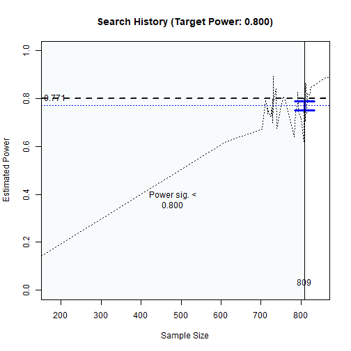
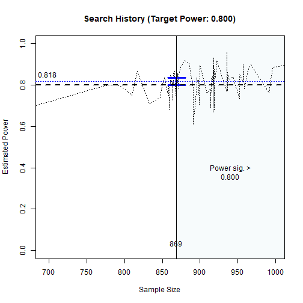
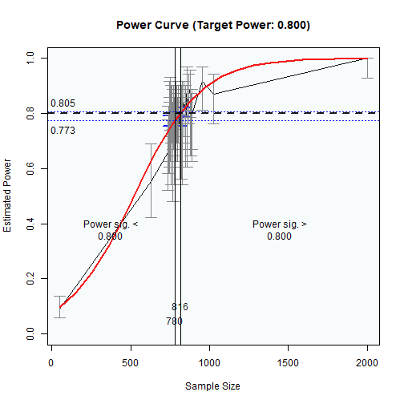
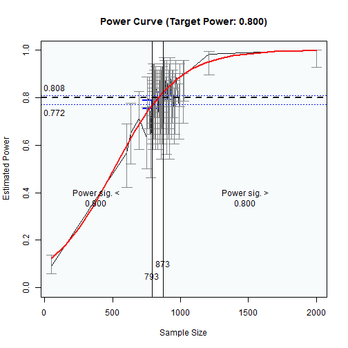

# NOTE

This article is for internal testing
of the printout.


``` r
library(power4mome)
options(power4mome.bz = TRUE)
```


``` r
mod <-
"
m ~ x
y ~ m + x
"
```


``` r
mod_es <-
"
m ~ x: m
y ~ m: s
y ~ x: s
"
```


``` r
out <- power4test(nrep = 2,
                  model = mod,
                  pop_es = mod_es,
                  n = 50000,
                  iseed = 1234)
```


``` r
print(out,
      data_long = TRUE)
#> 
#> ====================== Model Information ======================
#> 
#> == Model on Factors/Variables ==
#> 
#> m ~ x
#> y ~ m + x
#> 
#> == Model on Variables/Indicators ==
#> 
#> m ~ x
#> y ~ m + x
#> 
#> ====== Population Values ======
#> 
#> Regressions:
#>                    Population
#>   m ~                        
#>     x                 0.300  
#>   y ~                        
#>     m                 0.100  
#>     x                 0.100  
#> 
#> Variances:
#>                    Population
#>    .m                 0.910  
#>    .y                 0.974  
#>     x                 1.000  
#> 
#> (Computing indirect effects for 2 paths ...)
#> 
#> == Population Conditional/Indirect Effect(s) ==
#> 
#> == Indirect Effect(s) ==
#> 
#>               ind
#> x -> m -> y 0.030
#> x -> y      0.100
#> 
#>  - The 'ind' column shows the indirect effect(s).
#>  
#> ======================= Data Information =======================
#> 
#> Number of Replications:  2 
#> Sample Sizes:  50000 
#> 
#> ==== Descriptive Statistics ====
#> 
#>   vars     n mean sd skew kurtosis se
#> m    1 1e+05 0.00  1 0.01     0.03  0
#> y    2 1e+05 0.01  1 0.01     0.00  0
#> x    3 1e+05 0.00  1 0.01     0.01  0
#> 
#> ===== Parameter Estimates Based on All 2 Samples Combined =====
#> 
#> Total Sample Size: 100000 
#> 
#> ==== Standardized Estimates ====
#> 
#> Variances and error variances omitted.
#> 
#> Regressions:
#>                     est.std
#>   m ~                      
#>     x                 0.301
#>   y ~                      
#>     m                 0.095
#>     x                 0.101
#> 
#> 
#> ==================== Extra Element(s) Found ====================
#> 
#> - fit
#> 
#> === Element(s) of the First Dataset ===
#> 
#> ============ <fit> ============
#> 
#> lavaan 0.6-21 ended normally after 1 iteration
#> 
#>   Estimator                                         ML
#>   Optimization method                           NLMINB
#>   Number of model parameters                         5
#> 
#>   Number of observations                         50000
#> 
#> Model Test User Model:
#>                                                       
#>   Test statistic                                 0.000
#>   Degrees of freedom                                 0
```


``` r
out <- power4test(nrep = 200,
                  model = mod,
                  pop_es = mod_es,
                  n = 50,
                  R = 199,
                  ci_type = "mc",
                  test_fun = test_indirect_effect,
                  test_args = list(x = "x",
                                   m = "m",
                                   y = "y",
                                   mc_ci = TRUE),
                  iseed = 2345,
                  parallel = TRUE)
```


``` r
print(out,
      test_long = TRUE)
#> 
#> ====================== Model Information ======================
#> 
#> == Model on Factors/Variables ==
#> 
#> m ~ x
#> y ~ m + x
#> 
#> == Model on Variables/Indicators ==
#> 
#> m ~ x
#> y ~ m + x
#> 
#> ====== Population Values ======
#> 
#> Regressions:
#>                    Population
#>   m ~                        
#>     x                 0.300  
#>   y ~                        
#>     m                 0.100  
#>     x                 0.100  
#> 
#> Variances:
#>                    Population
#>    .m                 0.910  
#>    .y                 0.974  
#>     x                 1.000  
#> 
#> (Computing indirect effects for 2 paths ...)
#> 
#> == Population Conditional/Indirect Effect(s) ==
#> 
#> == Indirect Effect(s) ==
#> 
#>               ind
#> x -> m -> y 0.030
#> x -> y      0.100
#> 
#>  - The 'ind' column shows the indirect effect(s).
#>  
#> ======================= Data Information =======================
#> 
#> Number of Replications:  200 
#> Sample Sizes:  50 
#> 
#> Call print with 'data_long = TRUE' for further information.
#> 
#> ==================== Extra Element(s) Found ====================
#> 
#> - fit
#> - mc_out
#> 
#> === Element(s) of the First Dataset ===
#> 
#> ============ <fit> ============
#> 
#> lavaan 0.6-21 ended normally after 1 iteration
#> 
#>   Estimator                                         ML
#>   Optimization method                           NLMINB
#>   Number of model parameters                         5
#> 
#>   Number of observations                            50
#> 
#> Model Test User Model:
#>                                                       
#>   Test statistic                                 0.000
#>   Degrees of freedom                                 0
#> 
#> =========== <mc_out> ===========
#> 
#> 
#> == A 'mc_out' class object ==
#> 
#> Number of Monte Carlo replications: 199 
#> 
#> 
#> =============== <test_indirect: x->m->y> ===============
#> 
#> Mean(s) across replication:
#>    est cilo cihi   sig pvalue       R   nlt0 alpha bz_39 bz_79 bz_119 bz_159
#>  0.032  NaN  NaN 0.092  0.458 199.000 66.395 0.050 0.075 0.084  0.085  0.087
#>  bz_199
#>   0.090
#> 
#> - The value 'sig' is the rejection rate.
#> - If the null hypothesis is false, this is the power.
#> - Number of valid replications for rejection rate: 200 
#> - Proportion of valid replications for rejection rate: 1.000
```


``` r
out_n <- n_from_power(out,
                      what = "ub",
                      seed = 4567,
                      final_nrep = 2000,
                      algorithm = "probabilistic_bisection")
#> 
#> --- Setting ---
#> 
#> Algorithm:  probabilistic_bisection 
#> Goal:  close_enough 
#> What:  ub   (Upper bound of the confidence interval) 
#> 
#> --- Progress  ---
#> 
#> - Set 'progress = FALSE' to suppress displaying the progress.
#> Initial interval: [50, 2000] 
#> Do the simulation for the lower bound ...
#> Do the simulation for the upper bound ...
#> Search Progress Note:
#> - #: Iteration number
#> - nrep: The number of replications
#> - n/es: The value to try
#> - TE: Time elapsed
#> - ETA: Estimated time to do all 5000 replications and one final check
#> - Rep: The number of replications used out of the total number of replications
#> - Dx: The range of changes of x in the last 5 iterations
#> - Df: The range of changes of f in the last 5 iterations
#> - PP: The region(s) of probable power
#> #:1|nrep:50|n:1025|Rep:50/5000

 #:1|nrep:50|n:1025|TE:0.0177 secs|Rep:50/5000

#> #:1|nrep:50|n:1025|TE:0.0177 secs|Rep:50/5000|PP:[0.083,0.845]

#> #:2|nrep:50|n:613|TE:1.66 secs|ETA:1.85 mins|Rep:100/5000|PP:[0.083,0.845]

#> #:2|nrep:50|n:613|TE:1.66 secs|ETA:1.85 mins|Rep:100/5000|PP:[0.549,0.998]

#> #:3|nrep:50|n:862|TE:3.25 secs|ETA:2.39 mins|Rep:150/5000|PP:[0.549,0.998]

#> #:3|nrep:50|n:862|TE:3.25 secs|ETA:2.39 mins|Rep:150/5000|PP:[0.586,0.909]

#> #:4|nrep:50|n:729|TE:4.89 secs|ETA:2.69 mins|Rep:200/5000|PP:[0.586,0.909]

#> #:4|nrep:50|n:729|TE:4.89 secs|ETA:2.69 mins|Rep:200/5000|PP:[0.611,0.922]

#> #:5|nrep:50|n:711|TE:6.56 secs|ETA:2.86 mins|Rep:250/5000|PP:[0.611,0.922]

#> #:5|nrep:50|n:711|TE:6.56 secs|ETA:2.86
#> mins|Rep:250/5000|Dx:412|Df:0.267|PP:[0.…

 #:5|nrep:50|n:711|TE:6.56
#> secs|ETA:2.86 mins|Rep:250/5000|Dx:412|Df:0.267|PP:[0.…

#> #:6|nrep:50|n:702|TE:8.2 secs|ETA:2.96
#> mins|Rep:300/5000|Dx:412|Df:0.267|PP:[0.0…

 #:6|nrep:50|n:702|TE:8.2
#> secs|ETA:2.96 mins|Rep:300/5000|Dx:249|Df:0.267|PP:[0.0…

#> #:6|nrep:50|n:702|TE:8.2 secs|ETA:2.96
#> mins|Rep:300/5000|Dx:249|Df:0.267|PP:[0.6…

 #:7|nrep:50|n:786|TE:9.83
#> secs|ETA:3.02 mins|Rep:350/5000|Dx:249|Df:0.267|PP:[0.…

#> #:7|nrep:50|n:786|TE:9.83 secs|ETA:3.02
#> mins|Rep:350/5000|Dx:160|Df:0.215|PP:[0.…

 #:7|nrep:50|n:786|TE:9.83
#> secs|ETA:3.02 mins|Rep:350/5000|Dx:160|Df:0.215|PP:[0.…

#> #:8|nrep:50|n:816|TE:11.5 secs|ETA:3.06
#> mins|Rep:400/5000|Dx:160|Df:0.215|PP:[0.…

 #:8|nrep:50|n:816|TE:11.5
#> secs|ETA:3.06 mins|Rep:400/5000|Dx:114|Df:0.150|PP:[0.…

#> #:8|nrep:50|n:816|TE:11.5 secs|ETA:3.06
#> mins|Rep:400/5000|Dx:114|Df:0.150|PP:[0.…

 #:9|nrep:50|n:791|TE:13.1
#> secs|ETA:3.08 mins|Rep:450/5000|Dx:114|Df:0.150|PP:[0.…

#> #:9|nrep:50|n:791|TE:13.1 secs|ETA:3.08
#> mins|Rep:450/5000|Dx:114|Df:0.150|PP:[0.…

 #:9|nrep:50|n:791|TE:13.1
#> secs|ETA:3.08 mins|Rep:450/5000|Dx:114|Df:0.150|PP:[0.…

#> #:10|nrep:50|n:792|TE:14.8 secs|ETA:3.1
#> mins|Rep:500/5000|Dx:114|Df:0.150|PP:[0.…

 #:10|nrep:50|n:792|TE:14.8
#> secs|ETA:3.1 mins|Rep:500/5000|Dx:114|Df:0.152|PP:[0.…

#> #:10|nrep:50|n:792|TE:14.8 secs|ETA:3.1
#> mins|Rep:500/5000|Dx:114|Df:0.152|PP:[0.…

 #:11|nrep:50|n:760|TE:16.5
#> secs|ETA:3.12 mins|Rep:550/5000|Dx:114|Df:0.152|PP:[0…

#> #:11|nrep:50|n:760|TE:16.5 secs|ETA:3.12
#> mins|Rep:550/5000|Dx:56|Df:0.080|PP:[0.…

 #:11|nrep:50|n:760|TE:16.5
#> secs|ETA:3.12 mins|Rep:550/5000|Dx:56|Df:0.080|PP:[0.…

#> #:12|nrep:50|n:755|TE:18.3 secs|ETA:3.14
#> mins|Rep:600/5000|Dx:56|Df:0.080|PP:[0.…

 #:12|nrep:50|n:755|TE:18.3
#> secs|ETA:3.14 mins|Rep:600/5000|Dx:61|Df:0.047|PP:[0.…

#> #:12|nrep:50|n:755|TE:18.3 secs|ETA:3.14
#> mins|Rep:600/5000|Dx:61|Df:0.047|PP:[0.…

 #:13|nrep:50|n:738|TE:20.2
#> secs|ETA:3.16 mins|Rep:650/5000|Dx:61|Df:0.047|PP:[0.…

#> #:13|nrep:50|n:738|TE:20.2 secs|ETA:3.16
#> mins|Rep:650/5000|Dx:54|Df:0.062|PP:[0.…

 #:13|nrep:50|n:738|TE:20.2
#> secs|ETA:3.16 mins|Rep:650/5000|Dx:54|Df:0.062|PP:[0.…

#> #:14|nrep:50|n:715|TE:22.2 secs|ETA:3.19
#> mins|Rep:700/5000|Dx:54|Df:0.062|PP:[0.…

 #:14|nrep:50|n:715|TE:22.2
#> secs|ETA:3.19 mins|Rep:700/5000|Dx:77|Df:0.068|PP:[0.…

#> #:14|nrep:50|n:715|TE:22.2 secs|ETA:3.19
#> mins|Rep:700/5000|Dx:77|Df:0.068|PP:[0.…

 #:15|nrep:50|n:716|TE:24.2
#> secs|ETA:3.21 mins|Rep:750/5000|Dx:77|Df:0.068|PP:[0.…

#> #:15|nrep:50|n:716|TE:24.2 secs|ETA:3.21
#> mins|Rep:750/5000|Dx:45|Df:0.103|PP:[0.…

 #:15|nrep:50|n:716|TE:24.2
#> secs|ETA:3.21 mins|Rep:750/5000|Dx:45|Df:0.103|PP:[0.…

 #:16|nrep:50|n:727|TE:26
#> secs|ETA:3.21 mins|Rep:800/5000|Dx:45|Df:0.103|PP:[0.63…

#> #:16|nrep:50|n:727|TE:26 secs|ETA:3.21
#> mins|Rep:800/5000|Dx:40|Df:0.103|PP:[0.63…

 #:16|nrep:50|n:727|TE:26
#> secs|ETA:3.21 mins|Rep:800/5000|Dx:40|Df:0.103|PP:[0.63…

#> #:17|nrep:50|n:731|TE:27.9 secs|ETA:3.21
#> mins|Rep:850/5000|Dx:40|Df:0.103|PP:[0.…

 #:17|nrep:50|n:731|TE:27.9
#> secs|ETA:3.21 mins|Rep:850/5000|Dx:23|Df:0.103|PP:[0.…

#> #:17|nrep:50|n:731|TE:27.9 secs|ETA:3.21
#> mins|Rep:850/5000|Dx:23|Df:0.103|PP:[0.…

 #:18|nrep:50|n:730|TE:30 secs|ETA:3.22
#> mins|Rep:900/5000|Dx:23|Df:0.103|PP:[0.63…

 #:18|nrep:50|n:730|TE:30
#> secs|ETA:3.22 mins|Rep:900/5000|Dx:16|Df:0.048|PP:[0.63…

#> #:18|nrep:50|n:730|TE:30 secs|ETA:3.22
#> mins|Rep:900/5000|Dx:16|Df:0.048|PP:[0.63…

 #:19|nrep:50|n:730|TE:31.9
#> secs|ETA:3.21 mins|Rep:950/5000|Dx:16|Df:0.048|PP:[0.…

#> #:19|nrep:50|n:730|TE:31.9 secs|ETA:3.21
#> mins|Rep:950/5000|Dx:15|Df:0.155|PP:[0.…

 #:19|nrep:50|n:730|TE:31.9
#> secs|ETA:3.21 mins|Rep:950/5000|Dx:15|Df:0.155|PP:[0.…

#> #:20|nrep:50|n:717|TE:33.7 secs|ETA:3.2
#> mins|Rep:1000/5000|Dx:15|Df:0.155|PP:[0.…

 #:20|nrep:50|n:717|TE:33.7
#> secs|ETA:3.2 mins|Rep:1000/5000|Dx:14|Df:0.133|PP:[0.…

#> #:20|nrep:50|n:717|TE:33.7 secs|ETA:3.2
#> mins|Rep:1000/5000|Dx:14|Df:0.133|PP:[0.…

 #:21|nrep:50|n:719|TE:35.7
#> secs|ETA:3.19 mins|Rep:1050/5000|Dx:14|Df:0.133|PP:[0…

#> #:21|nrep:50|n:719|TE:35.7 secs|ETA:3.19
#> mins|Rep:1050/5000|Dx:14|Df:0.144|PP:[0…

 #:21|nrep:50|n:719|TE:35.7
#> secs|ETA:3.19 mins|Rep:1050/5000|Dx:14|Df:0.144|PP:[0…

#> #:22|nrep:50|n:723|TE:37.6 secs|ETA:3.18
#> mins|Rep:1100/5000|Dx:14|Df:0.144|PP:[0…

 #:22|nrep:50|n:723|TE:37.6
#> secs|ETA:3.18 mins|Rep:1100/5000|Dx:13|Df:0.169|PP:[0…

#> #:22|nrep:50|n:723|TE:37.6 secs|ETA:3.18
#> mins|Rep:1100/5000|Dx:13|Df:0.169|PP:[0…

 #:23|nrep:50|n:727|TE:39.5
#> secs|ETA:3.16 mins|Rep:1150/5000|Dx:13|Df:0.169|PP:[0…

#> #:23|nrep:50|n:727|TE:39.5 secs|ETA:3.16
#> mins|Rep:1150/5000|Dx:13|Df:0.169|PP:[0…

 #:23|nrep:50|n:727|TE:39.5
#> secs|ETA:3.16 mins|Rep:1150/5000|Dx:13|Df:0.169|PP:[0…

#> #:24|nrep:50|n:729|TE:41.4 secs|ETA:3.15
#> mins|Rep:1200/5000|Dx:13|Df:0.169|PP:[0…

 #:24|nrep:50|n:729|TE:41.4
#> secs|ETA:3.15 mins|Rep:1200/5000|Dx:12|Df:0.061|PP:[0…

#> #:24|nrep:50|n:729|TE:41.4 secs|ETA:3.15
#> mins|Rep:1200/5000|Dx:12|Df:0.061|PP:[0…

 #:25|nrep:50|n:740|TE:43.4
#> secs|ETA:3.14 mins|Rep:1250/5000|Dx:12|Df:0.061|PP:[0…

#> #:25|nrep:50|n:740|TE:43.4 secs|ETA:3.14
#> mins|Rep:1250/5000|Dx:21|Df:0.073|PP:[0…

 #:25|nrep:50|n:740|TE:43.4
#> secs|ETA:3.14 mins|Rep:1250/5000|Dx:21|Df:0.073|PP:[0…

#> #:26|nrep:50|n:783|TE:45.4 secs|ETA:3.13
#> mins|Rep:1300/5000|Dx:21|Df:0.073|PP:[0…

 #:26|nrep:50|n:783|TE:45.4
#> secs|ETA:3.13 mins|Rep:1300/5000|Dx:60|Df:0.087|PP:[0…

#> #:26|nrep:50|n:783|TE:45.4 secs|ETA:3.13
#> mins|Rep:1300/5000|Dx:60|Df:0.087|PP:[0…

 #:27|nrep:50|n:812|TE:47.4
#> secs|ETA:3.11 mins|Rep:1350/5000|Dx:60|Df:0.087|PP:[0…

#> #:27|nrep:50|n:812|TE:47.4 secs|ETA:3.11
#> mins|Rep:1350/5000|Dx:85|Df:0.220|PP:[0…

 #:27|nrep:50|n:812|TE:47.4
#> secs|ETA:3.11 mins|Rep:1350/5000|Dx:85|Df:0.220|PP:[0…

#> #:28|nrep:50|n:794|TE:49.4 secs|ETA:3.1
#> mins|Rep:1400/5000|Dx:85|Df:0.220|PP:[0.…

 #:28|nrep:50|n:794|TE:49.4
#> secs|ETA:3.1 mins|Rep:1400/5000|Dx:83|Df:0.220|PP:[0.…

#> #:28|nrep:50|n:794|TE:49.4 secs|ETA:3.1
#> mins|Rep:1400/5000|Dx:83|Df:0.220|PP:[0.…

 #:29|nrep:50|n:801|TE:51.3
#> secs|ETA:3.08 mins|Rep:1450/5000|Dx:83|Df:0.220|PP:[0…

#> #:29|nrep:50|n:801|TE:51.3 secs|ETA:3.08
#> mins|Rep:1450/5000|Dx:72|Df:0.220|PP:[0…

 #:29|nrep:50|n:801|TE:51.3
#> secs|ETA:3.08 mins|Rep:1450/5000|Dx:72|Df:0.220|PP:[0…

#> #:30|nrep:50|n:808|TE:53.4 secs|ETA:3.06
#> mins|Rep:1500/5000|Dx:72|Df:0.220|PP:[0…

 #:30|nrep:50|n:808|TE:53.4
#> secs|ETA:3.06 mins|Rep:1500/5000|Dx:29|Df:0.220|PP:[0…

#> #:30|nrep:50|n:808|TE:53.4 secs|ETA:3.06
#> mins|Rep:1500/5000|Dx:29|Df:0.220|PP:[0…

 #:31|nrep:50|n:807|TE:55.3
#> secs|ETA:3.04 mins|Rep:1550/5000|Dx:29|Df:0.220|PP:[0…

#> #:31|nrep:50|n:807|TE:55.3 secs|ETA:3.04
#> mins|Rep:1550/5000|Dx:18|Df:0.242|PP:[0…

 #:31|nrep:50|n:807|TE:55.3
#> secs|ETA:3.04 mins|Rep:1550/5000|Dx:18|Df:0.242|PP:[0…

#> #:32|nrep:50|n:825|TE:57.3 secs|ETA:3.02
#> mins|Rep:1600/5000|Dx:18|Df:0.242|PP:[0…

 #:32|nrep:50|n:825|TE:57.3
#> secs|ETA:3.02 mins|Rep:1600/5000|Dx:31|Df:0.231|PP:[0…

#> #:32|nrep:50|n:825|TE:57.3 secs|ETA:3.02
#> mins|Rep:1600/5000|Dx:31|Df:0.231|PP:[0…

 #:33|nrep:50|n:810|TE:59.5
#> secs|ETA:3.01 mins|Rep:1650/5000|Dx:31|Df:0.231|PP:[0…

#> #:33|nrep:50|n:810|TE:59.5 secs|ETA:3.01
#> mins|Rep:1650/5000|Dx:24|Df:0.231|PP:[0…

 #:33|nrep:50|n:810|TE:59.5
#> secs|ETA:3.01 mins|Rep:1650/5000|Dx:24|Df:0.231|PP:[0…

#> #:34|nrep:50|n:810|TE:1.03 mins|ETA:2.99
#> mins|Rep:1700/5000|Dx:24|Df:0.231|PP:[0…

 #:34|nrep:50|n:810|TE:1.03
#> mins|ETA:2.99 mins|Rep:1700/5000|Dx:18|Df:0.231|PP:[0…

#> #:34|nrep:50|n:810|TE:1.03 mins|ETA:2.99
#> mins|Rep:1700/5000|Dx:18|Df:0.231|PP:[0…

 #:35|nrep:50|n:814|TE:1.06
#> mins|ETA:2.97 mins|Rep:1750/5000|Dx:18|Df:0.231|PP:[0…

#> #:35|nrep:50|n:814|TE:1.06 mins|ETA:2.97
#> mins|Rep:1750/5000|Dx:18|Df:0.231|PP:[0…

 #:35|nrep:50|n:814|TE:1.06
#> mins|ETA:2.97 mins|Rep:1750/5000|Dx:18|Df:0.231|PP:[0…

#> #:36|nrep:50|n:822|TE:1.09 mins|ETA:2.95
#> mins|Rep:1800/5000|Dx:18|Df:0.231|PP:[0…

 #:36|nrep:50|n:822|TE:1.09
#> mins|ETA:2.95 mins|Rep:1800/5000|Dx:15|Df:0.143|PP:[0…

#> #:36|nrep:50|n:822|TE:1.09 mins|ETA:2.95
#> mins|Rep:1800/5000|Dx:15|Df:0.143|PP:[0…

 #:37|nrep:50|n:816|TE:1.12
#> mins|ETA:2.92 mins|Rep:1850/5000|Dx:15|Df:0.143|PP:[0…

#> #:37|nrep:50|n:816|TE:1.12 mins|ETA:2.92
#> mins|Rep:1850/5000|Dx:12|Df:0.117|PP:[0…

 #:37|nrep:50|n:816|TE:1.12
#> mins|ETA:2.92 mins|Rep:1850/5000|Dx:12|Df:0.117|PP:[0…

#> #:38|nrep:50|n:813|TE:1.16 mins|ETA:2.9
#> mins|Rep:1900/5000|Dx:12|Df:0.117|PP:[0.…

 #:38|nrep:50|n:813|TE:1.16
#> mins|ETA:2.9 mins|Rep:1900/5000|Dx:12|Df:0.134|PP:[0.…

#> #:38|nrep:50|n:813|TE:1.16 mins|ETA:2.9
#> mins|Rep:1900/5000|Dx:12|Df:0.134|PP:[0.…

 #:39|nrep:50|n:811|TE:1.19
#> mins|ETA:2.87 mins|Rep:1950/5000|Dx:12|Df:0.134|PP:[0…

#> #:39|nrep:50|n:811|TE:1.19 mins|ETA:2.87
#> mins|Rep:1950/5000|Dx:11|Df:0.125|PP:[0…

 #:39|nrep:50|n:811|TE:1.19
#> mins|ETA:2.87 mins|Rep:1950/5000|Dx:11|Df:0.125|PP:[0…

#> #:40|nrep:50|n:810|TE:1.22 mins|ETA:2.85
#> mins|Rep:2000/5000|Dx:11|Df:0.125|PP:[0…

 #:40|nrep:50|n:810|TE:1.22
#> mins|ETA:2.85 mins|Rep:2000/5000|Dx:12|Df:0.049|PP:[0…

#> #:40|nrep:50|n:810|TE:1.22 mins|ETA:2.85
#> mins|Rep:2000/5000|Dx:12|Df:0.049|PP:[0…

 #:41|nrep:50|n:808|TE:1.26
#> mins|ETA:2.83 mins|Rep:2050/5000|Dx:12|Df:0.049|PP:[0…

#> #:41|nrep:50|n:808|TE:1.26 mins|ETA:2.83
#> mins|Rep:2050/5000|Dx:8|Df:0.119|PP:[0.…

 #:41|nrep:50|n:808|TE:1.26
#> mins|ETA:2.83 mins|Rep:2050/5000|Dx:8|Df:0.119|PP:[0.…

#> #:42|nrep:50|n:809|TE:1.29 mins|ETA:2.8
#> mins|Rep:2100/5000|Dx:8|Df:0.119|PP:[0.7…

 #:42|nrep:50|n:809|TE:1.29
#> mins|ETA:2.8 mins|Rep:2100/5000|Dx:5|Df:0.119|PP:[0.7…

#> #:42|nrep:50|n:809|TE:1.29 mins|ETA:2.8
#> mins|Rep:2100/5000|Dx:5|Df:0.119|PP:[0.7…

 #:43|nrep:50|n:809|TE:1.32
#> mins|ETA:2.78 mins|Rep:2150/5000|Dx:5|Df:0.119|PP:[0.…

#> #:43|nrep:50|n:809|TE:1.32 mins|ETA:2.78
#> mins|Rep:2150/5000|Dx:3|Df:0.170|PP:[0.…

 #:43|nrep:50|n:809|TE:1.32
#> mins|ETA:2.78 mins|Rep:2150/5000|Dx:3|Df:0.170|PP:[0.…

#> #:44|nrep:50|n:810|TE:1.36 mins|ETA:2.75
#> mins|Rep:2200/5000|Dx:3|Df:0.170|PP:[0.…

 #:44|nrep:50|n:810|TE:1.36
#> mins|ETA:2.75 mins|Rep:2200/5000|Dx:2|Df:0.158|PP:[0.…

#> #:44|nrep:50|n:810|TE:1.36 mins|ETA:2.75
#> mins|Rep:2200/5000|Dx:2|Df:0.158|PP:[0.…

 #:45|nrep:50|n:809|TE:1.39
#> mins|ETA:2.73 mins|Rep:2250/5000|Dx:2|Df:0.158|PP:[0.…

#> #:45|nrep:50|n:809|TE:1.39 mins|ETA:2.73
#> mins|Rep:2250/5000|Dx:2|Df:0.131|PP:[0.…

 #:45|nrep:50|n:809|TE:1.39
#> mins|ETA:2.73 mins|Rep:2250/5000|Dx:2|Df:0.131|PP:[0.…

#> #:46|nrep:50|n:809|TE:1.43 mins|ETA:2.71
#> mins|Rep:2300/5000|Dx:2|Df:0.131|PP:[0.…

 #:46|nrep:50|n:809|TE:1.43
#> mins|ETA:2.71 mins|Rep:2300/5000|Dx:1|Df:0.131|PP:[0.…

#> #:46|nrep:50|n:809|TE:1.43 mins|ETA:2.71
#> mins|Rep:2300/5000|Dx:1|Df:0.131|PP:[0.…
#> 
#> Do Final Check 1: The range of changes of x in the last 5 iterations is less than 2.
#> #:47|nrep:2000|n:809|TE:1.47 mins|ETA:2.78
#> mins|Rep:2300/5000|Dx:1|Df:0.131|PP:[…
#> 
#> Updating the simulation for sample size: 809 
#> Re-simulate the data:
#> Fit the model(s):
#> Generate Monte Carlo estimates:
#> Update the test(s):
#> Update test_indirect: x->m->y :
#> #:47|nrep:2000|n:809|TE:1.47 mins|ETA:2.78
#> mins|Rep:2300/5000|Dx:1|Df:0.131|PP:[…
#> 
#> ** Search ended **: Solution found.
#> Summary:
#> - Number of iterations: 47 
#> - Number of replications: 2300 
#> - Time elapsed: 2.037 mins 
#> - The range of changes x in the last 5 iteration: 1 
#> - The range of changes f in the last 5 iteration: 0.131 
#> - 'nls()' estimation failed. Switch to logistic regression.
#> Solution found.
#> 
#> 
#> ========== Final Stage ==========
#> 
#> - Start at 2026-03-10 20:08:03 
#> - Rejection Rates:
#> 
#> [test]: test_indirect: x->m->y 
#> [test_label]: Test 
#>       n   est   p.v nrep reject r.cilo r.cihi
#> 1    50 0.032 1.000  200  0.092  0.058  0.138
#> 2    50 0.027 1.000   50  0.039  0.011  0.135
#> 3   613 0.030 1.000   50  0.621  0.482  0.741
#> 4   702 0.030 1.000   50  0.673  0.542  0.792
#> 5   711 0.031 1.000   50  0.795  0.670  0.888
#> 6   715 0.030 1.000   50  0.772  0.648  0.872
#> 7   716 0.033 1.000   50  0.738  0.604  0.841
#> 8   717 0.029 1.000   50  0.760  0.626  0.857
#> 9   719 0.029 1.000   50  0.749  0.604  0.841
#> 10  723 0.030 1.000   50  0.723  0.583  0.825
#> 11  727 0.029 1.000   50  0.764  0.626  0.857
#> 12  727 0.028 1.000   50  0.726  0.583  0.825
#> 13  729 0.030 1.000   50  0.800  0.670  0.888
#> 14  729 0.028 1.000   50  0.699  0.562  0.809
#> 15  730 0.030 1.000   50  0.783  0.648  0.872
#> 16  730 0.031 1.000   50  0.893  0.786  0.957
#> 17  731 0.033 1.000   50  0.786  0.648  0.872
#> 18  738 0.031 1.000   50  0.840  0.715  0.917
#> 19  740 0.030 1.000   50  0.676  0.542  0.792
#> 20  755 0.032 1.000   50  0.810  0.670  0.888
#> 21  760 0.030 1.000   50  0.795  0.670  0.888
#> 22  783 0.028 1.000   50  0.640  0.501  0.759
#> 23  786 0.029 1.000   50  0.746  0.604  0.841
#> 24  791 0.029 1.000   50  0.778  0.648  0.872
#> 25  792 0.030 1.000   50  0.825  0.692  0.902
#> 26  794 0.028 1.000   50  0.747  0.604  0.841
#> 27  801 0.030 1.000   50  0.715  0.583  0.825
#> 28  807 0.025 1.000   50  0.617  0.482  0.741
#> 29  808 0.031 1.000   50  0.800  0.670  0.888
#> 30  808 0.030 1.000   50  0.745  0.604  0.841
#> 31  809 0.030 1.000   50  0.755  0.626  0.857
#> 32  809 0.027 1.000   50  0.694  0.562  0.809
#> 33  809 0.028 1.000   50  0.755  0.626  0.857
#> 34  809 0.028 1.000   50  0.729  0.583  0.825
#> 35  809 0.030 1.000 2000  0.771  0.752  0.789
#> 36  810 0.028 1.000   50  0.779  0.648  0.872
#> 37  810 0.029 1.000   50  0.705  0.562  0.809
#> 38  810 0.031 1.000   50  0.851  0.738  0.930
#> 39  810 0.032 1.000   50  0.825  0.692  0.902
#> 40  811 0.032 1.000   50  0.864  0.738  0.930
#> 41  812 0.031 1.000   50  0.859  0.738  0.930
#> 42  813 0.031 1.000   50  0.839  0.715  0.917
#> 43  814 0.029 1.000   50  0.739  0.604  0.841
#> 44  816 0.030 1.000   50  0.824  0.692  0.902
#> 45  816 0.031 1.000   50  0.822  0.692  0.902
#> 46  822 0.030 1.000   50  0.815  0.692  0.902
#> 47  825 0.030 1.000   50  0.848  0.715  0.917
#> 48  862 0.031 1.000   50  0.888  0.762  0.944
#> 49 1025 0.028 1.000   50  0.886  0.762  0.944
#> 50 2000 0.029 1.000   50  0.982  0.895  0.996
#> Notes:
#> - n: The sample size in a trial.
#> - p.v: The proportion of valid replications.
#> - nrep: The number of replications.
#> - est: The mean of the estimates in a test across replications.
#> - reject: The proportion of 'significant' replications, that is, the
#>   rejection rate. If the null hypothesis is true, this is the Type I
#>   error rate. If the null hypothesis is false, this is the power.
#> - r.cilo,r.cihi: The confidence interval of the rejection rate, based
#>   on Wilson's (1927) method.
#> - Refer to the tests for the meanings of other columns.
#> 
#> - Estimated Power Curve:
#> 
#> Call:
#> power_curve(object = by_x_1, formula = power_model, start = power_curve_start, 
#>     lower_bound = lower_bound, upper_bound = upper_bound, nls_args = nls_args, 
#>     nls_control = nls_control, verbose = progress)
#> 
#> Predictor: n (Sample Size)
#> 
#> Model:
#> 
#> Call:  stats::glm(formula = reject ~ x, family = "binomial", data = reject1)
#> 
#> Coefficients:
#> (Intercept)            x  
#>   -2.369319     0.004525  
#> 
#> Degrees of Freedom: 4599 Total (i.e. Null);  4598 Residual
#> Null Deviance:	    5314 
#> Residual Deviance: 4781 	AIC: 4785
#> 
#> 
#> - Final Value: 809 
#> 
#> - Final Estimated Power: 0.7709 
#> - Confidence Interval: [0.7521; 0.7889]
#> - CI Level: 95.00%
```


``` r
out_n
#> Call:
#> power4mome::x_from_power(object = out, x = "n", what = "ub", 
#>     goal = "close_enough", final_nrep = 2000, final_R = 199, 
#>     seed = 4567, algorithm = "probabilistic_bisection")
#> 
#>                                      Setting
#> Predictor(x):                    Sample Size
#> Parameter:                               N/A
#> goal:                           close_enough
#> what:                                     ub
#> algorithm:           probabilistic_bisection
#> Level of confidence:                  95.00%
#> Target Power:                          0.800
#> 
#> - Final Value of Sample Size (n): 809
#> 
#> - Final Estimated Power (CI): 0.771 [0.752, 0.789]
#> 
#> Call `summary()` for detailed results.
```


``` r
summary(out_n)
#> 
#> ====== x_from_power Results ======
#> 
#> Call:
#> x_from_power(object = out, x = "n", what = "ub", goal = "close_enough", 
#>     final_nrep = 2000, final_R = 199, seed = 4567, algorithm = "probabilistic_bisection")
#> 
#> Predictor (x): Sample Size 
#> 
#> - Target Power: 0.800 
#> - Goal: Find 'x' with estimated upper confidence bound close enough to
#>   the target power.
#> 
#> === Major Results ===
#> 
#> - Final Value (Sample Size): 809
#> 
#> - Final Estimated Power: 0.771 
#> - Confidence Interval: [0.752; 0.789]
#> - Level of confidence: 95.0%
#> - Based on 2000 replications.
#> 
#> === Technical Information ===
#> 
#> - Algorithm: probabilistic_bisection 
#> - Tolerance for 'close enough': Within 0.01580 of 0.800 
#> - The range of values explored: 50 to 2000 
#> - Time spent in the search: 2.112 mins 
#> - The final crude model for the power-predictor relation:
#> 
#> Model Type: Logistic Regression 
#> 
#> Call:
#> power_curve(object = by_x_1, formula = power_model, start = power_curve_start, 
#>     lower_bound = lower_bound, upper_bound = upper_bound, nls_args = nls_args, 
#>     nls_control = nls_control, verbose = progress)
#> 
#> Predictor: n (Sample Size)
#> 
#> Model:
#> 
#> Call:  stats::glm(formula = reject ~ x, family = "binomial", data = reject1)
#> 
#> Coefficients:
#> (Intercept)            x  
#>   -2.369319     0.004525  
#> 
#> Degrees of Freedom: 4599 Total (i.e. Null);  4598 Residual
#> Null Deviance:	    5314 
#> Residual Deviance: 4781 	AIC: 4785
#> 
#> - Detailed Results:
#> 
#> [test]: test_indirect: x->m->y 
#> [test_label]: Test 
#>       n   est   p.v nrep reject r.cilo r.cihi
#> 1    50 0.032 1.000  200  0.092  0.058  0.138
#> 2    50 0.027 1.000   50  0.039  0.011  0.135
#> 3   613 0.030 1.000   50  0.621  0.482  0.741
#> 4   702 0.030 1.000   50  0.673  0.542  0.792
#> 5   711 0.031 1.000   50  0.795  0.670  0.888
#> 6   715 0.030 1.000   50  0.772  0.648  0.872
#> 7   716 0.033 1.000   50  0.738  0.604  0.841
#> 8   717 0.029 1.000   50  0.760  0.626  0.857
#> 9   719 0.029 1.000   50  0.749  0.604  0.841
#> 10  723 0.030 1.000   50  0.723  0.583  0.825
#> 11  727 0.029 1.000   50  0.764  0.626  0.857
#> 12  727 0.028 1.000   50  0.726  0.583  0.825
#> 13  729 0.030 1.000   50  0.800  0.670  0.888
#> 14  729 0.028 1.000   50  0.699  0.562  0.809
#> 15  730 0.030 1.000   50  0.783  0.648  0.872
#> 16  730 0.031 1.000   50  0.893  0.786  0.957
#> 17  731 0.033 1.000   50  0.786  0.648  0.872
#> 18  738 0.031 1.000   50  0.840  0.715  0.917
#> 19  740 0.030 1.000   50  0.676  0.542  0.792
#> 20  755 0.032 1.000   50  0.810  0.670  0.888
#> 21  760 0.030 1.000   50  0.795  0.670  0.888
#> 22  783 0.028 1.000   50  0.640  0.501  0.759
#> 23  786 0.029 1.000   50  0.746  0.604  0.841
#> 24  791 0.029 1.000   50  0.778  0.648  0.872
#> 25  792 0.030 1.000   50  0.825  0.692  0.902
#> 26  794 0.028 1.000   50  0.747  0.604  0.841
#> 27  801 0.030 1.000   50  0.715  0.583  0.825
#> 28  807 0.025 1.000   50  0.617  0.482  0.741
#> 29  808 0.031 1.000   50  0.800  0.670  0.888
#> 30  808 0.030 1.000   50  0.745  0.604  0.841
#> 31  809 0.030 1.000   50  0.755  0.626  0.857
#> 32  809 0.027 1.000   50  0.694  0.562  0.809
#> 33  809 0.028 1.000   50  0.755  0.626  0.857
#> 34  809 0.028 1.000   50  0.729  0.583  0.825
#> 35  809 0.030 1.000 2000  0.771  0.752  0.789
#> 36  810 0.028 1.000   50  0.779  0.648  0.872
#> 37  810 0.029 1.000   50  0.705  0.562  0.809
#> 38  810 0.031 1.000   50  0.851  0.738  0.930
#> 39  810 0.032 1.000   50  0.825  0.692  0.902
#> 40  811 0.032 1.000   50  0.864  0.738  0.930
#> 41  812 0.031 1.000   50  0.859  0.738  0.930
#> 42  813 0.031 1.000   50  0.839  0.715  0.917
#> 43  814 0.029 1.000   50  0.739  0.604  0.841
#> 44  816 0.030 1.000   50  0.824  0.692  0.902
#> 45  816 0.031 1.000   50  0.822  0.692  0.902
#> 46  822 0.030 1.000   50  0.815  0.692  0.902
#> 47  825 0.030 1.000   50  0.848  0.715  0.917
#> 48  862 0.031 1.000   50  0.888  0.762  0.944
#> 49 1025 0.028 1.000   50  0.886  0.762  0.944
#> 50 2000 0.029 1.000   50  0.982  0.895  0.996
#> Notes:
#> - n: The sample size in a trial.
#> - p.v: The proportion of valid replications.
#> - nrep: The number of replications.
#> - est: The mean of the estimates in a test across replications.
#> - reject: The proportion of 'significant' replications, that is, the
#>   rejection rate. If the null hypothesis is true, this is the Type I
#>   error rate. If the null hypothesis is false, this is the power.
#> - r.cilo,r.cihi: The confidence interval of the rejection rate, based
#>   on Wilson's (1927) method.
#> - Refer to the tests for the meanings of other columns.
```


``` r
plot(out_n)
```

<div class="figure" style="text-align: center">

<p class="caption">The Power Curve</p>
</div>


``` r
out_n_lb <- n_from_power(out,
                         what = "lb",
                         seed = 2345,
                         final_nrep = 2000,
                         algorithm = "probabilistic_bisection")
#> 
#> --- Setting ---
#> 
#> Algorithm:  probabilistic_bisection 
#> Goal:  close_enough 
#> What:  lb   (Lower bound of the confidence interval) 
#> 
#> --- Progress  ---
#> 
#> - Set 'progress = FALSE' to suppress displaying the progress.
#> Initial interval: [50, 2000] 
#> Do the simulation for the lower bound ...
#> Do the simulation for the upper bound ...
#> Search Progress Note:
#> - #: Iteration number
#> - nrep: The number of replications
#> - n/es: The value to try
#> - TE: Time elapsed
#> - ETA: Estimated time to do all 5000 replications and one final check
#> - Rep: The number of replications used out of the total number of replications
#> - Dx: The range of changes of x in the last 5 iterations
#> - Df: The range of changes of f in the last 5 iterations
#> - PP: The region(s) of probable power
#> #:1|nrep:50|n:1025|Rep:50/5000

 #:1|nrep:50|n:1025|TE:0.0202 secs|Rep:50/5000

#> #:1|nrep:50|n:1025|TE:0.0202 secs|Rep:50/5000|PP:[0.088,0.902]

#> #:2|nrep:50|n:636|TE:1.65 secs|ETA:1.83 mins|Rep:100/5000|PP:[0.088,0.902]

#> #:2|nrep:50|n:636|TE:1.65 secs|ETA:1.83 mins|Rep:100/5000|PP:[0.631,0.999]

#> #:3|nrep:50|n:896|TE:3.34 secs|ETA:2.44 mins|Rep:150/5000|PP:[0.631,0.999]

#> #:3|nrep:50|n:896|TE:3.34 secs|ETA:2.44 mins|Rep:150/5000|PP:[0.605,0.999]

#> #:4|nrep:50|n:952|TE:5.05 secs|ETA:2.75 mins|Rep:200/5000|PP:[0.605,0.999]

#> #:4|nrep:50|n:952|TE:5.05 secs|ETA:2.75 mins|Rep:200/5000|PP:[0.799,0.998]

#> #:5|nrep:50|n:1210|TE:6.77 secs|ETA:2.94 mins|Rep:250/5000|PP:[0.799,0.998]

#> #:5|nrep:50|n:1210|TE:6.77 secs|ETA:2.94
#> mins|Rep:250/5000|Dx:574|Df:0.331|PP:[0…

 #:5|nrep:50|n:1210|TE:6.77
#> secs|ETA:2.94 mins|Rep:250/5000|Dx:574|Df:0.331|PP:[0…

#> #:6|nrep:50|n:991|TE:8.51 secs|ETA:3.05
#> mins|Rep:300/5000|Dx:574|Df:0.331|PP:[0.…

 #:6|nrep:50|n:991|TE:8.51
#> secs|ETA:3.05 mins|Rep:300/5000|Dx:574|Df:0.331|PP:[0.…

#> #:6|nrep:50|n:991|TE:8.51 secs|ETA:3.05
#> mins|Rep:300/5000|Dx:574|Df:0.331|PP:[0.…

 #:7|nrep:50|n:1021|TE:10.2
#> secs|ETA:3.11 mins|Rep:350/5000|Dx:574|Df:0.331|PP:[0…

#> #:7|nrep:50|n:1021|TE:10.2 secs|ETA:3.11
#> mins|Rep:350/5000|Dx:314|Df:0.250|PP:[0…

 #:7|nrep:50|n:1021|TE:10.2
#> secs|ETA:3.11 mins|Rep:350/5000|Dx:314|Df:0.250|PP:[0…

#> #:8|nrep:50|n:1020|TE:11.9 secs|ETA:3.14
#> mins|Rep:400/5000|Dx:314|Df:0.250|PP:[0…

 #:8|nrep:50|n:1020|TE:11.9
#> secs|ETA:3.14 mins|Rep:400/5000|Dx:258|Df:0.250|PP:[0…

#> #:8|nrep:50|n:1020|TE:11.9 secs|ETA:3.14
#> mins|Rep:400/5000|Dx:258|Df:0.250|PP:[0…

 #:9|nrep:50|n:996|TE:13.7
#> secs|ETA:3.18 mins|Rep:450/5000|Dx:258|Df:0.250|PP:[0.…

#> #:9|nrep:50|n:996|TE:13.7 secs|ETA:3.18
#> mins|Rep:450/5000|Dx:219|Df:0.222|PP:[0.…

 #:9|nrep:50|n:996|TE:13.7
#> secs|ETA:3.18 mins|Rep:450/5000|Dx:219|Df:0.222|PP:[0.…

#> #:10|nrep:50|n:967|TE:15.5 secs|ETA:3.22
#> mins|Rep:500/5000|Dx:219|Df:0.222|PP:[0…

 #:10|nrep:50|n:967|TE:15.5
#> secs|ETA:3.22 mins|Rep:500/5000|Dx:54|Df:0.142|PP:[0.…

#> #:10|nrep:50|n:967|TE:15.5 secs|ETA:3.22
#> mins|Rep:500/5000|Dx:54|Df:0.142|PP:[0.…

 #:11|nrep:50|n:891|TE:17.5
#> secs|ETA:3.26 mins|Rep:550/5000|Dx:54|Df:0.142|PP:[0.…

#> #:11|nrep:50|n:891|TE:17.5 secs|ETA:3.26
#> mins|Rep:550/5000|Dx:130|Df:0.116|PP:[0…

 #:11|nrep:50|n:891|TE:17.5
#> secs|ETA:3.26 mins|Rep:550/5000|Dx:130|Df:0.116|PP:[0…

#> #:12|nrep:50|n:937|TE:19.4 secs|ETA:3.27
#> mins|Rep:600/5000|Dx:130|Df:0.116|PP:[0…

 #:12|nrep:50|n:937|TE:19.4
#> secs|ETA:3.27 mins|Rep:600/5000|Dx:129|Df:0.116|PP:[0…

#> #:12|nrep:50|n:937|TE:19.4 secs|ETA:3.27
#> mins|Rep:600/5000|Dx:129|Df:0.116|PP:[0…

 #:13|nrep:50|n:900|TE:21.3
#> secs|ETA:3.29 mins|Rep:650/5000|Dx:129|Df:0.116|PP:[0…

#> #:13|nrep:50|n:900|TE:21.3 secs|ETA:3.29
#> mins|Rep:650/5000|Dx:105|Df:0.110|PP:[0…

 #:13|nrep:50|n:900|TE:21.3
#> secs|ETA:3.29 mins|Rep:650/5000|Dx:105|Df:0.110|PP:[0…

#> #:14|nrep:50|n:774|TE:23.1 secs|ETA:3.3
#> mins|Rep:700/5000|Dx:105|Df:0.110|PP:[0.…

 #:14|nrep:50|n:774|TE:23.1
#> secs|ETA:3.3 mins|Rep:700/5000|Dx:193|Df:0.110|PP:[0.…

#> #:14|nrep:50|n:774|TE:23.1 secs|ETA:3.3
#> mins|Rep:700/5000|Dx:193|Df:0.110|PP:[0.…

 #:15|nrep:50|n:801|TE:25 secs|ETA:3.3
#> mins|Rep:750/5000|Dx:193|Df:0.110|PP:[0.09…

 #:15|nrep:50|n:801|TE:25
#> secs|ETA:3.3 mins|Rep:750/5000|Dx:163|Df:0.115|PP:[0.09…

#> #:15|nrep:50|n:801|TE:25 secs|ETA:3.3
#> mins|Rep:750/5000|Dx:163|Df:0.115|PP:[0.58…

 #:16|nrep:50|n:847|TE:27
#> secs|ETA:3.31 mins|Rep:800/5000|Dx:163|Df:0.115|PP:[0.5…

#> #:16|nrep:50|n:847|TE:27 secs|ETA:3.31
#> mins|Rep:800/5000|Dx:163|Df:0.156|PP:[0.5…

 #:16|nrep:50|n:847|TE:27
#> secs|ETA:3.31 mins|Rep:800/5000|Dx:163|Df:0.156|PP:[0.5…

#> #:17|nrep:50|n:896|TE:28.7 secs|ETA:3.29
#> mins|Rep:850/5000|Dx:163|Df:0.156|PP:[0…

 #:17|nrep:50|n:896|TE:28.7
#> secs|ETA:3.29 mins|Rep:850/5000|Dx:126|Df:0.156|PP:[0…

#> #:17|nrep:50|n:896|TE:28.7 secs|ETA:3.29
#> mins|Rep:850/5000|Dx:126|Df:0.156|PP:[0…

 #:18|nrep:50|n:891|TE:30.6
#> secs|ETA:3.28 mins|Rep:900/5000|Dx:126|Df:0.156|PP:[0…

#> #:18|nrep:50|n:891|TE:30.6 secs|ETA:3.28
#> mins|Rep:900/5000|Dx:122|Df:0.224|PP:[0…

 #:18|nrep:50|n:891|TE:30.6
#> secs|ETA:3.28 mins|Rep:900/5000|Dx:122|Df:0.224|PP:[0…

#> #:19|nrep:50|n:935|TE:32.5 secs|ETA:3.26
#> mins|Rep:950/5000|Dx:122|Df:0.224|PP:[0…

 #:19|nrep:50|n:935|TE:32.5
#> secs|ETA:3.26 mins|Rep:950/5000|Dx:134|Df:0.224|PP:[0…

#> #:19|nrep:50|n:935|TE:32.5 secs|ETA:3.26
#> mins|Rep:950/5000|Dx:134|Df:0.224|PP:[0…

 #:20|nrep:50|n:958|TE:34.3
#> secs|ETA:3.25 mins|Rep:1000/5000|Dx:134|Df:0.224|PP:[…

#> #:20|nrep:50|n:958|TE:34.3 secs|ETA:3.25
#> mins|Rep:1000/5000|Dx:111|Df:0.224|PP:[…

 #:20|nrep:50|n:958|TE:34.3
#> secs|ETA:3.25 mins|Rep:1000/5000|Dx:111|Df:0.224|PP:[…

#> #:21|nrep:50|n:963|TE:36.2 secs|ETA:3.24
#> mins|Rep:1050/5000|Dx:111|Df:0.224|PP:[…

 #:21|nrep:50|n:963|TE:36.2
#> secs|ETA:3.24 mins|Rep:1050/5000|Dx:72|Df:0.264|PP:[0…

#> #:21|nrep:50|n:963|TE:36.2 secs|ETA:3.24
#> mins|Rep:1050/5000|Dx:72|Df:0.264|PP:[0…

 #:22|nrep:50|n:957|TE:38.1
#> secs|ETA:3.22 mins|Rep:1100/5000|Dx:72|Df:0.264|PP:[0…

#> #:22|nrep:50|n:957|TE:38.1 secs|ETA:3.22
#> mins|Rep:1100/5000|Dx:72|Df:0.264|PP:[0…

 #:22|nrep:50|n:957|TE:38.1
#> secs|ETA:3.22 mins|Rep:1100/5000|Dx:72|Df:0.264|PP:[0…

#> #:23|nrep:50|n:957|TE:40.1 secs|ETA:3.21
#> mins|Rep:1150/5000|Dx:72|Df:0.264|PP:[0…

 #:23|nrep:50|n:957|TE:40.1
#> secs|ETA:3.21 mins|Rep:1150/5000|Dx:28|Df:0.130|PP:[0…

#> #:23|nrep:50|n:957|TE:40.1 secs|ETA:3.21
#> mins|Rep:1150/5000|Dx:28|Df:0.130|PP:[0…

 #:24|nrep:50|n:936|TE:42.1
#> secs|ETA:3.2 mins|Rep:1200/5000|Dx:28|Df:0.130|PP:[0.…

#> #:24|nrep:50|n:936|TE:42.1 secs|ETA:3.2
#> mins|Rep:1200/5000|Dx:27|Df:0.128|PP:[0.…

 #:24|nrep:50|n:936|TE:42.1
#> secs|ETA:3.2 mins|Rep:1200/5000|Dx:27|Df:0.128|PP:[0.…

 #:25|nrep:50|n:952|TE:44
#> secs|ETA:3.18 mins|Rep:1250/5000|Dx:27|Df:0.128|PP:[0.7…

#> #:25|nrep:50|n:952|TE:44 secs|ETA:3.18
#> mins|Rep:1250/5000|Dx:27|Df:0.128|PP:[0.7…

 #:25|nrep:50|n:952|TE:44
#> secs|ETA:3.18 mins|Rep:1250/5000|Dx:27|Df:0.128|PP:[0.7…

#> #:26|nrep:50|n:943|TE:46 secs|ETA:3.16
#> mins|Rep:1300/5000|Dx:27|Df:0.128|PP:[0.7…

 #:26|nrep:50|n:943|TE:46
#> secs|ETA:3.16 mins|Rep:1300/5000|Dx:21|Df:0.128|PP:[0.7…

#> #:26|nrep:50|n:943|TE:46 secs|ETA:3.16
#> mins|Rep:1300/5000|Dx:21|Df:0.128|PP:[0.7…

 #:27|nrep:50|n:938|TE:48
#> secs|ETA:3.15 mins|Rep:1350/5000|Dx:21|Df:0.128|PP:[0.7…

#> #:27|nrep:50|n:938|TE:48 secs|ETA:3.15
#> mins|Rep:1350/5000|Dx:21|Df:0.128|PP:[0.7…

 #:27|nrep:50|n:938|TE:48
#> secs|ETA:3.15 mins|Rep:1350/5000|Dx:21|Df:0.128|PP:[0.7…

#> #:28|nrep:50|n:937|TE:50 secs|ETA:3.13
#> mins|Rep:1400/5000|Dx:21|Df:0.128|PP:[0.7…

 #:28|nrep:50|n:937|TE:50
#> secs|ETA:3.13 mins|Rep:1400/5000|Dx:16|Df:0.080|PP:[0.7…

#> #:28|nrep:50|n:937|TE:50 secs|ETA:3.13
#> mins|Rep:1400/5000|Dx:16|Df:0.080|PP:[0.5…

 #:29|nrep:50|n:935|TE:52
#> secs|ETA:3.12 mins|Rep:1450/5000|Dx:16|Df:0.080|PP:[0.5…

#> #:29|nrep:50|n:935|TE:52 secs|ETA:3.12
#> mins|Rep:1450/5000|Dx:17|Df:0.036|PP:[0.5…

 #:29|nrep:50|n:935|TE:52
#> secs|ETA:3.12 mins|Rep:1450/5000|Dx:17|Df:0.036|PP:[0.5…

#> #:30|nrep:50|n:936|TE:54.1 secs|ETA:3.11
#> mins|Rep:1500/5000|Dx:17|Df:0.036|PP:[0…

 #:30|nrep:50|n:936|TE:54.1
#> secs|ETA:3.11 mins|Rep:1500/5000|Dx:8|Df:0.026|PP:[0.…

#> #:30|nrep:50|n:936|TE:54.1 secs|ETA:3.11
#> mins|Rep:1500/5000|Dx:8|Df:0.026|PP:[0.…

 #:31|nrep:50|n:935|TE:56.1
#> secs|ETA:3.09 mins|Rep:1550/5000|Dx:8|Df:0.026|PP:[0.…

#> #:31|nrep:50|n:935|TE:56.1 secs|ETA:3.09
#> mins|Rep:1550/5000|Dx:3|Df:0.145|PP:[0.…

 #:31|nrep:50|n:935|TE:56.1
#> secs|ETA:3.09 mins|Rep:1550/5000|Dx:3|Df:0.145|PP:[0.…

#> #:32|nrep:50|n:898|TE:58.3 secs|ETA:3.07
#> mins|Rep:1600/5000|Dx:3|Df:0.145|PP:[0.…

 #:32|nrep:50|n:898|TE:58.3
#> secs|ETA:3.07 mins|Rep:1600/5000|Dx:39|Df:0.150|PP:[0…

#> #:32|nrep:50|n:898|TE:58.3 secs|ETA:3.07
#> mins|Rep:1600/5000|Dx:39|Df:0.150|PP:[0…

 #:33|nrep:50|n:898|TE:1.01
#> mins|ETA:3.05 mins|Rep:1650/5000|Dx:39|Df:0.150|PP:[0…

#> #:33|nrep:50|n:898|TE:1.01 mins|ETA:3.05
#> mins|Rep:1650/5000|Dx:38|Df:0.150|PP:[0…

 #:33|nrep:50|n:898|TE:1.01
#> mins|ETA:3.05 mins|Rep:1650/5000|Dx:38|Df:0.150|PP:[0…

#> #:34|nrep:50|n:898|TE:1.04 mins|ETA:3.03
#> mins|Rep:1700/5000|Dx:38|Df:0.150|PP:[0…

 #:34|nrep:50|n:898|TE:1.04
#> mins|ETA:3.03 mins|Rep:1700/5000|Dx:38|Df:0.159|PP:[0…

#> #:34|nrep:50|n:898|TE:1.04 mins|ETA:3.03
#> mins|Rep:1700/5000|Dx:38|Df:0.159|PP:[0…

 #:35|nrep:50|n:899|TE:1.07
#> mins|ETA:3.01 mins|Rep:1750/5000|Dx:38|Df:0.159|PP:[0…

#> #:35|nrep:50|n:899|TE:1.07 mins|ETA:3.01
#> mins|Rep:1750/5000|Dx:37|Df:0.255|PP:[0…

 #:35|nrep:50|n:899|TE:1.07
#> mins|ETA:3.01 mins|Rep:1750/5000|Dx:37|Df:0.255|PP:[0…

#> #:36|nrep:50|n:917|TE:1.1 mins|ETA:2.98
#> mins|Rep:1800/5000|Dx:37|Df:0.255|PP:[0.…

 #:36|nrep:50|n:917|TE:1.1
#> mins|ETA:2.98 mins|Rep:1800/5000|Dx:19|Df:0.123|PP:[0.…

#> #:36|nrep:50|n:917|TE:1.1 mins|ETA:2.98
#> mins|Rep:1800/5000|Dx:19|Df:0.123|PP:[0.…

 #:37|nrep:50|n:922|TE:1.14
#> mins|ETA:2.96 mins|Rep:1850/5000|Dx:19|Df:0.123|PP:[0…

#> #:37|nrep:50|n:922|TE:1.14 mins|ETA:2.96
#> mins|Rep:1850/5000|Dx:24|Df:0.214|PP:[0…

 #:37|nrep:50|n:922|TE:1.14
#> mins|ETA:2.96 mins|Rep:1850/5000|Dx:24|Df:0.214|PP:[0…

#> #:38|nrep:50|n:909|TE:1.17 mins|ETA:2.93
#> mins|Rep:1900/5000|Dx:24|Df:0.214|PP:[0…

 #:38|nrep:50|n:909|TE:1.17
#> mins|ETA:2.93 mins|Rep:1900/5000|Dx:24|Df:0.214|PP:[0…

#> #:38|nrep:50|n:909|TE:1.17 mins|ETA:2.93
#> mins|Rep:1900/5000|Dx:24|Df:0.214|PP:[0…

 #:39|nrep:50|n:916|TE:1.2
#> mins|ETA:2.91 mins|Rep:1950/5000|Dx:24|Df:0.214|PP:[0.…

#> #:39|nrep:50|n:916|TE:1.2 mins|ETA:2.91
#> mins|Rep:1950/5000|Dx:23|Df:0.214|PP:[0.…

 #:39|nrep:50|n:916|TE:1.2
#> mins|ETA:2.91 mins|Rep:1950/5000|Dx:23|Df:0.214|PP:[0.…

#> #:40|nrep:50|n:914|TE:1.24 mins|ETA:2.88
#> mins|Rep:2000/5000|Dx:23|Df:0.214|PP:[0…

 #:40|nrep:50|n:914|TE:1.24
#> mins|ETA:2.88 mins|Rep:2000/5000|Dx:13|Df:0.159|PP:[0…

#> #:40|nrep:50|n:914|TE:1.24 mins|ETA:2.88
#> mins|Rep:2000/5000|Dx:13|Df:0.159|PP:[0…

 #:41|nrep:50|n:917|TE:1.27
#> mins|ETA:2.86 mins|Rep:2050/5000|Dx:13|Df:0.159|PP:[0…

#> #:41|nrep:50|n:917|TE:1.27 mins|ETA:2.86
#> mins|Rep:2050/5000|Dx:13|Df:0.159|PP:[0…

 #:41|nrep:50|n:917|TE:1.27
#> mins|ETA:2.86 mins|Rep:2050/5000|Dx:13|Df:0.159|PP:[0…

#> #:42|nrep:50|n:917|TE:1.3 mins|ETA:2.83
#> mins|Rep:2100/5000|Dx:13|Df:0.159|PP:[0.…

 #:42|nrep:50|n:917|TE:1.3
#> mins|ETA:2.83 mins|Rep:2100/5000|Dx:8|Df:0.082|PP:[0.7…

#> #:42|nrep:50|n:917|TE:1.3 mins|ETA:2.83
#> mins|Rep:2100/5000|Dx:8|Df:0.082|PP:[0.7…

 #:43|nrep:50|n:915|TE:1.34
#> mins|ETA:2.81 mins|Rep:2150/5000|Dx:8|Df:0.082|PP:[0.…

#> #:43|nrep:50|n:915|TE:1.34 mins|ETA:2.81
#> mins|Rep:2150/5000|Dx:3|Df:0.059|PP:[0.…

 #:43|nrep:50|n:915|TE:1.34
#> mins|ETA:2.81 mins|Rep:2150/5000|Dx:3|Df:0.059|PP:[0.…

#> #:44|nrep:50|n:914|TE:1.38 mins|ETA:2.79
#> mins|Rep:2200/5000|Dx:3|Df:0.059|PP:[0.…

 #:44|nrep:50|n:914|TE:1.38
#> mins|ETA:2.79 mins|Rep:2200/5000|Dx:3|Df:0.155|PP:[0.…

#> #:44|nrep:50|n:914|TE:1.38 mins|ETA:2.79
#> mins|Rep:2200/5000|Dx:3|Df:0.155|PP:[0.…

 #:45|nrep:50|n:918|TE:1.41
#> mins|ETA:2.76 mins|Rep:2250/5000|Dx:3|Df:0.155|PP:[0.…

#> #:45|nrep:50|n:918|TE:1.41 mins|ETA:2.76
#> mins|Rep:2250/5000|Dx:4|Df:0.155|PP:[0.…

 #:45|nrep:50|n:918|TE:1.41
#> mins|ETA:2.76 mins|Rep:2250/5000|Dx:4|Df:0.155|PP:[0.…

#> #:46|nrep:50|n:917|TE:1.44 mins|ETA:2.74
#> mins|Rep:2300/5000|Dx:4|Df:0.155|PP:[0.…

 #:46|nrep:50|n:917|TE:1.44
#> mins|ETA:2.74 mins|Rep:2300/5000|Dx:4|Df:0.174|PP:[0.…

#> #:46|nrep:50|n:917|TE:1.44 mins|ETA:2.74
#> mins|Rep:2300/5000|Dx:4|Df:0.174|PP:[0.…

 #:47|nrep:50|n:920|TE:1.48
#> mins|ETA:2.71 mins|Rep:2350/5000|Dx:4|Df:0.174|PP:[0.…

#> #:47|nrep:50|n:920|TE:1.48 mins|ETA:2.71
#> mins|Rep:2350/5000|Dx:6|Df:0.171|PP:[0.…

 #:47|nrep:50|n:920|TE:1.48
#> mins|ETA:2.71 mins|Rep:2350/5000|Dx:6|Df:0.171|PP:[0.…

#> #:48|nrep:50|n:919|TE:1.51 mins|ETA:2.68
#> mins|Rep:2400/5000|Dx:6|Df:0.171|PP:[0.…

 #:48|nrep:50|n:919|TE:1.51
#> mins|ETA:2.68 mins|Rep:2400/5000|Dx:6|Df:0.171|PP:[0.…

#> #:48|nrep:50|n:919|TE:1.51 mins|ETA:2.68
#> mins|Rep:2400/5000|Dx:6|Df:0.171|PP:[0.…

 #:49|nrep:50|n:921|TE:1.55
#> mins|ETA:2.66 mins|Rep:2450/5000|Dx:6|Df:0.171|PP:[0.…

#> #:49|nrep:50|n:921|TE:1.55 mins|ETA:2.66
#> mins|Rep:2450/5000|Dx:4|Df:0.208|PP:[0.…

 #:49|nrep:50|n:921|TE:1.55
#> mins|ETA:2.66 mins|Rep:2450/5000|Dx:4|Df:0.208|PP:[0.…

#> #:50|nrep:50|n:920|TE:1.58 mins|ETA:2.63
#> mins|Rep:2500/5000|Dx:4|Df:0.208|PP:[0.…

 #:50|nrep:50|n:920|TE:1.58
#> mins|ETA:2.63 mins|Rep:2500/5000|Dx:4|Df:0.208|PP:[0.…

#> #:50|nrep:50|n:920|TE:1.58 mins|ETA:2.63
#> mins|Rep:2500/5000|Dx:4|Df:0.208|PP:[0.…

 #:51|nrep:50|n:919|TE:1.62
#> mins|ETA:2.6 mins|Rep:2550/5000|Dx:4|Df:0.208|PP:[0.7…

#> #:51|nrep:50|n:919|TE:1.62 mins|ETA:2.6
#> mins|Rep:2550/5000|Dx:2|Df:0.195|PP:[0.7…

 #:51|nrep:50|n:919|TE:1.62
#> mins|ETA:2.6 mins|Rep:2550/5000|Dx:2|Df:0.195|PP:[0.7…

#> #:52|nrep:50|n:919|TE:1.65 mins|ETA:2.58
#> mins|Rep:2600/5000|Dx:2|Df:0.195|PP:[0.…

 #:52|nrep:50|n:919|TE:1.65
#> mins|ETA:2.58 mins|Rep:2600/5000|Dx:2|Df:0.195|PP:[0.…

#> #:52|nrep:50|n:919|TE:1.65 mins|ETA:2.58
#> mins|Rep:2600/5000|Dx:2|Df:0.195|PP:[0.…

 #:53|nrep:50|n:918|TE:1.69
#> mins|ETA:2.55 mins|Rep:2650/5000|Dx:2|Df:0.195|PP:[0.…

#> #:53|nrep:50|n:918|TE:1.69 mins|ETA:2.55
#> mins|Rep:2650/5000|Dx:3|Df:0.096|PP:[0.…

 #:53|nrep:50|n:918|TE:1.69
#> mins|ETA:2.55 mins|Rep:2650/5000|Dx:3|Df:0.096|PP:[0.…

#> #:54|nrep:50|n:917|TE:1.72 mins|ETA:2.52
#> mins|Rep:2700/5000|Dx:3|Df:0.096|PP:[0.…

 #:54|nrep:50|n:917|TE:1.72
#> mins|ETA:2.52 mins|Rep:2700/5000|Dx:3|Df:0.152|PP:[0.…

#> #:54|nrep:50|n:917|TE:1.72 mins|ETA:2.52
#> mins|Rep:2700/5000|Dx:3|Df:0.152|PP:[0.…

 #:55|nrep:50|n:917|TE:1.76
#> mins|ETA:2.5 mins|Rep:2750/5000|Dx:3|Df:0.152|PP:[0.7…

#> #:55|nrep:50|n:917|TE:1.76 mins|ETA:2.5
#> mins|Rep:2750/5000|Dx:2|Df:0.230|PP:[0.7…

 #:55|nrep:50|n:917|TE:1.76
#> mins|ETA:2.5 mins|Rep:2750/5000|Dx:2|Df:0.230|PP:[0.7…

#> #:56|nrep:50|n:917|TE:1.79 mins|ETA:2.47
#> mins|Rep:2800/5000|Dx:2|Df:0.230|PP:[0.…

 #:56|nrep:50|n:917|TE:1.79
#> mins|ETA:2.47 mins|Rep:2800/5000|Dx:2|Df:0.230|PP:[0.…

#> #:56|nrep:50|n:917|TE:1.79 mins|ETA:2.47
#> mins|Rep:2800/5000|Dx:2|Df:0.230|PP:[0.…

 #:57|nrep:50|n:917|TE:1.83
#> mins|ETA:2.45 mins|Rep:2850/5000|Dx:2|Df:0.230|PP:[0.…

#> #:57|nrep:50|n:917|TE:1.83 mins|ETA:2.45
#> mins|Rep:2850/5000|Dx:1|Df:0.230|PP:[0.…

 #:57|nrep:50|n:917|TE:1.83
#> mins|ETA:2.45 mins|Rep:2850/5000|Dx:1|Df:0.230|PP:[0.…
#> 
#> Do Final Check 1: The range of changes of x in the last 5 iterations is less than 2.
#> #:58|nrep:2000|n:917|TE:1.86 mins|ETA:2.49
#> mins|Rep:2850/5000|Dx:1|Df:0.230|PP:[…
#> 
#> Updating the simulation for sample size: 917 
#> Re-simulate the data:
#> Fit the model(s):
#> Generate Monte Carlo estimates:
#> Update the test(s):
#> Update test_indirect: x->m->y :
#> #:58|nrep:2000|n:917|TE:1.86 mins|ETA:2.49
#> mins|Rep:2850/5000|Dx:0|Df:0.194|PP:[…

 #:58|nrep:2000|n:917|TE:1.86
#> mins|ETA:2.49 mins|Rep:2850/5000|Dx:0|Df:0.194|PP:[…
#> 
#> Solution not found in Iteration 58. Continue the search.
#> #:59|nrep:50|n:817|TE:2.44 mins|ETA:1.95
#> mins|Rep:2850/5000|Dx:0|Df:0.194|PP:[0.…

 #:59|nrep:50|n:817|TE:2.44
#> mins|ETA:1.95 mins|Rep:2850/5000|Dx:100|Df:0.194|PP:[…

#> #:59|nrep:50|n:817|TE:2.44 mins|ETA:1.95
#> mins|Rep:2850/5000|Dx:100|Df:0.194|PP:[…

 #:60|nrep:50|n:917|TE:2.48
#> mins|ETA:1.94 mins|Rep:2900/5000|Dx:100|Df:0.194|PP:[…

#> #:60|nrep:50|n:917|TE:2.48 mins|ETA:1.94
#> mins|Rep:2900/5000|Dx:100|Df:0.149|PP:[…

 #:60|nrep:50|n:917|TE:2.48
#> mins|ETA:1.94 mins|Rep:2900/5000|Dx:100|Df:0.149|PP:[…

#> #:61|nrep:50|n:917|TE:2.52 mins|ETA:1.92
#> mins|Rep:2950/5000|Dx:100|Df:0.149|PP:[…

 #:61|nrep:50|n:917|TE:2.52
#> mins|ETA:1.92 mins|Rep:2950/5000|Dx:100|Df:0.158|PP:[…

#> #:61|nrep:50|n:917|TE:2.52 mins|ETA:1.92
#> mins|Rep:2950/5000|Dx:100|Df:0.158|PP:[…

 #:62|nrep:50|n:917|TE:2.56
#> mins|ETA:1.91 mins|Rep:3000/5000|Dx:100|Df:0.158|PP:[…

#> #:62|nrep:50|n:917|TE:2.56 mins|ETA:1.91
#> mins|Rep:3000/5000|Dx:100|Df:0.158|PP:[…

 #:62|nrep:50|n:917|TE:2.56
#> mins|ETA:1.91 mins|Rep:3000/5000|Dx:100|Df:0.158|PP:[…

#> #:63|nrep:50|n:917|TE:2.6 mins|ETA:1.89
#> mins|Rep:3050/5000|Dx:100|Df:0.158|PP:[0…

 #:63|nrep:50|n:917|TE:2.6
#> mins|ETA:1.89 mins|Rep:3050/5000|Dx:100|Df:0.158|PP:[0…

#> #:63|nrep:50|n:917|TE:2.6 mins|ETA:1.89
#> mins|Rep:3050/5000|Dx:100|Df:0.158|PP:[0…

 #:64|nrep:50|n:917|TE:2.64
#> mins|ETA:1.88 mins|Rep:3100/5000|Dx:100|Df:0.158|PP:[…

#> #:64|nrep:50|n:917|TE:2.64 mins|ETA:1.88
#> mins|Rep:3100/5000|Dx:0|Df:0.155|PP:[0.…

 #:64|nrep:50|n:917|TE:2.64
#> mins|ETA:1.88 mins|Rep:3100/5000|Dx:0|Df:0.155|PP:[0.…

#> #:64|nrep:50|n:917|TE:2.64 mins|ETA:1.88
#> mins|Rep:3100/5000|Dx:0|Df:0.155|PP:[0.…
#> 
#> Candidate solution too close to the previous candidate(s).
#> Restart from the state in Iteration 11 again.
#> #:65|nrep:50|n:790|TE:2.68 mins|ETA:1.86
#> mins|Rep:3150/5000|Dx:0|Df:0.155|PP:[0.…

 #:65|nrep:50|n:790|TE:2.68
#> mins|ETA:1.86 mins|Rep:3150/5000|Dx:127|Df:0.155|PP:[…

#> #:65|nrep:50|n:790|TE:2.68 mins|ETA:1.86
#> mins|Rep:3150/5000|Dx:127|Df:0.155|PP:[…

 #:66|nrep:50|n:810|TE:2.72
#> mins|ETA:1.84 mins|Rep:3200/5000|Dx:127|Df:0.155|PP:[…

#> #:66|nrep:50|n:810|TE:2.72 mins|ETA:1.84
#> mins|Rep:3200/5000|Dx:127|Df:0.114|PP:[…

 #:66|nrep:50|n:810|TE:2.72
#> mins|ETA:1.84 mins|Rep:3200/5000|Dx:127|Df:0.114|PP:[…

#> #:67|nrep:50|n:885|TE:2.76 mins|ETA:1.83
#> mins|Rep:3250/5000|Dx:127|Df:0.114|PP:[…

 #:67|nrep:50|n:885|TE:2.76
#> mins|ETA:1.83 mins|Rep:3250/5000|Dx:127|Df:0.154|PP:[…

#> #:67|nrep:50|n:885|TE:2.76 mins|ETA:1.83
#> mins|Rep:3250/5000|Dx:127|Df:0.154|PP:[…

 #:68|nrep:50|n:833|TE:2.8
#> mins|ETA:1.81 mins|Rep:3300/5000|Dx:127|Df:0.154|PP:[0…

#> #:68|nrep:50|n:833|TE:2.8 mins|ETA:1.81
#> mins|Rep:3300/5000|Dx:127|Df:0.195|PP:[0…

 #:68|nrep:50|n:833|TE:2.8
#> mins|ETA:1.81 mins|Rep:3300/5000|Dx:127|Df:0.195|PP:[0…

#> #:69|nrep:50|n:864|TE:2.83 mins|ETA:1.79
#> mins|Rep:3350/5000|Dx:127|Df:0.195|PP:[…

 #:69|nrep:50|n:864|TE:2.83
#> mins|ETA:1.79 mins|Rep:3350/5000|Dx:95|Df:0.195|PP:[0…

#> #:69|nrep:50|n:864|TE:2.83 mins|ETA:1.79
#> mins|Rep:3350/5000|Dx:95|Df:0.195|PP:[0…

 #:70|nrep:50|n:871|TE:2.88
#> mins|ETA:1.77 mins|Rep:3400/5000|Dx:95|Df:0.195|PP:[0…

#> #:70|nrep:50|n:871|TE:2.88 mins|ETA:1.77
#> mins|Rep:3400/5000|Dx:75|Df:0.195|PP:[0…

 #:70|nrep:50|n:871|TE:2.88
#> mins|ETA:1.77 mins|Rep:3400/5000|Dx:75|Df:0.195|PP:[0…

#> #:71|nrep:50|n:872|TE:2.92 mins|ETA:1.76
#> mins|Rep:3450/5000|Dx:75|Df:0.195|PP:[0…

 #:71|nrep:50|n:872|TE:2.92
#> mins|ETA:1.76 mins|Rep:3450/5000|Dx:52|Df:0.195|PP:[0…

#> #:71|nrep:50|n:872|TE:2.92 mins|ETA:1.76
#> mins|Rep:3450/5000|Dx:52|Df:0.195|PP:[0…

 #:72|nrep:50|n:880|TE:2.96
#> mins|ETA:1.74 mins|Rep:3500/5000|Dx:52|Df:0.195|PP:[0…

#> #:72|nrep:50|n:880|TE:2.96 mins|ETA:1.74
#> mins|Rep:3500/5000|Dx:47|Df:0.210|PP:[0…

 #:72|nrep:50|n:880|TE:2.96
#> mins|ETA:1.74 mins|Rep:3500/5000|Dx:47|Df:0.210|PP:[0…

 #:73|nrep:50|n:866|TE:3
#> mins|ETA:1.72 mins|Rep:3550/5000|Dx:47|Df:0.210|PP:[0.58…

#> #:73|nrep:50|n:866|TE:3 mins|ETA:1.72
#> mins|Rep:3550/5000|Dx:16|Df:0.137|PP:[0.58…

 #:73|nrep:50|n:866|TE:3
#> mins|ETA:1.72 mins|Rep:3550/5000|Dx:16|Df:0.137|PP:[0.58…

#> #:74|nrep:50|n:853|TE:3.04 mins|ETA:1.7
#> mins|Rep:3600/5000|Dx:16|Df:0.137|PP:[0.…

 #:74|nrep:50|n:853|TE:3.04
#> mins|ETA:1.7 mins|Rep:3600/5000|Dx:27|Df:0.137|PP:[0.…

#> #:74|nrep:50|n:853|TE:3.04 mins|ETA:1.7
#> mins|Rep:3600/5000|Dx:27|Df:0.137|PP:[0.…

 #:75|nrep:50|n:849|TE:3.08
#> mins|ETA:1.68 mins|Rep:3650/5000|Dx:27|Df:0.137|PP:[0…

#> #:75|nrep:50|n:849|TE:3.08 mins|ETA:1.68
#> mins|Rep:3650/5000|Dx:31|Df:0.137|PP:[0…

 #:75|nrep:50|n:849|TE:3.08
#> mins|ETA:1.68 mins|Rep:3650/5000|Dx:31|Df:0.137|PP:[0…

#> #:76|nrep:50|n:857|TE:3.12 mins|ETA:1.66
#> mins|Rep:3700/5000|Dx:31|Df:0.137|PP:[0…

 #:76|nrep:50|n:857|TE:3.12
#> mins|ETA:1.66 mins|Rep:3700/5000|Dx:31|Df:0.158|PP:[0…

#> #:76|nrep:50|n:857|TE:3.12 mins|ETA:1.66
#> mins|Rep:3700/5000|Dx:31|Df:0.158|PP:[0…

 #:77|nrep:50|n:865|TE:3.16
#> mins|ETA:1.64 mins|Rep:3750/5000|Dx:31|Df:0.158|PP:[0…

#> #:77|nrep:50|n:865|TE:3.16 mins|ETA:1.64
#> mins|Rep:3750/5000|Dx:17|Df:0.106|PP:[0…

 #:77|nrep:50|n:865|TE:3.16
#> mins|ETA:1.64 mins|Rep:3750/5000|Dx:17|Df:0.106|PP:[0…

#> #:78|nrep:50|n:861|TE:3.2 mins|ETA:1.62
#> mins|Rep:3800/5000|Dx:17|Df:0.106|PP:[0.…

 #:78|nrep:50|n:861|TE:3.2
#> mins|ETA:1.62 mins|Rep:3800/5000|Dx:16|Df:0.097|PP:[0.…

#> #:78|nrep:50|n:861|TE:3.2 mins|ETA:1.62
#> mins|Rep:3800/5000|Dx:16|Df:0.097|PP:[0.…

 #:79|nrep:50|n:858|TE:3.24
#> mins|ETA:1.6 mins|Rep:3850/5000|Dx:16|Df:0.097|PP:[0.…

#> #:79|nrep:50|n:858|TE:3.24 mins|ETA:1.6
#> mins|Rep:3850/5000|Dx:16|Df:0.097|PP:[0.…

 #:79|nrep:50|n:858|TE:3.24
#> mins|ETA:1.6 mins|Rep:3850/5000|Dx:16|Df:0.097|PP:[0.…

#> #:80|nrep:50|n:859|TE:3.28 mins|ETA:1.58
#> mins|Rep:3900/5000|Dx:16|Df:0.097|PP:[0…

 #:80|nrep:50|n:859|TE:3.28
#> mins|ETA:1.58 mins|Rep:3900/5000|Dx:8|Df:0.179|PP:[0.…

#> #:80|nrep:50|n:859|TE:3.28 mins|ETA:1.58
#> mins|Rep:3900/5000|Dx:8|Df:0.179|PP:[0.…

 #:81|nrep:50|n:864|TE:3.32
#> mins|ETA:1.56 mins|Rep:3950/5000|Dx:8|Df:0.179|PP:[0.…

#> #:81|nrep:50|n:864|TE:3.32 mins|ETA:1.56
#> mins|Rep:3950/5000|Dx:7|Df:0.179|PP:[0.…

 #:81|nrep:50|n:864|TE:3.32
#> mins|ETA:1.56 mins|Rep:3950/5000|Dx:7|Df:0.179|PP:[0.…

#> #:82|nrep:50|n:864|TE:3.36 mins|ETA:1.54
#> mins|Rep:4000/5000|Dx:7|Df:0.179|PP:[0.…

 #:82|nrep:50|n:864|TE:3.36
#> mins|ETA:1.54 mins|Rep:4000/5000|Dx:6|Df:0.169|PP:[0.…

#> #:82|nrep:50|n:864|TE:3.36 mins|ETA:1.54
#> mins|Rep:4000/5000|Dx:6|Df:0.169|PP:[0.…

 #:83|nrep:50|n:872|TE:3.4
#> mins|ETA:1.52 mins|Rep:4050/5000|Dx:6|Df:0.169|PP:[0.7…

#> #:83|nrep:50|n:872|TE:3.4 mins|ETA:1.52
#> mins|Rep:4050/5000|Dx:14|Df:0.165|PP:[0.…

 #:83|nrep:50|n:872|TE:3.4
#> mins|ETA:1.52 mins|Rep:4050/5000|Dx:14|Df:0.165|PP:[0.…

#> #:84|nrep:50|n:868|TE:3.44 mins|ETA:1.5
#> mins|Rep:4100/5000|Dx:14|Df:0.165|PP:[0.…

 #:84|nrep:50|n:868|TE:3.44
#> mins|ETA:1.5 mins|Rep:4100/5000|Dx:13|Df:0.165|PP:[0.…

#> #:84|nrep:50|n:868|TE:3.44 mins|ETA:1.5
#> mins|Rep:4100/5000|Dx:13|Df:0.165|PP:[0.…

 #:85|nrep:50|n:874|TE:3.49
#> mins|ETA:1.48 mins|Rep:4150/5000|Dx:13|Df:0.165|PP:[0…

#> #:85|nrep:50|n:874|TE:3.49 mins|ETA:1.48
#> mins|Rep:4150/5000|Dx:10|Df:0.163|PP:[0…

 #:85|nrep:50|n:874|TE:3.49
#> mins|ETA:1.48 mins|Rep:4150/5000|Dx:10|Df:0.163|PP:[0…

#> #:86|nrep:50|n:870|TE:3.53 mins|ETA:1.45
#> mins|Rep:4200/5000|Dx:10|Df:0.163|PP:[0…

 #:86|nrep:50|n:870|TE:3.53
#> mins|ETA:1.45 mins|Rep:4200/5000|Dx:10|Df:0.163|PP:[0…

#> #:86|nrep:50|n:870|TE:3.53 mins|ETA:1.45
#> mins|Rep:4200/5000|Dx:10|Df:0.163|PP:[0…

 #:87|nrep:50|n:870|TE:3.57
#> mins|ETA:1.43 mins|Rep:4250/5000|Dx:10|Df:0.163|PP:[0…

#> #:87|nrep:50|n:870|TE:3.57 mins|ETA:1.43
#> mins|Rep:4250/5000|Dx:6|Df:0.142|PP:[0.…

 #:87|nrep:50|n:870|TE:3.57
#> mins|ETA:1.43 mins|Rep:4250/5000|Dx:6|Df:0.142|PP:[0.…

#> #:88|nrep:50|n:870|TE:3.61 mins|ETA:1.41
#> mins|Rep:4300/5000|Dx:6|Df:0.142|PP:[0.…

 #:88|nrep:50|n:870|TE:3.61
#> mins|ETA:1.41 mins|Rep:4300/5000|Dx:6|Df:0.142|PP:[0.…

#> #:88|nrep:50|n:870|TE:3.61 mins|ETA:1.41
#> mins|Rep:4300/5000|Dx:6|Df:0.142|PP:[0.…

 #:89|nrep:50|n:868|TE:3.65
#> mins|ETA:1.39 mins|Rep:4350/5000|Dx:6|Df:0.142|PP:[0.…

#> #:89|nrep:50|n:868|TE:3.65 mins|ETA:1.39
#> mins|Rep:4350/5000|Dx:6|Df:0.113|PP:[0.…

 #:89|nrep:50|n:868|TE:3.65
#> mins|ETA:1.39 mins|Rep:4350/5000|Dx:6|Df:0.113|PP:[0.…

#> #:90|nrep:50|n:870|TE:3.69 mins|ETA:1.37
#> mins|Rep:4400/5000|Dx:6|Df:0.113|PP:[0.…

 #:90|nrep:50|n:870|TE:3.69
#> mins|ETA:1.37 mins|Rep:4400/5000|Dx:2|Df:0.078|PP:[0.…

#> #:90|nrep:50|n:870|TE:3.69 mins|ETA:1.37
#> mins|Rep:4400/5000|Dx:2|Df:0.078|PP:[0.…

 #:91|nrep:50|n:869|TE:3.74
#> mins|ETA:1.34 mins|Rep:4450/5000|Dx:2|Df:0.078|PP:[0.…

#> #:91|nrep:50|n:869|TE:3.74 mins|ETA:1.34
#> mins|Rep:4450/5000|Dx:2|Df:0.078|PP:[0.…

 #:91|nrep:50|n:869|TE:3.74
#> mins|ETA:1.34 mins|Rep:4450/5000|Dx:2|Df:0.078|PP:[0.…

#> #:92|nrep:50|n:869|TE:3.78 mins|ETA:1.32
#> mins|Rep:4500/5000|Dx:2|Df:0.078|PP:[0.…

 #:92|nrep:50|n:869|TE:3.78
#> mins|ETA:1.32 mins|Rep:4500/5000|Dx:2|Df:0.078|PP:[0.…

#> #:92|nrep:50|n:869|TE:3.78 mins|ETA:1.32
#> mins|Rep:4500/5000|Dx:2|Df:0.078|PP:[0.…

 #:93|nrep:50|n:870|TE:3.82
#> mins|ETA:1.3 mins|Rep:4550/5000|Dx:2|Df:0.078|PP:[0.7…

#> #:93|nrep:50|n:870|TE:3.82 mins|ETA:1.3
#> mins|Rep:4550/5000|Dx:2|Df:0.081|PP:[0.7…

 #:93|nrep:50|n:870|TE:3.82
#> mins|ETA:1.3 mins|Rep:4550/5000|Dx:2|Df:0.081|PP:[0.7…

#> #:94|nrep:50|n:869|TE:3.87 mins|ETA:1.28
#> mins|Rep:4600/5000|Dx:2|Df:0.081|PP:[0.…

 #:94|nrep:50|n:869|TE:3.87
#> mins|ETA:1.28 mins|Rep:4600/5000|Dx:1|Df:0.085|PP:[0.…

#> #:94|nrep:50|n:869|TE:3.87 mins|ETA:1.28
#> mins|Rep:4600/5000|Dx:1|Df:0.085|PP:[0.…
#> 
#> Do Final Check 2: The range of changes of x in the last 5 iterations is less than 2.
#> #:95|nrep:2000|n:869|TE:3.91 mins|ETA:1.29
#> mins|Rep:4600/5000|Dx:1|Df:0.085|PP:[…
#> 
#> Updating the simulation for sample size: 869 
#> Re-simulate the data:
#> Fit the model(s):
#> Generate Monte Carlo estimates:
#> Update the test(s):
#> Update test_indirect: x->m->y :
#> #:95|nrep:2000|n:869|TE:3.91 mins|ETA:1.29
#> mins|Rep:4600/5000|Dx:1|Df:0.085|PP:[…
#> 
#> ** Search ended **: Solution found.
#> Summary:
#> - Number of iterations: 95 
#> - Number of replications: 4600 
#> - Time elapsed: 4.489 mins 
#> - The range of changes x in the last 5 iteration: 1 
#> - The range of changes f in the last 5 iteration: 0.085 
#> - 'nls()' estimation failed. Switch to logistic regression.
#> Solution found.
#> 
#> 
#> ========== Final Stage ==========
#> 
#> - Start at 2026-03-10 20:12:39 
#> - Rejection Rates:
#> 
#> [test]: test_indirect: x->m->y 
#> [test_label]: Test 
#>       n   est   p.v nrep reject r.cilo r.cihi
#> 1    50 0.032 1.000  200  0.092  0.058  0.138
#> 2    50 0.032 1.000   50  0.085  0.032  0.188
#> 3   636 0.030 1.000   50  0.653  0.522  0.776
#> 4   774 0.032 1.000   50  0.798  0.670  0.888
#> 5   790 0.032 1.000   50  0.802  0.670  0.888
#> 6   801 0.032 1.000   50  0.781  0.648  0.872
#> 7   810 0.031 1.000   50  0.751  0.626  0.857
#> 8   817 0.030 1.000   50  0.868  0.738  0.930
#> 9   833 0.028 1.000   50  0.710  0.583  0.825
#> 10  847 0.030 1.000   50  0.740  0.604  0.841
#> 11  849 0.030 1.000   50  0.783  0.648  0.872
#> 12  853 0.030 1.000   50  0.835  0.715  0.917
#> 13  857 0.028 1.000   50  0.762  0.626  0.857
#> 14  858 0.031 1.000   50  0.801  0.670  0.888
#> 15  859 0.029 1.000   50  0.680  0.542  0.792
#> 16  861 0.030 1.000   50  0.850  0.715  0.917
#> 17  864 0.029 1.000   50  0.794  0.670  0.888
#> 18  864 0.029 1.000   50  0.814  0.692  0.902
#> 19  864 0.031 1.000   50  0.726  0.583  0.825
#> 20  865 0.030 1.000   50  0.859  0.738  0.930
#> 21  866 0.030 1.000   50  0.867  0.738  0.930
#> 22  868 0.029 1.000   50  0.747  0.604  0.841
#> 23  868 0.032 1.000   50  0.775  0.648  0.872
#> 24  869 0.029 1.000   50  0.833  0.715  0.917
#> 25  869 0.027 1.000   50  0.792  0.670  0.888
#> 26  869 0.030 1.000   50  0.771  0.648  0.872
#> 27  869 0.030 1.000 2000  0.818  0.800  0.834
#> 28  870 0.030 1.000   50  0.810  0.692  0.902
#> 29  870 0.031 1.000   50  0.814  0.692  0.902
#> 30  870 0.030 1.000   50  0.853  0.738  0.930
#> 31  870 0.030 1.000   50  0.829  0.692  0.902
#> 32  870 0.031 1.000   50  0.856  0.738  0.930
#> 33  871 0.029 1.000   50  0.814  0.692  0.902
#> 34  872 0.028 1.000   50  0.783  0.648  0.872
#> 35  872 0.032 1.000   50  0.846  0.715  0.917
#> 36  874 0.030 1.000   50  0.889  0.762  0.944
#> 37  880 0.031 1.000   50  0.920  0.812  0.968
#> 38  885 0.033 1.000   50  0.905  0.786  0.957
#> 39  891 0.030 1.000   50  0.788  0.648  0.872
#> 40  891 0.026 1.000   50  0.610  0.462  0.724
#> 41  896 0.030 1.000   50  0.793  0.670  0.888
#> 42  896 0.032 1.000   50  0.834  0.715  0.917
#> 43  898 0.030 1.000   50  0.810  0.670  0.888
#> 44  898 0.032 1.000   50  0.828  0.692  0.902
#> 45  898 0.030 1.000   50  0.801  0.670  0.888
#> 46  899 0.027 1.000   50  0.704  0.562  0.809
#> 47  900 0.034 1.000   50  0.896  0.786  0.957
#> 48  909 0.028 1.000   50  0.760  0.626  0.857
#> 49  914 0.031 1.000   50  0.783  0.648  0.872
#> 50  914 0.031 1.000   50  0.687  0.542  0.792
#> 51  915 0.030 1.000   50  0.835  0.715  0.917
#> 52  916 0.030 1.000   50  0.841  0.715  0.917
#> 53  917 0.029 1.000   50  0.791  0.670  0.888
#> 54  917 0.031 1.000   50  0.823  0.692  0.902
#> 55  917 0.030 1.000   50  0.842  0.715  0.917
#> 56  917 0.028 1.000   50  0.668  0.522  0.776
#> 57  917 0.029 1.000   50  0.783  0.648  0.872
#> 58  917 0.026 1.000   50  0.704  0.562  0.809
#> 59  917 0.031 1.000   50  0.898  0.786  0.957
#> 60  917 0.030 1.000   50  0.749  0.604  0.841
#> 61  917 0.030 1.000 2000  0.846  0.829  0.861
#> 62  917 0.030 1.000   50  0.838  0.715  0.917
#> 63  917 0.029 1.000   50  0.710  0.583  0.825
#> 64  917 0.031 1.000   50  0.865  0.738  0.930
#> 65  917 0.030 1.000   50  0.838  0.715  0.917
#> 66  917 0.030 1.000   50  0.843  0.715  0.917
#> 67  918 0.031 1.000   50  0.839  0.715  0.917
#> 68  918 0.034 1.000   50  0.934  0.838  0.979
#> 69  919 0.027 1.000   50  0.682  0.542  0.792
#> 70  919 0.030 1.000   50  0.875  0.762  0.944
#> 71  919 0.031 1.000   50  0.877  0.762  0.944
#> 72  920 0.030 1.000   50  0.837  0.715  0.917
#> 73  920 0.031 1.000   50  0.839  0.715  0.917
#> 74  921 0.031 1.000   50  0.876  0.762  0.944
#> 75  922 0.031 1.000   50  0.918  0.812  0.968
#> 76  935 0.030 1.000   50  0.769  0.626  0.857
#> 77  935 0.029 1.000   50  0.815  0.692  0.902
#> 78  935 0.032 1.000   50  0.959  0.865  0.989
#> 79  936 0.029 1.000   50  0.771  0.648  0.872
#> 80  936 0.029 1.000   50  0.818  0.692  0.902
#> 81  937 0.030 1.000   50  0.848  0.715  0.917
#> 82  937 0.030 1.000   50  0.833  0.715  0.917
#> 83  938 0.030 1.000   50  0.827  0.692  0.902
#> 84  943 0.030 1.000   50  0.841  0.715  0.917
#> 85  952 0.027 1.000   50  0.734  0.604  0.841
#> 86  952 0.031 1.000   50  0.851  0.738  0.930
#> 87  957 0.028 1.000   50  0.819  0.692  0.902
#> 88  957 0.032 1.000   50  0.899  0.786  0.957
#> 89  958 0.027 1.000   50  0.784  0.648  0.872
#> 90  963 0.031 1.000   50  0.874  0.762  0.944
#> 91  967 0.033 1.000   50  0.898  0.786  0.957
#> 92  991 0.027 1.000   50  0.762  0.626  0.857
#> 93  996 0.032 1.000   50  0.885  0.762  0.944
#> 94 1020 0.030 1.000   50  0.904  0.786  0.957
#> 95 1021 0.029 1.000   50  0.825  0.692  0.902
#> 96 1025 0.031 1.000   50  0.896  0.786  0.957
#> 97 1210 0.030 1.000   50  0.984  0.895  0.996
#> 98 2000 0.029 1.000   50  1.000  0.929  1.000
#> Notes:
#> - n: The sample size in a trial.
#> - p.v: The proportion of valid replications.
#> - nrep: The number of replications.
#> - est: The mean of the estimates in a test across replications.
#> - reject: The proportion of 'significant' replications, that is, the
#>   rejection rate. If the null hypothesis is true, this is the Type I
#>   error rate. If the null hypothesis is false, this is the power.
#> - r.cilo,r.cihi: The confidence interval of the rejection rate, based
#>   on Wilson's (1927) method.
#> - Refer to the tests for the meanings of other columns.
#> 
#> - Estimated Power Curve:
#> 
#> Call:
#> power_curve(object = by_x_1, formula = power_model, start = power_curve_start, 
#>     lower_bound = lower_bound, upper_bound = upper_bound, nls_args = nls_args, 
#>     nls_control = nls_control, verbose = progress)
#> 
#> Predictor: n (Sample Size)
#> 
#> Model:
#> 
#> Call:  stats::glm(formula = reject ~ x, family = "binomial", data = reject1)
#> 
#> Coefficients:
#> (Intercept)            x  
#>   -2.360170     0.004345  
#> 
#> Degrees of Freedom: 8949 Total (i.e. Null);  8948 Residual
#> Null Deviance:	    8887 
#> Residual Deviance: 8222 	AIC: 8226
#> 
#> 
#> - Final Value: 869 
#> 
#> - Final Estimated Power: 0.8179 
#> - Confidence Interval: [0.8005; 0.8343]
#> - CI Level: 95.00%
```


``` r
out_n_lb
#> Call:
#> power4mome::x_from_power(object = out, x = "n", what = "lb", 
#>     goal = "close_enough", final_nrep = 2000, final_R = 199, 
#>     seed = 2345, algorithm = "probabilistic_bisection")
#> 
#>                                      Setting
#> Predictor(x):                    Sample Size
#> Parameter:                               N/A
#> goal:                           close_enough
#> what:                                     lb
#> algorithm:           probabilistic_bisection
#> Level of confidence:                  95.00%
#> Target Power:                          0.800
#> 
#> - Final Value of Sample Size (n): 869
#> 
#> - Final Estimated Power (CI): 0.818 [0.800, 0.834]
#> 
#> Call `summary()` for detailed results.
```


``` r
summary(out_n_lb)
#> 
#> ====== x_from_power Results ======
#> 
#> Call:
#> x_from_power(object = out, x = "n", what = "lb", goal = "close_enough", 
#>     final_nrep = 2000, final_R = 199, seed = 2345, algorithm = "probabilistic_bisection")
#> 
#> Predictor (x): Sample Size 
#> 
#> - Target Power: 0.800 
#> - Goal: Find 'x' with estimated lower confidence bound close enough to
#>   the target power.
#> 
#> === Major Results ===
#> 
#> - Final Value (Sample Size): 869
#> 
#> - Final Estimated Power: 0.818 
#> - Confidence Interval: [0.800; 0.834]
#> - Level of confidence: 95.0%
#> - Based on 2000 replications.
#> 
#> === Technical Information ===
#> 
#> - Algorithm: probabilistic_bisection 
#> - Tolerance for 'close enough': Within 0.01509 of 0.800 
#> - The range of values explored: 50 to 2000 
#> - Time spent in the search: 4.588 mins 
#> - The final crude model for the power-predictor relation:
#> 
#> Model Type: Logistic Regression 
#> 
#> Call:
#> power_curve(object = by_x_1, formula = power_model, start = power_curve_start, 
#>     lower_bound = lower_bound, upper_bound = upper_bound, nls_args = nls_args, 
#>     nls_control = nls_control, verbose = progress)
#> 
#> Predictor: n (Sample Size)
#> 
#> Model:
#> 
#> Call:  stats::glm(formula = reject ~ x, family = "binomial", data = reject1)
#> 
#> Coefficients:
#> (Intercept)            x  
#>   -2.360170     0.004345  
#> 
#> Degrees of Freedom: 8949 Total (i.e. Null);  8948 Residual
#> Null Deviance:	    8887 
#> Residual Deviance: 8222 	AIC: 8226
#> 
#> - Detailed Results:
#> 
#> [test]: test_indirect: x->m->y 
#> [test_label]: Test 
#>       n   est   p.v nrep reject r.cilo r.cihi
#> 1    50 0.032 1.000  200  0.092  0.058  0.138
#> 2    50 0.032 1.000   50  0.085  0.032  0.188
#> 3   636 0.030 1.000   50  0.653  0.522  0.776
#> 4   774 0.032 1.000   50  0.798  0.670  0.888
#> 5   790 0.032 1.000   50  0.802  0.670  0.888
#> 6   801 0.032 1.000   50  0.781  0.648  0.872
#> 7   810 0.031 1.000   50  0.751  0.626  0.857
#> 8   817 0.030 1.000   50  0.868  0.738  0.930
#> 9   833 0.028 1.000   50  0.710  0.583  0.825
#> 10  847 0.030 1.000   50  0.740  0.604  0.841
#> 11  849 0.030 1.000   50  0.783  0.648  0.872
#> 12  853 0.030 1.000   50  0.835  0.715  0.917
#> 13  857 0.028 1.000   50  0.762  0.626  0.857
#> 14  858 0.031 1.000   50  0.801  0.670  0.888
#> 15  859 0.029 1.000   50  0.680  0.542  0.792
#> 16  861 0.030 1.000   50  0.850  0.715  0.917
#> 17  864 0.029 1.000   50  0.794  0.670  0.888
#> 18  864 0.029 1.000   50  0.814  0.692  0.902
#> 19  864 0.031 1.000   50  0.726  0.583  0.825
#> 20  865 0.030 1.000   50  0.859  0.738  0.930
#> 21  866 0.030 1.000   50  0.867  0.738  0.930
#> 22  868 0.029 1.000   50  0.747  0.604  0.841
#> 23  868 0.032 1.000   50  0.775  0.648  0.872
#> 24  869 0.029 1.000   50  0.833  0.715  0.917
#> 25  869 0.027 1.000   50  0.792  0.670  0.888
#> 26  869 0.030 1.000   50  0.771  0.648  0.872
#> 27  869 0.030 1.000 2000  0.818  0.800  0.834
#> 28  870 0.030 1.000   50  0.810  0.692  0.902
#> 29  870 0.031 1.000   50  0.814  0.692  0.902
#> 30  870 0.030 1.000   50  0.853  0.738  0.930
#> 31  870 0.030 1.000   50  0.829  0.692  0.902
#> 32  870 0.031 1.000   50  0.856  0.738  0.930
#> 33  871 0.029 1.000   50  0.814  0.692  0.902
#> 34  872 0.028 1.000   50  0.783  0.648  0.872
#> 35  872 0.032 1.000   50  0.846  0.715  0.917
#> 36  874 0.030 1.000   50  0.889  0.762  0.944
#> 37  880 0.031 1.000   50  0.920  0.812  0.968
#> 38  885 0.033 1.000   50  0.905  0.786  0.957
#> 39  891 0.030 1.000   50  0.788  0.648  0.872
#> 40  891 0.026 1.000   50  0.610  0.462  0.724
#> 41  896 0.030 1.000   50  0.793  0.670  0.888
#> 42  896 0.032 1.000   50  0.834  0.715  0.917
#> 43  898 0.030 1.000   50  0.810  0.670  0.888
#> 44  898 0.032 1.000   50  0.828  0.692  0.902
#> 45  898 0.030 1.000   50  0.801  0.670  0.888
#> 46  899 0.027 1.000   50  0.704  0.562  0.809
#> 47  900 0.034 1.000   50  0.896  0.786  0.957
#> 48  909 0.028 1.000   50  0.760  0.626  0.857
#> 49  914 0.031 1.000   50  0.783  0.648  0.872
#> 50  914 0.031 1.000   50  0.687  0.542  0.792
#> 51  915 0.030 1.000   50  0.835  0.715  0.917
#> 52  916 0.030 1.000   50  0.841  0.715  0.917
#> 53  917 0.029 1.000   50  0.791  0.670  0.888
#> 54  917 0.031 1.000   50  0.823  0.692  0.902
#> 55  917 0.030 1.000   50  0.842  0.715  0.917
#> 56  917 0.028 1.000   50  0.668  0.522  0.776
#> 57  917 0.029 1.000   50  0.783  0.648  0.872
#> 58  917 0.026 1.000   50  0.704  0.562  0.809
#> 59  917 0.031 1.000   50  0.898  0.786  0.957
#> 60  917 0.030 1.000   50  0.749  0.604  0.841
#> 61  917 0.030 1.000 2000  0.846  0.829  0.861
#> 62  917 0.030 1.000   50  0.838  0.715  0.917
#> 63  917 0.029 1.000   50  0.710  0.583  0.825
#> 64  917 0.031 1.000   50  0.865  0.738  0.930
#> 65  917 0.030 1.000   50  0.838  0.715  0.917
#> 66  917 0.030 1.000   50  0.843  0.715  0.917
#> 67  918 0.031 1.000   50  0.839  0.715  0.917
#> 68  918 0.034 1.000   50  0.934  0.838  0.979
#> 69  919 0.027 1.000   50  0.682  0.542  0.792
#> 70  919 0.030 1.000   50  0.875  0.762  0.944
#> 71  919 0.031 1.000   50  0.877  0.762  0.944
#> 72  920 0.030 1.000   50  0.837  0.715  0.917
#> 73  920 0.031 1.000   50  0.839  0.715  0.917
#> 74  921 0.031 1.000   50  0.876  0.762  0.944
#> 75  922 0.031 1.000   50  0.918  0.812  0.968
#> 76  935 0.030 1.000   50  0.769  0.626  0.857
#> 77  935 0.029 1.000   50  0.815  0.692  0.902
#> 78  935 0.032 1.000   50  0.959  0.865  0.989
#> 79  936 0.029 1.000   50  0.771  0.648  0.872
#> 80  936 0.029 1.000   50  0.818  0.692  0.902
#> 81  937 0.030 1.000   50  0.848  0.715  0.917
#> 82  937 0.030 1.000   50  0.833  0.715  0.917
#> 83  938 0.030 1.000   50  0.827  0.692  0.902
#> 84  943 0.030 1.000   50  0.841  0.715  0.917
#> 85  952 0.027 1.000   50  0.734  0.604  0.841
#> 86  952 0.031 1.000   50  0.851  0.738  0.930
#> 87  957 0.028 1.000   50  0.819  0.692  0.902
#> 88  957 0.032 1.000   50  0.899  0.786  0.957
#> 89  958 0.027 1.000   50  0.784  0.648  0.872
#> 90  963 0.031 1.000   50  0.874  0.762  0.944
#> 91  967 0.033 1.000   50  0.898  0.786  0.957
#> 92  991 0.027 1.000   50  0.762  0.626  0.857
#> 93  996 0.032 1.000   50  0.885  0.762  0.944
#> 94 1020 0.030 1.000   50  0.904  0.786  0.957
#> 95 1021 0.029 1.000   50  0.825  0.692  0.902
#> 96 1025 0.031 1.000   50  0.896  0.786  0.957
#> 97 1210 0.030 1.000   50  0.984  0.895  0.996
#> 98 2000 0.029 1.000   50  1.000  0.929  1.000
#> Notes:
#> - n: The sample size in a trial.
#> - p.v: The proportion of valid replications.
#> - nrep: The number of replications.
#> - est: The mean of the estimates in a test across replications.
#> - reject: The proportion of 'significant' replications, that is, the
#>   rejection rate. If the null hypothesis is true, this is the Type I
#>   error rate. If the null hypothesis is false, this is the power.
#> - r.cilo,r.cihi: The confidence interval of the rejection rate, based
#>   on Wilson's (1927) method.
#> - Refer to the tests for the meanings of other columns.
```


``` r
plot(out_n_lb)
```

<div class="figure" style="text-align: center">

<p class="caption">The Power Curve</p>
</div>


``` r
n_power_region <- n_region_from_power(out,
                                      seed = 2468,
                                      final_nrep = 2000,
                                      algorithm = "probabilistic_bisection")
#> 
#> =========== Phase 1: Upper Bound ===========
#> 
#> Find the approximate region with power significantly below 0.8 ...
#> 
#> --- Setting ---
#> 
#> Algorithm:  probabilistic_bisection 
#> Goal:  close_enough 
#> What:  ub   (Upper bound of the confidence interval) 
#> 
#> --- Progress  ---
#> 
#> - Set 'progress = FALSE' to suppress displaying the progress.
#> Initial interval: [50, 2000] 
#> Do the simulation for the lower bound ...
#> Do the simulation for the upper bound ...
#> Search Progress Note:
#> - #: Iteration number
#> - nrep: The number of replications
#> - n/es: The value to try
#> - TE: Time elapsed
#> - ETA: Estimated time to do all 5000 replications and one final check
#> - Rep: The number of replications used out of the total number of replications
#> - Dx: The range of changes of x in the last 5 iterations
#> - Df: The range of changes of f in the last 5 iterations
#> - PP: The region(s) of probable power
#> #:1|nrep:50|n:1025|Rep:50/5000

 #:1|nrep:50|n:1025|TE:0.0209 secs|Rep:50/5000

#> #:1|nrep:50|n:1025|TE:0.0209 secs|Rep:50/5000|PP:[0.084,0.883]

#> #:2|nrep:50|n:629|TE:1.71 secs|ETA:1.88 mins|Rep:100/5000|PP:[0.084,0.883]

#> #:2|nrep:50|n:629|TE:1.71 secs|ETA:1.88 mins|Rep:100/5000|PP:[0.558,0.998]

#> #:3|nrep:50|n:886|TE:3.34 secs|ETA:2.44 mins|Rep:150/5000|PP:[0.558,0.998]

#> #:3|nrep:50|n:886|TE:3.34 secs|ETA:2.44 mins|Rep:150/5000|PP:[0.542,0.998]

#> #:4|nrep:50|n:953|TE:4.98 secs|ETA:2.71 mins|Rep:200/5000|PP:[0.542,0.998]

#> #:4|nrep:50|n:953|TE:4.98 secs|ETA:2.71 mins|Rep:200/5000|PP:[0.082,0.892]

#> #:5|nrep:50|n:810|TE:6.66 secs|ETA:2.88 mins|Rep:250/5000|PP:[0.082,0.892]

#> #:5|nrep:50|n:810|TE:6.66 secs|ETA:2.88
#> mins|Rep:250/5000|Dx:396|Df:0.365|PP:[0.…

 #:5|nrep:50|n:810|TE:6.66
#> secs|ETA:2.88 mins|Rep:250/5000|Dx:396|Df:0.365|PP:[0.…

#> #:6|nrep:50|n:879|TE:8.34 secs|ETA:2.98
#> mins|Rep:300/5000|Dx:396|Df:0.365|PP:[0.…

 #:6|nrep:50|n:879|TE:8.34
#> secs|ETA:2.98 mins|Rep:300/5000|Dx:324|Df:0.365|PP:[0.…

#> #:6|nrep:50|n:879|TE:8.34 secs|ETA:2.98
#> mins|Rep:300/5000|Dx:324|Df:0.365|PP:[0.…

 #:7|nrep:50|n:884|TE:10 secs|ETA:3.05
#> mins|Rep:350/5000|Dx:324|Df:0.365|PP:[0.08…

 #:7|nrep:50|n:884|TE:10
#> secs|ETA:3.05 mins|Rep:350/5000|Dx:143|Df:0.179|PP:[0.08…

#> #:7|nrep:50|n:884|TE:10 secs|ETA:3.05
#> mins|Rep:350/5000|Dx:143|Df:0.179|PP:[0.08…

 #:8|nrep:50|n:887|TE:11.8
#> secs|ETA:3.11 mins|Rep:400/5000|Dx:143|Df:0.179|PP:[0.…

#> #:8|nrep:50|n:887|TE:11.8 secs|ETA:3.11
#> mins|Rep:400/5000|Dx:143|Df:0.179|PP:[0.…

 #:8|nrep:50|n:887|TE:11.8
#> secs|ETA:3.11 mins|Rep:400/5000|Dx:143|Df:0.179|PP:[0.…

#> #:9|nrep:50|n:876|TE:13.5 secs|ETA:3.14
#> mins|Rep:450/5000|Dx:143|Df:0.179|PP:[0.…

 #:9|nrep:50|n:876|TE:13.5
#> secs|ETA:3.14 mins|Rep:450/5000|Dx:77|Df:0.151|PP:[0.0…

#> #:9|nrep:50|n:876|TE:13.5 secs|ETA:3.14
#> mins|Rep:450/5000|Dx:77|Df:0.151|PP:[0.0…

 #:10|nrep:50|n:792|TE:15.3
#> secs|ETA:3.16 mins|Rep:500/5000|Dx:77|Df:0.151|PP:[0.…

#> #:10|nrep:50|n:792|TE:15.3 secs|ETA:3.16
#> mins|Rep:500/5000|Dx:95|Df:0.119|PP:[0.…

 #:10|nrep:50|n:792|TE:15.3
#> secs|ETA:3.16 mins|Rep:500/5000|Dx:95|Df:0.119|PP:[0.…

#> #:11|nrep:50|n:737|TE:17.1 secs|ETA:3.19
#> mins|Rep:550/5000|Dx:95|Df:0.119|PP:[0.…

 #:11|nrep:50|n:737|TE:17.1
#> secs|ETA:3.19 mins|Rep:550/5000|Dx:150|Df:0.232|PP:[0…

#> #:11|nrep:50|n:737|TE:17.1 secs|ETA:3.19
#> mins|Rep:550/5000|Dx:150|Df:0.232|PP:[0…

 #:12|nrep:50|n:819|TE:18.8
#> secs|ETA:3.18 mins|Rep:600/5000|Dx:150|Df:0.232|PP:[0…

#> #:12|nrep:50|n:819|TE:18.8 secs|ETA:3.18
#> mins|Rep:600/5000|Dx:150|Df:0.232|PP:[0…

 #:12|nrep:50|n:819|TE:18.8
#> secs|ETA:3.18 mins|Rep:600/5000|Dx:150|Df:0.232|PP:[0…

#> #:13|nrep:50|n:785|TE:20.5 secs|ETA:3.18
#> mins|Rep:650/5000|Dx:150|Df:0.232|PP:[0…

 #:13|nrep:50|n:785|TE:20.5
#> secs|ETA:3.18 mins|Rep:650/5000|Dx:139|Df:0.232|PP:[0…

#> #:13|nrep:50|n:785|TE:20.5 secs|ETA:3.18
#> mins|Rep:650/5000|Dx:139|Df:0.232|PP:[0…

 #:14|nrep:50|n:798|TE:22.3
#> secs|ETA:3.18 mins|Rep:700/5000|Dx:139|Df:0.232|PP:[0…

#> #:14|nrep:50|n:798|TE:22.3 secs|ETA:3.18
#> mins|Rep:700/5000|Dx:82|Df:0.166|PP:[0.…

 #:14|nrep:50|n:798|TE:22.3
#> secs|ETA:3.18 mins|Rep:700/5000|Dx:82|Df:0.166|PP:[0.…

#> #:15|nrep:50|n:813|TE:24.1 secs|ETA:3.18
#> mins|Rep:750/5000|Dx:82|Df:0.166|PP:[0.…

 #:15|nrep:50|n:813|TE:24.1
#> secs|ETA:3.18 mins|Rep:750/5000|Dx:82|Df:0.166|PP:[0.…

#> #:15|nrep:50|n:813|TE:24.1 secs|ETA:3.18
#> mins|Rep:750/5000|Dx:82|Df:0.166|PP:[0.…

 #:16|nrep:50|n:825|TE:25.9
#> secs|ETA:3.17 mins|Rep:800/5000|Dx:82|Df:0.166|PP:[0.…

#> #:16|nrep:50|n:825|TE:25.9 secs|ETA:3.17
#> mins|Rep:800/5000|Dx:40|Df:0.139|PP:[0.…

 #:16|nrep:50|n:825|TE:25.9
#> secs|ETA:3.17 mins|Rep:800/5000|Dx:40|Df:0.139|PP:[0.…

#> #:17|nrep:50|n:857|TE:27.6 secs|ETA:3.15
#> mins|Rep:850/5000|Dx:40|Df:0.139|PP:[0.…

 #:17|nrep:50|n:857|TE:27.6
#> secs|ETA:3.15 mins|Rep:850/5000|Dx:72|Df:0.075|PP:[0.…

#> #:17|nrep:50|n:857|TE:27.6 secs|ETA:3.15
#> mins|Rep:850/5000|Dx:72|Df:0.075|PP:[0.…

 #:18|nrep:50|n:867|TE:29.5
#> secs|ETA:3.15 mins|Rep:900/5000|Dx:72|Df:0.075|PP:[0.…

#> #:18|nrep:50|n:867|TE:29.5 secs|ETA:3.15
#> mins|Rep:900/5000|Dx:69|Df:0.185|PP:[0.…

 #:18|nrep:50|n:867|TE:29.5
#> secs|ETA:3.15 mins|Rep:900/5000|Dx:69|Df:0.185|PP:[0.…

#> #:19|nrep:50|n:850|TE:31.4 secs|ETA:3.14
#> mins|Rep:950/5000|Dx:69|Df:0.185|PP:[0.…

 #:19|nrep:50|n:850|TE:31.4
#> secs|ETA:3.14 mins|Rep:950/5000|Dx:54|Df:0.185|PP:[0.…

#> #:19|nrep:50|n:850|TE:31.4 secs|ETA:3.14
#> mins|Rep:950/5000|Dx:54|Df:0.185|PP:[0.…

 #:20|nrep:50|n:858|TE:33.3
#> secs|ETA:3.14 mins|Rep:1000/5000|Dx:54|Df:0.185|PP:[0…

#> #:20|nrep:50|n:858|TE:33.3 secs|ETA:3.14
#> mins|Rep:1000/5000|Dx:42|Df:0.185|PP:[0…

 #:20|nrep:50|n:858|TE:33.3
#> secs|ETA:3.14 mins|Rep:1000/5000|Dx:42|Df:0.185|PP:[0…

#> #:21|nrep:50|n:856|TE:35.1 secs|ETA:3.12
#> mins|Rep:1050/5000|Dx:42|Df:0.185|PP:[0…

 #:21|nrep:50|n:856|TE:35.1
#> secs|ETA:3.12 mins|Rep:1050/5000|Dx:17|Df:0.169|PP:[0…

#> #:21|nrep:50|n:856|TE:35.1 secs|ETA:3.12
#> mins|Rep:1050/5000|Dx:17|Df:0.169|PP:[0…

 #:22|nrep:50|n:839|TE:37 secs|ETA:3.11
#> mins|Rep:1100/5000|Dx:17|Df:0.169|PP:[0.5…

 #:22|nrep:50|n:839|TE:37
#> secs|ETA:3.11 mins|Rep:1100/5000|Dx:28|Df:0.166|PP:[0.5…

#> #:22|nrep:50|n:839|TE:37 secs|ETA:3.11
#> mins|Rep:1100/5000|Dx:28|Df:0.166|PP:[0.5…

 #:23|nrep:50|n:830|TE:38.8
#> secs|ETA:3.1 mins|Rep:1150/5000|Dx:28|Df:0.166|PP:[0.…

#> #:23|nrep:50|n:830|TE:38.8 secs|ETA:3.1
#> mins|Rep:1150/5000|Dx:28|Df:0.166|PP:[0.…

 #:23|nrep:50|n:830|TE:38.8
#> secs|ETA:3.1 mins|Rep:1150/5000|Dx:28|Df:0.166|PP:[0.…

#> #:24|nrep:50|n:825|TE:40.7 secs|ETA:3.08
#> mins|Rep:1200/5000|Dx:28|Df:0.166|PP:[0…

 #:24|nrep:50|n:825|TE:40.7
#> secs|ETA:3.08 mins|Rep:1200/5000|Dx:33|Df:0.146|PP:[0…

#> #:24|nrep:50|n:825|TE:40.7 secs|ETA:3.08
#> mins|Rep:1200/5000|Dx:33|Df:0.146|PP:[0…

 #:25|nrep:50|n:826|TE:42.6
#> secs|ETA:3.07 mins|Rep:1250/5000|Dx:33|Df:0.146|PP:[0…

#> #:25|nrep:50|n:826|TE:42.6 secs|ETA:3.07
#> mins|Rep:1250/5000|Dx:31|Df:0.146|PP:[0…

 #:25|nrep:50|n:826|TE:42.6
#> secs|ETA:3.07 mins|Rep:1250/5000|Dx:31|Df:0.146|PP:[0…

#> #:26|nrep:50|n:814|TE:44.5 secs|ETA:3.06
#> mins|Rep:1300/5000|Dx:31|Df:0.146|PP:[0…

 #:26|nrep:50|n:814|TE:44.5
#> secs|ETA:3.06 mins|Rep:1300/5000|Dx:25|Df:0.148|PP:[0…

#> #:26|nrep:50|n:814|TE:44.5 secs|ETA:3.06
#> mins|Rep:1300/5000|Dx:25|Df:0.148|PP:[0…

 #:27|nrep:50|n:826|TE:46.5
#> secs|ETA:3.04 mins|Rep:1350/5000|Dx:25|Df:0.148|PP:[0…

#> #:27|nrep:50|n:826|TE:46.5 secs|ETA:3.04
#> mins|Rep:1350/5000|Dx:16|Df:0.139|PP:[0…

 #:27|nrep:50|n:826|TE:46.5
#> secs|ETA:3.04 mins|Rep:1350/5000|Dx:16|Df:0.139|PP:[0…

#> #:28|nrep:50|n:823|TE:48.4 secs|ETA:3.02
#> mins|Rep:1400/5000|Dx:16|Df:0.139|PP:[0…

 #:28|nrep:50|n:823|TE:48.4
#> secs|ETA:3.02 mins|Rep:1400/5000|Dx:12|Df:0.139|PP:[0…

#> #:28|nrep:50|n:823|TE:48.4 secs|ETA:3.02
#> mins|Rep:1400/5000|Dx:12|Df:0.139|PP:[0…

 #:29|nrep:50|n:827|TE:50.2 secs|ETA:3
#> mins|Rep:1450/5000|Dx:12|Df:0.139|PP:[0.58…

 #:29|nrep:50|n:827|TE:50.2
#> secs|ETA:3 mins|Rep:1450/5000|Dx:13|Df:0.139|PP:[0.58…

#> #:29|nrep:50|n:827|TE:50.2 secs|ETA:3
#> mins|Rep:1450/5000|Dx:13|Df:0.139|PP:[0.69…

 #:30|nrep:50|n:829|TE:52.1
#> secs|ETA:2.98 mins|Rep:1500/5000|Dx:13|Df:0.139|PP:[0…

#> #:30|nrep:50|n:829|TE:52.1 secs|ETA:2.98
#> mins|Rep:1500/5000|Dx:15|Df:0.127|PP:[0…

 #:30|nrep:50|n:829|TE:52.1
#> secs|ETA:2.98 mins|Rep:1500/5000|Dx:15|Df:0.127|PP:[0…

#> #:31|nrep:50|n:828|TE:54.1 secs|ETA:2.96
#> mins|Rep:1550/5000|Dx:15|Df:0.127|PP:[0…

 #:31|nrep:50|n:828|TE:54.1
#> secs|ETA:2.96 mins|Rep:1550/5000|Dx:6|Df:0.110|PP:[0.…

#> #:31|nrep:50|n:828|TE:54.1 secs|ETA:2.96
#> mins|Rep:1550/5000|Dx:6|Df:0.110|PP:[0.…

 #:32|nrep:50|n:826|TE:56.1
#> secs|ETA:2.95 mins|Rep:1600/5000|Dx:6|Df:0.110|PP:[0.…

#> #:32|nrep:50|n:826|TE:56.1 secs|ETA:2.95
#> mins|Rep:1600/5000|Dx:6|Df:0.144|PP:[0.…

 #:32|nrep:50|n:826|TE:56.1
#> secs|ETA:2.95 mins|Rep:1600/5000|Dx:6|Df:0.144|PP:[0.…

 #:33|nrep:50|n:825|TE:58
#> secs|ETA:2.93 mins|Rep:1650/5000|Dx:6|Df:0.144|PP:[0.70…

#> #:33|nrep:50|n:825|TE:58 secs|ETA:2.93
#> mins|Rep:1650/5000|Dx:4|Df:0.103|PP:[0.70…

 #:33|nrep:50|n:825|TE:58
#> secs|ETA:2.93 mins|Rep:1650/5000|Dx:4|Df:0.103|PP:[0.58…

#> #:34|nrep:50|n:823|TE:59.9 secs|ETA:2.91
#> mins|Rep:1700/5000|Dx:4|Df:0.103|PP:[0.…

 #:34|nrep:50|n:823|TE:59.9
#> secs|ETA:2.91 mins|Rep:1700/5000|Dx:6|Df:0.175|PP:[0.…

#> #:34|nrep:50|n:823|TE:59.9 secs|ETA:2.91
#> mins|Rep:1700/5000|Dx:6|Df:0.175|PP:[0.…

 #:35|nrep:50|n:825|TE:1.03
#> mins|ETA:2.88 mins|Rep:1750/5000|Dx:6|Df:0.175|PP:[0.…

#> #:35|nrep:50|n:825|TE:1.03 mins|ETA:2.88
#> mins|Rep:1750/5000|Dx:5|Df:0.175|PP:[0.…

 #:35|nrep:50|n:825|TE:1.03
#> mins|ETA:2.88 mins|Rep:1750/5000|Dx:5|Df:0.175|PP:[0.…

#> #:36|nrep:50|n:825|TE:1.07 mins|ETA:2.87
#> mins|Rep:1800/5000|Dx:5|Df:0.175|PP:[0.…

 #:36|nrep:50|n:825|TE:1.07
#> mins|ETA:2.87 mins|Rep:1800/5000|Dx:3|Df:0.205|PP:[0.…

#> #:36|nrep:50|n:825|TE:1.07 mins|ETA:2.87
#> mins|Rep:1800/5000|Dx:3|Df:0.205|PP:[0.…

 #:37|nrep:50|n:823|TE:1.1
#> mins|ETA:2.85 mins|Rep:1850/5000|Dx:3|Df:0.205|PP:[0.7…

#> #:37|nrep:50|n:823|TE:1.1 mins|ETA:2.85
#> mins|Rep:1850/5000|Dx:2|Df:0.205|PP:[0.7…

 #:37|nrep:50|n:823|TE:1.1
#> mins|ETA:2.85 mins|Rep:1850/5000|Dx:2|Df:0.205|PP:[0.5…

#> #:38|nrep:50|n:820|TE:1.13 mins|ETA:2.83
#> mins|Rep:1900/5000|Dx:2|Df:0.205|PP:[0.…

 #:38|nrep:50|n:820|TE:1.13
#> mins|ETA:2.83 mins|Rep:1900/5000|Dx:5|Df:0.205|PP:[0.…

#> #:38|nrep:50|n:820|TE:1.13 mins|ETA:2.83
#> mins|Rep:1900/5000|Dx:5|Df:0.205|PP:[0.…

 #:39|nrep:50|n:817|TE:1.17
#> mins|ETA:2.8 mins|Rep:1950/5000|Dx:5|Df:0.205|PP:[0.5…

#> #:39|nrep:50|n:817|TE:1.17 mins|ETA:2.8
#> mins|Rep:1950/5000|Dx:8|Df:0.177|PP:[0.5…

 #:39|nrep:50|n:817|TE:1.17
#> mins|ETA:2.8 mins|Rep:1950/5000|Dx:8|Df:0.177|PP:[0.5…

#> #:40|nrep:50|n:823|TE:1.2 mins|ETA:2.78
#> mins|Rep:2000/5000|Dx:8|Df:0.177|PP:[0.5…

 #:40|nrep:50|n:823|TE:1.2
#> mins|ETA:2.78 mins|Rep:2000/5000|Dx:8|Df:0.177|PP:[0.5…

#> #:40|nrep:50|n:823|TE:1.2 mins|ETA:2.78
#> mins|Rep:2000/5000|Dx:8|Df:0.177|PP:[0.7…

 #:41|nrep:50|n:823|TE:1.23
#> mins|ETA:2.76 mins|Rep:2050/5000|Dx:8|Df:0.177|PP:[0.…

#> #:41|nrep:50|n:823|TE:1.23 mins|ETA:2.76
#> mins|Rep:2050/5000|Dx:6|Df:0.144|PP:[0.…

 #:41|nrep:50|n:823|TE:1.23
#> mins|ETA:2.76 mins|Rep:2050/5000|Dx:6|Df:0.144|PP:[0.…

#> #:42|nrep:50|n:820|TE:1.27 mins|ETA:2.74
#> mins|Rep:2100/5000|Dx:6|Df:0.144|PP:[0.…

 #:42|nrep:50|n:820|TE:1.27
#> mins|ETA:2.74 mins|Rep:2100/5000|Dx:6|Df:0.137|PP:[0.…

#> #:42|nrep:50|n:820|TE:1.27 mins|ETA:2.74
#> mins|Rep:2100/5000|Dx:6|Df:0.137|PP:[0.…

 #:43|nrep:50|n:818|TE:1.3
#> mins|ETA:2.72 mins|Rep:2150/5000|Dx:6|Df:0.137|PP:[0.5…

#> #:43|nrep:50|n:818|TE:1.3 mins|ETA:2.72
#> mins|Rep:2150/5000|Dx:6|Df:0.137|PP:[0.5…

 #:43|nrep:50|n:818|TE:1.3
#> mins|ETA:2.72 mins|Rep:2150/5000|Dx:6|Df:0.137|PP:[0.5…

#> #:44|nrep:50|n:819|TE:1.33 mins|ETA:2.7
#> mins|Rep:2200/5000|Dx:6|Df:0.137|PP:[0.5…

 #:44|nrep:50|n:819|TE:1.33
#> mins|ETA:2.7 mins|Rep:2200/5000|Dx:5|Df:0.106|PP:[0.5…

#> #:44|nrep:50|n:819|TE:1.33 mins|ETA:2.7
#> mins|Rep:2200/5000|Dx:5|Df:0.106|PP:[0.5…

 #:45|nrep:50|n:817|TE:1.37
#> mins|ETA:2.67 mins|Rep:2250/5000|Dx:5|Df:0.106|PP:[0.…

#> #:45|nrep:50|n:817|TE:1.37 mins|ETA:2.67
#> mins|Rep:2250/5000|Dx:6|Df:0.111|PP:[0.…

 #:45|nrep:50|n:817|TE:1.37
#> mins|ETA:2.67 mins|Rep:2250/5000|Dx:6|Df:0.111|PP:[0.…

#> #:46|nrep:50|n:818|TE:1.4 mins|ETA:2.65
#> mins|Rep:2300/5000|Dx:6|Df:0.111|PP:[0.5…

 #:46|nrep:50|n:818|TE:1.4
#> mins|ETA:2.65 mins|Rep:2300/5000|Dx:3|Df:0.232|PP:[0.5…

#> #:46|nrep:50|n:818|TE:1.4 mins|ETA:2.65
#> mins|Rep:2300/5000|Dx:3|Df:0.232|PP:[0.5…

 #:47|nrep:50|n:817|TE:1.44
#> mins|ETA:2.63 mins|Rep:2350/5000|Dx:3|Df:0.232|PP:[0.…

#> #:47|nrep:50|n:817|TE:1.44 mins|ETA:2.63
#> mins|Rep:2350/5000|Dx:2|Df:0.232|PP:[0.…

 #:47|nrep:50|n:817|TE:1.44
#> mins|ETA:2.63 mins|Rep:2350/5000|Dx:2|Df:0.232|PP:[0.…

#> #:48|nrep:50|n:817|TE:1.47 mins|ETA:2.61
#> mins|Rep:2400/5000|Dx:2|Df:0.232|PP:[0.…

 #:48|nrep:50|n:817|TE:1.47
#> mins|ETA:2.61 mins|Rep:2400/5000|Dx:2|Df:0.232|PP:[0.…

#> #:48|nrep:50|n:817|TE:1.47 mins|ETA:2.61
#> mins|Rep:2400/5000|Dx:2|Df:0.232|PP:[0.…

 #:49|nrep:50|n:817|TE:1.51
#> mins|ETA:2.59 mins|Rep:2450/5000|Dx:2|Df:0.232|PP:[0.…

#> #:49|nrep:50|n:817|TE:1.51 mins|ETA:2.59
#> mins|Rep:2450/5000|Dx:1|Df:0.232|PP:[0.…

 #:49|nrep:50|n:817|TE:1.51
#> mins|ETA:2.59 mins|Rep:2450/5000|Dx:1|Df:0.232|PP:[0.…
#> 
#> Do Final Check 1: The range of changes of x in the last 5 iterations is less than 2.
#> #:50|nrep:2000|n:816|TE:1.54 mins|ETA:2.64
#> mins|Rep:2450/5000|Dx:1|Df:0.232|PP:[…
#> 
#> Updating the simulation for sample size: 816 
#> Re-simulate the data:
#> Fit the model(s):
#> Generate Monte Carlo estimates:
#> Update the test(s):
#> Update test_indirect: x->m->y :
#> #:50|nrep:2000|n:816|TE:1.54 mins|ETA:2.64
#> mins|Rep:2450/5000|Dx:2|Df:0.206|PP:[…

 #:50|nrep:2000|n:816|TE:1.54
#> mins|ETA:2.64 mins|Rep:2450/5000|Dx:2|Df:0.206|PP:[…
#> 
#> Solution not found in Iteration 50. Continue the search.
#> #:51|nrep:50|n:800|TE:2.1 mins|ETA:2.02
#> mins|Rep:2450/5000|Dx:2|Df:0.206|PP:[0.6…

 #:51|nrep:50|n:800|TE:2.1
#> mins|ETA:2.02 mins|Rep:2450/5000|Dx:17|Df:0.075|PP:[0.…

#> #:51|nrep:50|n:800|TE:2.1 mins|ETA:2.02
#> mins|Rep:2450/5000|Dx:17|Df:0.075|PP:[0.…

 #:52|nrep:50|n:776|TE:2.14
#> mins|ETA:2.01 mins|Rep:2500/5000|Dx:17|Df:0.075|PP:[0…

#> #:52|nrep:50|n:776|TE:2.14 mins|ETA:2.01
#> mins|Rep:2500/5000|Dx:41|Df:0.079|PP:[0…

 #:52|nrep:50|n:776|TE:2.14
#> mins|ETA:2.01 mins|Rep:2500/5000|Dx:41|Df:0.079|PP:[0…

#> #:53|nrep:50|n:787|TE:2.18 mins|ETA:2
#> mins|Rep:2550/5000|Dx:41|Df:0.079|PP:[0.08…

 #:53|nrep:50|n:787|TE:2.18
#> mins|ETA:2 mins|Rep:2550/5000|Dx:41|Df:0.079|PP:[0.08…

#> #:53|nrep:50|n:787|TE:2.18 mins|ETA:2
#> mins|Rep:2550/5000|Dx:41|Df:0.079|PP:[0.60…

 #:54|nrep:50|n:770|TE:2.21
#> mins|ETA:1.98 mins|Rep:2600/5000|Dx:41|Df:0.079|PP:[0…

#> #:54|nrep:50|n:770|TE:2.21 mins|ETA:1.98
#> mins|Rep:2600/5000|Dx:46|Df:0.077|PP:[0…

 #:54|nrep:50|n:770|TE:2.21
#> mins|ETA:1.98 mins|Rep:2600/5000|Dx:46|Df:0.077|PP:[0…

#> #:55|nrep:50|n:766|TE:2.25 mins|ETA:1.97
#> mins|Rep:2650/5000|Dx:46|Df:0.077|PP:[0…

 #:55|nrep:50|n:766|TE:2.25
#> mins|ETA:1.97 mins|Rep:2650/5000|Dx:34|Df:0.095|PP:[0…

#> #:55|nrep:50|n:766|TE:2.25 mins|ETA:1.97
#> mins|Rep:2650/5000|Dx:34|Df:0.095|PP:[0…

 #:56|nrep:50|n:780|TE:2.29
#> mins|ETA:1.96 mins|Rep:2700/5000|Dx:34|Df:0.095|PP:[0…

#> #:56|nrep:50|n:780|TE:2.29 mins|ETA:1.96
#> mins|Rep:2700/5000|Dx:21|Df:0.095|PP:[0…

 #:56|nrep:50|n:780|TE:2.29
#> mins|ETA:1.96 mins|Rep:2700/5000|Dx:21|Df:0.095|PP:[0…

#> #:57|nrep:50|n:784|TE:2.33 mins|ETA:1.95
#> mins|Rep:2750/5000|Dx:21|Df:0.095|PP:[0…

 #:57|nrep:50|n:784|TE:2.33
#> mins|ETA:1.95 mins|Rep:2750/5000|Dx:21|Df:0.110|PP:[0…

#> #:57|nrep:50|n:784|TE:2.33 mins|ETA:1.95
#> mins|Rep:2750/5000|Dx:21|Df:0.110|PP:[0…

 #:58|nrep:50|n:774|TE:2.37
#> mins|ETA:1.93 mins|Rep:2800/5000|Dx:21|Df:0.110|PP:[0…

#> #:58|nrep:50|n:774|TE:2.37 mins|ETA:1.93
#> mins|Rep:2800/5000|Dx:18|Df:0.110|PP:[0…

 #:58|nrep:50|n:774|TE:2.37
#> mins|ETA:1.93 mins|Rep:2800/5000|Dx:18|Df:0.110|PP:[0…

#> #:59|nrep:50|n:763|TE:2.41 mins|ETA:1.92
#> mins|Rep:2850/5000|Dx:18|Df:0.110|PP:[0…

 #:59|nrep:50|n:763|TE:2.41
#> mins|ETA:1.92 mins|Rep:2850/5000|Dx:21|Df:0.110|PP:[0…

#> #:59|nrep:50|n:763|TE:2.41 mins|ETA:1.92
#> mins|Rep:2850/5000|Dx:21|Df:0.110|PP:[0…

 #:60|nrep:50|n:751|TE:2.44
#> mins|ETA:1.9 mins|Rep:2900/5000|Dx:21|Df:0.110|PP:[0.…

#> #:60|nrep:50|n:751|TE:2.44 mins|ETA:1.9
#> mins|Rep:2900/5000|Dx:33|Df:0.090|PP:[0.…

 #:60|nrep:50|n:751|TE:2.44
#> mins|ETA:1.9 mins|Rep:2900/5000|Dx:33|Df:0.090|PP:[0.…

#> #:61|nrep:50|n:739|TE:2.48 mins|ETA:1.89
#> mins|Rep:2950/5000|Dx:33|Df:0.090|PP:[0…

 #:61|nrep:50|n:739|TE:2.48
#> mins|ETA:1.89 mins|Rep:2950/5000|Dx:45|Df:0.134|PP:[0…

#> #:61|nrep:50|n:739|TE:2.48 mins|ETA:1.89
#> mins|Rep:2950/5000|Dx:45|Df:0.134|PP:[0…

 #:62|nrep:50|n:748|TE:2.52
#> mins|ETA:1.87 mins|Rep:3000/5000|Dx:45|Df:0.134|PP:[0…

#> #:62|nrep:50|n:748|TE:2.52 mins|ETA:1.87
#> mins|Rep:3000/5000|Dx:35|Df:0.123|PP:[0…

 #:62|nrep:50|n:748|TE:2.52
#> mins|ETA:1.87 mins|Rep:3000/5000|Dx:35|Df:0.123|PP:[0…

#> #:63|nrep:50|n:757|TE:2.56 mins|ETA:1.86
#> mins|Rep:3050/5000|Dx:35|Df:0.123|PP:[0…

 #:63|nrep:50|n:757|TE:2.56
#> mins|ETA:1.86 mins|Rep:3050/5000|Dx:24|Df:0.123|PP:[0…

#> #:63|nrep:50|n:757|TE:2.56 mins|ETA:1.86
#> mins|Rep:3050/5000|Dx:24|Df:0.123|PP:[0…

 #:64|nrep:50|n:750|TE:2.6
#> mins|ETA:1.84 mins|Rep:3100/5000|Dx:24|Df:0.123|PP:[0.…

#> #:64|nrep:50|n:750|TE:2.6 mins|ETA:1.84
#> mins|Rep:3100/5000|Dx:18|Df:0.152|PP:[0.…

 #:64|nrep:50|n:750|TE:2.6
#> mins|ETA:1.84 mins|Rep:3100/5000|Dx:18|Df:0.152|PP:[0.…

#> #:65|nrep:50|n:745|TE:2.64 mins|ETA:1.83
#> mins|Rep:3150/5000|Dx:18|Df:0.152|PP:[0…

 #:65|nrep:50|n:745|TE:2.64
#> mins|ETA:1.83 mins|Rep:3150/5000|Dx:18|Df:0.152|PP:[0…

#> #:65|nrep:50|n:745|TE:2.64 mins|ETA:1.83
#> mins|Rep:3150/5000|Dx:18|Df:0.152|PP:[0…

 #:66|nrep:50|n:746|TE:2.68
#> mins|ETA:1.81 mins|Rep:3200/5000|Dx:18|Df:0.152|PP:[0…

#> #:66|nrep:50|n:746|TE:2.68 mins|ETA:1.81
#> mins|Rep:3200/5000|Dx:12|Df:0.154|PP:[0…

 #:66|nrep:50|n:746|TE:2.68
#> mins|ETA:1.81 mins|Rep:3200/5000|Dx:12|Df:0.154|PP:[0…

#> #:67|nrep:50|n:748|TE:2.72 mins|ETA:1.8
#> mins|Rep:3250/5000|Dx:12|Df:0.154|PP:[0.…

 #:67|nrep:50|n:748|TE:2.72
#> mins|ETA:1.8 mins|Rep:3250/5000|Dx:12|Df:0.154|PP:[0.…

#> #:67|nrep:50|n:748|TE:2.72 mins|ETA:1.8
#> mins|Rep:3250/5000|Dx:12|Df:0.154|PP:[0.…

 #:68|nrep:50|n:747|TE:2.76
#> mins|ETA:1.78 mins|Rep:3300/5000|Dx:12|Df:0.154|PP:[0…

#> #:68|nrep:50|n:747|TE:2.76 mins|ETA:1.78
#> mins|Rep:3300/5000|Dx:5|Df:0.154|PP:[0.…

 #:68|nrep:50|n:747|TE:2.76
#> mins|ETA:1.78 mins|Rep:3300/5000|Dx:5|Df:0.154|PP:[0.…

#> #:69|nrep:50|n:745|TE:2.8 mins|ETA:1.76
#> mins|Rep:3350/5000|Dx:5|Df:0.154|PP:[0.0…

 #:69|nrep:50|n:745|TE:2.8
#> mins|ETA:1.76 mins|Rep:3350/5000|Dx:3|Df:0.156|PP:[0.0…

#> #:69|nrep:50|n:745|TE:2.8 mins|ETA:1.76
#> mins|Rep:3350/5000|Dx:3|Df:0.156|PP:[0.6…

 #:70|nrep:50|n:746|TE:2.84
#> mins|ETA:1.74 mins|Rep:3400/5000|Dx:3|Df:0.156|PP:[0.…

#> #:70|nrep:50|n:746|TE:2.84 mins|ETA:1.74
#> mins|Rep:3400/5000|Dx:3|Df:0.156|PP:[0.…

 #:70|nrep:50|n:746|TE:2.84
#> mins|ETA:1.74 mins|Rep:3400/5000|Dx:3|Df:0.156|PP:[0.…

#> #:71|nrep:50|n:746|TE:2.88 mins|ETA:1.73
#> mins|Rep:3450/5000|Dx:3|Df:0.156|PP:[0.…

 #:71|nrep:50|n:746|TE:2.88
#> mins|ETA:1.73 mins|Rep:3450/5000|Dx:3|Df:0.156|PP:[0.…

#> #:71|nrep:50|n:746|TE:2.88 mins|ETA:1.73
#> mins|Rep:3450/5000|Dx:3|Df:0.156|PP:[0.…

 #:72|nrep:50|n:746|TE:2.92
#> mins|ETA:1.71 mins|Rep:3500/5000|Dx:3|Df:0.156|PP:[0.…

#> #:72|nrep:50|n:746|TE:2.92 mins|ETA:1.71
#> mins|Rep:3500/5000|Dx:2|Df:0.156|PP:[0.…

 #:72|nrep:50|n:746|TE:2.92
#> mins|ETA:1.71 mins|Rep:3500/5000|Dx:2|Df:0.156|PP:[0.…

#> #:73|nrep:50|n:746|TE:2.96 mins|ETA:1.69
#> mins|Rep:3550/5000|Dx:2|Df:0.156|PP:[0.…

 #:73|nrep:50|n:746|TE:2.96
#> mins|ETA:1.69 mins|Rep:3550/5000|Dx:1|Df:0.115|PP:[0.…

#> #:73|nrep:50|n:746|TE:2.96 mins|ETA:1.69
#> mins|Rep:3550/5000|Dx:1|Df:0.115|PP:[0.…
#> 
#> Do Final Check 2: The range of changes of x in the last 5 iterations is less than 2.
#> #:74|nrep:2000|n:747|TE:3 mins|ETA:1.71
#> mins|Rep:3550/5000|Dx:1|Df:0.115|PP:[0.7…
#> 
#> Updating the simulation for sample size: 747 
#> Re-simulate the data:
#> Fit the model(s):
#> Generate Monte Carlo estimates:
#> Update the test(s):
#> Update test_indirect: x->m->y :
#> #:74|nrep:2000|n:747|TE:3 mins|ETA:1.71
#> mins|Rep:3550/5000|Dx:1|Df:0.115|PP:[0.7…

 #:74|nrep:2000|n:747|TE:3
#> mins|ETA:1.71 mins|Rep:3550/5000|Dx:1|Df:0.115|PP:[0.7…
#> 
#> Solution not found in Iteration 74. Continue the search.
#> #:75|nrep:50|n:849|TE:3.56 mins|ETA:1.51
#> mins|Rep:3550/5000|Dx:1|Df:0.115|PP:[0.…

 #:75|nrep:50|n:849|TE:3.56
#> mins|ETA:1.51 mins|Rep:3550/5000|Dx:103|Df:0.124|PP:[…

#> #:75|nrep:50|n:849|TE:3.56 mins|ETA:1.51
#> mins|Rep:3550/5000|Dx:103|Df:0.124|PP:[…

 #:76|nrep:50|n:749|TE:3.61
#> mins|ETA:1.5 mins|Rep:3600/5000|Dx:103|Df:0.124|PP:[0…

#> #:76|nrep:50|n:749|TE:3.61 mins|ETA:1.5
#> mins|Rep:3600/5000|Dx:103|Df:0.124|PP:[0…

 #:76|nrep:50|n:749|TE:3.61
#> mins|ETA:1.5 mins|Rep:3600/5000|Dx:103|Df:0.124|PP:[0…

#> #:77|nrep:50|n:749|TE:3.65 mins|ETA:1.48
#> mins|Rep:3650/5000|Dx:103|Df:0.124|PP:[…

 #:77|nrep:50|n:749|TE:3.65
#> mins|ETA:1.48 mins|Rep:3650/5000|Dx:103|Df:0.124|PP:[…

#> #:77|nrep:50|n:749|TE:3.65 mins|ETA:1.48
#> mins|Rep:3650/5000|Dx:103|Df:0.124|PP:[…

 #:78|nrep:50|n:750|TE:3.7
#> mins|ETA:1.47 mins|Rep:3700/5000|Dx:103|Df:0.124|PP:[0…

#> #:78|nrep:50|n:750|TE:3.7 mins|ETA:1.47
#> mins|Rep:3700/5000|Dx:102|Df:0.117|PP:[0…

 #:78|nrep:50|n:750|TE:3.7
#> mins|ETA:1.47 mins|Rep:3700/5000|Dx:102|Df:0.117|PP:[0…

#> #:79|nrep:50|n:756|TE:3.74 mins|ETA:1.45
#> mins|Rep:3750/5000|Dx:102|Df:0.117|PP:[…

 #:79|nrep:50|n:756|TE:3.74
#> mins|ETA:1.45 mins|Rep:3750/5000|Dx:100|Df:0.135|PP:[…

#> #:79|nrep:50|n:756|TE:3.74 mins|ETA:1.45
#> mins|Rep:3750/5000|Dx:100|Df:0.135|PP:[…

 #:80|nrep:50|n:769|TE:3.79
#> mins|ETA:1.44 mins|Rep:3800/5000|Dx:100|Df:0.135|PP:[…

#> #:80|nrep:50|n:769|TE:3.79 mins|ETA:1.44
#> mins|Rep:3800/5000|Dx:20|Df:0.146|PP:[0…

 #:80|nrep:50|n:769|TE:3.79
#> mins|ETA:1.44 mins|Rep:3800/5000|Dx:20|Df:0.146|PP:[0…

#> #:81|nrep:50|n:779|TE:3.83 mins|ETA:1.42
#> mins|Rep:3850/5000|Dx:20|Df:0.146|PP:[0…

 #:81|nrep:50|n:779|TE:3.83
#> mins|ETA:1.42 mins|Rep:3850/5000|Dx:30|Df:0.110|PP:[0…

#> #:81|nrep:50|n:779|TE:3.83 mins|ETA:1.42
#> mins|Rep:3850/5000|Dx:30|Df:0.110|PP:[0…

 #:82|nrep:50|n:784|TE:3.88
#> mins|ETA:1.4 mins|Rep:3900/5000|Dx:30|Df:0.110|PP:[0.…

#> #:82|nrep:50|n:784|TE:3.88 mins|ETA:1.4
#> mins|Rep:3900/5000|Dx:34|Df:0.255|PP:[0.…

 #:82|nrep:50|n:784|TE:3.88
#> mins|ETA:1.4 mins|Rep:3900/5000|Dx:34|Df:0.255|PP:[0.…

#> #:83|nrep:50|n:781|TE:3.92 mins|ETA:1.38
#> mins|Rep:3950/5000|Dx:34|Df:0.255|PP:[0…

 #:83|nrep:50|n:781|TE:3.92
#> mins|ETA:1.38 mins|Rep:3950/5000|Dx:28|Df:0.255|PP:[0…

#> #:83|nrep:50|n:781|TE:3.92 mins|ETA:1.38
#> mins|Rep:3950/5000|Dx:28|Df:0.255|PP:[0…

 #:84|nrep:50|n:781|TE:3.97
#> mins|ETA:1.37 mins|Rep:4000/5000|Dx:28|Df:0.255|PP:[0…

#> #:84|nrep:50|n:781|TE:3.97 mins|ETA:1.37
#> mins|Rep:4000/5000|Dx:15|Df:0.255|PP:[0…

 #:84|nrep:50|n:781|TE:3.97
#> mins|ETA:1.37 mins|Rep:4000/5000|Dx:15|Df:0.255|PP:[0…

#> #:85|nrep:50|n:779|TE:4.01 mins|ETA:1.35
#> mins|Rep:4050/5000|Dx:15|Df:0.255|PP:[0…

 #:85|nrep:50|n:779|TE:4.01
#> mins|ETA:1.35 mins|Rep:4050/5000|Dx:5|Df:0.198|PP:[0.…

#> #:85|nrep:50|n:779|TE:4.01 mins|ETA:1.35
#> mins|Rep:4050/5000|Dx:5|Df:0.198|PP:[0.…

 #:86|nrep:50|n:779|TE:4.06
#> mins|ETA:1.33 mins|Rep:4100/5000|Dx:5|Df:0.198|PP:[0.…

#> #:86|nrep:50|n:779|TE:4.06 mins|ETA:1.33
#> mins|Rep:4100/5000|Dx:5|Df:0.091|PP:[0.…

 #:86|nrep:50|n:779|TE:4.06
#> mins|ETA:1.33 mins|Rep:4100/5000|Dx:5|Df:0.091|PP:[0.…

#> #:87|nrep:50|n:775|TE:4.1 mins|ETA:1.32
#> mins|Rep:4150/5000|Dx:5|Df:0.091|PP:[0.7…

 #:87|nrep:50|n:775|TE:4.1
#> mins|ETA:1.32 mins|Rep:4150/5000|Dx:6|Df:0.095|PP:[0.7…

#> #:87|nrep:50|n:775|TE:4.1 mins|ETA:1.32
#> mins|Rep:4150/5000|Dx:6|Df:0.095|PP:[0.7…

 #:88|nrep:50|n:776|TE:4.15
#> mins|ETA:1.3 mins|Rep:4200/5000|Dx:6|Df:0.095|PP:[0.7…

#> #:88|nrep:50|n:776|TE:4.15 mins|ETA:1.3
#> mins|Rep:4200/5000|Dx:6|Df:0.117|PP:[0.7…

 #:88|nrep:50|n:776|TE:4.15
#> mins|ETA:1.3 mins|Rep:4200/5000|Dx:6|Df:0.117|PP:[0.7…

#> #:89|nrep:50|n:779|TE:4.19 mins|ETA:1.28
#> mins|Rep:4250/5000|Dx:6|Df:0.117|PP:[0.…

 #:89|nrep:50|n:779|TE:4.19
#> mins|ETA:1.28 mins|Rep:4250/5000|Dx:4|Df:0.118|PP:[0.…

#> #:89|nrep:50|n:779|TE:4.19 mins|ETA:1.28
#> mins|Rep:4250/5000|Dx:4|Df:0.118|PP:[0.…

 #:90|nrep:50|n:780|TE:4.24
#> mins|ETA:1.26 mins|Rep:4300/5000|Dx:4|Df:0.118|PP:[0.…

#> #:90|nrep:50|n:780|TE:4.24 mins|ETA:1.26
#> mins|Rep:4300/5000|Dx:5|Df:0.118|PP:[0.…

 #:90|nrep:50|n:780|TE:4.24
#> mins|ETA:1.26 mins|Rep:4300/5000|Dx:5|Df:0.118|PP:[0.…

#> #:91|nrep:50|n:780|TE:4.28 mins|ETA:1.24
#> mins|Rep:4350/5000|Dx:5|Df:0.118|PP:[0.…

 #:91|nrep:50|n:780|TE:4.28
#> mins|ETA:1.24 mins|Rep:4350/5000|Dx:5|Df:0.040|PP:[0.…

#> #:91|nrep:50|n:780|TE:4.28 mins|ETA:1.24
#> mins|Rep:4350/5000|Dx:5|Df:0.040|PP:[0.…

 #:92|nrep:50|n:780|TE:4.33
#> mins|ETA:1.22 mins|Rep:4400/5000|Dx:5|Df:0.040|PP:[0.…

#> #:92|nrep:50|n:780|TE:4.33 mins|ETA:1.22
#> mins|Rep:4400/5000|Dx:4|Df:0.052|PP:[0.…

 #:92|nrep:50|n:780|TE:4.33
#> mins|ETA:1.22 mins|Rep:4400/5000|Dx:4|Df:0.052|PP:[0.…

#> #:93|nrep:50|n:780|TE:4.38 mins|ETA:1.2
#> mins|Rep:4450/5000|Dx:4|Df:0.052|PP:[0.7…

 #:93|nrep:50|n:780|TE:4.38
#> mins|ETA:1.2 mins|Rep:4450/5000|Dx:1|Df:0.052|PP:[0.7…

#> #:93|nrep:50|n:780|TE:4.38 mins|ETA:1.2
#> mins|Rep:4450/5000|Dx:1|Df:0.052|PP:[0.7…
#> 
#> Do Final Check 3: The range of changes of x in the last 5 iterations is less than 2.
#> #:94|nrep:2000|n:780|TE:4.42 mins|ETA:1.22
#> mins|Rep:4450/5000|Dx:1|Df:0.052|PP:[…
#> 
#> Updating the simulation for sample size: 780 
#> Re-simulate the data:
#> Fit the model(s):
#> Generate Monte Carlo estimates:
#> Update the test(s):
#> Update test_indirect: x->m->y :
#> #:94|nrep:2000|n:780|TE:4.42 mins|ETA:1.22
#> mins|Rep:4450/5000|Dx:1|Df:0.052|PP:[…
#> 
#> ** Search ended **: Solution found.
#> Summary:
#> - Number of iterations: 94 
#> - Number of replications: 4450 
#> - Time elapsed: 5.002 mins 
#> - The range of changes x in the last 5 iteration: 1 
#> - The range of changes f in the last 5 iteration: 0.052 
#> - 'nls()' estimation failed. Switch to logistic regression.
#> Solution found.
#> 
#> 
#> ========== Final Stage ==========
#> 
#> - Start at 2026-03-10 20:17:45 
#> - Rejection Rates:
#> 
#> [test]: test_indirect: x->m->y 
#> [test_label]: Test 
#>       n   est   p.v nrep reject r.cilo r.cihi
#> 1    50 0.032 1.000  200  0.092  0.058  0.138
#> 2    50 0.024 1.000   50  0.055  0.021  0.162
#> 3   629 0.028 1.000   50  0.553  0.423  0.688
#> 4   737 0.028 1.000   50  0.659  0.522  0.776
#> 5   739 0.028 1.000   50  0.713  0.583  0.825
#> 6   745 0.030 1.000   50  0.765  0.626  0.857
#> 7   745 0.030 1.000   50  0.691  0.562  0.809
#> 8   746 0.026 1.000   50  0.710  0.583  0.825
#> 9   746 0.029 1.000   50  0.760  0.626  0.857
#> 10  746 0.030 1.000   50  0.802  0.670  0.888
#> 11  746 0.029 1.000   50  0.754  0.626  0.857
#> 12  746 0.029 1.000   50  0.687  0.542  0.792
#> 13  747 0.033 1.000   50  0.847  0.715  0.917
#> 14  747 0.030 1.000 2000  0.755  0.736  0.773
#> 15  748 0.028 1.000   50  0.731  0.604  0.841
#> 16  748 0.030 1.000   50  0.840  0.715  0.917
#> 17  749 0.030 1.000   50  0.761  0.626  0.857
#> 18  749 0.031 1.000   50  0.693  0.562  0.809
#> 19  750 0.033 1.000   50  0.864  0.738  0.930
#> 20  750 0.031 1.000   50  0.725  0.583  0.825
#> 21  751 0.033 1.000   50  0.836  0.715  0.917
#> 22  756 0.028 1.000   50  0.675  0.542  0.792
#> 23  757 0.031 1.000   50  0.828  0.692  0.902
#> 24  763 0.030 1.000   50  0.817  0.692  0.902
#> 25  766 0.031 1.000   50  0.737  0.604  0.841
#> 26  769 0.026 1.000   50  0.614  0.482  0.741
#> 27  770 0.032 1.000   50  0.797  0.670  0.888
#> 28  774 0.033 1.000   50  0.830  0.692  0.902
#> 29  775 0.032 1.000   50  0.766  0.626  0.857
#> 30  776 0.029 1.000   50  0.754  0.626  0.857
#> 31  776 0.029 1.000   50  0.744  0.604  0.841
#> 32  779 0.031 1.000   50  0.672  0.542  0.792
#> 33  779 0.028 1.000   50  0.781  0.648  0.872
#> 34  779 0.031 1.000   50  0.844  0.715  0.917
#> 35  779 0.030 1.000   50  0.726  0.583  0.825
#> 36  780 0.029 1.000   50  0.757  0.626  0.857
#> 37  780 0.029 1.000   50  0.752  0.626  0.857
#> 38  780 0.026 1.000   50  0.746  0.604  0.841
#> 39  780 0.031 1.000   50  0.778  0.648  0.872
#> 40  780 0.030 1.000   50  0.769  0.626  0.857
#> 41  780 0.030 1.000 2000  0.773  0.755  0.791
#> 42  781 0.031 1.000   50  0.779  0.648  0.872
#> 43  781 0.031 1.000   50  0.861  0.738  0.930
#> 44  784 0.030 1.000   50  0.847  0.715  0.917
#> 45  784 0.030 1.000   50  0.870  0.738  0.930
#> 46  785 0.031 1.000   50  0.761  0.626  0.857
#> 47  787 0.030 1.000   50  0.832  0.715  0.917
#> 48  792 0.031 1.000   50  0.818  0.692  0.902
#> 49  798 0.029 1.000   50  0.757  0.626  0.857
#> 50  800 0.030 1.000   50  0.828  0.692  0.902
#> 51  810 0.031 1.000   50  0.739  0.604  0.841
#> 52  813 0.032 1.000   50  0.753  0.626  0.857
#> 53  814 0.027 1.000   50  0.692  0.562  0.809
#> 54  816 0.030 1.000 2000  0.805  0.787  0.822
#> 55  817 0.029 1.000   50  0.705  0.562  0.809
#> 56  817 0.028 1.000   50  0.731  0.604  0.841
#> 57  817 0.031 1.000   50  0.758  0.626  0.857
#> 58  817 0.031 1.000   50  0.807  0.670  0.888
#> 59  817 0.030 1.000   50  0.833  0.715  0.917
#> 60  818 0.028 1.000   50  0.761  0.626  0.857
#> 61  818 0.032 1.000   50  0.963  0.865  0.989
#> 62  819 0.029 1.000   50  0.825  0.692  0.902
#> 63  819 0.031 1.000   50  0.840  0.715  0.917
#> 64  820 0.032 1.000   50  0.815  0.692  0.902
#> 65  820 0.033 1.000   50  0.816  0.692  0.902
#> 66  823 0.031 1.000   50  0.708  0.562  0.809
#> 67  823 0.028 1.000   50  0.677  0.542  0.792
#> 68  823 0.028 1.000   50  0.849  0.715  0.917
#> 69  823 0.028 1.000   50  0.736  0.604  0.841
#> 70  823 0.033 1.000   50  0.842  0.715  0.917
#> 71  825 0.027 1.000   50  0.686  0.542  0.792
#> 72  825 0.029 1.000   50  0.769  0.626  0.857
#> 73  825 0.030 1.000   50  0.830  0.715  0.917
#> 74  825 0.031 1.000   50  0.797  0.670  0.888
#> 75  825 0.032 1.000   50  0.882  0.762  0.944
#> 76  826 0.030 1.000   50  0.831  0.715  0.917
#> 77  826 0.030 1.000   50  0.819  0.692  0.902
#> 78  826 0.031 1.000   50  0.852  0.738  0.930
#> 79  827 0.032 1.000   50  0.749  0.604  0.841
#> 80  828 0.031 1.000   50  0.810  0.670  0.888
#> 81  829 0.029 1.000   50  0.806  0.670  0.888
#> 82  830 0.033 1.000   50  0.820  0.692  0.902
#> 83  839 0.034 1.000   50  0.840  0.715  0.917
#> 84  849 0.029 1.000   50  0.811  0.692  0.902
#> 85  850 0.028 1.000   50  0.748  0.604  0.841
#> 86  856 0.033 1.000   50  0.915  0.812  0.968
#> 87  857 0.027 1.000   50  0.746  0.604  0.841
#> 88  858 0.032 1.000   50  0.800  0.670  0.888
#> 89  867 0.032 1.000   50  0.871  0.762  0.944
#> 90  876 0.032 1.000   50  0.890  0.786  0.957
#> 91  879 0.029 1.000   50  0.772  0.648  0.872
#> 92  884 0.028 1.000   50  0.779  0.648  0.872
#> 93  886 0.030 1.000   50  0.751  0.626  0.857
#> 94  887 0.030 1.000   50  0.797  0.670  0.888
#> 95  953 0.031 1.000   50  0.918  0.812  0.968
#> 96 1025 0.031 1.000   50  0.871  0.762  0.944
#> 97 2000 0.031 1.000   50  1.000  0.929  1.000
#> Notes:
#> - n: The sample size in a trial.
#> - p.v: The proportion of valid replications.
#> - nrep: The number of replications.
#> - est: The mean of the estimates in a test across replications.
#> - reject: The proportion of 'significant' replications, that is, the
#>   rejection rate. If the null hypothesis is true, this is the Type I
#>   error rate. If the null hypothesis is false, this is the power.
#> - r.cilo,r.cihi: The confidence interval of the rejection rate, based
#>   on Wilson's (1927) method.
#> - Refer to the tests for the meanings of other columns.
#> 
#> - Estimated Power Curve:
#> 
#> Call:
#> power_curve(object = by_x_1, formula = power_model, start = power_curve_start, 
#>     lower_bound = lower_bound, upper_bound = upper_bound, nls_args = nls_args, 
#>     nls_control = nls_control, verbose = progress)
#> 
#> Predictor: n (Sample Size)
#> 
#> Model:
#> 
#> Call:  stats::glm(formula = reject ~ x, family = "binomial", data = reject1)
#> 
#> Coefficients:
#> (Intercept)            x  
#>   -2.462346     0.004729  
#> 
#> Degrees of Freedom: 10849 Total (i.e. Null);  10848 Residual
#> Null Deviance:	    11840 
#> Residual Deviance: 11230 	AIC: 11230
#> 
#> 
#> - Final Value: 780 
#> 
#> - Final Estimated Power: 0.7735 
#> - Confidence Interval: [0.7546; 0.7913]
#> - CI Level: 95.00%
#> 
#> =========== Phase 2: Lower Bound ===========
#> 
#> Find the approximate region with power significantly above 0.8 ...
#> 
#> --- Setting ---
#> 
#> Algorithm:  probabilistic_bisection 
#> Goal:  close_enough 
#> What:  lb   (Lower bound of the confidence interval) 
#> 
#> --- Progress  ---
#> 
#> - Set 'progress = FALSE' to suppress displaying the progress.
#> 
#> --- Solution Already Found ---
#> 
#> Solution already found in the object. Search will be skipped.
#> - 'nls()' estimation failed. Switch to logistic regression.
#> 
#> ========== Final Stage ==========
#> 
#> - Start at 2026-03-10 20:17:48 
#> - Rejection Rates:
#> 
#> [test]: test_indirect: x->m->y 
#> [test_label]: Test 
#>       n   est   p.v nrep reject r.cilo r.cihi
#> 1    50 0.032 1.000  200  0.092  0.058  0.138
#> 2    50 0.024 1.000   50  0.055  0.021  0.162
#> 3   629 0.028 1.000   50  0.553  0.423  0.688
#> 4   737 0.028 1.000   50  0.659  0.522  0.776
#> 5   739 0.028 1.000   50  0.713  0.583  0.825
#> 6   745 0.030 1.000   50  0.765  0.626  0.857
#> 7   745 0.030 1.000   50  0.691  0.562  0.809
#> 8   746 0.026 1.000   50  0.710  0.583  0.825
#> 9   746 0.029 1.000   50  0.760  0.626  0.857
#> 10  746 0.030 1.000   50  0.802  0.670  0.888
#> 11  746 0.029 1.000   50  0.754  0.626  0.857
#> 12  746 0.029 1.000   50  0.687  0.542  0.792
#> 13  747 0.033 1.000   50  0.847  0.715  0.917
#> 14  747 0.030 1.000 2000  0.755  0.736  0.773
#> 15  748 0.028 1.000   50  0.731  0.604  0.841
#> 16  748 0.030 1.000   50  0.840  0.715  0.917
#> 17  749 0.030 1.000   50  0.761  0.626  0.857
#> 18  749 0.031 1.000   50  0.693  0.562  0.809
#> 19  750 0.033 1.000   50  0.864  0.738  0.930
#> 20  750 0.031 1.000   50  0.725  0.583  0.825
#> 21  751 0.033 1.000   50  0.836  0.715  0.917
#> 22  756 0.028 1.000   50  0.675  0.542  0.792
#> 23  757 0.031 1.000   50  0.828  0.692  0.902
#> 24  763 0.030 1.000   50  0.817  0.692  0.902
#> 25  766 0.031 1.000   50  0.737  0.604  0.841
#> 26  769 0.026 1.000   50  0.614  0.482  0.741
#> 27  770 0.032 1.000   50  0.797  0.670  0.888
#> 28  774 0.033 1.000   50  0.830  0.692  0.902
#> 29  775 0.032 1.000   50  0.766  0.626  0.857
#> 30  776 0.029 1.000   50  0.754  0.626  0.857
#> 31  776 0.029 1.000   50  0.744  0.604  0.841
#> 32  779 0.031 1.000   50  0.672  0.542  0.792
#> 33  779 0.028 1.000   50  0.781  0.648  0.872
#> 34  779 0.031 1.000   50  0.844  0.715  0.917
#> 35  779 0.030 1.000   50  0.726  0.583  0.825
#> 36  780 0.029 1.000   50  0.757  0.626  0.857
#> 37  780 0.029 1.000   50  0.752  0.626  0.857
#> 38  780 0.026 1.000   50  0.746  0.604  0.841
#> 39  780 0.031 1.000   50  0.778  0.648  0.872
#> 40  780 0.030 1.000   50  0.769  0.626  0.857
#> 41  780 0.030 1.000 2000  0.773  0.755  0.791
#> 42  781 0.031 1.000   50  0.779  0.648  0.872
#> 43  781 0.031 1.000   50  0.861  0.738  0.930
#> 44  784 0.030 1.000   50  0.847  0.715  0.917
#> 45  784 0.030 1.000   50  0.870  0.738  0.930
#> 46  785 0.031 1.000   50  0.761  0.626  0.857
#> 47  787 0.030 1.000   50  0.832  0.715  0.917
#> 48  792 0.031 1.000   50  0.818  0.692  0.902
#> 49  798 0.029 1.000   50  0.757  0.626  0.857
#> 50  800 0.030 1.000   50  0.828  0.692  0.902
#> 51  810 0.031 1.000   50  0.739  0.604  0.841
#> 52  813 0.032 1.000   50  0.753  0.626  0.857
#> 53  814 0.027 1.000   50  0.692  0.562  0.809
#> 54  816 0.030 1.000 2000  0.805  0.787  0.822
#> 55  817 0.029 1.000   50  0.705  0.562  0.809
#> 56  817 0.028 1.000   50  0.731  0.604  0.841
#> 57  817 0.031 1.000   50  0.758  0.626  0.857
#> 58  817 0.031 1.000   50  0.807  0.670  0.888
#> 59  817 0.030 1.000   50  0.833  0.715  0.917
#> 60  818 0.028 1.000   50  0.761  0.626  0.857
#> 61  818 0.032 1.000   50  0.963  0.865  0.989
#> 62  819 0.029 1.000   50  0.825  0.692  0.902
#> 63  819 0.031 1.000   50  0.840  0.715  0.917
#> 64  820 0.032 1.000   50  0.815  0.692  0.902
#> 65  820 0.033 1.000   50  0.816  0.692  0.902
#> 66  823 0.031 1.000   50  0.708  0.562  0.809
#> 67  823 0.028 1.000   50  0.677  0.542  0.792
#> 68  823 0.028 1.000   50  0.849  0.715  0.917
#> 69  823 0.028 1.000   50  0.736  0.604  0.841
#> 70  823 0.033 1.000   50  0.842  0.715  0.917
#> 71  825 0.027 1.000   50  0.686  0.542  0.792
#> 72  825 0.029 1.000   50  0.769  0.626  0.857
#> 73  825 0.030 1.000   50  0.830  0.715  0.917
#> 74  825 0.031 1.000   50  0.797  0.670  0.888
#> 75  825 0.032 1.000   50  0.882  0.762  0.944
#> 76  826 0.030 1.000   50  0.831  0.715  0.917
#> 77  826 0.030 1.000   50  0.819  0.692  0.902
#> 78  826 0.031 1.000   50  0.852  0.738  0.930
#> 79  827 0.032 1.000   50  0.749  0.604  0.841
#> 80  828 0.031 1.000   50  0.810  0.670  0.888
#> 81  829 0.029 1.000   50  0.806  0.670  0.888
#> 82  830 0.033 1.000   50  0.820  0.692  0.902
#> 83  839 0.034 1.000   50  0.840  0.715  0.917
#> 84  849 0.029 1.000   50  0.811  0.692  0.902
#> 85  850 0.028 1.000   50  0.748  0.604  0.841
#> 86  856 0.033 1.000   50  0.915  0.812  0.968
#> 87  857 0.027 1.000   50  0.746  0.604  0.841
#> 88  858 0.032 1.000   50  0.800  0.670  0.888
#> 89  867 0.032 1.000   50  0.871  0.762  0.944
#> 90  876 0.032 1.000   50  0.890  0.786  0.957
#> 91  879 0.029 1.000   50  0.772  0.648  0.872
#> 92  884 0.028 1.000   50  0.779  0.648  0.872
#> 93  886 0.030 1.000   50  0.751  0.626  0.857
#> 94  887 0.030 1.000   50  0.797  0.670  0.888
#> 95  953 0.031 1.000   50  0.918  0.812  0.968
#> 96 1025 0.031 1.000   50  0.871  0.762  0.944
#> 97 2000 0.031 1.000   50  1.000  0.929  1.000
#> Notes:
#> - n: The sample size in a trial.
#> - p.v: The proportion of valid replications.
#> - nrep: The number of replications.
#> - est: The mean of the estimates in a test across replications.
#> - reject: The proportion of 'significant' replications, that is, the
#>   rejection rate. If the null hypothesis is true, this is the Type I
#>   error rate. If the null hypothesis is false, this is the power.
#> - r.cilo,r.cihi: The confidence interval of the rejection rate, based
#>   on Wilson's (1927) method.
#> - Refer to the tests for the meanings of other columns.
#> 
#> - Estimated Power Curve:
#> 
#> Call:
#> power_curve(object = by_x_1, formula = power_curve_args$power_model, 
#>     start = power_curve_args$start, lower_bound = power_curve_args$lower_bound, 
#>     upper_bound = power_curve_args$upper_bound, nls_args = power_curve_args$nls_args, 
#>     nls_control = power_curve_args$nls_control, verbose = progress)
#> 
#> Predictor: n (Sample Size)
#> 
#> Model:
#> 
#> Call:  stats::glm(formula = reject ~ x, family = "binomial", data = reject1)
#> 
#> Coefficients:
#> (Intercept)            x  
#>   -2.462346     0.004729  
#> 
#> Degrees of Freedom: 10849 Total (i.e. Null);  10848 Residual
#> Null Deviance:	    11840 
#> Residual Deviance: 11230 	AIC: 11230
#> 
#> 
#> - Final Value: 816 
#> 
#> - Final Estimated Power: 0.8048 
#> - Confidence Interval: [0.7871; 0.8218]
#> - CI Level: 95.00%
n_power_region
#> Call:
#> n_region_from_power(object = out, final_nrep = 2000, seed = 2468, 
#>     algorithm = "probabilistic_bisection")
#> 
#>                      Setting                                      
#> Predictor(x)         Sample Size                                  
#> Goal:                Power significantly below or above the target
#> algorithm:           probabilistic_bisection                      
#> Level of confidence: 95.00%                                       
#> Target Power:        0.800                                        
#> 
#> Solution: 
#> 
#> Approximate region of sample sizes with power:
#> - not significantly different from 0.800: 780 to 816
#> - significantly lower than 0.800: 780
#> - significantly higher than 0.800: 816
#> 
#> Confidence intervals of the estimated power:
#> - for the lower bound (780): [0.755, 0.791]
#> - for the upper bound (816): [0.787, 0.822]
#> 
#> Call `summary()` for detailed results.
```


``` r
plot(n_power_region)
```

<div class="figure" style="text-align: center">

<p class="caption">The Power Curve (Region)</p>
</div>


``` r
n_power_region2 <- n_region_from_power(out_n_lb,
                                       seed = 24680,
                                       final_nrep = 2000,
                                       algorithm = "probabilistic_bisection")
#> 
#> =========== Phase 1: Upper Bound ===========
#> 
#> Find the approximate region with power significantly below 0.8 ...
#> 
#> --- Setting ---
#> 
#> Algorithm:  probabilistic_bisection 
#> Goal:  close_enough 
#> What:  ub   (Upper bound of the confidence interval) 
#> 
#> --- Progress  ---
#> 
#> - Set 'progress = FALSE' to suppress displaying the progress.
#> Initial interval: [50, 2000] 
#> Do the simulation for the lower bound ...
#> Search Progress Note:
#> - #: Iteration number
#> - nrep: The number of replications
#> - n/es: The value to try
#> - TE: Time elapsed
#> - ETA: Estimated time to do all 5000 replications and one final check
#> - Rep: The number of replications used out of the total number of replications
#> - Dx: The range of changes of x in the last 5 iterations
#> - Df: The range of changes of f in the last 5 iterations
#> - PP: The region(s) of probable power
#> #:1|nrep:50|n:1025|Rep:50/5000

 #:1|nrep:50|n:1025|TE:0.00798 secs|Rep:50/5000

#> #:1|nrep:50|n:1025|TE:0.00798 secs|Rep:50/5000|PP:[0.096,0.886]

#> #:2|nrep:50|n:606|TE:0.593 secs|ETA:26.8 secs|Rep:100/5000|PP:[0.096,0.886]

#> #:2|nrep:50|n:606|TE:0.593 secs|ETA:26.8 secs|Rep:100/5000|PP:[0.552,0.998]

#> #:3|nrep:50|n:853|TE:2.68 secs|ETA:1.73 mins|Rep:150/5000|PP:[0.552,0.998]
#> #:3|nrep:50|n:853|TE:2.68 secs|ETA:1.73 mins|Rep:150/5000|PP:[0.097,0.886]

#> #:4|nrep:50|n:754|TE:3.19 secs|ETA:1.47 mins|Rep:200/5000|PP:[0.097,0.886]

#> #:4|nrep:50|n:754|TE:3.19 secs|ETA:1.47 mins|Rep:200/5000|PP:[0.099,0.886]

#> #:5|nrep:50|n:750|TE:5.44 secs|ETA:2.05 mins|Rep:250/5000|PP:[0.099,0.886]

#> #:5|nrep:50|n:750|TE:5.44 secs|ETA:2.05
#> mins|Rep:250/5000|Dx:419|Df:0.327|PP:[0.…

 #:5|nrep:50|n:750|TE:5.44
#> secs|ETA:2.05 mins|Rep:250/5000|Dx:419|Df:0.327|PP:[0.…

#> #:6|nrep:50|n:845|TE:7.73 secs|ETA:2.45
#> mins|Rep:300/5000|Dx:419|Df:0.327|PP:[0.…

 #:6|nrep:50|n:845|TE:7.73
#> secs|ETA:2.45 mins|Rep:300/5000|Dx:247|Df:0.266|PP:[0.…

#> #:6|nrep:50|n:845|TE:7.73 secs|ETA:2.45
#> mins|Rep:300/5000|Dx:247|Df:0.266|PP:[0.…

 #:7|nrep:50|n:808|TE:10 secs|ETA:2.73
#> mins|Rep:350/5000|Dx:247|Df:0.266|PP:[0.55…

 #:7|nrep:50|n:808|TE:10
#> secs|ETA:2.73 mins|Rep:350/5000|Dx:103|Df:0.207|PP:[0.55…

#> #:7|nrep:50|n:808|TE:10 secs|ETA:2.73
#> mins|Rep:350/5000|Dx:103|Df:0.207|PP:[0.55…

 #:8|nrep:50|n:781|TE:12.2
#> secs|ETA:2.89 mins|Rep:400/5000|Dx:103|Df:0.207|PP:[0.…

#> #:8|nrep:50|n:781|TE:12.2 secs|ETA:2.89
#> mins|Rep:400/5000|Dx:95|Df:0.237|PP:[0.5…

 #:8|nrep:50|n:781|TE:12.2
#> secs|ETA:2.89 mins|Rep:400/5000|Dx:95|Df:0.237|PP:[0.5…

#> #:9|nrep:50|n:806|TE:14.4 secs|ETA:3.03
#> mins|Rep:450/5000|Dx:95|Df:0.237|PP:[0.5…

 #:9|nrep:50|n:806|TE:14.4
#> secs|ETA:3.03 mins|Rep:450/5000|Dx:95|Df:0.281|PP:[0.5…

#> #:9|nrep:50|n:806|TE:14.4 secs|ETA:3.03
#> mins|Rep:450/5000|Dx:95|Df:0.281|PP:[0.5…

 #:10|nrep:50|n:792|TE:16.6
#> secs|ETA:3.14 mins|Rep:500/5000|Dx:95|Df:0.281|PP:[0.…

#> #:10|nrep:50|n:792|TE:16.6 secs|ETA:3.14
#> mins|Rep:500/5000|Dx:64|Df:0.281|PP:[0.…

 #:10|nrep:50|n:792|TE:16.6
#> secs|ETA:3.14 mins|Rep:500/5000|Dx:64|Df:0.281|PP:[0.…

#> #:11|nrep:50|n:793|TE:18.8 secs|ETA:3.21
#> mins|Rep:550/5000|Dx:64|Df:0.281|PP:[0.…

 #:11|nrep:50|n:793|TE:18.8
#> secs|ETA:3.21 mins|Rep:550/5000|Dx:27|Df:0.281|PP:[0.…

#> #:11|nrep:50|n:793|TE:18.8 secs|ETA:3.21
#> mins|Rep:550/5000|Dx:27|Df:0.281|PP:[0.…

 #:12|nrep:50|n:800|TE:21.2
#> secs|ETA:3.3 mins|Rep:600/5000|Dx:27|Df:0.281|PP:[0.7…

#> #:12|nrep:50|n:800|TE:21.2 secs|ETA:3.3
#> mins|Rep:600/5000|Dx:25|Df:0.281|PP:[0.7…

 #:12|nrep:50|n:800|TE:21.2
#> secs|ETA:3.3 mins|Rep:600/5000|Dx:25|Df:0.281|PP:[0.7…

#> #:13|nrep:50|n:801|TE:23.4 secs|ETA:3.34
#> mins|Rep:650/5000|Dx:25|Df:0.281|PP:[0.…

 #:13|nrep:50|n:801|TE:23.4
#> secs|ETA:3.34 mins|Rep:650/5000|Dx:14|Df:0.208|PP:[0.…

#> #:13|nrep:50|n:801|TE:23.4 secs|ETA:3.34
#> mins|Rep:650/5000|Dx:14|Df:0.208|PP:[0.…

 #:14|nrep:50|n:802|TE:24 secs|ETA:3.13
#> mins|Rep:700/5000|Dx:14|Df:0.208|PP:[0.70…

 #:14|nrep:50|n:802|TE:24
#> secs|ETA:3.13 mins|Rep:700/5000|Dx:10|Df:0.209|PP:[0.70…

#> #:14|nrep:50|n:802|TE:24 secs|ETA:3.13
#> mins|Rep:700/5000|Dx:10|Df:0.209|PP:[0.56…

 #:15|nrep:50|n:797|TE:26.3
#> secs|ETA:3.19 mins|Rep:750/5000|Dx:10|Df:0.209|PP:[0.…

#> #:15|nrep:50|n:797|TE:26.3 secs|ETA:3.19
#> mins|Rep:750/5000|Dx:9|Df:0.209|PP:[0.5…

 #:15|nrep:50|n:797|TE:26.3
#> secs|ETA:3.19 mins|Rep:750/5000|Dx:9|Df:0.209|PP:[0.7…

#> #:16|nrep:50|n:798|TE:28.6 secs|ETA:3.22
#> mins|Rep:800/5000|Dx:9|Df:0.209|PP:[0.7…

 #:16|nrep:50|n:798|TE:28.6
#> secs|ETA:3.22 mins|Rep:800/5000|Dx:5|Df:0.158|PP:[0.7…

#> #:16|nrep:50|n:798|TE:28.6 secs|ETA:3.22
#> mins|Rep:800/5000|Dx:5|Df:0.158|PP:[0.7…

 #:17|nrep:50|n:800|TE:30.9
#> secs|ETA:3.24 mins|Rep:850/5000|Dx:5|Df:0.158|PP:[0.7…

#> #:17|nrep:50|n:800|TE:30.9 secs|ETA:3.24
#> mins|Rep:850/5000|Dx:5|Df:0.158|PP:[0.7…

 #:17|nrep:50|n:800|TE:30.9
#> secs|ETA:3.24 mins|Rep:850/5000|Dx:5|Df:0.158|PP:[0.7…

#> #:18|nrep:50|n:799|TE:33.2 secs|ETA:3.27
#> mins|Rep:900/5000|Dx:5|Df:0.158|PP:[0.7…

 #:18|nrep:50|n:799|TE:33.2
#> secs|ETA:3.27 mins|Rep:900/5000|Dx:5|Df:0.158|PP:[0.7…

#> #:18|nrep:50|n:799|TE:33.2 secs|ETA:3.27
#> mins|Rep:900/5000|Dx:5|Df:0.158|PP:[0.7…

 #:19|nrep:50|n:797|TE:35.5
#> secs|ETA:3.28 mins|Rep:950/5000|Dx:5|Df:0.158|PP:[0.7…

#> #:19|nrep:50|n:797|TE:35.5 secs|ETA:3.28
#> mins|Rep:950/5000|Dx:3|Df:0.158|PP:[0.7…

 #:19|nrep:50|n:797|TE:35.5
#> secs|ETA:3.28 mins|Rep:950/5000|Dx:3|Df:0.158|PP:[0.7…

#> #:20|nrep:50|n:798|TE:37.9 secs|ETA:3.31
#> mins|Rep:1000/5000|Dx:3|Df:0.158|PP:[0.…

 #:20|nrep:50|n:798|TE:37.9
#> secs|ETA:3.31 mins|Rep:1000/5000|Dx:3|Df:0.169|PP:[0.…

#> #:20|nrep:50|n:798|TE:37.9 secs|ETA:3.31
#> mins|Rep:1000/5000|Dx:3|Df:0.169|PP:[0.…

 #:21|nrep:50|n:798|TE:40.2
#> secs|ETA:3.32 mins|Rep:1050/5000|Dx:3|Df:0.169|PP:[0.…

#> #:21|nrep:50|n:798|TE:40.2 secs|ETA:3.32
#> mins|Rep:1050/5000|Dx:3|Df:0.169|PP:[0.…

 #:21|nrep:50|n:798|TE:40.2
#> secs|ETA:3.32 mins|Rep:1050/5000|Dx:3|Df:0.169|PP:[0.…

#> #:22|nrep:50|n:798|TE:42.6 secs|ETA:3.33
#> mins|Rep:1100/5000|Dx:3|Df:0.169|PP:[0.…

 #:22|nrep:50|n:798|TE:42.6
#> secs|ETA:3.33 mins|Rep:1100/5000|Dx:2|Df:0.169|PP:[0.…

#> #:22|nrep:50|n:798|TE:42.6 secs|ETA:3.33
#> mins|Rep:1100/5000|Dx:2|Df:0.169|PP:[0.…

 #:23|nrep:50|n:798|TE:44.9
#> secs|ETA:3.33 mins|Rep:1150/5000|Dx:2|Df:0.169|PP:[0.…

#> #:23|nrep:50|n:798|TE:44.9 secs|ETA:3.33
#> mins|Rep:1150/5000|Dx:1|Df:0.107|PP:[0.…

 #:23|nrep:50|n:798|TE:44.9
#> secs|ETA:3.33 mins|Rep:1150/5000|Dx:1|Df:0.107|PP:[0.…
#> 
#> Do Final Check 1: The range of changes of x in the last 5 iterations is less than 2.
#> #:24|nrep:2000|n:797|TE:47.3 secs|ETA:3.5
#> mins|Rep:1150/5000|Dx:1|Df:0.107|PP:[0…
#> 
#> Updating the simulation for sample size: 797 
#> Re-simulate the data:
#> Fit the model(s):
#> Generate Monte Carlo estimates:
#> Update the test(s):
#> Update test_indirect: x->m->y :
#> #:24|nrep:2000|n:797|TE:47.3 secs|ETA:3.5
#> mins|Rep:1150/5000|Dx:1|Df:0.107|PP:[0…

 #:24|nrep:2000|n:797|TE:47.3
#> secs|ETA:3.5 mins|Rep:1150/5000|Dx:1|Df:0.107|PP:[0…
#> 
#> Solution not found in Iteration 24. Continue the search.
#> #:25|nrep:50|n:694|TE:1.35 mins|ETA:2.32
#> mins|Rep:1150/5000|Dx:1|Df:0.107|PP:[0.…

 #:25|nrep:50|n:694|TE:1.35
#> mins|ETA:2.32 mins|Rep:1150/5000|Dx:104|Df:0.109|PP:[…

#> #:25|nrep:50|n:694|TE:1.35 mins|ETA:2.32
#> mins|Rep:1150/5000|Dx:104|Df:0.109|PP:[…

 #:26|nrep:50|n:794|TE:1.39
#> mins|ETA:2.33 mins|Rep:1200/5000|Dx:104|Df:0.109|PP:[…

#> #:26|nrep:50|n:794|TE:1.39 mins|ETA:2.33
#> mins|Rep:1200/5000|Dx:104|Df:0.105|PP:[…

 #:26|nrep:50|n:794|TE:1.39
#> mins|ETA:2.33 mins|Rep:1200/5000|Dx:104|Df:0.105|PP:[…

#> #:27|nrep:50|n:795|TE:1.44 mins|ETA:2.34
#> mins|Rep:1250/5000|Dx:104|Df:0.105|PP:[…

 #:27|nrep:50|n:795|TE:1.44
#> mins|ETA:2.34 mins|Rep:1250/5000|Dx:104|Df:0.107|PP:[…

#> #:27|nrep:50|n:795|TE:1.44 mins|ETA:2.34
#> mins|Rep:1250/5000|Dx:104|Df:0.107|PP:[…

 #:28|nrep:50|n:794|TE:1.48
#> mins|ETA:2.34 mins|Rep:1300/5000|Dx:104|Df:0.107|PP:[…

#> #:28|nrep:50|n:794|TE:1.48 mins|ETA:2.34
#> mins|Rep:1300/5000|Dx:103|Df:0.107|PP:[…

 #:28|nrep:50|n:794|TE:1.48
#> mins|ETA:2.34 mins|Rep:1300/5000|Dx:103|Df:0.107|PP:[…

#> #:29|nrep:50|n:793|TE:1.52 mins|ETA:2.34
#> mins|Rep:1350/5000|Dx:103|Df:0.107|PP:[…

 #:29|nrep:50|n:793|TE:1.52
#> mins|ETA:2.34 mins|Rep:1350/5000|Dx:101|Df:0.107|PP:[…

#> #:29|nrep:50|n:793|TE:1.52 mins|ETA:2.34
#> mins|Rep:1350/5000|Dx:101|Df:0.107|PP:[…

 #:30|nrep:50|n:794|TE:1.56
#> mins|ETA:2.35 mins|Rep:1400/5000|Dx:101|Df:0.107|PP:[…

#> #:30|nrep:50|n:794|TE:1.56 mins|ETA:2.35
#> mins|Rep:1400/5000|Dx:2|Df:0.072|PP:[0.…

 #:30|nrep:50|n:794|TE:1.56
#> mins|ETA:2.35 mins|Rep:1400/5000|Dx:2|Df:0.072|PP:[0.…

#> #:31|nrep:50|n:794|TE:1.6 mins|ETA:2.35
#> mins|Rep:1450/5000|Dx:2|Df:0.072|PP:[0.6…

 #:31|nrep:50|n:794|TE:1.6
#> mins|ETA:2.35 mins|Rep:1450/5000|Dx:2|Df:0.072|PP:[0.6…

#> #:31|nrep:50|n:794|TE:1.6 mins|ETA:2.35
#> mins|Rep:1450/5000|Dx:2|Df:0.072|PP:[0.6…

 #:32|nrep:50|n:794|TE:1.65
#> mins|ETA:2.35 mins|Rep:1500/5000|Dx:2|Df:0.072|PP:[0.…

#> #:32|nrep:50|n:794|TE:1.65 mins|ETA:2.35
#> mins|Rep:1500/5000|Dx:1|Df:0.087|PP:[0.…

 #:32|nrep:50|n:794|TE:1.65
#> mins|ETA:2.35 mins|Rep:1500/5000|Dx:1|Df:0.087|PP:[0.…
#> 
#> Do Final Check 2: The range of changes of x in the last 5 iterations is less than 2.
#> #:33|nrep:2000|n:793|TE:1.69 mins|ETA:2.41
#> mins|Rep:1500/5000|Dx:1|Df:0.087|PP:[…
#> 
#> Updating the simulation for sample size: 793 
#> Re-simulate the data:
#> Fit the model(s):
#> Generate Monte Carlo estimates:
#> Update the test(s):
#> Update test_indirect: x->m->y :
#> #:33|nrep:2000|n:793|TE:1.69 mins|ETA:2.41
#> mins|Rep:1500/5000|Dx:1|Df:0.087|PP:[…
#> 
#> ** Search ended **: Solution found.
#> Summary:
#> - Number of iterations: 33 
#> - Number of replications: 1500 
#> - Time elapsed: 2.254 mins 
#> - The range of changes x in the last 5 iteration: 1 
#> - The range of changes f in the last 5 iteration: 0.087 
#> - 'nls()' estimation failed. Switch to logistic regression.
#> Solution found.
#> 
#> 
#> ========== Final Stage ==========
#> 
#> - Start at 2026-03-10 20:20:10 
#> - Rejection Rates:
#> 
#> [test]: test_indirect: x->m->y 
#> [test_label]: Test 
#>       n   est   p.v nrep reject r.cilo r.cihi
#> 1    50 0.032 1.000  200  0.092  0.058  0.138
#> 2    50 0.024 1.000   50  0.041  0.011  0.135
#> 3   606 0.027 1.000   50  0.569  0.423  0.688
#> 4   636 0.030 1.000   50  0.653  0.522  0.776
#> 5   694 0.032 1.000   50  0.712  0.583  0.825
#> 6   750 0.027 1.000   50  0.630  0.501  0.759
#> 7   754 0.031 1.000   50  0.792  0.670  0.888
#> 8   774 0.032 1.000   50  0.798  0.670  0.888
#> 9   781 0.026 1.000   50  0.600  0.462  0.724
#> 10  790 0.032 1.000   50  0.802  0.670  0.888
#> 11  792 0.030 1.000   50  0.775  0.648  0.872
#> 12  793 0.027 1.000   50  0.674  0.542  0.792
#> 13  793 0.028 1.000   50  0.758  0.626  0.857
#> 14  793 0.030 1.000 2000  0.772  0.753  0.789
#> 15  794 0.030 1.000   50  0.748  0.604  0.841
#> 16  794 0.031 1.000   50  0.817  0.692  0.902
#> 17  794 0.031 1.000   50  0.748  0.604  0.841
#> 18  794 0.029 1.000   50  0.803  0.670  0.888
#> 19  794 0.030 1.000   50  0.834  0.715  0.917
#> 20  795 0.031 1.000   50  0.819  0.692  0.902
#> 21  797 0.030 1.000   50  0.760  0.626  0.857
#> 22  797 0.029 1.000   50  0.765  0.626  0.857
#> 23  797 0.030 1.000 2000  0.799  0.781  0.816
#> 24  798 0.029 1.000   50  0.725  0.583  0.825
#> 25  798 0.028 1.000   50  0.714  0.583  0.825
#> 26  798 0.031 1.000   50  0.821  0.692  0.902
#> 27  798 0.028 1.000   50  0.796  0.670  0.888
#> 28  798 0.030 1.000   50  0.817  0.692  0.902
#> 29  799 0.031 1.000   50  0.883  0.762  0.944
#> 30  800 0.028 1.000   50  0.763  0.626  0.857
#> 31  800 0.030 1.000   50  0.813  0.692  0.902
#> 32  801 0.032 1.000   50  0.781  0.648  0.872
#> 33  802 0.032 1.000   50  0.882  0.762  0.944
#> 34  806 0.030 1.000   50  0.881  0.762  0.944
#> 35  808 0.030 1.000   50  0.837  0.715  0.917
#> 36  810 0.031 1.000   50  0.751  0.626  0.857
#> 37  817 0.030 1.000   50  0.868  0.738  0.930
#> 38  833 0.028 1.000   50  0.710  0.583  0.825
#> 39  845 0.032 1.000   50  0.830  0.715  0.917
#> 40  847 0.030 1.000   50  0.740  0.604  0.841
#> 41  849 0.030 1.000   50  0.783  0.648  0.872
#> 42  853 0.030 1.000   50  0.835  0.715  0.917
#> 43  857 0.028 1.000   50  0.762  0.626  0.857
#> 44  858 0.031 1.000   50  0.801  0.670  0.888
#> 45  859 0.029 1.000   50  0.680  0.542  0.792
#> 46  861 0.030 1.000   50  0.850  0.715  0.917
#> 47  864 0.029 1.000   50  0.794  0.670  0.888
#> 48  865 0.030 1.000   50  0.859  0.738  0.930
#> 49  866 0.030 1.000   50  0.867  0.738  0.930
#> 50  868 0.029 1.000   50  0.747  0.604  0.841
#> 51  869 0.029 1.000   50  0.833  0.715  0.917
#> 52  870 0.030 1.000   50  0.810  0.692  0.902
#> 53  871 0.029 1.000   50  0.814  0.692  0.902
#> 54  872 0.028 1.000   50  0.783  0.648  0.872
#> 55  874 0.030 1.000   50  0.889  0.762  0.944
#> 56  880 0.031 1.000   50  0.920  0.812  0.968
#> 57  885 0.033 1.000   50  0.905  0.786  0.957
#> 58  891 0.030 1.000   50  0.788  0.648  0.872
#> 59  896 0.030 1.000   50  0.793  0.670  0.888
#> 60  898 0.030 1.000   50  0.810  0.670  0.888
#> 61  899 0.027 1.000   50  0.704  0.562  0.809
#> 62  900 0.034 1.000   50  0.896  0.786  0.957
#> 63  909 0.028 1.000   50  0.760  0.626  0.857
#> 64  914 0.031 1.000   50  0.783  0.648  0.872
#> 65  915 0.030 1.000   50  0.835  0.715  0.917
#> 66  916 0.030 1.000   50  0.841  0.715  0.917
#> 67  917 0.029 1.000   50  0.791  0.670  0.888
#> 68  918 0.031 1.000   50  0.839  0.715  0.917
#> 69  919 0.027 1.000   50  0.682  0.542  0.792
#> 70  920 0.030 1.000   50  0.837  0.715  0.917
#> 71  921 0.031 1.000   50  0.876  0.762  0.944
#> 72  922 0.031 1.000   50  0.918  0.812  0.968
#> 73  935 0.030 1.000   50  0.769  0.626  0.857
#> 74  936 0.029 1.000   50  0.771  0.648  0.872
#> 75  937 0.030 1.000   50  0.848  0.715  0.917
#> 76  938 0.030 1.000   50  0.827  0.692  0.902
#> 77  943 0.030 1.000   50  0.841  0.715  0.917
#> 78  952 0.027 1.000   50  0.734  0.604  0.841
#> 79  957 0.028 1.000   50  0.819  0.692  0.902
#> 80  958 0.027 1.000   50  0.784  0.648  0.872
#> 81  963 0.031 1.000   50  0.874  0.762  0.944
#> 82  967 0.033 1.000   50  0.898  0.786  0.957
#> 83  991 0.027 1.000   50  0.762  0.626  0.857
#> 84  996 0.032 1.000   50  0.885  0.762  0.944
#> 85 1020 0.030 1.000   50  0.904  0.786  0.957
#> 86 1021 0.029 1.000   50  0.825  0.692  0.902
#> 87 1025 0.031 1.000   50  0.896  0.786  0.957
#> 88 1210 0.030 1.000   50  0.984  0.895  0.996
#> 89 2000 0.029 1.000   50  1.000  0.929  1.000
#> Notes:
#> - n: The sample size in a trial.
#> - p.v: The proportion of valid replications.
#> - nrep: The number of replications.
#> - est: The mean of the estimates in a test across replications.
#> - reject: The proportion of 'significant' replications, that is, the
#>   rejection rate. If the null hypothesis is true, this is the Type I
#>   error rate. If the null hypothesis is false, this is the power.
#> - r.cilo,r.cihi: The confidence interval of the rejection rate, based
#>   on Wilson's (1927) method.
#> - Refer to the tests for the meanings of other columns.
#> 
#> - Estimated Power Curve:
#> 
#> Call:
#> power_curve(object = by_x_1, formula = power_model, start = power_curve_start, 
#>     lower_bound = lower_bound, upper_bound = upper_bound, nls_args = nls_args, 
#>     nls_control = nls_control, verbose = progress)
#> 
#> Predictor: n (Sample Size)
#> 
#> Model:
#> 
#> Call:  stats::glm(formula = reject ~ x, family = "binomial", data = reject1)
#> 
#> Coefficients:
#> (Intercept)            x  
#>   -2.182970     0.004273  
#> 
#> Degrees of Freedom: 8499 Total (i.e. Null);  8498 Residual
#> Null Deviance:	    9102 
#> Residual Deviance: 8478 	AIC: 8482
#> 
#> 
#> - Final Value: 793 
#> 
#> - Final Estimated Power: 0.7716 
#> - Confidence Interval: [0.7526; 0.7894]
#> - CI Level: 95.00%
#> 
#> =========== Phase 2: Lower Bound ===========
#> 
#> Find the approximate region with power significantly above 0.8 ...
#> 
#> --- Setting ---
#> 
#> Algorithm:  probabilistic_bisection 
#> Goal:  close_enough 
#> What:  lb   (Lower bound of the confidence interval) 
#> 
#> --- Progress  ---
#> 
#> - Set 'progress = FALSE' to suppress displaying the progress.
#> Initial interval: [50, 2000] 
#> Do the simulation for the lower bound ...
#> Search Progress Note:
#> - #: Iteration number
#> - nrep: The number of replications
#> - n/es: The value to try
#> - TE: Time elapsed
#> - ETA: Estimated time to do all 5000 replications and one final check
#> - Rep: The number of replications used out of the total number of replications
#> - Dx: The range of changes of x in the last 5 iterations
#> - Df: The range of changes of f in the last 5 iterations
#> - PP: The region(s) of probable power
#> #:1|nrep:50|n:1025|Rep:50/5000

 #:1|nrep:50|n:1025|TE:0.00846 secs|Rep:50/5000

#> #:1|nrep:50|n:1025|TE:0.00846 secs|Rep:50/5000|PP:[0.105,0.890]

#> #:2|nrep:50|n:636|TE:0.752 secs|ETA:30.4 secs|Rep:100/5000|PP:[0.105,0.890]

#> #:2|nrep:50|n:636|TE:0.752 secs|ETA:30.4 secs|Rep:100/5000|PP:[0.599,0.998]

#> #:3|nrep:50|n:896|TE:1.42 secs|ETA:40.2 secs|Rep:150/5000|PP:[0.599,0.998]
#> #:3|nrep:50|n:896|TE:1.42 secs|ETA:40.2 secs|Rep:150/5000|PP:[0.599,0.998]

#> #:4|nrep:50|n:952|TE:2.07 secs|ETA:43.7 secs|Rep:200/5000|PP:[0.599,0.998]

#> #:4|nrep:50|n:952|TE:2.07 secs|ETA:43.7 secs|Rep:200/5000|PP:[0.822,0.998]

#> #:5|nrep:50|n:1210|TE:2.71 secs|ETA:45.8 secs|Rep:250/5000|PP:[0.822,0.998]

#> #:5|nrep:50|n:1210|TE:2.71 secs|ETA:45.8
#> secs|Rep:250/5000|Dx:574|Df:0.331|PP:[0…

 #:5|nrep:50|n:1210|TE:2.71
#> secs|ETA:45.8 secs|Rep:250/5000|Dx:574|Df:0.331|PP:[0…

#> #:6|nrep:50|n:991|TE:3.37 secs|ETA:47.2
#> secs|Rep:300/5000|Dx:574|Df:0.331|PP:[0.…

 #:6|nrep:50|n:991|TE:3.37
#> secs|ETA:47.2 secs|Rep:300/5000|Dx:574|Df:0.331|PP:[0.…

#> #:6|nrep:50|n:991|TE:3.37 secs|ETA:47.2
#> secs|Rep:300/5000|Dx:574|Df:0.331|PP:[0.…

 #:7|nrep:50|n:1021|TE:4.02
#> secs|ETA:48 secs|Rep:350/5000|Dx:574|Df:0.331|PP:[0.5…

#> #:7|nrep:50|n:1021|TE:4.02 secs|ETA:48
#> secs|Rep:350/5000|Dx:314|Df:0.250|PP:[0.5…

 #:7|nrep:50|n:1021|TE:4.02
#> secs|ETA:48 secs|Rep:350/5000|Dx:314|Df:0.250|PP:[0.5…

#> #:8|nrep:50|n:1020|TE:4.66 secs|ETA:48.3
#> secs|Rep:400/5000|Dx:314|Df:0.250|PP:[0…

 #:8|nrep:50|n:1020|TE:4.66
#> secs|ETA:48.3 secs|Rep:400/5000|Dx:258|Df:0.250|PP:[0…

#> #:8|nrep:50|n:1020|TE:4.66 secs|ETA:48.3
#> secs|Rep:400/5000|Dx:258|Df:0.250|PP:[0…

 #:9|nrep:50|n:996|TE:5.35
#> secs|ETA:49.1 secs|Rep:450/5000|Dx:258|Df:0.250|PP:[0.…

#> #:9|nrep:50|n:996|TE:5.35 secs|ETA:49.1
#> secs|Rep:450/5000|Dx:219|Df:0.222|PP:[0.…

 #:9|nrep:50|n:996|TE:5.35
#> secs|ETA:49.1 secs|Rep:450/5000|Dx:219|Df:0.222|PP:[0.…

 #:10|nrep:50|n:967|TE:6
#> secs|ETA:49.1 secs|Rep:500/5000|Dx:219|Df:0.222|PP:[0.59…

#> #:10|nrep:50|n:967|TE:6 secs|ETA:49.1
#> secs|Rep:500/5000|Dx:54|Df:0.142|PP:[0.599…

 #:10|nrep:50|n:967|TE:6
#> secs|ETA:49.1 secs|Rep:500/5000|Dx:54|Df:0.142|PP:[0.599…

#> #:11|nrep:50|n:891|TE:6.64 secs|ETA:49
#> secs|Rep:550/5000|Dx:54|Df:0.142|PP:[0.59…

 #:11|nrep:50|n:891|TE:6.64
#> secs|ETA:49 secs|Rep:550/5000|Dx:130|Df:0.116|PP:[0.5…

#> #:11|nrep:50|n:891|TE:6.64 secs|ETA:49
#> secs|Rep:550/5000|Dx:130|Df:0.116|PP:[0.1…

 #:12|nrep:50|n:937|TE:7.32
#> secs|ETA:49.3 secs|Rep:600/5000|Dx:130|Df:0.116|PP:[0…

#> #:12|nrep:50|n:937|TE:7.32 secs|ETA:49.3
#> secs|Rep:600/5000|Dx:129|Df:0.116|PP:[0…

 #:12|nrep:50|n:937|TE:7.32
#> secs|ETA:49.3 secs|Rep:600/5000|Dx:129|Df:0.116|PP:[0…

#> #:13|nrep:50|n:900|TE:7.97 secs|ETA:49.2
#> secs|Rep:650/5000|Dx:129|Df:0.116|PP:[0…

 #:13|nrep:50|n:900|TE:7.97
#> secs|ETA:49.2 secs|Rep:650/5000|Dx:105|Df:0.110|PP:[0…

#> #:13|nrep:50|n:900|TE:7.97 secs|ETA:49.2
#> secs|Rep:650/5000|Dx:105|Df:0.110|PP:[0…

 #:14|nrep:50|n:774|TE:8.62
#> secs|ETA:48.9 secs|Rep:700/5000|Dx:105|Df:0.110|PP:[0…

#> #:14|nrep:50|n:774|TE:8.62 secs|ETA:48.9
#> secs|Rep:700/5000|Dx:193|Df:0.110|PP:[0…

 #:14|nrep:50|n:774|TE:8.62
#> secs|ETA:48.9 secs|Rep:700/5000|Dx:193|Df:0.110|PP:[0…

#> #:15|nrep:50|n:801|TE:9.26 secs|ETA:48.6
#> secs|Rep:750/5000|Dx:193|Df:0.110|PP:[0…

 #:15|nrep:50|n:801|TE:9.26
#> secs|ETA:48.6 secs|Rep:750/5000|Dx:163|Df:0.115|PP:[0…

#> #:15|nrep:50|n:801|TE:9.26 secs|ETA:48.6
#> secs|Rep:750/5000|Dx:163|Df:0.115|PP:[0…

 #:16|nrep:50|n:847|TE:9.9
#> secs|ETA:48.3 secs|Rep:800/5000|Dx:163|Df:0.115|PP:[0.…

#> #:16|nrep:50|n:847|TE:9.9 secs|ETA:48.3
#> secs|Rep:800/5000|Dx:163|Df:0.156|PP:[0.…

 #:16|nrep:50|n:847|TE:9.9
#> secs|ETA:48.3 secs|Rep:800/5000|Dx:163|Df:0.156|PP:[0.…

#> #:17|nrep:50|n:896|TE:10.5 secs|ETA:48
#> secs|Rep:850/5000|Dx:163|Df:0.156|PP:[0.5…

 #:17|nrep:50|n:896|TE:10.5
#> secs|ETA:48 secs|Rep:850/5000|Dx:126|Df:0.156|PP:[0.5…

#> #:17|nrep:50|n:896|TE:10.5 secs|ETA:48
#> secs|Rep:850/5000|Dx:126|Df:0.156|PP:[0.6…

 #:18|nrep:50|n:871|TE:12.8
#> secs|ETA:58.3 secs|Rep:900/5000|Dx:126|Df:0.156|PP:[0…

#> #:18|nrep:50|n:871|TE:12.8 secs|ETA:58.3
#> secs|Rep:900/5000|Dx:122|Df:0.137|PP:[0…

 #:18|nrep:50|n:871|TE:12.8
#> secs|ETA:58.3 secs|Rep:900/5000|Dx:122|Df:0.137|PP:[0…

#> #:19|nrep:50|n:872|TE:13.5 secs|ETA:57.5
#> secs|Rep:950/5000|Dx:122|Df:0.137|PP:[0…

 #:19|nrep:50|n:872|TE:13.5
#> secs|ETA:57.5 secs|Rep:950/5000|Dx:95|Df:0.137|PP:[0.…

#> #:19|nrep:50|n:872|TE:13.5 secs|ETA:57.5
#> secs|Rep:950/5000|Dx:95|Df:0.137|PP:[0.…

 #:20|nrep:50|n:885|TE:14.1
#> secs|ETA:56.6 secs|Rep:1000/5000|Dx:95|Df:0.137|PP:[0…

#> #:20|nrep:50|n:885|TE:14.1 secs|ETA:56.6
#> secs|Rep:1000/5000|Dx:49|Df:0.166|PP:[0…

 #:20|nrep:50|n:885|TE:14.1
#> secs|ETA:56.6 secs|Rep:1000/5000|Dx:49|Df:0.166|PP:[0…

#> #:21|nrep:50|n:866|TE:14.9 secs|ETA:55.9
#> secs|Rep:1050/5000|Dx:49|Df:0.166|PP:[0…

 #:21|nrep:50|n:866|TE:14.9
#> secs|ETA:55.9 secs|Rep:1050/5000|Dx:30|Df:0.123|PP:[0…

#> #:21|nrep:50|n:866|TE:14.9 secs|ETA:55.9
#> secs|Rep:1050/5000|Dx:30|Df:0.123|PP:[0…

 #:22|nrep:50|n:851|TE:15.8
#> secs|ETA:55.7 secs|Rep:1100/5000|Dx:30|Df:0.123|PP:[0…

#> #:22|nrep:50|n:851|TE:15.8 secs|ETA:55.7
#> secs|Rep:1100/5000|Dx:34|Df:0.123|PP:[0…

 #:22|nrep:50|n:851|TE:15.8
#> secs|ETA:55.7 secs|Rep:1100/5000|Dx:34|Df:0.123|PP:[0…

#> #:23|nrep:50|n:828|TE:18.1 secs|ETA:1.06
#> mins|Rep:1150/5000|Dx:34|Df:0.123|PP:[0…

 #:23|nrep:50|n:828|TE:18.1
#> secs|ETA:1.06 mins|Rep:1150/5000|Dx:57|Df:0.123|PP:[0…

#> #:23|nrep:50|n:828|TE:18.1 secs|ETA:1.06
#> mins|Rep:1150/5000|Dx:57|Df:0.123|PP:[0…

 #:24|nrep:50|n:812|TE:20.4
#> secs|ETA:1.17 mins|Rep:1200/5000|Dx:57|Df:0.123|PP:[0…

#> #:24|nrep:50|n:812|TE:20.4 secs|ETA:1.17
#> mins|Rep:1200/5000|Dx:73|Df:0.072|PP:[0…

 #:24|nrep:50|n:812|TE:20.4
#> secs|ETA:1.17 mins|Rep:1200/5000|Dx:73|Df:0.072|PP:[0…

#> #:25|nrep:50|n:803|TE:22.8 secs|ETA:1.27
#> mins|Rep:1250/5000|Dx:73|Df:0.072|PP:[0…

 #:25|nrep:50|n:803|TE:22.8
#> secs|ETA:1.27 mins|Rep:1250/5000|Dx:63|Df:0.052|PP:[0…

#> #:25|nrep:50|n:803|TE:22.8 secs|ETA:1.27
#> mins|Rep:1250/5000|Dx:63|Df:0.052|PP:[0…

 #:26|nrep:50|n:804|TE:25 secs|ETA:1.35
#> mins|Rep:1300/5000|Dx:63|Df:0.052|PP:[0.1…

 #:26|nrep:50|n:804|TE:25
#> secs|ETA:1.35 mins|Rep:1300/5000|Dx:48|Df:0.058|PP:[0.1…

#> #:26|nrep:50|n:804|TE:25 secs|ETA:1.35
#> mins|Rep:1300/5000|Dx:48|Df:0.058|PP:[0.1…

 #:27|nrep:50|n:818|TE:27.3
#> secs|ETA:1.43 mins|Rep:1350/5000|Dx:48|Df:0.058|PP:[0…

#> #:27|nrep:50|n:818|TE:27.3 secs|ETA:1.43
#> mins|Rep:1350/5000|Dx:25|Df:0.042|PP:[0…

 #:27|nrep:50|n:818|TE:27.3
#> secs|ETA:1.43 mins|Rep:1350/5000|Dx:25|Df:0.042|PP:[0…

#> #:28|nrep:50|n:816|TE:29.6 secs|ETA:1.5
#> mins|Rep:1400/5000|Dx:25|Df:0.042|PP:[0.…

 #:28|nrep:50|n:816|TE:29.6
#> secs|ETA:1.5 mins|Rep:1400/5000|Dx:15|Df:0.107|PP:[0.…

#> #:28|nrep:50|n:816|TE:29.6 secs|ETA:1.5
#> mins|Rep:1400/5000|Dx:15|Df:0.107|PP:[0.…

 #:29|nrep:50|n:850|TE:31.9
#> secs|ETA:1.56 mins|Rep:1450/5000|Dx:15|Df:0.107|PP:[0…

#> #:29|nrep:50|n:850|TE:31.9 secs|ETA:1.56
#> mins|Rep:1450/5000|Dx:47|Df:0.101|PP:[0…

 #:29|nrep:50|n:850|TE:31.9
#> secs|ETA:1.56 mins|Rep:1450/5000|Dx:47|Df:0.101|PP:[0…

#> #:30|nrep:50|n:858|TE:34.2 secs|ETA:1.62
#> mins|Rep:1500/5000|Dx:47|Df:0.101|PP:[0…

 #:30|nrep:50|n:858|TE:34.2
#> secs|ETA:1.62 mins|Rep:1500/5000|Dx:54|Df:0.101|PP:[0…

#> #:30|nrep:50|n:858|TE:34.2 secs|ETA:1.62
#> mins|Rep:1500/5000|Dx:54|Df:0.101|PP:[0…

 #:31|nrep:50|n:860|TE:35 secs|ETA:1.58
#> mins|Rep:1550/5000|Dx:54|Df:0.101|PP:[0.6…

 #:31|nrep:50|n:860|TE:35
#> secs|ETA:1.58 mins|Rep:1550/5000|Dx:44|Df:0.122|PP:[0.6…

#> #:31|nrep:50|n:860|TE:35 secs|ETA:1.58
#> mins|Rep:1550/5000|Dx:44|Df:0.122|PP:[0.6…

 #:32|nrep:50|n:855|TE:37.3
#> secs|ETA:1.63 mins|Rep:1600/5000|Dx:44|Df:0.122|PP:[0…

#> #:32|nrep:50|n:855|TE:37.3 secs|ETA:1.63
#> mins|Rep:1600/5000|Dx:44|Df:0.122|PP:[0…

 #:32|nrep:50|n:855|TE:37.3
#> secs|ETA:1.63 mins|Rep:1600/5000|Dx:44|Df:0.122|PP:[0…

#> #:33|nrep:50|n:859|TE:39.7 secs|ETA:1.68
#> mins|Rep:1650/5000|Dx:44|Df:0.122|PP:[0…

 #:33|nrep:50|n:859|TE:39.7
#> secs|ETA:1.68 mins|Rep:1650/5000|Dx:10|Df:0.168|PP:[0…

#> #:33|nrep:50|n:859|TE:39.7 secs|ETA:1.68
#> mins|Rep:1650/5000|Dx:10|Df:0.168|PP:[0…

 #:34|nrep:50|n:873|TE:40.4
#> secs|ETA:1.64 mins|Rep:1700/5000|Dx:10|Df:0.168|PP:[0…

#> #:34|nrep:50|n:873|TE:40.4 secs|ETA:1.64
#> mins|Rep:1700/5000|Dx:18|Df:0.168|PP:[0…

 #:34|nrep:50|n:873|TE:40.4
#> secs|ETA:1.64 mins|Rep:1700/5000|Dx:18|Df:0.168|PP:[0…

#> #:35|nrep:50|n:877|TE:42.8 secs|ETA:1.68
#> mins|Rep:1750/5000|Dx:18|Df:0.168|PP:[0…

 #:35|nrep:50|n:877|TE:42.8
#> secs|ETA:1.68 mins|Rep:1750/5000|Dx:22|Df:0.168|PP:[0…

#> #:35|nrep:50|n:877|TE:42.8 secs|ETA:1.68
#> mins|Rep:1750/5000|Dx:22|Df:0.168|PP:[0…

 #:36|nrep:50|n:876|TE:45.1
#> secs|ETA:1.71 mins|Rep:1800/5000|Dx:22|Df:0.168|PP:[0…

#> #:36|nrep:50|n:876|TE:45.1 secs|ETA:1.71
#> mins|Rep:1800/5000|Dx:22|Df:0.166|PP:[0…

 #:36|nrep:50|n:876|TE:45.1
#> secs|ETA:1.71 mins|Rep:1800/5000|Dx:22|Df:0.166|PP:[0…

#> #:37|nrep:50|n:873|TE:48.6 secs|ETA:1.8
#> mins|Rep:1850/5000|Dx:22|Df:0.166|PP:[0.…

 #:37|nrep:50|n:873|TE:48.6
#> secs|ETA:1.8 mins|Rep:1850/5000|Dx:18|Df:0.166|PP:[0.…

#> #:37|nrep:50|n:873|TE:48.6 secs|ETA:1.8
#> mins|Rep:1850/5000|Dx:18|Df:0.166|PP:[0.…

 #:38|nrep:50|n:877|TE:51.4
#> secs|ETA:1.84 mins|Rep:1900/5000|Dx:18|Df:0.166|PP:[0…

#> #:38|nrep:50|n:877|TE:51.4 secs|ETA:1.84
#> mins|Rep:1900/5000|Dx:4|Df:0.112|PP:[0.…

 #:38|nrep:50|n:877|TE:51.4
#> secs|ETA:1.84 mins|Rep:1900/5000|Dx:4|Df:0.112|PP:[0.…

 #:39|nrep:50|n:873|TE:54
#> secs|ETA:1.87 mins|Rep:1950/5000|Dx:4|Df:0.112|PP:[0.76…

#> #:39|nrep:50|n:873|TE:54 secs|ETA:1.87
#> mins|Rep:1950/5000|Dx:4|Df:0.133|PP:[0.76…

 #:39|nrep:50|n:873|TE:54
#> secs|ETA:1.87 mins|Rep:1950/5000|Dx:4|Df:0.133|PP:[0.77…

#> #:40|nrep:50|n:875|TE:56.6 secs|ETA:1.9
#> mins|Rep:2000/5000|Dx:4|Df:0.133|PP:[0.7…

 #:40|nrep:50|n:875|TE:56.6
#> secs|ETA:1.9 mins|Rep:2000/5000|Dx:4|Df:0.133|PP:[0.7…

#> #:40|nrep:50|n:875|TE:56.6 secs|ETA:1.9
#> mins|Rep:2000/5000|Dx:4|Df:0.133|PP:[0.7…

 #:41|nrep:50|n:874|TE:59.2
#> secs|ETA:1.93 mins|Rep:2050/5000|Dx:4|Df:0.133|PP:[0.…

#> #:41|nrep:50|n:874|TE:59.2 secs|ETA:1.93
#> mins|Rep:2050/5000|Dx:4|Df:0.133|PP:[0.…

 #:41|nrep:50|n:874|TE:59.2
#> secs|ETA:1.93 mins|Rep:2050/5000|Dx:4|Df:0.133|PP:[0.…

 #:42|nrep:50|n:873|TE:1
#> mins|ETA:1.89 mins|Rep:2100/5000|Dx:4|Df:0.133|PP:[0.759…

#> #:42|nrep:50|n:873|TE:1 mins|ETA:1.89
#> mins|Rep:2100/5000|Dx:4|Df:0.133|PP:[0.759…

 #:42|nrep:50|n:873|TE:1
#> mins|ETA:1.89 mins|Rep:2100/5000|Dx:4|Df:0.133|PP:[0.761…

#> #:43|nrep:50|n:873|TE:1.05 mins|ETA:1.91
#> mins|Rep:2150/5000|Dx:4|Df:0.133|PP:[0.…

 #:43|nrep:50|n:873|TE:1.05
#> mins|ETA:1.91 mins|Rep:2150/5000|Dx:2|Df:0.133|PP:[0.…

#> #:43|nrep:50|n:873|TE:1.05 mins|ETA:1.91
#> mins|Rep:2150/5000|Dx:2|Df:0.133|PP:[0.…

 #:44|nrep:50|n:873|TE:1.09
#> mins|ETA:1.92 mins|Rep:2200/5000|Dx:2|Df:0.133|PP:[0.…

#> #:44|nrep:50|n:873|TE:1.09 mins|ETA:1.92
#> mins|Rep:2200/5000|Dx:2|Df:0.110|PP:[0.…

 #:44|nrep:50|n:873|TE:1.09
#> mins|ETA:1.92 mins|Rep:2200/5000|Dx:2|Df:0.110|PP:[0.…

#> #:45|nrep:50|n:873|TE:1.13 mins|ETA:1.93
#> mins|Rep:2250/5000|Dx:2|Df:0.110|PP:[0.…

 #:45|nrep:50|n:873|TE:1.13
#> mins|ETA:1.93 mins|Rep:2250/5000|Dx:1|Df:0.136|PP:[0.…

#> #:45|nrep:50|n:873|TE:1.13 mins|ETA:1.93
#> mins|Rep:2250/5000|Dx:1|Df:0.136|PP:[0.…
#> 
#> Do Final Check 1: The range of changes of x in the last 5 iterations is less than 2.
#> #:46|nrep:2000|n:873|TE:1.17 mins|ETA:2.01
#> mins|Rep:2250/5000|Dx:1|Df:0.136|PP:[…
#> 
#> Updating the simulation for sample size: 873 
#> Re-simulate the data:
#> Fit the model(s):
#> Generate Monte Carlo estimates:
#> Update the test(s):
#> Update test_indirect: x->m->y :
#> #:46|nrep:2000|n:873|TE:1.17 mins|ETA:2.01
#> mins|Rep:2250/5000|Dx:1|Df:0.136|PP:[…
#> 
#> ** Search ended **: Solution found.
#> Summary:
#> - Number of iterations: 46 
#> - Number of replications: 2250 
#> - Time elapsed: 1.727 mins 
#> - The range of changes x in the last 5 iteration: 1 
#> - The range of changes f in the last 5 iteration: 0.136 
#> - 'nls()' estimation failed. Switch to logistic regression.
#> Solution found.
#> 
#> 
#> ========== Final Stage ==========
#> 
#> - Start at 2026-03-10 20:21:58 
#> - Rejection Rates:
#> 
#> [test]: test_indirect: x->m->y 
#> [test_label]: Test 
#>       n   est   p.v nrep reject r.cilo r.cihi
#> 1    50 0.032 1.000  200  0.092  0.058  0.138
#> 2    50 0.024 1.000   50  0.041  0.011  0.135
#> 3   606 0.027 1.000   50  0.569  0.423  0.688
#> 4   636 0.030 1.000   50  0.653  0.522  0.776
#> 5   694 0.032 1.000   50  0.712  0.583  0.825
#> 6   750 0.027 1.000   50  0.630  0.501  0.759
#> 7   754 0.031 1.000   50  0.792  0.670  0.888
#> 8   774 0.032 1.000   50  0.798  0.670  0.888
#> 9   781 0.026 1.000   50  0.600  0.462  0.724
#> 10  790 0.032 1.000   50  0.802  0.670  0.888
#> 11  792 0.030 1.000   50  0.775  0.648  0.872
#> 12  793 0.027 1.000   50  0.674  0.542  0.792
#> 13  794 0.030 1.000   50  0.748  0.604  0.841
#> 14  795 0.031 1.000   50  0.819  0.692  0.902
#> 15  797 0.030 1.000   50  0.760  0.626  0.857
#> 16  798 0.029 1.000   50  0.725  0.583  0.825
#> 17  799 0.031 1.000   50  0.883  0.762  0.944
#> 18  800 0.028 1.000   50  0.763  0.626  0.857
#> 19  801 0.032 1.000   50  0.781  0.648  0.872
#> 20  802 0.032 1.000   50  0.882  0.762  0.944
#> 21  803 0.031 1.000   50  0.815  0.692  0.902
#> 22  804 0.031 1.000   50  0.796  0.670  0.888
#> 23  806 0.030 1.000   50  0.881  0.762  0.944
#> 24  808 0.030 1.000   50  0.837  0.715  0.917
#> 25  810 0.031 1.000   50  0.751  0.626  0.857
#> 26  812 0.030 1.000   50  0.833  0.715  0.917
#> 27  816 0.029 1.000   50  0.727  0.583  0.825
#> 28  817 0.030 1.000   50  0.868  0.738  0.930
#> 29  818 0.030 1.000   50  0.827  0.692  0.902
#> 30  828 0.033 1.000   50  0.838  0.715  0.917
#> 31  833 0.028 1.000   50  0.710  0.583  0.825
#> 32  845 0.032 1.000   50  0.830  0.715  0.917
#> 33  847 0.030 1.000   50  0.740  0.604  0.841
#> 34  849 0.030 1.000   50  0.783  0.648  0.872
#> 35  850 0.033 1.000   50  0.782  0.648  0.872
#> 36  851 0.033 1.000   50  0.855  0.738  0.930
#> 37  853 0.030 1.000   50  0.835  0.715  0.917
#> 38  855 0.029 1.000   50  0.787  0.648  0.872
#> 39  857 0.028 1.000   50  0.762  0.626  0.857
#> 40  858 0.031 1.000   50  0.801  0.670  0.888
#> 41  859 0.029 1.000   50  0.680  0.542  0.792
#> 42  860 0.030 1.000   50  0.848  0.715  0.917
#> 43  861 0.030 1.000   50  0.850  0.715  0.917
#> 44  864 0.029 1.000   50  0.794  0.670  0.888
#> 45  865 0.030 1.000   50  0.859  0.738  0.930
#> 46  866 0.030 1.000   50  0.867  0.738  0.930
#> 47  868 0.029 1.000   50  0.747  0.604  0.841
#> 48  869 0.029 1.000   50  0.833  0.715  0.917
#> 49  870 0.030 1.000   50  0.810  0.692  0.902
#> 50  871 0.029 1.000   50  0.814  0.692  0.902
#> 51  872 0.028 1.000   50  0.783  0.648  0.872
#> 52  873 0.030 1.000   50  0.787  0.648  0.872
#> 53  873 0.029 1.000   50  0.778  0.648  0.872
#> 54  873 0.030 1.000   50  0.756  0.626  0.857
#> 55  873 0.031 1.000   50  0.778  0.648  0.872
#> 56  873 0.031 1.000   50  0.797  0.670  0.888
#> 57  873 0.031 1.000   50  0.850  0.738  0.930
#> 58  873 0.030 1.000   50  0.753  0.626  0.857
#> 59  873 0.030 1.000 2000  0.808  0.790  0.825
#> 60  874 0.030 1.000   50  0.889  0.762  0.944
#> 61  875 0.032 1.000   50  0.837  0.715  0.917
#> 62  876 0.030 1.000   50  0.846  0.715  0.917
#> 63  877 0.031 1.000   50  0.823  0.692  0.902
#> 64  877 0.031 1.000   50  0.889  0.762  0.944
#> 65  880 0.031 1.000   50  0.920  0.812  0.968
#> 66  885 0.033 1.000   50  0.905  0.786  0.957
#> 67  891 0.030 1.000   50  0.788  0.648  0.872
#> 68  896 0.030 1.000   50  0.793  0.670  0.888
#> 69  896 0.033 1.000   50  0.876  0.762  0.944
#> 70  898 0.030 1.000   50  0.810  0.670  0.888
#> 71  899 0.027 1.000   50  0.704  0.562  0.809
#> 72  900 0.034 1.000   50  0.896  0.786  0.957
#> 73  909 0.028 1.000   50  0.760  0.626  0.857
#> 74  914 0.031 1.000   50  0.783  0.648  0.872
#> 75  915 0.030 1.000   50  0.835  0.715  0.917
#> 76  916 0.030 1.000   50  0.841  0.715  0.917
#> 77  917 0.029 1.000   50  0.791  0.670  0.888
#> 78  918 0.031 1.000   50  0.839  0.715  0.917
#> 79  919 0.027 1.000   50  0.682  0.542  0.792
#> 80  920 0.030 1.000   50  0.837  0.715  0.917
#> 81  921 0.031 1.000   50  0.876  0.762  0.944
#> 82  922 0.031 1.000   50  0.918  0.812  0.968
#> 83  935 0.030 1.000   50  0.769  0.626  0.857
#> 84  936 0.029 1.000   50  0.771  0.648  0.872
#> 85  937 0.030 1.000   50  0.848  0.715  0.917
#> 86  938 0.030 1.000   50  0.827  0.692  0.902
#> 87  943 0.030 1.000   50  0.841  0.715  0.917
#> 88  952 0.027 1.000   50  0.734  0.604  0.841
#> 89  957 0.028 1.000   50  0.819  0.692  0.902
#> 90  958 0.027 1.000   50  0.784  0.648  0.872
#> 91  963 0.031 1.000   50  0.874  0.762  0.944
#> 92  967 0.033 1.000   50  0.898  0.786  0.957
#> 93  991 0.027 1.000   50  0.762  0.626  0.857
#> 94  996 0.032 1.000   50  0.885  0.762  0.944
#> 95 1020 0.030 1.000   50  0.904  0.786  0.957
#> 96 1021 0.029 1.000   50  0.825  0.692  0.902
#> 97 1025 0.031 1.000   50  0.896  0.786  0.957
#> 98 1210 0.030 1.000   50  0.984  0.895  0.996
#> 99 2000 0.029 1.000   50  1.000  0.929  1.000
#> Notes:
#> - n: The sample size in a trial.
#> - p.v: The proportion of valid replications.
#> - nrep: The number of replications.
#> - est: The mean of the estimates in a test across replications.
#> - reject: The proportion of 'significant' replications, that is, the
#>   rejection rate. If the null hypothesis is true, this is the Type I
#>   error rate. If the null hypothesis is false, this is the power.
#> - r.cilo,r.cihi: The confidence interval of the rejection rate, based
#>   on Wilson's (1927) method.
#> - Refer to the tests for the meanings of other columns.
#> 
#> - Estimated Power Curve:
#> 
#> Call:
#> power_curve(object = by_x_1, formula = power_model, start = power_curve_start, 
#>     lower_bound = lower_bound, upper_bound = upper_bound, nls_args = nls_args, 
#>     nls_control = nls_control, verbose = progress)
#> 
#> Predictor: n (Sample Size)
#> 
#> Model:
#> 
#> Call:  stats::glm(formula = reject ~ x, family = "binomial", data = reject1)
#> 
#> Coefficients:
#> (Intercept)            x  
#>   -2.338593     0.004343  
#> 
#> Degrees of Freedom: 7049 Total (i.e. Null);  7048 Residual
#> Null Deviance:	    7414 
#> Residual Deviance: 6762 	AIC: 6766
#> 
#> 
#> - Final Value: 873 
#> 
#> - Final Estimated Power: 0.8079 
#> - Confidence Interval: [0.7902; 0.8247]
#> - CI Level: 95.00%
n_power_region2
#> Call:
#> n_region_from_power(object = out_n_lb, final_nrep = 2000, seed = 24680, 
#>     algorithm = "probabilistic_bisection")
#> 
#>                      Setting                                      
#> Predictor(x)         Sample Size                                  
#> Goal:                Power significantly below or above the target
#> algorithm:           probabilistic_bisection                      
#> Level of confidence: 95.00%                                       
#> Target Power:        0.800                                        
#> 
#> Solution: 
#> 
#> Approximate region of sample sizes with power:
#> - not significantly different from 0.800: 793 to 873
#> - significantly lower than 0.800: 793
#> - significantly higher than 0.800: 873
#> 
#> Confidence intervals of the estimated power:
#> - for the lower bound (793): [0.753, 0.789]
#> - for the upper bound (873): [0.790, 0.825]
#> 
#> Call `summary()` for detailed results.
```


``` r
plot(n_power_region2)
```

<div class="figure" style="text-align: center">

<p class="caption">The Power Curve (Region) Version 2</p>
</div>


