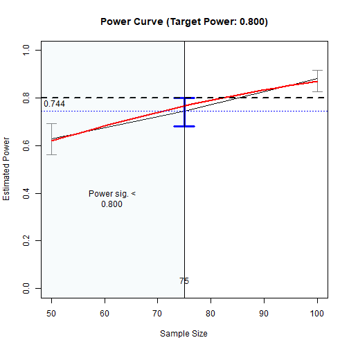
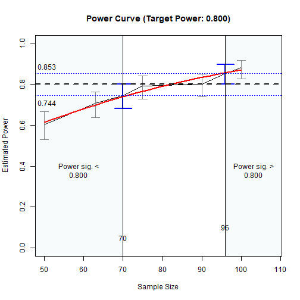

# NOTE

This article is for internal testing
of the printout.


``` r
library(power4mome)
options(power4mome.bz = TRUE)
```


``` r
mod <-
"
m ~ x
y ~ m + x
"
```


``` r
mod_es <-
"
m ~ x: l
y ~ m: m
y ~ x: s
"
```


``` r
out <- power4test(nrep = 2,
                  model = mod,
                  pop_es = mod_es,
                  n = 50000,
                  iseed = 1234)
```


``` r
print(out,
      data_long = TRUE)
#> 
#> ====================== Model Information ======================
#> 
#> == Model on Factors/Variables ==
#> 
#> m ~ x
#> y ~ m + x
#> 
#> == Model on Variables/Indicators ==
#> 
#> m ~ x
#> y ~ m + x
#> 
#> ====== Population Values ======
#> 
#> Regressions:
#>                    Population
#>   m ~                        
#>     x                 0.500  
#>   y ~                        
#>     m                 0.300  
#>     x                 0.100  
#> 
#> Variances:
#>                    Population
#>    .m                 0.750  
#>    .y                 0.870  
#>     x                 1.000  
#> 
#> (Computing indirect effects for 2 paths ...)
#> 
#> == Population Conditional/Indirect Effect(s) ==
#> 
#> == Indirect Effect(s) ==
#> 
#>               ind
#> x -> m -> y 0.150
#> x -> y      0.100
#> 
#>  - The 'ind' column shows the indirect effect(s).
#>  
#> ======================= Data Information =======================
#> 
#> Number of Replications:  2 
#> Sample Sizes:  50000 
#> 
#> ==== Descriptive Statistics ====
#> 
#>   vars     n mean sd skew kurtosis se
#> m    1 1e+05 0.00  1 0.01     0.03  0
#> y    2 1e+05 0.01  1 0.01     0.00  0
#> x    3 1e+05 0.00  1 0.01     0.01  0
#> 
#> ===== Parameter Estimates Based on All 2 Samples Combined =====
#> 
#> Total Sample Size: 100000 
#> 
#> ==== Standardized Estimates ====
#> 
#> Variances and error variances omitted.
#> 
#> Regressions:
#>                     est.std
#>   m ~                      
#>     x                 0.500
#>   y ~                      
#>     m                 0.295
#>     x                 0.102
#> 
#> 
#> ==================== Extra Element(s) Found ====================
#> 
#> - fit
#> 
#> === Element(s) of the First Dataset ===
#> 
#> ============ <fit> ============
#> 
#> lavaan 0.6-21.2434 ended normally after 1 iteration
#> 
#>   Estimator                                         ML
#>   Optimization method                           NLMINB
#>   Number of model parameters                         5
#> 
#>   Number of observations                         50000
#> 
#> Model Test User Model:
#>                                                       
#>   Test statistic                                 0.000
#>   Degrees of freedom                                 0
```


``` r
out <- power4test(nrep = 50,
                  model = mod,
                  pop_es = mod_es,
                  n = 100,
                  R = 199,
                  ci_type = "mc",
                  test_fun = test_indirect_effect,
                  test_args = list(x = "x",
                                   m = "m",
                                   y = "y",
                                   mc_ci = TRUE),
                  iseed = 2345,
                  parallel = TRUE)
```


``` r
print(out,
      test_long = TRUE)
#> 
#> ====================== Model Information ======================
#> 
#> == Model on Factors/Variables ==
#> 
#> m ~ x
#> y ~ m + x
#> 
#> == Model on Variables/Indicators ==
#> 
#> m ~ x
#> y ~ m + x
#> 
#> ====== Population Values ======
#> 
#> Regressions:
#>                    Population
#>   m ~                        
#>     x                 0.500  
#>   y ~                        
#>     m                 0.300  
#>     x                 0.100  
#> 
#> Variances:
#>                    Population
#>    .m                 0.750  
#>    .y                 0.870  
#>     x                 1.000  
#> 
#> (Computing indirect effects for 2 paths ...)
#> 
#> == Population Conditional/Indirect Effect(s) ==
#> 
#> == Indirect Effect(s) ==
#> 
#>               ind
#> x -> m -> y 0.150
#> x -> y      0.100
#> 
#>  - The 'ind' column shows the indirect effect(s).
#>  
#> ======================= Data Information =======================
#> 
#> Number of Replications:  50 
#> Sample Sizes:  100 
#> 
#> Call print with 'data_long = TRUE' for further information.
#> 
#> ==================== Extra Element(s) Found ====================
#> 
#> - fit
#> - mc_out
#> 
#> === Element(s) of the First Dataset ===
#> 
#> ============ <fit> ============
#> 
#> lavaan 0.6-21.2434 ended normally after 1 iteration
#> 
#>   Estimator                                         ML
#>   Optimization method                           NLMINB
#>   Number of model parameters                         5
#> 
#>   Number of observations                           100
#> 
#> Model Test User Model:
#>                                                       
#>   Test statistic                                 0.000
#>   Degrees of freedom                                 0
#> 
#> =========== <mc_out> ===========
#> 
#> 
#> == A 'mc_out' class object ==
#> 
#> Number of Monte Carlo replications: 199 
#> 
#> 
#> =============== <test_indirect: x->m->y> ===============
#> 
#> Mean(s) across replication:
#>    est  cilo  cihi   sig
#>  0.149 0.037 0.284 0.800
#> 
#> - The value 'sig' is the rejection rate.
#> - If the null hypothesis is false, this is the power.
#> - Number of valid replications for rejection rate: 50 
#> - Proportion of valid replications for rejection rate: 1.000
```


``` r
out_n <- n_from_power(out,
                      what = "ub",
                      seed = 4567)
```


``` r
out_n
#> Call:
#> power4mome::x_from_power(object = out, x = "n", what = "ub", 
#>     goal = "close_enough", final_nrep = 50, final_R = 199, seed = 4567)
#> 
#>                           Setting
#> Predictor(x):         Sample Size
#> Parameter:                    N/A
#> goal:                close_enough
#> what:                          ub
#> algorithm:              bisection
#> Level of confidence:       95.00%
#> Target Power:               0.800
#> 
#> - Final Value of Sample Size (n): 88
#> 
#> - Final Estimated Power (CI): 0.680 [0.542, 0.792]
#> 
#> Call `summary()` for detailed results.
```


``` r
summary(out_n)
#> 
#> ====== x_from_power Results ======
#> 
#> Call:
#> x_from_power(object = out, x = "n", what = "ub", goal = "close_enough", 
#>     final_nrep = 50, final_R = 199, seed = 4567)
#> 
#> Predictor (x): Sample Size 
#> 
#> - Target Power: 0.800 
#> - Goal: Find 'x' with estimated upper confidence bound close enough to
#>   the target power.
#> 
#> === Major Results ===
#> 
#> - Final Value (Sample Size): 88
#> 
#> - Final Estimated Power: 0.680 
#> - Confidence Interval: [0.542; 0.792]
#> - Level of confidence: 95.0%
#> - Based on 50 replications.
#> 
#> === Technical Information ===
#> 
#> - Algorithm: bisection 
#> - Tolerance for 'close enough': Within 0.02000 of 0.800 
#> - The range of values explored: 100 to 88 
#> - Time spent in the search: 16.02 secs 
#> - The final crude model for the power-predictor relation:
#> 
#> Model Type: Logistic Regression 
#> 
#> Call:
#> power_curve(object = by_x_1, formula = power_model, start = power_curve_start, 
#>     lower_bound = lower_bound, upper_bound = upper_bound, nls_args = nls_args, 
#>     nls_control = nls_control, verbose = progress)
#> 
#> Predictor: n (Sample Size)
#> 
#> Model:
#> 
#> Call:  stats::glm(formula = reject ~ x, family = "binomial", data = reject1)
#> 
#> Coefficients:
#> (Intercept)            x  
#>    -1.98127      0.03233  
#> 
#> Degrees of Freedom: 199 Total (i.e. Null);  198 Residual
#> Null Deviance:	    264.6 
#> Residual Deviance: 248.4 	AIC: 252.4
#> 
#> - Detailed Results:
#> 
#> [test]: test_indirect: x->m->y 
#> [test_label]: Test 
#>     n   est   p.v reject r.cilo r.cihi
#> 1  50 0.145 1.000  0.420  0.294  0.558
#> 2  75 0.143 1.000  0.600  0.462  0.724
#> 3  88 0.163 1.000  0.680  0.542  0.792
#> 4 100 0.149 1.000  0.800  0.670  0.888
#> Notes:
#> - n: The sample size in a trial.
#> - p.v: The proportion of valid replications.
#> - est: The mean of the estimates in a test across replications.
#> - reject: The proportion of 'significant' replications, that is, the
#>   rejection rate. If the null hypothesis is true, this is the Type I
#>   error rate. If the null hypothesis is false, this is the power.
#> - r.cilo,r.cihi: The confidence interval of the rejection rate, based
#>   on Wilson's (1927) method.
#> - Refer to the tests for the meanings of other columns.
```


``` r
plot(out_n)
```

<div class="figure" style="text-align: center">

<p class="caption">The Power Curve</p>
</div>


``` r
out_n_lb <- n_from_power(out,
                         what = "lb",
                         seed = 2345)
```


``` r
out_n_lb
#> Call:
#> power4mome::x_from_power(object = out, x = "n", what = "lb", 
#>     goal = "close_enough", final_nrep = 50, final_R = 199, seed = 2345)
#> 
#>                           Setting
#> Predictor(x):         Sample Size
#> Parameter:                    N/A
#> goal:                close_enough
#> what:                          lb
#> algorithm:              bisection
#> Level of confidence:       95.00%
#> Target Power:               0.800
#> 
#> - Final Value of Sample Size (n): 149
#> 
#> - Final Estimated Power (CI): 0.920 [0.812, 0.968]
#> 
#> Call `summary()` for detailed results.
```


``` r
summary(out_n_lb)
#> 
#> ====== x_from_power Results ======
#> 
#> Call:
#> x_from_power(object = out, x = "n", what = "lb", goal = "close_enough", 
#>     final_nrep = 50, final_R = 199, seed = 2345)
#> 
#> Predictor (x): Sample Size 
#> 
#> - Target Power: 0.800 
#> - Goal: Find 'x' with estimated lower confidence bound close enough to
#>   the target power.
#> 
#> === Major Results ===
#> 
#> - Final Value (Sample Size): 149
#> 
#> - Final Estimated Power: 0.920 
#> - Confidence Interval: [0.812; 0.968]
#> - Level of confidence: 95.0%
#> - Based on 50 replications.
#> 
#> === Technical Information ===
#> 
#> - Algorithm: bisection 
#> - Tolerance for 'close enough': Within 0.02000 of 0.800 
#> - The range of values explored: 100 to 50 
#> - Time spent in the search: 26.44 secs 
#> - The final crude model for the power-predictor relation:
#> 
#> Model Type: Logistic Regression 
#> 
#> Call:
#> power_curve(object = by_x_1, formula = power_model, start = power_curve_start, 
#>     lower_bound = lower_bound, upper_bound = upper_bound, nls_args = nls_args, 
#>     nls_control = nls_control, verbose = progress)
#> 
#> Predictor: n (Sample Size)
#> 
#> Model:
#> 
#> Call:  stats::glm(formula = reject ~ x, family = "binomial", data = reject1)
#> 
#> Coefficients:
#> (Intercept)            x  
#>    -1.58617      0.02743  
#> 
#> Degrees of Freedom: 299 Total (i.e. Null);  298 Residual
#> Null Deviance:	    279.8 
#> Residual Deviance: 220.2 	AIC: 224.2
#> 
#> - Detailed Results:
#> 
#> [test]: test_indirect: x->m->y 
#> [test_label]: Test 
#>     n   est   p.v reject r.cilo r.cihi
#> 1  50 0.147 1.000  0.440  0.312  0.577
#> 2 100 0.149 1.000  0.800  0.670  0.888
#> 3 139 0.148 1.000  0.840  0.715  0.917
#> 4 149 0.148 1.000  0.920  0.812  0.968
#> 5 159 0.161 1.000  0.960  0.865  0.989
#> 6 178 0.139 1.000  0.980  0.895  0.996
#> Notes:
#> - n: The sample size in a trial.
#> - p.v: The proportion of valid replications.
#> - est: The mean of the estimates in a test across replications.
#> - reject: The proportion of 'significant' replications, that is, the
#>   rejection rate. If the null hypothesis is true, this is the Type I
#>   error rate. If the null hypothesis is false, this is the power.
#> - r.cilo,r.cihi: The confidence interval of the rejection rate, based
#>   on Wilson's (1927) method.
#> - Refer to the tests for the meanings of other columns.
```


``` r
plot(out_n_lb)
```

<div class="figure" style="text-align: center">

<p class="caption">The Power Curve</p>
</div>


``` r
n_power_region <- n_region_from_power(out,
                                      seed = 2468)
#> 
#> 
#> --- Phase 1 ---
#> 
#> Find the approximate region with power significantly below 0.8 ...
#> 
#> 
#> --- Setting ---
#> 
#> Algorithm:  bisection 
#> Goal:  close_enough 
#> What:  ub   (Upper bound of the confidence interval) 
#> 
#> --- Progress  ---
#> 
#> - Set 'progress = FALSE' to suppress displaying the progress.
#> - Set 'simulation progress = FALSE' to suppress displaying the progress
#>   in the simulation.
#> 
#> Initial interval: [50, 100] 
#> 
#> 
#> Do the simulation for the lower bound:
#> 
#> Try x = 50 
#> 
#> Updating the simulation for sample size: 50 
#> Re-simulate the data:
#> Fit the model(s):
#> Generate Monte Carlo estimates:
#> Update the test(s):
#> Update test_indirect: x->m->y :
#> 
#> Estimated power at n: 0.460, 95.0% confidence interval: [0.330,0.596]
#> 
#> Initial interval: [50, 100] 
#> 
#> - Rejection Rates:
#> [test]: test_indirect: x->m->y 
#> [test_label]: Test 
#>     n   est   p.v reject r.cilo r.cihi
#> 1  50 0.140 1.000  0.460  0.330  0.596
#> 2 100 0.149 1.000  0.800  0.670  0.888
#> 
#> 
#> 
#> == Enter extending interval ...
#> 
#> 
#> 
#> == Exit extending interval ...
#> 
#> 
#> Iteration # 1 
#> 
#> Try x = 75 
#> 
#> Updating the simulation for sample size: 75 
#> Re-simulate the data:
#> Fit the model(s):
#> Generate Monte Carlo estimates:
#> Update the test(s):
#> Update test_indirect: x->m->y :
#> 
#> Estimated power at n: 0.660, 95.0% confidence interval: [0.522,0.776]
#> - Rejection Rates:
#> [test]: test_indirect: x->m->y 
#> [test_label]: Test 
#>     n   est   p.v reject r.cilo r.cihi
#> 1  50 0.140 1.000  0.460  0.330  0.596
#> 2  75 0.154 1.000  0.660  0.522  0.776
#> 3 100 0.149 1.000  0.800  0.670  0.888
#> 
#> New interval: [75, 100] 
#> Updated x: 88 
#> 
#> Iteration # 2 
#> 
#> Try x = 88 
#> 
#> Updating the simulation for sample size: 88 
#> Re-simulate the data:
#> Fit the model(s):
#> Generate Monte Carlo estimates:
#> Update the test(s):
#> Update test_indirect: x->m->y :
#> 
#> Estimated power at n: 0.700, 95.0% confidence interval: [0.562,0.809]
#> - Rejection Rates:
#> [test]: test_indirect: x->m->y 
#> [test_label]: Test 
#>     n   est   p.v reject r.cilo r.cihi
#> 1  50 0.140 1.000  0.460  0.330  0.596
#> 2  75 0.154 1.000  0.660  0.522  0.776
#> 3  88 0.151 1.000  0.700  0.562  0.809
#> 4 100 0.149 1.000  0.800  0.670  0.888
#> 
#> - 'nls()' estimation failed. Switch to logistic regression.
#> Solution found.
#> 
#> 
#> --- Final Stage ---
#> 
#> - Start at 2025-12-13 17:53:23 
#> - Rejection Rates:
#> 
#> [test]: test_indirect: x->m->y 
#> [test_label]: Test 
#>     n   est   p.v reject r.cilo r.cihi
#> 1  50 0.140 1.000  0.460  0.330  0.596
#> 2  75 0.154 1.000  0.660  0.522  0.776
#> 3  88 0.151 1.000  0.700  0.562  0.809
#> 4 100 0.149 1.000  0.800  0.670  0.888
#> Notes:
#> - n: The sample size in a trial.
#> - p.v: The proportion of valid replications.
#> - est: The mean of the estimates in a test across replications.
#> - reject: The proportion of 'significant' replications, that is, the
#>   rejection rate. If the null hypothesis is true, this is the Type I
#>   error rate. If the null hypothesis is false, this is the power.
#> - r.cilo,r.cihi: The confidence interval of the rejection rate, based
#>   on Wilson's (1927) method.
#> - Refer to the tests for the meanings of other columns.
#> 
#> - Estimated Power Curve:
#> 
#> Call:
#> power_curve(object = by_x_1, formula = power_model, start = power_curve_start, 
#>     lower_bound = lower_bound, upper_bound = upper_bound, nls_args = nls_args, 
#>     nls_control = nls_control, verbose = progress)
#> 
#> Predictor: n (Sample Size)
#> 
#> Model:
#> 
#> Call:  stats::glm(formula = reject ~ x, family = "binomial", data = reject1)
#> 
#> Coefficients:
#> (Intercept)            x  
#>    -1.62200      0.02945  
#> 
#> Degrees of Freedom: 199 Total (i.e. Null);  198 Residual
#> Null Deviance:	    257.7 
#> Residual Deviance: 244.5 	AIC: 248.5
#> 
#> 
#> - Final Value: 88 
#> 
#> - Final Estimated Power: 0.7000 
#> - Confidence Interval: [0.5625; 0.8090]
#> - CI Level: 95.00%
#> 
#> 
#> --- Phase 2 ---
#> 
#> Find the approximate region with power significantly above 0.8 ...
#> 
#> 
#> --- Setting ---
#> 
#> Algorithm:  bisection 
#> Goal:  close_enough 
#> What:  lb   (Lower bound of the confidence interval) 
#> 
#> --- Progress  ---
#> 
#> - Set 'progress = FALSE' to suppress displaying the progress.
#> - Set 'simulation progress = FALSE' to suppress displaying the progress
#>   in the simulation.
#> 
#> Initial interval: [100, 120] 
#> 
#> 
#> Do the simulation for the upper bound:
#> 
#> Try x = 120 
#> 
#> Updating the simulation for sample size: 120 
#> Re-simulate the data:
#> Fit the model(s):
#> Generate Monte Carlo estimates:
#> Update the test(s):
#> Update test_indirect: x->m->y :
#> 
#> Estimated power at n: 0.840, 95.0% confidence interval: [0.715,0.917]
#> 
#> Initial interval: [100, 120] 
#> 
#> - Rejection Rates:
#> [test]: test_indirect: x->m->y 
#> [test_label]: Test 
#>     n   est   p.v reject r.cilo r.cihi
#> 1  50 0.140 1.000  0.460  0.330  0.596
#> 2  75 0.154 1.000  0.660  0.522  0.776
#> 3  88 0.151 1.000  0.700  0.562  0.809
#> 4 100 0.149 1.000  0.800  0.670  0.888
#> 5 120 0.139 1.000  0.840  0.715  0.917
#> 
#> 
#> 
#> == Enter extending interval ...
#> 
#> Interval below the solution. Extend the upper bound ...
#> 
#> Try x = 237 
#> 
#> Updating the simulation for sample size: 237 
#> Re-simulate the data:
#> Fit the model(s):
#> Generate Monte Carlo estimates:
#> Update the test(s):
#> Update test_indirect: x->m->y :
#> 
#> Estimated power at n: 0.980, 95.0% confidence interval: [0.895,0.996]
#> 
#> 
#> (Extending the interval) Iteration: 1 
#> 
#> New interval: [120, 237] 
#> Interval OK.
#> Final extended interval: [120, 237] 
#> 
#> 
#> == Exit extending interval ...
#> 
#> 
#> Iteration # 1 
#> 
#> Try x = 179 
#> 
#> Updating the simulation for sample size: 179 
#> Re-simulate the data:
#> Fit the model(s):
#> Generate Monte Carlo estimates:
#> Update the test(s):
#> Update test_indirect: x->m->y :
#> 
#> Estimated power at n: 0.940, 95.0% confidence interval: [0.838,0.979]
#> - Rejection Rates:
#> [test]: test_indirect: x->m->y 
#> [test_label]: Test 
#>     n   est   p.v reject r.cilo r.cihi
#> 1  50 0.140 1.000  0.460  0.330  0.596
#> 2  75 0.154 1.000  0.660  0.522  0.776
#> 3  88 0.151 1.000  0.700  0.562  0.809
#> 4 100 0.149 1.000  0.800  0.670  0.888
#> 5 120 0.139 1.000  0.840  0.715  0.917
#> 6 179 0.153 1.000  0.940  0.838  0.979
#> 7 237 0.148 1.000  0.980  0.895  0.996
#> 
#> New interval: [120, 179] 
#> Updated x: 150 
#> 
#> Iteration # 2 
#> 
#> Try x = 150 
#> 
#> Updating the simulation for sample size: 150 
#> Re-simulate the data:
#> Fit the model(s):
#> Generate Monte Carlo estimates:
#> Update the test(s):
#> Update test_indirect: x->m->y :
#> 
#> Estimated power at n: 0.900, 95.0% confidence interval: [0.786,0.957]
#> - Rejection Rates:
#> [test]: test_indirect: x->m->y 
#> [test_label]: Test 
#>     n   est   p.v reject r.cilo r.cihi
#> 1  50 0.140 1.000  0.460  0.330  0.596
#> 2  75 0.154 1.000  0.660  0.522  0.776
#> 3  88 0.151 1.000  0.700  0.562  0.809
#> 4 100 0.149 1.000  0.800  0.670  0.888
#> 5 120 0.139 1.000  0.840  0.715  0.917
#> 6 150 0.135 1.000  0.900  0.786  0.957
#> 7 179 0.153 1.000  0.940  0.838  0.979
#> 8 237 0.148 1.000  0.980  0.895  0.996
#> 
#> - 'nls()' estimation failed. Switch to logistic regression.
#> Solution found.
#> 
#> 
#> --- Final Stage ---
#> 
#> - Start at 2025-12-13 17:53:44 
#> - Rejection Rates:
#> 
#> [test]: test_indirect: x->m->y 
#> [test_label]: Test 
#>     n   est   p.v reject r.cilo r.cihi
#> 1  50 0.140 1.000  0.460  0.330  0.596
#> 2  75 0.154 1.000  0.660  0.522  0.776
#> 3  88 0.151 1.000  0.700  0.562  0.809
#> 4 100 0.149 1.000  0.800  0.670  0.888
#> 5 120 0.139 1.000  0.840  0.715  0.917
#> 6 150 0.135 1.000  0.900  0.786  0.957
#> 7 179 0.153 1.000  0.940  0.838  0.979
#> 8 237 0.148 1.000  0.980  0.895  0.996
#> Notes:
#> - n: The sample size in a trial.
#> - p.v: The proportion of valid replications.
#> - est: The mean of the estimates in a test across replications.
#> - reject: The proportion of 'significant' replications, that is, the
#>   rejection rate. If the null hypothesis is true, this is the Type I
#>   error rate. If the null hypothesis is false, this is the power.
#> - r.cilo,r.cihi: The confidence interval of the rejection rate, based
#>   on Wilson's (1927) method.
#> - Refer to the tests for the meanings of other columns.
#> 
#> - Estimated Power Curve:
#> 
#> Call:
#> power_curve(object = by_x_1, formula = power_model, start = power_curve_start, 
#>     lower_bound = lower_bound, upper_bound = upper_bound, nls_args = nls_args, 
#>     nls_control = nls_control, verbose = progress)
#> 
#> Predictor: n (Sample Size)
#> 
#> Model:
#> 
#> Call:  stats::glm(formula = reject ~ x, family = "binomial", data = reject1)
#> 
#> Coefficients:
#> (Intercept)            x  
#>    -1.12062      0.02264  
#> 
#> Degrees of Freedom: 399 Total (i.e. Null);  398 Residual
#> Null Deviance:	    416.4 
#> Residual Deviance: 354.4 	AIC: 358.4
#> 
#> 
#> - Final Value: 150 
#> 
#> - Final Estimated Power: 0.9000 
#> - Confidence Interval: [0.7864; 0.9565]
#> - CI Level: 95.00%
n_power_region
#> Call:
#> n_region_from_power(object = out, seed = 2468)
#> 
#>                      Setting                                      
#> Predictor(x)         Sample Size                                  
#> Goal:                Power significantly below or above the target
#> algorithm:           bisection                                    
#> Level of confidence: 95.00%                                       
#> Target Power:        0.800                                        
#> 
#> Solution: 
#> 
#> Approximate region of sample sizes with power:
#> - not significantly different from 0.800: 88 to 150
#> - significantly lower than 0.800: 88
#> - significantly higher than 0.800: 150
#> 
#> Confidence intervals of the estimated power:
#> - for the lower bound (88): [0.562, 0.809]
#> - for the upper bound (150): [0.786, 0.957]
#> 
#> Call `summary()` for detailed results.
```


``` r
plot(n_power_region)
```

<div class="figure" style="text-align: center">

<p class="caption">The Power Curve (Region)</p>
</div>


``` r
n_power_region2 <- n_region_from_power(out_n_lb,
                                      seed = 24680)
#> 
#> 
#> --- Phase 1 ---
#> 
#> Find the approximate region with power significantly below 0.8 ...
#> 
#> 
#> --- Setting ---
#> 
#> Algorithm:  bisection 
#> Goal:  close_enough 
#> What:  ub   (Upper bound of the confidence interval) 
#> 
#> --- Progress  ---
#> 
#> - Set 'progress = FALSE' to suppress displaying the progress.
#> - Set 'simulation progress = FALSE' to suppress displaying the progress
#>   in the simulation.
#> 
#> Initial interval: [50, 100] 
#> 
#> 
#> Initial interval: [50, 100] 
#> 
#> - Rejection Rates:
#> [test]: test_indirect: x->m->y 
#> [test_label]: Test 
#>     n   est   p.v reject r.cilo r.cihi
#> 1  50 0.147 1.000  0.440  0.312  0.577
#> 2 100 0.149 1.000  0.800  0.670  0.888
#> 3 139 0.148 1.000  0.840  0.715  0.917
#> 4 149 0.148 1.000  0.920  0.812  0.968
#> 5 159 0.161 1.000  0.960  0.865  0.989
#> 6 178 0.139 1.000  0.980  0.895  0.996
#> 
#> 
#> 
#> == Enter extending interval ...
#> 
#> 
#> 
#> == Exit extending interval ...
#> 
#> 
#> Iteration # 1 
#> 
#> Try x = 75 
#> 
#> Updating the simulation for sample size: 75 
#> Re-simulate the data:
#> Fit the model(s):
#> Generate Monte Carlo estimates:
#> Update the test(s):
#> Update test_indirect: x->m->y :
#> 
#> Estimated power at n: 0.680, 95.0% confidence interval: [0.542,0.792]
#> - Rejection Rates:
#> [test]: test_indirect: x->m->y 
#> [test_label]: Test 
#>     n   est   p.v reject r.cilo r.cihi
#> 1  50 0.147 1.000  0.440  0.312  0.577
#> 2  75 0.147 1.000  0.680  0.542  0.792
#> 3 100 0.149 1.000  0.800  0.670  0.888
#> 4 139 0.148 1.000  0.840  0.715  0.917
#> 5 149 0.148 1.000  0.920  0.812  0.968
#> 6 159 0.161 1.000  0.960  0.865  0.989
#> 7 178 0.139 1.000  0.980  0.895  0.996
#> 
#> - 'nls()' estimation failed. Switch to logistic regression.
#> Solution found.
#> 
#> 
#> --- Final Stage ---
#> 
#> - Start at 2025-12-13 17:53:50 
#> - Rejection Rates:
#> 
#> [test]: test_indirect: x->m->y 
#> [test_label]: Test 
#>     n   est   p.v reject r.cilo r.cihi
#> 1  50 0.147 1.000  0.440  0.312  0.577
#> 2  75 0.147 1.000  0.680  0.542  0.792
#> 3 100 0.149 1.000  0.800  0.670  0.888
#> 4 139 0.148 1.000  0.840  0.715  0.917
#> 5 149 0.148 1.000  0.920  0.812  0.968
#> 6 159 0.161 1.000  0.960  0.865  0.989
#> 7 178 0.139 1.000  0.980  0.895  0.996
#> Notes:
#> - n: The sample size in a trial.
#> - p.v: The proportion of valid replications.
#> - est: The mean of the estimates in a test across replications.
#> - reject: The proportion of 'significant' replications, that is, the
#>   rejection rate. If the null hypothesis is true, this is the Type I
#>   error rate. If the null hypothesis is false, this is the power.
#> - r.cilo,r.cihi: The confidence interval of the rejection rate, based
#>   on Wilson's (1927) method.
#> - Refer to the tests for the meanings of other columns.
#> 
#> - Estimated Power Curve:
#> 
#> Call:
#> power_curve(object = by_x_1, formula = power_model, start = power_curve_start, 
#>     lower_bound = lower_bound, upper_bound = upper_bound, nls_args = nls_args, 
#>     nls_control = nls_control, verbose = progress)
#> 
#> Predictor: n (Sample Size)
#> 
#> Model:
#> 
#> Call:  stats::glm(formula = reject ~ x, family = "binomial", data = reject1)
#> 
#> Coefficients:
#> (Intercept)            x  
#>    -1.43578      0.02659  
#> 
#> Degrees of Freedom: 349 Total (i.e. Null);  348 Residual
#> Null Deviance:	    347.5 
#> Residual Deviance: 283.5 	AIC: 287.5
#> 
#> 
#> - Final Value: 75 
#> 
#> - Final Estimated Power: 0.6800 
#> - Confidence Interval: [0.5419; 0.7924]
#> - CI Level: 95.00%
#> 
#> 
#> --- Phase 2 ---
#> 
#> Find the approximate region with power significantly above 0.8 ...
#> 
#> 
#> --- Setting ---
#> 
#> Algorithm:  bisection 
#> Goal:  close_enough 
#> What:  lb   (Lower bound of the confidence interval) 
#> 
#> --- Progress  ---
#> 
#> - Set 'progress = FALSE' to suppress displaying the progress.
#> - Set 'simulation progress = FALSE' to suppress displaying the progress
#>   in the simulation.
#> 
#> --- Solution Already Found ---
#> 
#> Solution already found in the object. Search will be skipped.
#> - 'nls()' estimation failed. Switch to logistic regression.
#> 
#> 
#> --- Final Stage ---
#> 
#> - Start at 2025-12-13 17:53:50 
#> - Rejection Rates:
#> 
#> [test]: test_indirect: x->m->y 
#> [test_label]: Test 
#>     n   est   p.v reject r.cilo r.cihi
#> 1  50 0.147 1.000  0.440  0.312  0.577
#> 2  75 0.147 1.000  0.680  0.542  0.792
#> 3 100 0.149 1.000  0.800  0.670  0.888
#> 4 139 0.148 1.000  0.840  0.715  0.917
#> 5 149 0.148 1.000  0.920  0.812  0.968
#> 6 159 0.161 1.000  0.960  0.865  0.989
#> 7 178 0.139 1.000  0.980  0.895  0.996
#> Notes:
#> - n: The sample size in a trial.
#> - p.v: The proportion of valid replications.
#> - est: The mean of the estimates in a test across replications.
#> - reject: The proportion of 'significant' replications, that is, the
#>   rejection rate. If the null hypothesis is true, this is the Type I
#>   error rate. If the null hypothesis is false, this is the power.
#> - r.cilo,r.cihi: The confidence interval of the rejection rate, based
#>   on Wilson's (1927) method.
#> - Refer to the tests for the meanings of other columns.
#> 
#> - Estimated Power Curve:
#> 
#> Call:
#> power_curve(object = by_x_1, formula = power_curve_args$power_model, 
#>     start = power_curve_args$start, lower_bound = power_curve_args$lower_bound, 
#>     upper_bound = power_curve_args$upper_bound, nls_args = power_curve_args$nls_args, 
#>     nls_control = power_curve_args$nls_control, verbose = progress)
#> 
#> Predictor: n (Sample Size)
#> 
#> Model:
#> 
#> Call:  stats::glm(formula = reject ~ x, family = "binomial", data = reject1)
#> 
#> Coefficients:
#> (Intercept)            x  
#>    -1.43578      0.02659  
#> 
#> Degrees of Freedom: 349 Total (i.e. Null);  348 Residual
#> Null Deviance:	    347.5 
#> Residual Deviance: 283.5 	AIC: 287.5
#> 
#> 
#> - Final Value: 149 
#> 
#> - Final Estimated Power: 0.9200 
#> - Confidence Interval: [0.8116; 0.9685]
#> - CI Level: 95.00%
n_power_region2
#> Call:
#> n_region_from_power(object = out_n_lb, seed = 24680)
#> 
#>                      Setting                                      
#> Predictor(x)         Sample Size                                  
#> Goal:                Power significantly below or above the target
#> algorithm:           bisection                                    
#> Level of confidence: 95.00%                                       
#> Target Power:        0.800                                        
#> 
#> Solution: 
#> 
#> Approximate region of sample sizes with power:
#> - not significantly different from 0.800: 75 to 149
#> - significantly lower than 0.800: 75
#> - significantly higher than 0.800: 149
#> 
#> Confidence intervals of the estimated power:
#> - for the lower bound (75): [0.542, 0.792]
#> - for the upper bound (149): [0.812, 0.968]
#> 
#> Call `summary()` for detailed results.
```


``` r
plot(n_power_region2)
```

<div class="figure" style="text-align: center">

<p class="caption">The Power Curve (Region) Version 2</p>
</div>


