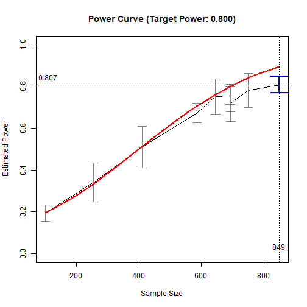
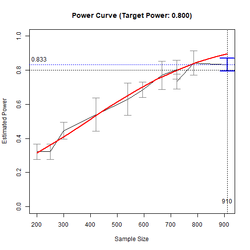

# Introduction

This and other "Quick Template" vignettes
are examples of R code to test do power
analysis or determine sample size in
typical models using
[power4mome](https://sfcheung.github.io/power4mome/).
Users can quickly adapt
them for their scenarios.

# Prerequisite

Basic knowledge about fitting models
by `lavaan` and `power4mome` is required.
This file is not intended to be an introduction
on how to use functions in `power4mome`.

# Scope

This file has code examples for various
mediation models.

# Estimate the Power for a Sample Size

An example to estimate power given
other factors.

The code:


``` r
library(power4mome)
#
# ====== Model: Form ======
model <-
"
m ~ x
y ~ m + x
"
#
# ====== Model: Population Values ======
# l: large (.50 by default)
# m: medium (.30 by default)
# s: small (.10 by default)
model_es <-
"
m ~ x: s
y ~ m: l
y ~ x: m
"
#
# ====== Test the Model Specification ======
out <- power4test(nrep = 2,
                  model = model,
                  pop_es = model_es,
                  n = 50000,
                  iseed = 1234)
#
# ====== Check the Data Generated ======
print(out,
      data_long = TRUE)
#
# ====== Estimate the Power ======
# For n = 100,
# when testing the indirect effect by
# Monte Carlo confidence interval
out <- power4test(nrep = 400,
                  model = model,
                  pop_es = model_es,
                  n = 100,
                  R = 1000,
                  ci_type = "mc",
                  test_fun = test_indirect_effect,
                  test_args = list(x = "x",
                                   m = "m",
                                   y = "y",
                                   mc_ci = TRUE),
                  iseed = 1234,
                  parallel = TRUE)
#
# ====== Compute the Rejection Rate ======
rejection_rates(out)
```

The results:


``` r
print(out,
      data_long = TRUE)
#> 
#> ====================== Model Information ======================
#> 
#> == Model on Factors/Variables ==
#> 
#> m ~ x
#> y ~ m + x
#> 
#> == Model on Variables/Indicators ==
#> 
#> m ~ x
#> y ~ m + x
#> 
#> ====== Population Values ======
#> 
#> Regressions:
#>                    Population
#>   m ~                        
#>     x                 0.100  
#>   y ~                        
#>     m                 0.500  
#>     x                 0.300  
#> 
#> Variances:
#>                    Population
#>    .m                 0.990  
#>    .y                 0.630  
#>     x                 1.000  
#> 
#> ======================= Data Information =======================
#> 
#> Number of Replications:  400 
#> Sample Sizes:  100 
#> 
#> ==== Descriptive Statistics ====
#> 
#>   vars     n  mean sd  skew kurtosis   se
#> m    1 40000  0.00  1  0.01    -0.01 0.01
#> y    2 40000 -0.01  1 -0.02    -0.03 0.01
#> x    3 40000  0.00  1  0.01    -0.02 0.01
#> 
#> ==== Parameter Estimates Based on All 400 Samples Combined ====
#> 
#> Total Sample Size: 40000 
#> 
#> ==== Standardized Estimates ====
#> 
#> Variances and error variances omitted.
#> 
#> Regressions:
#>                     est.std
#>   m ~                      
#>     x                 0.099
#>   y ~                      
#>     m                 0.499
#>     x                 0.305
#> 
#> 
#> ==================== Extra Element(s) Found ====================
#> 
#> - fit
#> - mc_out
#> 
#> === Element(s) of the First Dataset ===
#> 
#> ============ <fit> ============
#> 
#> lavaan 0.6-19 ended normally after 1 iteration
#> 
#>   Estimator                                         ML
#>   Optimization method                           NLMINB
#>   Number of model parameters                         5
#> 
#>   Number of observations                           100
#> 
#> Model Test User Model:
#>                                                       
#>   Test statistic                                 0.000
#>   Degrees of freedom                                 0
#> 
#> =========== <mc_out> ===========
#> 
#> 
#> == A 'mc_out' class object ==
#> 
#> Number of Monte Carlo replications: 1000 
#> 
#> 
#> ====================== Test(s) Conducted ======================
#> 
#> - test_indirect: x->m->y
#> 
#> Call print() and set 'test_long = TRUE' for a detailed report.
rejection_rates(out)
#>                     test test_label   p.v reject r.cilo r.cihi
#> 1 test_indirect: x->m->y       Test 1.000  0.195  0.156  0.234
#> Notes:
#> - p.v: The proportion of valid replications.
#> - reject: The proportion of 'significant' replications, that is, the
#>   rejection rate.If the null hypothesis is true, this is the Type I
#>   error rate. If the null hypothesis is false, this is the power.
#> - r.cilo,r.cihi: The confidence interval of the rejection rate, based
#>   on normal approximation.
#> - Refer to the tests for the meanings of other columns.
```

# Try Another Sample Size

The code:


``` r
#
# ===== Reuse the output of power4test() =====
# Estimate power for n = 150
# Set n to 150
out_new_n <- power4test(out,
                        n = 150)
#
# ===== Compute Rejection Rate (Power) =====
rejection_rates(out_new_n)
```

The results:


``` r
rejection_rates(out_new_n)
#>                     test test_label   p.v reject r.cilo r.cihi
#> 1 test_indirect: x->m->y       Test 1.000  0.290  0.246  0.334
#> Notes:
#> - p.v: The proportion of valid replications.
#> - reject: The proportion of 'significant' replications, that is, the
#>   rejection rate.If the null hypothesis is true, this is the Type I
#>   error rate. If the null hypothesis is false, this is the power.
#> - r.cilo,r.cihi: The confidence interval of the rejection rate, based
#>   on normal approximation.
#> - Refer to the tests for the meanings of other columns.
```

# Try Several Sample Sizes

The code:


``` r
#
# ===== Reuse the output of power4test() =====
# Estimate power for n = 200, 250, 300
# Use power4test_by_n()
out_ns <- power4test_by_n(out,
                          n = c(200, 250, 300),
                          by_seed = 5789)
#
# ===== Compute Rejection Rate (Power) =====
rejection_rates(out_ns)
```

The results:


``` r
rejection_rates(out_ns)
#>     n                   test test_label   p.v reject r.cilo r.cihi
#> 1 200 test_indirect: x->m->y       Test 1.000  0.323  0.277  0.368
#> 2 250 test_indirect: x->m->y       Test 1.000  0.323  0.277  0.368
#> 3 300 test_indirect: x->m->y       Test 1.000  0.445  0.396  0.494
#> Notes:
#> - n: The sample size in a trial.
#> - p.v: The proportion of valid replications.
#> - reject: The proportion of 'significant' replications, that is, the
#>   rejection rate.If the null hypothesis is true, this is the Type I
#>   error rate. If the null hypothesis is false, this is the power.
#> - r.cilo,r.cihi: The confidence interval of the rejection rate, based
#>   on normal approximation.
#> - Refer to the tests for the meanings of other columns.
```

# Find the Sample Size With Power Approximately .80

## Use the Output of `power4test()`

Suppose we do this step right after calling `power4test()`
on one sample size.

It can take some time to run if estimated power
of the sample size is too different from
the target power.

The code:


``` r
#
# ===== Reuse the output of power4test() =====
# Call x_from_power()
# To set desired precision:
# - Set final number of R: final_R = 1000 (Default, can be omitted)
# - Set final number of replications: final_nrep = 400 (Default, can be omitted)
n_power_80 <- x_from_power(out,
                           x = "n",
                           seed = 1357)
#
# ===== Print the Summary =====
summary(n_power_80)
#
# ===== Plot the (Crude) Power Curve =====
plot(n_power_80)
```

The results:


``` r
#
# ===== Print the Summary =====
summary(n_power_80)
#> 
#> ====== x_from_power Results ======
#> 
#> Call:
#> x_from_power(object = out, x = "n", seed = 1357)
#> Predictor (x): Sample Size 
#> 
#> - Target Power: 0.800 
#> 
#> === Major Results ===
#> 
#> - Final Value: 849 
#> - Final Estimated Power: 0.807 
#> - Confidence Interval: [0.769; 0.846]
#> - Level of confidence: 95.0%
#> - Based on 400 replications.
#> 
#> === Technical Information ===
#> 
#> - The range of values explored: 100 to 849 
#> - Time spent in the search: 2.186 mins 
#> - The final crude model for the power-predictor relation:
#> 
#> Model Type: Logistic Regression 
#> 
#> Call:
#> power_curve(object = by_x_i, formula = power_model, start = start, 
#>     lower_bound = lower_bound, upper_bound = upper_bound, nls_args = nls_args, 
#>     nls_control = nls_control, verbose = progress)
#> 
#> Predictor: n (Sample Size)
#> 
#> Model:
#> 
#> Call:  stats::glm(formula = reject ~ x, family = "binomial", data = reject1)
#> 
#> Coefficients:
#> (Intercept)            x  
#>    -1.88634      0.00472  
#> 
#> Degrees of Freedom: 599 Total (i.e. Null);  598 Residual
#> Null Deviance:	    701.9 
#> Residual Deviance: 661.5 	AIC: 665.5
#> 
#> - Detailed Results:
#> 
#>      n                   test test_label   p.v reject r.cilo r.cihi
#> 1  100 test_indirect: x->m->y       Test 1.000  0.195  0.156  0.234
#> 2  255 test_indirect: x->m->y       Test 1.000  0.340  0.247  0.433
#> 3  410 test_indirect: x->m->y       Test 1.000  0.510  0.412  0.608
#> 4  586 test_indirect: x->m->y       Test 1.000  0.672  0.627  0.718
#> 5  645 test_indirect: x->m->y       Test 1.000  0.750  0.665  0.835
#> 6  692 test_indirect: x->m->y       Test 1.000  0.755  0.713  0.797
#> 7  693 test_indirect: x->m->y       Test 1.000  0.739  0.678  0.800
#> 8  694 test_indirect: x->m->y       Test 1.000  0.720  0.632  0.808
#> 9  750 test_indirect: x->m->y       Test 1.000  0.780  0.699  0.861
#> 10 849 test_indirect: x->m->y       Test 1.000  0.807  0.769  0.846
#> Notes:
#> - n: The sample size in a trial.
#> - p.v: The proportion of valid replications.
#> - reject: The proportion of 'significant' replications, that is, the
#>   rejection rate.If the null hypothesis is true, this is the Type I
#>   error rate. If the null hypothesis is false, this is the power.
#> - r.cilo,r.cihi: The confidence interval of the rejection rate, based
#>   on normal approximation.
#> - Refer to the tests for the meanings of other columns.
#
# ===== Plot the (Crude) Power Curve =====
plot(n_power_80)
```



## Use the Output of `power4test_by_n()`

We already tried several other sample
sizes using `power4test_by_n()`. We
can also continue the search using its output
by calling `x_from_power()` on its
output.

It can take some time to run if estimated levels
of power
of the sample sizes are too different from
the target power.

The code:


``` r
#
# ===== Reuse the output of power4test_by_n() =====
# Call x_from_power()
# To set desired precision:
# - Set final number of R: final_R = 1000 (Default, can be omitted)
# - Set final number of replications: final_nrep = 400 (Default, can be omitted)
n_power_80_ns <- x_from_power(out_ns,
                              x = "n",
                              seed = 1357)
#
# ===== Print the Summary =====
summary(n_power_80_ns)
#
# ===== Plot the (Crude) Power Curve =====
plot(n_power_80_ns)
```

The results:


``` r
#
# ===== Print the Summary =====
summary(n_power_80_ns)
#> 
#> ====== x_from_power Results ======
#> 
#> Call:
#> x_from_power(object = out_ns, x = "n", seed = 1357)
#> Predictor (x): Sample Size 
#> 
#> - Target Power: 0.800 
#> 
#> === Major Results ===
#> 
#> - Final Value: 910 
#> - Final Estimated Power: 0.833 
#> - Confidence Interval: [0.796; 0.869]
#> - Level of confidence: 95.0%
#> - Based on 400 replications.
#> 
#> === Technical Information ===
#> 
#> - The range of values explored: 200 to 910 
#> - Time spent in the search: 2.103 mins 
#> - The final crude model for the power-predictor relation:
#> 
#> Model Type: Logistic Regression 
#> 
#> Call:
#> power_curve(object = by_x_i, formula = power_model, start = start, 
#>     lower_bound = lower_bound, upper_bound = upper_bound, nls_args = nls_args, 
#>     nls_control = nls_control, verbose = progress)
#> 
#> Predictor: n (Sample Size)
#> 
#> Model:
#> 
#> Call:  stats::glm(formula = reject ~ x, family = "binomial", data = reject1)
#> 
#> Coefficients:
#> (Intercept)            x  
#>   -1.608780     0.004152  
#> 
#> Degrees of Freedom: 1399 Total (i.e. Null);  1398 Residual
#> Null Deviance:	    1879 
#> Residual Deviance: 1830 	AIC: 1834
#> 
#> - Detailed Results:
#> 
#>      n                   test test_label   p.v reject r.cilo r.cihi
#> 1  200 test_indirect: x->m->y       Test 1.000  0.323  0.277  0.368
#> 2  250 test_indirect: x->m->y       Test 1.000  0.323  0.277  0.368
#> 3  300 test_indirect: x->m->y       Test 1.000  0.445  0.396  0.494
#> 4  420 test_indirect: x->m->y       Test 1.000  0.540  0.442  0.638
#> 5  539 test_indirect: x->m->y       Test 1.000  0.630  0.535  0.725
#> 6  594 test_indirect: x->m->y       Test 1.000  0.685  0.639  0.731
#> 7  666 test_indirect: x->m->y       Test 1.000  0.770  0.688  0.852
#> 8  721 test_indirect: x->m->y       Test 1.000  0.804  0.749  0.859
#> 9  722 test_indirect: x->m->y       Test 1.000  0.733  0.689  0.776
#> 10 785 test_indirect: x->m->y       Test 1.000  0.842  0.770  0.913
#> 11 910 test_indirect: x->m->y       Test 1.000  0.833  0.796  0.869
#> Notes:
#> - n: The sample size in a trial.
#> - p.v: The proportion of valid replications.
#> - reject: The proportion of 'significant' replications, that is, the
#>   rejection rate.If the null hypothesis is true, this is the Type I
#>   error rate. If the null hypothesis is false, this is the power.
#> - r.cilo,r.cihi: The confidence interval of the rejection rate, based
#>   on normal approximation.
#> - Refer to the tests for the meanings of other columns.
#
# ===== Plot the (Crude) Power Curve =====
plot(n_power_80_ns)
```



# Final Remarks

For details on how to use `power4test()`,
`power4test_by_n()`, and `x_from_power()`,
please refer to the [Get-Started article](https://sfcheung.github.io/power4mome/articles/power4mome.html),
and the [article](https://sfcheung.github.io/power4mome/articles/power4mome.html)
on finding the sample size
given desired power using `x_from_power()`,
as well as the help pages of these
functions.
